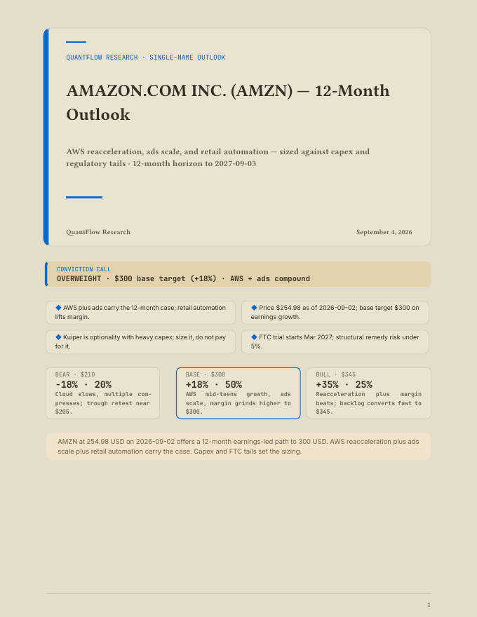
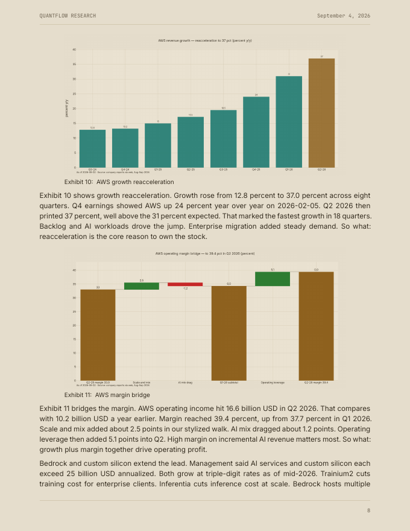
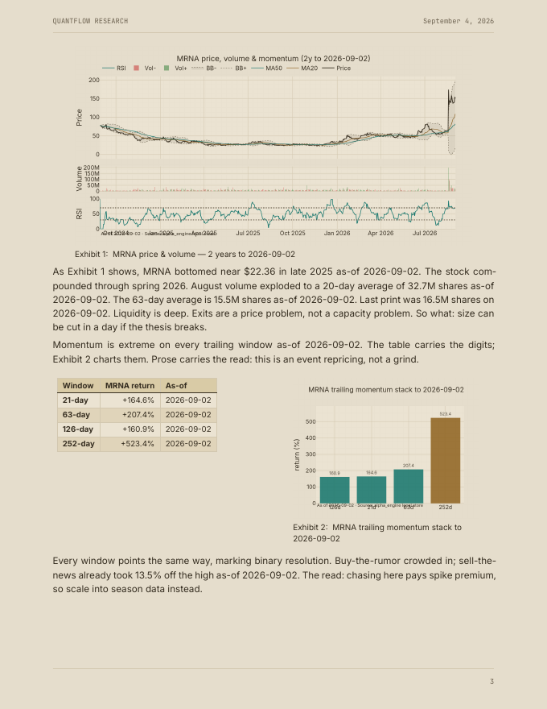
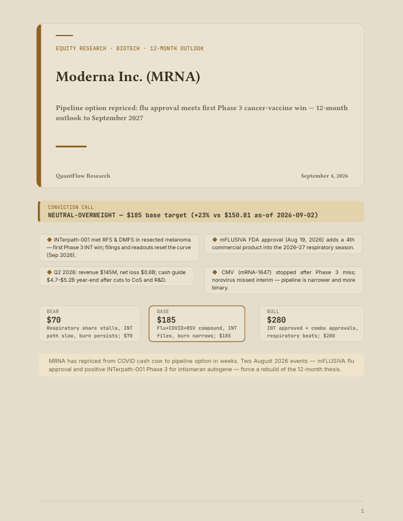

# report-forge

Quarto-powered report engine that turns Markdown + local chart PNGs into
typography-grade PDF (custom Typst templates), responsive HTML, DOCX, and
Chromium-printed `pdf-web` — driven by agents over MCP (stdio), with
mechanical quality gates that refuse to ship bad exhibits.

Built to render [QuantFlow](https://github.com/Kizo07/quantflow) flagship
equity outlooks: 20–30 page chart-led reports where every figure carries
one visual identity, every table reads like a spreadsheet, and the cover
fits on page one.

## Showcase

Real pages from production reports (AMZN 12-month outlook, 24pp; MRNA
12-month outlook, 12pp — both rendered by this engine):

**Infographic cover — verdict band, key-point cards, scenario strip, all on page 1:**



**Exhibit-led body — tiered chart sizes, native Exhibit numbering, spreadsheet tables:**



**Dense technician — paired exhibits, showtable data box, burned-in provenance:**



**Second cover, same pipeline — one scaffold call, different brief:**



## What it does

- **8 templates** — `standard`, `memo`, `whitepaper`, `modern`,
  `studio`, `portfolio-light`, `portfolio-dark` (gold/teal QuantFlow
  identity on warm paper or near-black), `bespoke` (caller-owned layout).
- **Cover infographics** (editorial templates): KPI metrics strip,
  conviction `verdict` band, up-to-4 `key_points` cards, exactly-3
  `scenarios` strip — compacted to fit page 1 with the body breaking to p2.
- **`rf-showtable`** — spreadsheet treatment for showcase tables (banded
  accent header, zebra rows, semibold label column, tabular numerals,
  `.rf-nums-right` alignment) in HTML *and* PDF via the Typst template.
- **Native `Exhibit N` numbering** — crossref `fig-title`/`fig-prefix`
  wiring, so `{#fig-exN}` + fig-cap renders a single caption with no
  Figure/Exhibit duplicates.
- **Chart identity bridge** — `save_chart` auto-applies the QuantFlow
  plotly theme matching the page (`quantflow-light`/`quantflow-dark`
  derived colorways); engine builders (`alpha_engine.viz`) export
  caption-burned PNGs via `save_figure`.
- **Hard quality gates** — `engine_charts_only` scaffold flag makes
  `render_report` refuse fallback charts (matplotlib/seaborn tags, or
  white-paper charts on light templates) instead of shipping them;
  `scripts/figure_lint.py` gates size tiers, crossrefs, voice tics,
  alt-text, accent pixels, and paper color *before* render.
- **Agent execution surface** — `reportforge_run_code` / `run_file`
  (project-root cwd, full quant stack), `save_asset`, `append_section`,
  `project_status`, `read_project_file` (render logs), `publish_report`.

## Quickstart

```bash
python -m venv .venv && .venv/bin/pip install -e .
# scaffold a light flagship with cover infographics + hard chart gate
.venv/bin/python -m reportforge.cli scaffold amzn-outlook \
  --template portfolio-light --engine-charts-only \
  --verdict "OVERWEIGHT — $300 base target" ...
# fill index.qmd (or via MCP write_report_body), then:
.venv/bin/python -m reportforge.cli render amzn-outlook --formats pdf,html
# pre-render gate (must be clean):
.venv/bin/python scripts/figure_lint.py reports/amzn-outlook
```

Via MCP (stdio, e.g. from QuantFlow): `reportforge_scaffold_report` →
`reportforge_write_report_body` / `reportforge_append_section` →
`reportforge_render_report` → `reportforge_publish_report`.

## Docs

- `docs/flagship-rules.md` — the voice, sizing, identity, and pre-render
  checklist that steers flagship runs (committed mirror of the agent skill).
- `reports/aapl-12m-flagship/` — full sample report generated by the engine.

## License

MIT — see [LICENSE](LICENSE).
