# Executive Summary

Apple enters its most consequential product transition since 2021 with the stock at **$316.85** (close 2026-08-31, +36.5% over 12 months) and a genuine two-engine story: iPhone revenue growing **+22% y/y** at $4.7T scale, and Services at a record **$30.7B (+12%)** with 75.6% gross margin. The September 2026 event is a dual catalyst — iPhone 18 Pro and the first **foldable "iPhone Ultra" at ~$1,999** — and it is also incoming CEO **John Ternus's first event** (transition effective September 1, 2026, with Tim Cook moving to executive chairman).

The debate is not demand (nine consecutive EPS beats; FQ3'26 revenue $109.4B, +16%) but **multiple discipline**: at ~36x trailing / ~32x forward, the September-quarter guide (+9–11%) already missed Street, Q3 gross margin (50.1%) leaned on ~2pp of one-time tariff refunds, and management flagged "supply constraints increasing significantly" into the holiday quarter. Huawei owns the Chinese foldable segment Apple is entering late, Google's ~$20B/yr search payments now renew on one-year non-exclusive terms, and opex is running +23% on AI R&D.

**Adjudication:** demand evidence outweighs margin evidence. We rate the setup **Constructive (Moderate-High conviction)** with a probability-weighted 12-month target of **≈$347 (+9.5%)** — Bear $245 (25%), Base $360 (50%), Bull $425 (25%). Enter on weakness at $300–308 or on a confirmed break above $327; invalidate on December-quarter iPhone growth guidance <5% or loss of $300 on volume.

# 1. As-Of Data Box (2026-08-31)

| Item | Value | Note |
|---|---|---|
| Close | **$316.85** | Local store, 0 days stale |
| 52-week range | $225.95 – $344.57 (intraday ATH Jul 29) | |
| 1-yr return | **+36.5%** | From $231.29 adj. 2025-08-29 |
| Market cap | ≈ $4.73T | ~14.9B shares |
| TTM EPS / P/E | ≈ $8.70 / **~36x** | Through FQ3'26 |
| FY26 revenue (est.) | ≈ $472B (+13% YoY) | Guidance-implied |
| Net cash | ≈ $35–45B | Cash ~$130B, debt ~$90B |
| FF attribution | β 1.16 · HML −0.45 · CMA −0.59 · RMW +0.12 · MOM +0.01 · SMB −0.05 | Alpha 19.6% ann. (t=3.55); R² 0.28 |
| Peer closes (08-31) | MSFT 507.29 · GOOGL 339.35 · META 572.34 · NVDA 220.78 · AMZN 259.77 | Local store |

Data freshness: price store verified fresh through 2026-08-31 (engine_status). No fundamental dataset in store — fundamentals sourced from Apple newsroom and dated press coverage.

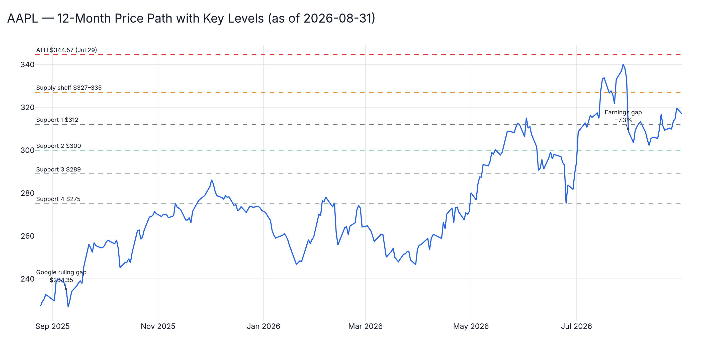{width=100%}

# 2. Earnings Trajectory — the Surprise of FY2026

| Quarter | Revenue | iPhone | Services | GM | EPS | Notes |
|---|---|---|---|---|---|---|
| FQ1'26 (Dec) | **$143.8B (+16%)** — record | +23% | — | — | $2.84 (+16%) | Net income $42.1B; international 65% of sales |
| FQ2'26 (Mar) | $111.2B (+17%) | March-qtr record | — | — | $2.01 (+22%) | Net income $29.6B; Greater China beat consensus ~$1.6B; **new $100B buyback** (FY25's was $110B) |
| FQ3'26 (Jun) | $109.4B (+16%) | **$54.3B (+22%)** | **$30.7B (+12%), record** | **50.1%** (≈+2pp one-time tariff refunds; ~48.1% adjusted) | $2.02 (+29%, +$0.11 refund benefit) | Opex $19.1B (+23%, R&D); Services GM 75.6% (−110bp q/q, mix) |
| FQ4'26 guide | +9–11% (vs Street ~12%) | Dec-qtr growth guided 10–12% vs Street ~6% | — | 47–48% incl. ~1pp refunds | — | FX −2.5pp; **"supply constraints increasing significantly"**; stock fell post-print — margin/guidance reaction, not demand |

**Tariff context:** FY25 tariff cost ran ~$1.1B/quarter (cumulative >$3.3B); FY26 flips to a refund tailwind as India (iPhones) and Vietnam (Mac/Watch) sourcing takes hold. Mac/iPad prices were reportedly raised ~20% to pass through component (memory) inflation — the refund tailwind fades into FY27.

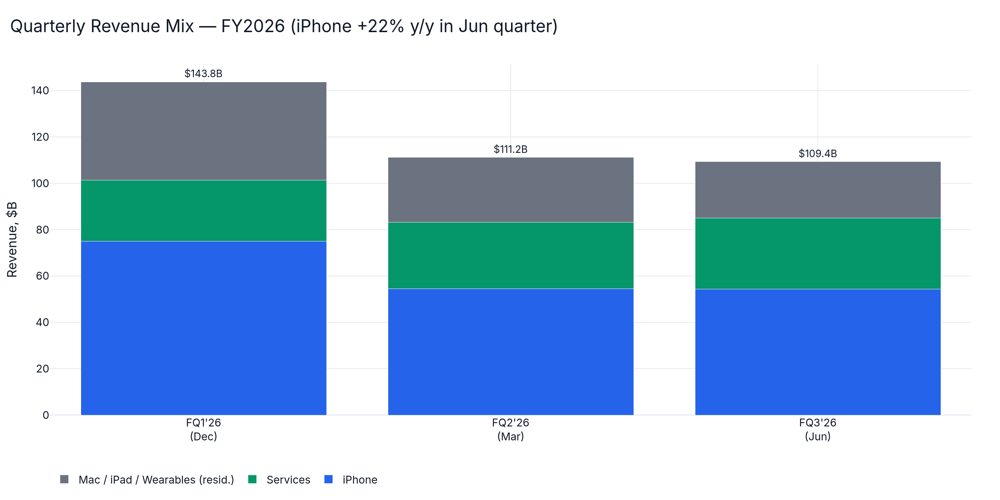{width=100%}

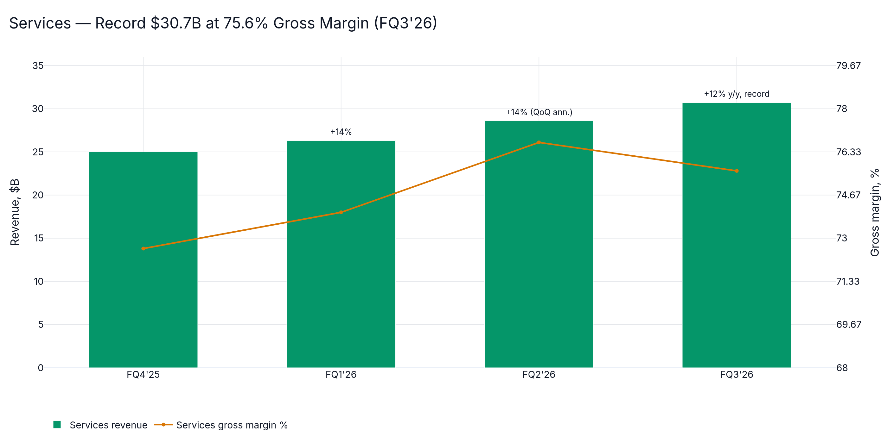{width=100%}

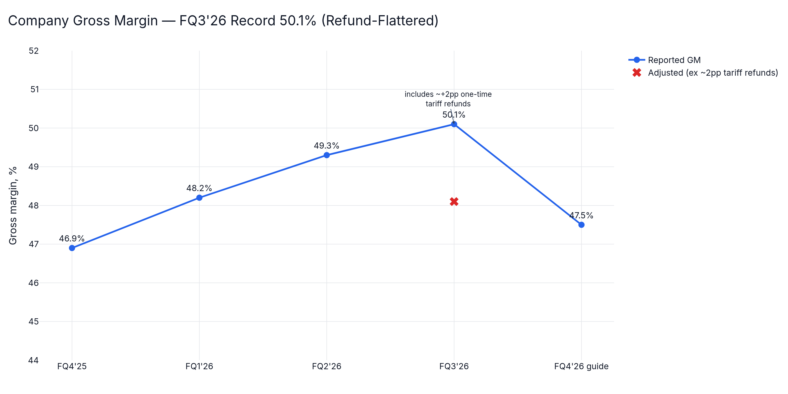{width=100%}

# 3. Catalyst Stack

- **Leadership transition — the most important near-term narrative.** Tim Cook → **John Ternus CEO effective September 1, 2026** (announced ~Apr 20, 2026); Cook remains executive chairman. The September event is Ternus's first as CEO — continuity framing with a hardware-first culture shift. CEO transitions are historically multiple-compressors until execution is proven.
- **September 2026 event (~Sept 9):** iPhone 18 Pro / Pro Max plus the first **foldable "iPhone Ultra" at ~$1,999** (7.7" inner display; stubby magnetic Apple Pencil tested, per Gurman 08-30), limited early stock. Standard iPhone 18 pushed to spring 2027 — a deliberate two-phase cycle that flattens seasonality.
- **AI:** Apple–Google deal (reportedly ~$1B/yr) confirmed Jan 13, 2026 — Gemini powers next-gen foundation models. Personalized Siri ("Project Campos", on-screen awareness) rolling out in phases from iOS 26.4 (Feb 2026) with the full rebuild in iOS 27 (WWDC June 2026). The core debate: distribution (2.2B+ devices) vs. model-quality gap vs. MSFT/GOOGL/META; Siri AI still not live in the EU.
- **Services / regulatory:** Judge Mehta's Sept 2025 remedies preserved ~$20B/yr Google search payments but banned multi-year exclusivity — now one-year non-exclusive terms: a durable but renegotiable stream. EU App Store fee dispute reportedly settled/truced (Aug 2026); DMA exposure contained for now.
- **China:** Q1'26 smartphone market −3.3% YoY; **Huawei #1 (~13.9M units), Apple #2 and fastest-growing**; same order held in Q2'26. Huawei's domestic supply chain insulates it from tariffs; Apple's Q2 China beat (+$1.6B vs consensus) shows iPhone 17 pull-through, but Huawei's Mate foldables own the local premium-foldable segment Apple enters late.
- **Vision Pro:** niche ($3,499, enterprise/pro focus); gaming/immersive-video teams scaled back, pivot toward ambient/AR-glasses. Not a 12-month revenue driver — optionality written off.

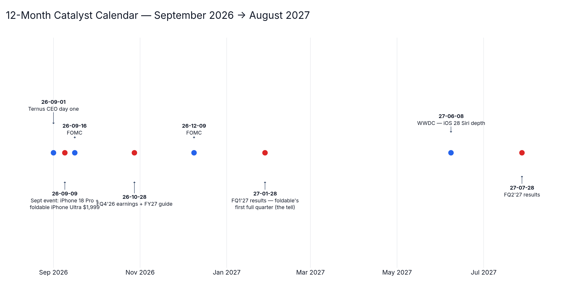{width=100%}

# 4. Technical Picture (full 1-yr series)

Regime: **primary uptrend intact**, choppy high-level consolidation. Structure: gap-down to $234.35 on the Sept 9, 2025 Google ruling → post-event breakout to $256+ → Feb 2026 peak $280.91 → Feb 12 flush to $255 (−9.2%) → spring grind → May–July rally to all-time high **$344.57 (July 29)** → earnings gap July 31 to ~$309 (−7.3% day) → $300–$320 basing since. Price is above rising 50-day and 200-day structure; momentum neutral-to-positive (+3.7% final week into the Ternus handover). The July 31 gap sits unclosed below — a typical magnet if the cycle narrative disappoints.

| Level | Price | Meaning |
|---|---|---|
| Resistance 3 | $340–$344.57 | Pre-earnings zone / ATH |
| Resistance 1 | $327–$335 | July supply shelf |
| **Close** | **$316.85** | 2026-08-31 |
| Support 1 | $312 | August consolidation floor |
| Support 2 | $300 | Psychological + Aug 12 low $302.25 |
| Support 3 | $289 | June close / gap shelf |
| Support 4 | $275 | June 25 capitulation low / Feb pivot |

**Drawdown episodes (past 12m):** Feb '26 flush −9.2% ($280.91 → $255); July 31 '26 earnings gap −7.3% in one day; max 12-month drawdown ≈ −19% (memo estimate). Gap risk, not drift, is the dominant tail; realized vol ≈ 28–32% annualized, residual/idio vol ≈ 37% (FF regression).

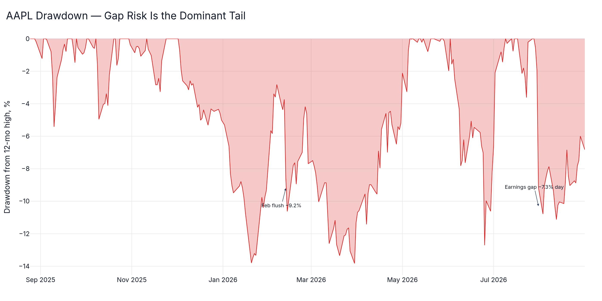{width=100%}

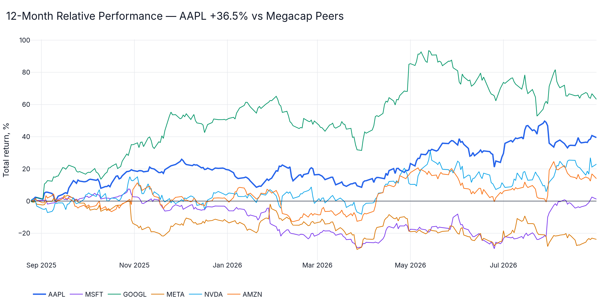{width=100%}

# 5. Bull / Bear Debate (Adversarial, Adjudicated)

**Bull (strongest case).** First genuine product-cycle + Services flywheel since 2021: iPhone +22% growth at $4.7T scale is extraordinary; the foldable opens a $1,999+ ASP tier with no Western competitor against a 200M+ upgradeable installed base; Siri/Gemini converts AI from liability into a retention moat; ~$100B/yr buybacks retire ~3%/yr of float; Services grows 12% at 75% gross margin. Base-case revenue ~$510–530B in FY27 with EPS ~$10.

**Bear (strongest case).** ~36x trailing / ~32x forward already prices the supercycle; the September-quarter guide missed Street and Q3 margins needed tariff refunds; supply constraints threaten December-quarter delivery; foldables are late to a market Huawei has trained, and $1,999 caps volume; Google payments are structurally at risk on every one-year renewal; Huawei is growing faster in China; opex +23% is a permanent AI-cost step-up; CEO-transition execution risk is historically a multiple-compressor; memory-cost inflation forces ~20% price hikes that test demand elasticity.

**Adjudication.** Demand evidence (iPhone +22%, China beat, nine straight EPS beats) is stronger than margin evidence (one-time refund distortion, FX drag). The bear's multiple argument is real but is best expressed as *limited upside to $345+ without delivery confirmation*, not as a thesis-breaking risk. Google-payment and foldable-adoption risks are priced partially, not fully. Net: **constructive, with discipline on entry.**

# 6. Valuation & Scenarios

DCF anchor: FCF ~$135–140B FY27E, 8% cost of equity, 3.5% terminal growth → supports ~$350–380. Relative: own-history forward band 24–36x; mega-cap peer range 28–35x; 30x on ~$10 FY27 EPS ≈ $300, 34x ≈ $340.

**Implied-price sensitivity: FY27E EPS × forward multiple**

| EPS \ Multiple | 28x | 30x | 32x | 34x | 36x | 38x |
|---|---|---|---|---|---|---|
| $9.50 | $266 | $285 | $304 | $323 | $342 | $361 |
| $10.00 | $280 | $300 | $320 | $340 | $360 | $380 |
| $10.50 | $294 | $315 | $336 | $357 | $378 | $399 |

**Scenario fan**

| Scenario | Prob. | Target | Implied | Drivers | Invalidation |
|---|---|---|---|---|---|
| **Bear** | 25% | **$245** | −23% | Foldable disappointment; China re-accelerates toward Huawei; Google payment renegotiated down; ~25–26x FY27 | Dec-qtr iPhone growth <5%; Services <8% |
| **Base** | 50% | **$360** | +14% | Foldable sells out into spring; iPhone +10–12% Dec-qtr as guided; Services +12%; buybacks; ~34x | Constraints persist past FQ1'27 |
| **Bull** | 25% | **$425** | +34% | Foldable supercycle (10M+ units FY27); Siri adoption inflection; re-rate to 37–38x on AI monetization | — |

**Probability-weighted 12-month target ≈ $347 (+9.5% from $316.85), plus ~0.35% dividend.**

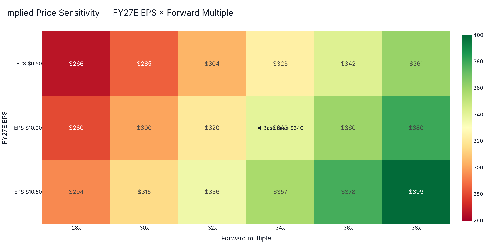{width=100%}

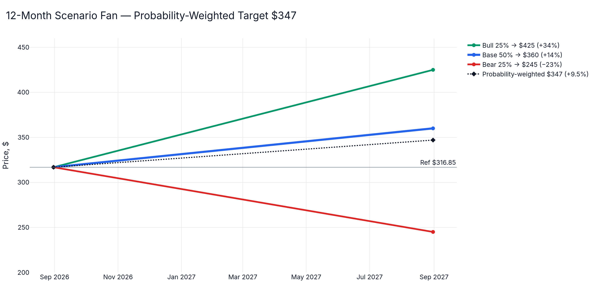{width=100%}

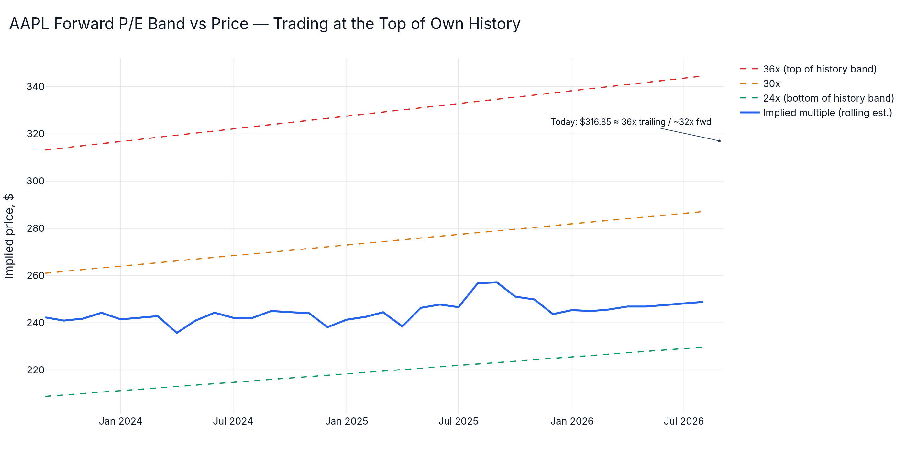{width=100%}

# 7. Risk Dashboard

- **Factor profile (FF regression):** β 1.16 market; strongly negative value (HML −0.45) and conservative-investment (CMA −0.59) exposures; positive profitability (RMW +0.12); neutral momentum (MOM +0.01); SMB −0.05. Annualized alpha 19.6% (t-stat 3.55); R² 0.28 — a quality-growth defensive-cyclical hybrid with large idiosyncratic content.
- **Volatility:** realized ≈ 28–32% annualized (elevated since the July gap); idiosyncratic ≈ 37% annualized.
- **Drawdowns:** max ≈ −19% past 12 months; −7.3% one-day July 31 earnings gap — gap risk is the dominant tail.
- **Tail risks:** (1) US–China tariff re-escalation; (2) Google TAC non-renewal (~0.5–1% of revenue gross, but sentiment-critical); (3) foldable yield / repair-cost crisis at $1,000+ inner-screen replacement; (4) macro — FOMC Sept 15–16, Oct 27–28, Dec 8–9 (2027: Jan 26–27, Mar 16–17, Apr 27–28).

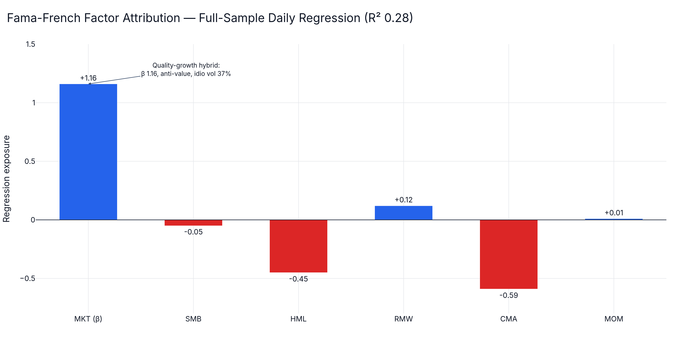{width=100%}

# 8. Capital Returns & Peer Context

- **Buybacks:** FY2025 authorization $110B; FY2026 authorization $100B (April 2026) — still the largest repurchaser on earth, retiring ~3%/yr of float.
- **Dividend:** $0.27/quarter ($1.08 annualized, ~0.35% yield); ex-dividend Nov 10, 2025.
- **Peer closes 2026-08-31 (local store):** AAPL $316.85 (+36.5% 1-yr) · MSFT $507.29 · GOOGL $339.35 · META $572.34 · NVDA $220.78 · AMZN $259.77.

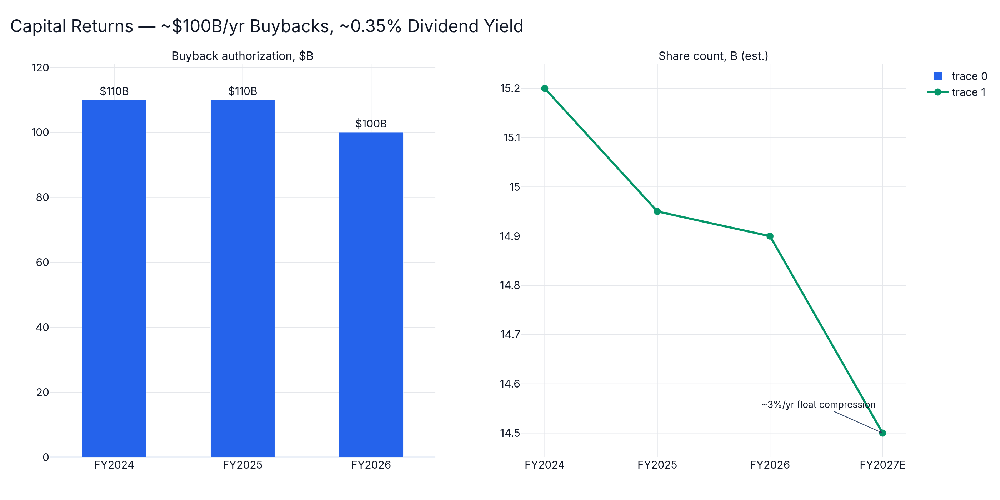{width=100%}

# 9. 12-Month Catalyst Calendar

| Date | Event |
|---|---|
| Sep 1, 2026 | Ternus CEO day one |
| ~Sep 9, 2026 | September event: iPhone 18 Pro + foldable iPhone Ultra ($1,999) |
| Sep 15–16, 2026 | FOMC |
| Late Oct 2026 | FQ4'26 earnings + FY27 guide (watch supply-constraint quantification) |
| Oct 27–28, 2026 | FOMC |
| Dec 8–9, 2026 | FOMC |
| Late Jan 2027 | FQ1'27 holiday results — foldable's first full quarter (the tell) |
| Feb 2027 | Foldable shipment read-through; spring standard iPhone 18 timing |
| Jun 2027 | WWDC — iOS 28 Siri depth; on-device vs. Gemini balance |
| Jul 2027 | FQ2'27; June 2027 iPhone installed-base & Services KPIs |

# 10. Positioning Guidance (research framing, not advice)

- **Conviction: Moderate-High (Constructive).** Probability-weighted +9.5% over 12 months with asymmetric structure: the $300–312 support zone offers ~1:1.6 reward/risk to $360 vs. $245.
- Suggested framework for a diversified book: 2–4% single-name weight (idiosyncratic vol ~37% contributes ~0.7–1.5% portfolio vol at a 4% weight); scale ½ at $300–308, ½ on a confirmed break above $327.
- **Invalidation / exit:** December-quarter iPhone growth guidance <5%, foldable units tracking <5M for FY27, or loss of $300 on volume → stand down to bear-case re-evaluation.

# 11. Sources

- [Apple Q2 FY2026 results — Apple Newsroom](https://www.apple.com/newsroom/2026/04/apple-reports-second-quarter-results/)
- [Apple Q3 FY2026 results — Apple Newsroom](https://www.apple.com/newsroom/2026/07/apple-reports-third-quarter-results/)
- [Apple (AAPL) Q3 2026 earnings call transcript — The Motley Fool](https://www.fool.com/earnings/call-transcripts/2026-08-07/apple-aapl-q3-2026-earnings-call-transcript/)
- [Apple warns supply constraints will increase significantly — 9to5Mac](https://9to5mac.com/2026-07-30/apple-warns-supply-constraints-will-increase-significantly-next-quarter/)
- [Apple at $320: Here's Who Should Hold Their Shares — 24/7 Wall St.](https://247wallst.com/investing/2026-08-31/apple-at-320-heres-who-should-hold-their-shares/)
- [Apple Q2 FY2026 recap — MacRumors](https://www.macrumors.com/2026-04-30/apple-2q-2026-earnings/)
- [Apple taps Google Gemini for next-gen Siri — Axios](https://www.axios.com/2026-01-13/apple-intelligence-google-gemini-siri)
- [Apple CEO transition: Tim Cook and John Ternus share internal memos — 9to5Mac](https://9to5mac.com/2026-04-20/apple-ceo-transition-tim-cook-and-john-ternus-share-internal-memos/)
- [China smartphone market Q1 2026 — Counterpoint Research](https://counterpointresearch.com/en/insights/china-smartphone-market-q1-2026)
- [Huawei, Apple, Q2 2026 China smartphone market — Huawei Central](https://www.huaweicentral.com/huawei-apple-q2-2026-chinas-smartphone-market/)
- [Apple Pencil for iPhone Ultra was tested — MacRumors](https://www.macrumors.com/2026-08-30/apple-pencil-for-iphone-ultra-was-tested/)
- [Tariff tsunami: Apple's cumulative costs surge past $3.3 billion — ITBEAR](https://www.itbear.com/technews/tariff-tsunami-apples-cumulative-costs-surge-past-3-3-billion-pressuring-profit-margins/)
- [A truce on App Store fees; still no Siri AI in Europe — MacSparky](https://www.macsparky.com/blog/2026/08/a-truce-on-app-store-fees-still-no-siri-ai-in-europe/)
- [When are the next Fed meetings? See the calendar — WSJ](https://www.wsj.com/livecoverage/fed-meeting-warsh-interest-rate-07-29-2026/card/when-are-the-next-fed-meetings-see-the-calendar-yb7AyfCdX1mFJUNsrbwn)
- AAPL and peer prices plus Fama-French factor attribution: local alpha_engine store, verified fresh through 2026-08-31.

---

*Prepared via the quant-desk workflow: quant analyst (store/factor analytics), news analyst (fundamentals, regulatory, competitive), technical analyst (1-yr price series), bull/bear researchers, risk manager, and CIO synthesis. Research framing only — not investment advice. All data as of 2026-08-31.*
