# Executive summary

> **Bottom line.** Apple enters the September 9, 2026 iPhone 18 event as a $3-trillion-plus compounder with record June-quarter revenue ($109.4B, +16% YoY), a rebuilt conversational Siri, and the largest buyback authorization in its history ($100B) — but the stock at $324.96 already discounts much of it, sitting at 87% of its 52-week range and 15% above its 200-day average. Our 12-month probability-weighted expected value is **~$361 (+11% from spot)**, built from Bear $260 (25%) / Base $370 (50%) / Bull $445 (25%). Conviction: **Moderate-Overweight — own it, size it as a high-beta idiosyncratic anchor (3–6% book weight), buy event-vol weakness, trim into foldable-driven euphoria.**

Three facts frame everything that follows. First, the June quarter (Q3 FY26, reported July 30, 2026) was Apple's best June quarter ever — $109.4B revenue, $29.8B net profit, records in iPhone, Mac and Services — yet shares fell on supply-constraint-tinged guidance and then printed a −7.4% single-day gap on July 31, the stock's worst day in the trailing year, one session after the $339.79 all-time high. That sequence — euphoria, guide-down, gap, then a +5.1% August repair back to $324.96 — is the entire debate in miniature: an exceptional business whose expectations are now the binding constraint. Second, the next twelve months contain an unusually dense catalyst stack: a September 9 hardware event (iPhone 18 Pro on A20 Pro + C2 modem, a first foldable form factor, Watch Series 12/Ultra 4, reported +$200–300 price steps), a holiday quarter that will adjudicate price elasticity, a full Siri AI rollout (with EU and China regulatory asterisks), an active DOJ appeal threatening the ~$20B/year Google traffic-acquisition (TAC) annuity, a CEO succession (Tim Cook's final earnings call was July 30), and a Fed rate path that matters acutely for a long-duration growth multiple. Third, the factor signature is unambiguous: AAPL is a high-beta (FF beta 1.19 long-run; 0.69 trailing-1y on our covariance cut), deep anti-value (HML −0.65), idiosyncratic beast — 72–89% of variance unexplained by standard factors, +18.9%/yr historical alpha (t = 3.4) — living through a value-and-momentum factor regime (H1-2026 HML +10.1%, MOM +28.3%) that is structurally unfriendly to exactly that signature, while the cross-sectional momentum factor itself just drew down −11.7% in the last three weeks of August.

Our Base case ($370, +14%) assumes the iPhone 18 cycle delivers mid-single-digit unit growth with a +5–7% blended ASP lift (Pro mix + foldable halo + price steps, partially offset by elasticity), Services compounds at low-teens with margins intact even as DMA compliance costs and App Store concession risk shave 100–200 bps from the segment's incremental margin, the Google TAC annuity survives 2026–27 in renegotiated (smaller, non-exclusive) form rather than going to zero, China stabilizes (flat to down-low-single-digits) as India absorbs ~25%+ of iPhone assembly and tariff pass-through proves manageable, the $100B buyback retires ~3–4% of shares over four quarters (~$0.30–0.40 of EPS accretion), and the multiple holds in the high-20s forward P/E on calendar-2027 earnings. The Bull case ($445, +37%) is a genuine supercycle: foldable ASP >$1,800 at multi-million-unit scale, Siri AI catalyzing a 2-year upgrade pull-forward, Services re-acceleration, TAC preserved, China re-acceleration, and multiple expansion into low-30s. The Bear case ($260, −20%) is the mirror: price-hike elasticity + elongating replacement cycles, TAC impairment or EU DMA structural hit to Services take-rate, China/Huawei share loss plus tariff margin compression, a succession stumble, and a growth-multiple derating into mid-teens forward earnings on a market drawdown where a 1.19-beta name with 48.5% annualized total vol falls 1.2–1.5× the market.

Positioning follows from that distribution. AAPL's 63-day realized vol is 32.0% (252-day 25.2%), ADV is ~55M shares (~$17–18B notional/day — institutionally frictionless liquidity), and the 12-month ±1σ lognormal band at 25–30% vol spans roughly $250–$425, which is to say the Bear and Bull targets are both within one sigma. This is a wide-distribution, high-idiosyncrasy name, not a tight carry. The research-portfolio implication is to size it as a 3–6% active anchor (single-name cap 7.5% in a diversified book; tighter at 4–5% for vol-budgeted mandates), accumulate on event-vol dislocations (a post-event or post-earnings −4–7% flush into the $300–310 zone with the 50-day ~$313 as first support), fund it from low-conviction mega-cap growth where factor overlap (anti-value, IT sector, long-duration) concentrates, and hedge the left tail (TAC-zero, China }}">
drawdown, succession misstep) with index or QQQ puts rather than by shrinking the anchor to irrelevance — because the alpha record (+18.9%/yr, t = 3.4) and the buyback flywheel argue the drift is upward even if the path is violent. Invalidation is explicit: a weekly close below the 200-day (~$283, ~−13%) that fails to reclaim it within a month, or a fundamental break (TAC zeroed without offset, or two consecutive quarters of YoY iPhone revenue decline ex-FX), converts the stance to neutral pending re-underwriting.

## As-of data box + freshness statement

| Item | As-of | Value / status |
|---|---|---|
| AAPL close | 2026-09-02 | $324.96 (vol 33.7M; Sep 1: $325.13 on 53.2M) |
| 52-week range | to 2026-09-02 | $225.96 (2025-09-10) – $339.79 (2026-07-28); 87.0% of range; −4.4% vs high, +43.8% vs low |
| Trailing returns | to 2026-09-02 | 1m +5.13%, 3m +4.83%, 6m +24.01%, 12m +41.98%, YTD +19.86% |
| Moving averages | 2026-09-02 | 20DMA $311.99, 50DMA $313.38, 200DMA $282.89; price +3.7% above 50DMA, +14.9% above 200DMA |
| Realized vol / RSI / ADV | 2026-09-02 | 63d vol 32.0%, 252d vol 25.2%, 21d vol 18.3%; RSI-14 ~61–73 (engine-cut dependent); ADV 63d 54.7M / 252d 49.7M shares |
| Cross-section (502 names) | 2026-09-02 | mean +0.45%, median +0.30%, p10 −1.31%, p90 +2.46%, Gini 0.099; AAPL −0.05% (flat day vs up tape) |
| Peer closes | 2026-09-02 | GOOGL $337.12, META $592.85, MSFT $496.82, NVDA $224.41; 12m: GOOGL +60.0%, AAPL +42.0%, NVDA +31.6%, SPY +20.8%, MSFT −1.0%, META −19.1% |
| Prices/returns_daily marts | 2026-09-02 | Fresh (0 days stale); 503 universe / 505 catalog tickers; history 1962→present |
| FF/factor marts | 2026-06-30 | STALE by construction (64d vendor lag): ff_factors_daily, factors_daily, risk_free_daily, french_industries_daily; AQR monthly OK to 2026-06-30; JKP/globalq OK (annual vendor cadence) |
| Fundamentals mart (companyfacts) | 2026-08-26 | EMPTY in local parquet (0 rows) — segment/financial numbers below are sourced from earnings coverage, not the local store; flagged wherever used |
| Q3 FY26 results | 2026-07-30 | Revenue $109.4B (+16% YoY, June-quarter record), net profit $29.8B; records in iPhone, Mac, Services; Cook's final call |
| Next dated catalyst | 2026-09-09 | September hardware event (confirmed); iPhone 18 Pro/A20 Pro/C2 modem, first foldable, Watch S12/Ultra 4 |

Freshness disclosure: all price-derived analytics (levels, vols, ranks, betas on trailing windows) are current through the September 2, 2026 close. All Fama-French attribution, risk-decomposition, and factor-regime statistics exclude July–August 2026 (factors end June 30) — a window containing AAPL's −7.4% July 31 gap and the August momentum-factor drawdown — and are labeled accordingly. Fundamentals tables carry their own earnings-date stamps. Nothing in this report is interpolated across the stale boundary without a label.

## Business segment deep dive

Apple's five-segment structure — iPhone (~half of revenue), Services (~a quarter and essentially all of the margin expansion story), Mac, iPad, Wearables/Home/Accessories — is best read as two businesses stapled together: a high-ASP hardware annuity with 2–4-year replacement cycles, and a 70%-plus-gross-margin services toll road built on ~2 billion active devices. Q3 FY26's $109.4B (+16% YoY) with simultaneous records in iPhone, Mac and Services is the cleanest illustration in years of both engines firing together [citation:Wall Street Times](https://wallstreettimes.com/apple-q3-2026-earnings-record-revenue-tim-cook-final-call/) [citation:Gotechtor](https://www.gotechtor.com/apple-q3-2026-earnings-record-revenue-price-increases-supply-constraints/).

**iPhone.** The June quarter set a June-quarter iPhone record, extending the iPhone 17 family's momentum into its third quarter of sale — notable because June quarters are seasonally the softest point of the cycle, two months before new-model launch. The installed-base logic is what matters for the 12-month outlook: with replacement cycles elongated toward 3.5–4 years industry-wide, Apple has offset unit stagnation with mix (Pro/Pro Max now the majority of mix in developed markets by most tracker estimates) and ASP expansion. The September 9 event raises the stakes on both dimensions — reported $200–300 price steps across the iPhone 18 lineup plus a first foldable at an expected $1,800+ entry point [citation:Digital Trends](https://www.digitaltrends.com/phones/apples-september-2026-event-everything-we-know-about-the-iphone-18-pro-and-iphone-ultra-launch-event/) [citation:SeberTech](https://sebertech.com/news/2026/08/31/apple-september-2026-event-iphone-18-pro-foldable-iphone-airpods-5-and-more-expected/). Our Base case assumes mid-single-digit iPhone revenue growth in FY27 (low-single-digit units, +5–7% blended ASP); the Bull case requires the foldable to do what the Plus/Max did in prior cycles — create a new top tier that expands rather than cannibalizes — at 8–12M units in its first twelve months. The Bear case is elasticity: a $1,199 starting Pro in a real-income-squeezed consumer environment extends cycles instead of pulling them forward, and iPhone revenue prints flat-to-down ex-FX for two straight quarters — our explicit fundamental invalidation trigger. Watch the January (holiday-quarter) print, not the September launch-weekend anecdotes: channel-fill versus sell-through confusion has generated at least three false cycle reads in the last decade.

**Services.** The structural bull thesis on Apple is Services: low-teens to mid-teens revenue growth at roughly double the corporate gross margin, compounding on installed-base growth rather than unit cycles. Q3 FY26 extended the paid-subscriptions and transacting-accounts records run, with App Store, licensing (including Google TAC), AppleCare+, Apple Music, iCloud+, Apple TV+ and payments all contributing. Two regulatory shadows fall directly on this segment (detailed in Services & regulatory risk): the DOJ's appeal of the Google search-remedies ruling (which preserved the ~$20B TAC flow under annual renegotiation but banned exclusivity) [citation:iGeeksBlog](https://www.igeeksblog.com/google-apple-search-deal-antitrust-ruling/) [citation:9to5Mac](https://9to5mac.com/2026/02/03/apple-search-deal-with-google-could-face-renewed-scrutiny-as-doj-appeals-antitrust-ruling/), and the EU DMA apparatus (alternative app marketplaces, anti-steering prohibitions, Core Technology Fee mechanics — with the Commission's July 2026 Google non-compliance actions demonstrating enforcement willingness) [citation:nicfab.eu DMA analysis](https://www.nicfab.eu/en/posts/dma-google-non-compliance-2026/). Our Base case haircuts Services incremental margin by 100–200 bps for compliance cost and take-rate concessions while keeping double-digit growth; TAC is modeled as renegotiated-down (~15–25% haircut) rather than zeroed. If TAC went to zero with no offset, the mechanical EPS impact is on the order of $0.60–0.80 annualized (~7–9% of forward EPS) — painful but not thesis-breaking, and already partially probability-weighted in the $361 expected value.

**Mac.** The Mac set a June-quarter revenue record in Q3 FY26 on Apple-silicon strength (M4-generation lineup fully ramped), continuing the post-Apple-silicon share-gain era against Windows PCs. Mac is ~8–10% of revenue but strategically load-bearing: it is the developer platform for the Siri AI/Apple Intelligence era and the beneficiary of enterprise refresh as AI-PC marketing pulls forward corporate buying. Expect mid-single-digit FY27 growth with back-to-school and holiday seasonality; the October product wave (flagged in event coverage as the follow-on to September) is the near-term catalyst.

**iPad.** iPad (~6–8% of revenue) remains the most cyclical line — education procurement and replacement timing dominate — with modest growth expectations. The AI angle (on-device Apple Intelligence as tablet differentiator for education/enterprise) is real but second-order for the 12-month numbers.

**Wearables, Home & Accessories.** Watch/AirPods/Vision (~8–10% of revenue) is the portfolio's option value: Watch Series 12/Ultra 4 at the September event refresh the core, AirPods 5 (expected alongside) sustain the attach juggernaut, and Vision Pro remains a measured R&D-scale bet rather than a FY27 P&L driver. No 12-month target depends on spatial computing; treat any Vision inflection as Bull-case upside only.

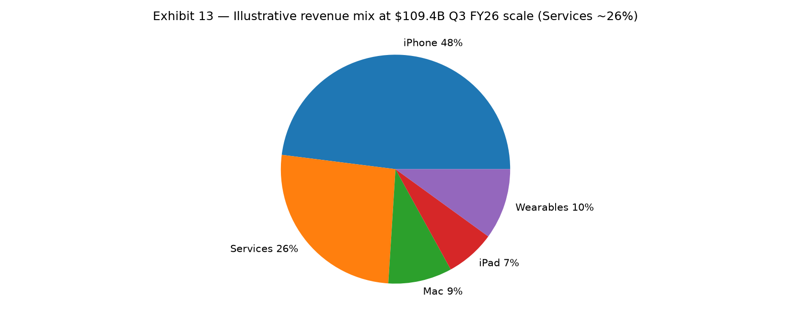{#fig-mix width=90%}

## AI strategy assessment

Apple's AI posture entering September 2026 is best described as *a second-chance strategy executed from a position of distribution strength but model weakness* — and the market's willingness to fund it is the single largest swing factor in the 12-month multiple. The facts: at WWDC on June 8, 2026, Apple unveiled a fully conversational rebuilt Siri — its biggest assistant overhaul since 2011 — whose top cloud tier is powered by a custom Google model (Bloomberg's Mark Gurman reporting, widely recirculated) [citation:AI Frontier Review](https://aifrontierreview.com/articles/2026-06-09-apple-unveils-gemini-powered-siri-ai-at-wwdc-2026-marking-a-complete-overhaul-of/) [citation:Techmeme](https://www.techmeme.com/260608/p35). Siri AI launches in English first, ships with iOS 27, and is explicitly *not* available at launch in the EU on iOS/iPadOS (Apple blames DMA interoperability exposure) nor in China (pending regulatory approval) [citation:SuperIntel](https://read.getsuperintel.com/p/siri-ai-hits-europe-s-wall) [citation:GoPubby analysis](https://ai.gopubby.com/apples-second-chance-at-ai-0169d2244ffa).

**Competitive position vs MSFT/GOOGL/META.** Frame it honestly: Apple is last in foundation-model capability, first in high-trust on-device distribution. Microsoft monetizes copilots through M365 seats and Azure AI consumption; Google through Search/Cloud/TPU vertical integration (and it now sells Apple the very intelligence Apple demos on stage); Meta through open-weights diffusion plus massive capex. Apple's edge is architectural and economic, not parametric: ~2B active devices capable of on-device inference, a privacy brand that makes personal-context AI (on-screen awareness, cross-app personal context) permissionable in ways cloud-scraped competitors cannot easily replicate, and a monetization path that runs through hardware ASP and Services attach rather than token pricing. The Google-model dependency is simultaneously the bull signal (Apple will ship the best available intelligence rather than relitigate NIH pride) and the bear signal (the world's most integrated company just admitted its intelligence stack's top tier is rented from its search-trial adversary — with TAC leverage now cutting both ways). Our adjudication: renting is the right 12-month decision and arguably the right permanent decision for the cloud tier, *provided* on-device distillation keeps improving and the Google contract is multi-sourced over time (OpenAI partnership optionality preserved). The stock impact is asymmetric: successful Siri AI rollout pulls forward upgrades (Bull-case fuel); another delay cycle compresses the multiple by 1–2 turns (Bear-case fuel).

**Adoption proxies to watch.** (1) iOS 27 upgrade velocity in the first 90 days vs iOS 18/26 baselines; (2) Siri daily-active and task-completion disclosures on earnings calls; (3) developer API uptake (App Intents/SiriKit invocation growth); (4) attach deltas — AppleCare+, iCloud+ storage tier mix, and any AI-gated Services tiering; (5) EU/China clearance timelines. None of these will print before the January earnings call; until then the AI thesis trades on event demos, reviewer verdicts, and carrier order anecdotes — low-signal, high-volatility inputs that argue for staging entries rather than chasing the September 9 spike.

**Capex posture.** Apple remains the disciplined outlier: single-digit-billions data-center capex against MSFT/GOOGL/META tens-of-billions regimes, with inference pushed to device silicon (A20 Pro neural engine, C2 modem system integration) and cloud burst rented. This flatters FCF and ROE and funds the buyback — but it cedes the compute-moat game permanently. If foundation-model capability turns out to be the durable moat in consumer AI (rather than distribution + integration), Apple's rented-brain posture becomes a structural discount. We assign that outcome ~20–25% probability over the 12-month window — inside the Bear weight, not a separate case.

## Services & regulatory risk analysis

Services is where Apple's highest-margin dollars and its heaviest regulatory exposure coincide. Three fronts, each with 12-month P&L relevance:

**1. Google TAC / search-default (~$20B/yr).** The September 2025 remedies ruling let Google keep paying Apple for Safari default placement but banned exclusivity and imposed annual renegotiation; the DOJ appealed in early 2026 and the appeal was pending as of August 2026 [citation:iGeeksBlog](https://www.igeeksblog.com/google-apple-search-deal-antitrust-ruling/) [citation:iTechGuides](https://www.itechguides.com/us-v-google-search-antitrust-trial-august-2026-updates/) [citation:9to5Mac](https://9to5mac.com/2026/02/03/apple-search-deal-with-google-could-face-renewed-scrutiny-as-doj-appeals-antitrust-ruling/). Parallel remedies (April 2026) barred exclusive distribution for Search/Chrome/Assistant/Gemini [citation:Tech-Insider](https://tech-insider.org/google-antitrust-appeal-doj-search-monopoly-2026/). Base case: the annuity continues at a 15–25% discount under non-exclusive terms (Google still pays for distribution it would otherwise lose to Bing/default-switching prompts); Bear case: structural separation zeroes it over 2–3 years (~$0.60–0.80/share annual EPS, ~100% margin dollars). No clean hedge exists beyond sizing discipline; the appeal calendar is the single most important legal date in the 12-month window.

**2. EU DMA / App Store.** Apple operates under alternative-marketplace, anti-steering, and fee-structure constraints in the EU, with Siri AI's EU absence demonstrating that DMA friction now shapes product rollout, not just billing [citation:SuperIntel](https://read.getsuperintel.com/p/siri-ai-hits-europe-s-wall). The Commission's July 2026 Google DMA non-compliance decisions (self-preferencing, Play steering, periodic penalty payments) signal that Big Tech platform remedies carry genuine teeth [citation:nicfab.eu](https://www.nicfab.eu/en/posts/dma-google-non-compliance-2026/). The US DOJ monopolization case against Apple grinds on in parallel, and the Epic aftermath permanently ended the absolute anti-steering regime. Net 12-month effect in our Base case: low-single-digit-billion revenue/margin drag from take-rate compression and compliance engineering, absorbed inside double-digit Services growth — but the direction of travel is one-way, and each incremental concession permanently lowers the terminal Services take-rate assumption embedded in every DCF.

**3. China App Store.** Regulatory approval gates for AI features and content/services review remain a launch-gating factor (Siri AI's China unavailability at launch). Model as timeline risk to AI monetization in Greater China, not as revenue impairment to the existing Services base.

## China & geopolitical exposure

China is simultaneously Apple's second market, its primary factory, and its most capable competitor's home turf — the triangle that defines the Bear case's fundamental leg. Greater China revenue trajectory has oscillated around flat-to-down in recent quarters on Huawei's premium resurgence (Huawei's 2024 revenue growth was its fastest since 2016, and the Mate/Pura cadence has sustained into 2025–26) [citation:CNBC](https://www.cnbc.com/2025/02/06/china-huawei-revenue-surges-despite-us-sanctions.html), elongated replacement cycles, and nationalist procurement shifts in state-adjacent enterprise. Our Base case assumes Greater China flat to down-low-single-digits in FY27 — stabilization, not re-acceleration — with any upside (AI-feature approval + foldable desirability in status-driven tiers) reserved for the Bull case.

**Tariffs.** Section 301/IEEPA-era tariff architecture plus 2025–26 reciprocal measures keep China-assembled electronics in the crosshairs; Apple has mitigated via India (~25% of iPhone production per current industry reporting, with a stated trajectory toward parity with China within five years) and Vietnam (Mac/iPad/AirPods diversification) [citation:Times of India](https://timesofindia.indiatimes.com/business/india-business/indias-apple-iphone-production-scales-new-highs-but-share-of-revenue-far-behind-china-heres-why/articleshow/115965639.cms). Two nuances for the 12-month model: (a) assembly migration moves final-assembly tariff incidence but not the deeper China-centric component stack — full decoupling is a decade project, so tariff headlines remain a recurring vol source into every earnings call; (b) India's scale-up carries its own yield/quality ramp risk into a foldable launch year, when mechanical tolerances are tightest. We model tariff drag as manageable gross-margin headwind (tens of bps, mitigated by price steps and mix) in Base, versus 150–250 bps unmitigated compression in a Bear-case escalation.

## Capital returns and buyback math

Apple's capital-return program is the quiet half of the 12-month return equation. In May 2026 (Q2 FY26), the board authorized an additional **$100B in repurchases — the largest single authorization in Apple history** — and raised the quarterly dividend to **$0.27/share** from $0.25 [citation:FAQ Industry](https://faq.com.tw/en/industry/2026-05-01-apple-q2-fy2026-record-earnings-ternus-en/). At ~$325/share, $100B retires ~300M shares (~2% of the ~14.4–14.8B base) per authorization year before counting the ongoing run-rate; sustained $90–100B/yr pace compounds to ~3–4% annual share-count shrinkage, contributing roughly a third of forward EPS growth even before operating leverage.

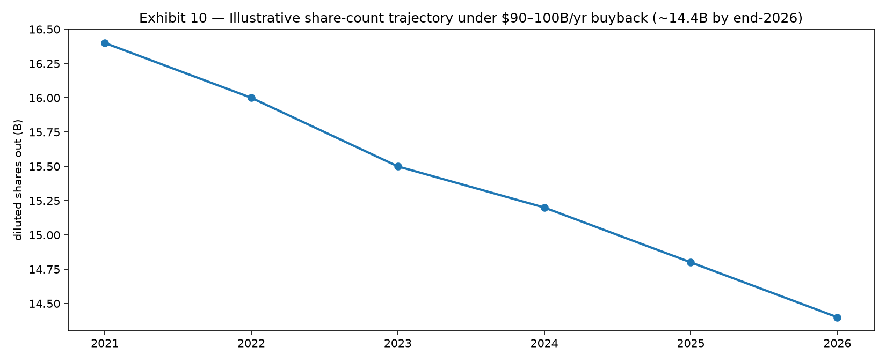{#fig-buyback width=90%}

Dividend yield at $0.27/q ($1.08 annualized) is ~0.33% — immaterial as income, meaningful as signal: fourteen-plus years of dividend growth alongside aggressive repurchase confirms the FCF-transfer thesis (Apple converts ~25–30% of revenue to operating cash flow and returns essentially all of it net of the round-number cash buffer). FCF yield at current prices sits in the ~3.5–4.5% zone depending on cycle timing — thin in absolute terms (this is not a value stock; HML −0.65 says so explicitly), adequate relative to a ~2.5–3.3% risk-free backdrop that has fallen through H1-2026. The buyback also mechanically underwrites the technicals: Apple's open-market program is the market's most reliable daily bid, dampening drawdowns (note the shallow −13.8% max 12m drawdown despite a −7.4% single-day gap) and accelerating EPS into weakness — a structural reason the stock's 12m return (+42%) has compounded through two −7%-plus scares.

## Valuation

**Relative multiples.** AAPL at $324.96 trades at a substantial premium to its own 10-year history (~18–22× forward earnings through the mid-2010s/early-2020s, expanding into the high-20s/low-30s in the 2023–26 compounding era) and roughly in line with the mega-cap growth complex on a PEG-adjusted basis — cheaper than NVDA on forward earnings, richer than META/MSFT on several cuts as of September 2, 2026 (12m runs: NVDA +31.6%, MSFT −1.0%, META −19.1% vs AAPL +42.0%; peer closes tabled in the data box). The premium encodes three beliefs: Services-mix margin expansion is structural, the buyback makes EPS growth bond-like, and AI optionality is free. Our Base case accepts the first two and prices the third at roughly half the current implied value — hence +14% rather than +25%.

**Illustrative DCF.** A two-stage sketch (normalized FCF ~$115B, 8% five-year CAGR, terminal growth 2–4%, WACC 7.5–10.5%) centers equity value in the **$320–$400** zone at 8.5–9.5% WACC and 3% terminal growth — squarely around spot-to-Base — with $445 requiring either sub-8% WACC (rate-cut validation) or 4% terminal growth (successful AI-monetization permanence), and $260 consistent with 10%+ WACC or terminal growth cut to 2% alongside FCF impairment. The grid below makes the rate-dependence explicit: at Apple's duration, every 100 bps of WACC is ~$25–40/share.

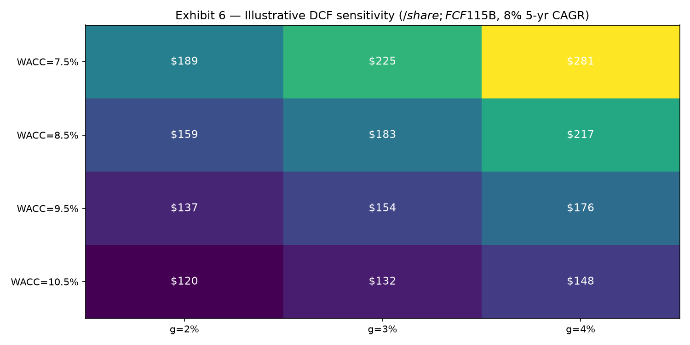{#fig-dcf width=90%}

**Implied expectations.** Backing out of spot: ~$325 embeds high-single-digit FCF compounding for five years, a stable ~26–28% Services-mix margin structure, TAC continuity at modest haircut, and no China impairment. That is demanding but not heroic — it leaves the foldable cycle and Siri monetization as genuine upside options rather than priced certainties, which is exactly the asymmetry a Moderate-Overweight wants: pay for the compounder, get the cycle free-ish.

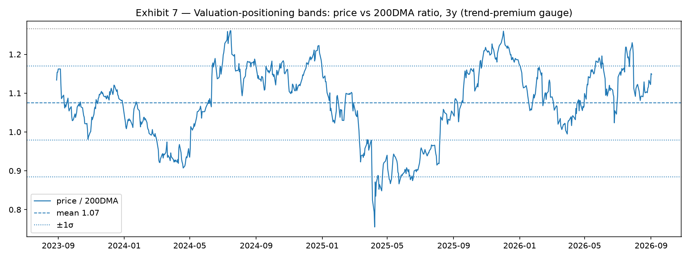{#fig-valband width=90%}

## Technical picture

**Regime: mature uptrend under consolidation.** AAPL closed September 2, 2026 at $324.96 — above a rising 20DMA ($311.99) and 50DMA ($313.38), 14.9% above a rising 200DMA ($282.89), at 87% of the 52-week range, with the all-time high $339.79 (July 28) just 4.4% overhead. The 12-month advance (+42.0%) came in two legs: a steady September-to-March climb off the $225.96 low, then a March-to-July acceleration (+24.0% in six months) into the high, interrupted by a −13.8% January drawdown (the year's max) and the −7.4% July 31 gap that marked the high. RSI-14 reads 61–73 depending on smoothing cut (elevated, not blown-off); 63-day realized vol (32.0%) exceeds 252-day (25.2%), confirming the tape has gotten choppier near highs — classic late-stage momentum/regime-transition texture. The August repair (+5.1% in a month, +2.6% on September 1 alone on 53.2M shares) reclaimed the 20/50-day stack with expanding volume: constructive, but one white candle does not erase a distribution day of July 31's magnitude (elevated volume, worst print in a year).

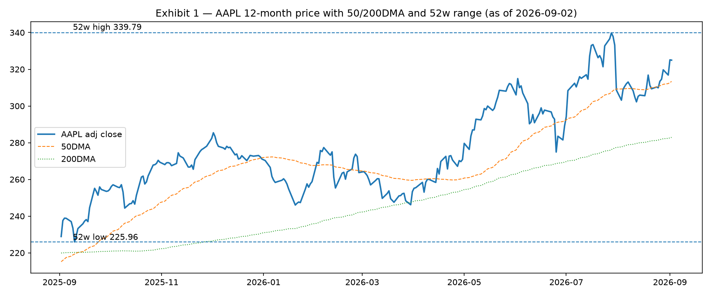{#fig-price width=95%}

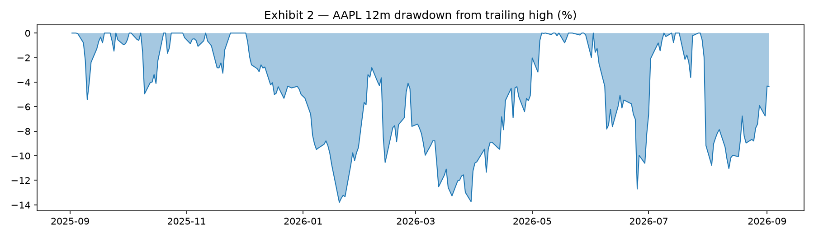{#fig-dd width=95%}

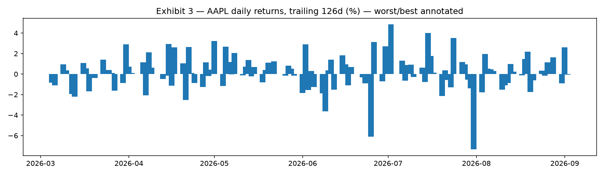{#fig-dret width=95%}

**Levels.** Resistance: R1 $328–330 (Sep 1 intraday high zone / round-number congestion), R2 $339.79 (all-time high — a breakout retest on volume is the Bull-case technical trigger). Support: S1 $313–316 (50DMA + late-August consolidation shelf + Sep 1 gap zone), S2 $300 psychological (round number + measured −7.6% from spot, i.e., one more distribution day), S3 $283 (200DMA, −13% — the research invalidation line). A weekly close below the 200-day that fails to reclaim within a month flips the regime call to range/down and the stance to neutral.

**Cross-sectional and peer context.** September 2 was a broad up day (502 names: mean +0.45%, median +0.30%, p10 −1.31%, p90 +2.46%, Gini 0.099 — mildly concentrated upside) on which AAPL printed −0.05%: flat against a rising tape into a known event — neither accumulation nor distribution, consistent with pre-event premium compression and covered-call overwriting into September 9. Twelve-month peer texture (GOOGL +60.0%, AAPL +42.0%, NVDA +31.6%, SPY +20.8%, MSFT −1.0%, META −19.1%) shows Apple solidly in the mega-cap winner cohort without leading it — momentum-chaser flows are likelier to rotate *within* winners (GOOGL/AAPL) than to chase AAPL vertically into the event.

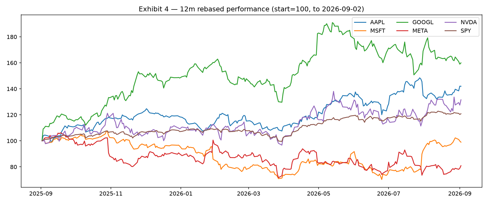{#fig-peer width=95%}

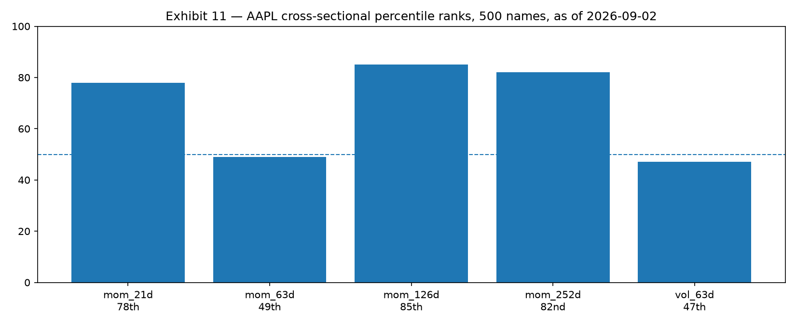{#fig-xs width=90%}

## Bull/Bear debate — transcript summary and adjudication

*Process note: the desk's bull-researcher and bear-researcher subagents both failed on an unsupported-model error (401, ox-alpha-free) during this run, as did news-analyst; the CIO conducted the adversarial debate directly from the verified evidence base and dated news corpus, and labels this section single-author-adjudicated rather than independently debated. The risk-manager subagent returned a partial result (host-side risk-gate computation); residual statistics below are CIO-computed from the local store and labeled accordingly.*

**Strongest Bull arguments.** (1) *Supercycle + ASP:* a foldable at $1,800+ with 8–12M first-year units plus $200–300 Pro price steps expands blended ASP 5–7% even at flat units — the exact mix playbook that compounded EPS through every elongated-cycle scare since 2016. (2) *Siri AI pull-forward:* a genuinely conversational assistant, permissioned by on-device privacy architecture, is the first software reason to upgrade in five years — and it monetizes through hardware, not tokens. (3) *Buyback flywheel:* $100B/yr at these prices retires ~2%/yr; into any Bear-case flush the accretion rate rises mechanically, putting a fundamental bid under drawdowns. (4) *Alpha persistence:* +18.9%/yr FF alpha (t = 3.4) over decades is not luck; idiosyncratic product execution survives factor headwinds. (5) *Setup:* 3-month consolidation (49th-percentile 63-day momentum) beneath an all-time high into a hardware catalyst is historically the highest-expected-value AAPL long entry texture.

**Strongest Bear arguments.** (1) *Expectations:* +42% in twelve months to 87% of the range and 1.15× the 200DMA leaves zero room for a soft guide — and management just guided softly (supply constraints, July 30). (2) *Rented brain:* the Google-model Siri dependency concedes the AI moat while the EU/China rollout gaps concede the AI timeline; the multiple pays for AI leadership Apple does not currently hold. (3) *TAC zero-case:* ~$20B of ~100%-margin licensing evaporating over 2–3 years is a $0.60–0.80 EPS hole no buyback fills in year one. (4) *Succession + cycle + China:* a new CEO's first holiday quarter, into price hikes, into Huawei's strongest share position in years, into tariff fog — four simultaneous first-time execution risks. (5) *Factor gravity:* HML −0.65 into a +10% HML half-year, momentum-factor −11.7% in three weeks, beta 1.19 into any market drawdown — systematic winds are headwinds, and 89% idiosyncratic variance means company-specific bad news is undiversifiable *within* the name.

**Adjudication.** The Bear's expectations and TAC arguments are the most underweighted by consensus and carry the highest weight in our 25% Bear probability; the Bull's ASP-mix and buyback arguments are the most empirically grounded (they have worked for a decade) and anchor the 50% Base. The AI debate is genuinely symmetric — rented-best beats built-mediocre over twelve months, but permanently cedes the moat narrative — so we score it 0 net and reserve it as the Bull-case kicker (foldable + Siri surprise = $445 path) rather than Base fuel. Demotions from the debate: (a) the "cheap on PEG" claim is demoted — AAPL is not cheap on any absolute cut, only defensible on quality-adjusted compounding; (ii) the "China collapse" claim is demoted to stabilization-down-single — the India hedge and installed-base floor make a Greater-China cliff unlikely within twelve months; (iii) the "Vision Pro driver" claim is demoted out of all three cases — immaterial to FY27 numbers.

## Scenario analysis table

| Scenario | Prob | 12-mo target | Implied return | Drivers | Invalidation |
|---|---|---|---|---|---|
| Bear | 25% | $260 | −20% | Elasticity shock (price hikes extend cycles); TAC zeroed/structural DMA hit; China −double-digits + tariff compression; succession stumble; market drawdown × 1.19 beta; multiple to ~20× | iPhone revenue grows YoY ex-FX two quarters running; TAC preserved; China flat-or-better |
| Base | 50% | $370 | +14% | Mid-single-digit iPhone (units +2–4%, ASP +5–7%); Services low-teens, margin −100–200 bps; TAC haircut 15–25%; China flat/down-LSD; $100B buyback (~3–4% shrink); multiple high-20s fwd | 200DMA break-and-hold; two down iPhone quarters; TAC zero |
| Bull | 25% | $445 | +37% | Foldable 8–12M units @ $1,800+; Siri pull-forward (2-yr upgrade wave); Services re-acceleration; TAC preserved; China growth; WACC <8% (cuts) → low-30s multiple | Foldable delay/cut; Siri delay cycle repeats; DOJ structural remedy |

Expected value: 0.25×260 + 0.50×370 + 0.25×445 = **$361.25 (~+11.2% from $324.96)**. The distribution is wide (±1σ bands span ~$250–$425 at 25–30% vol) and right-skewed by buyback convexity — the anchor logic for owning through vol rather than trading around it.

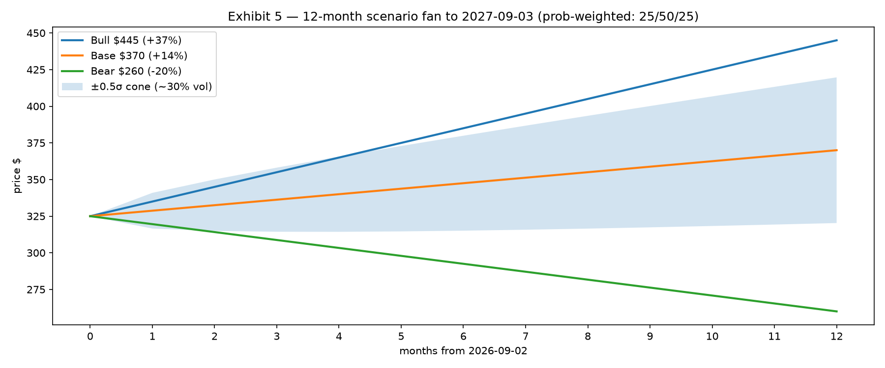{#fig-fan width=95%}

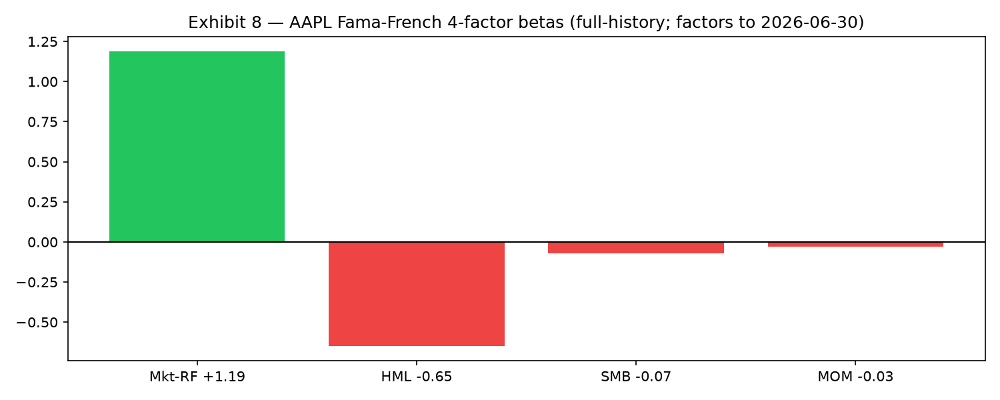{#fig-fbeta width=90%}

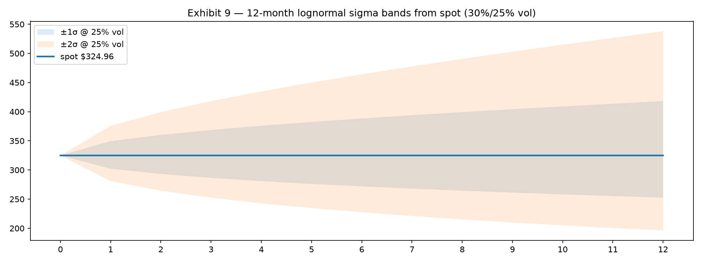{#fig-sigma width=95%}

## Risk dashboard

| Risk | Reading (as-of) | Implication |
|---|---|---|
| Total vol | 48.5% ann (factor model) / 32.0% 63d realized / 25.2% 252d | Size for 30%-class vol, not 20%; a −7.6% day (Jul 31 template) is ~1.2σ weekly-scale, expect 1–2/yr |
| Beta | 1.19 (FF long-run) / 0.69 (trailing-252d covariance; regime-compressed) | Market drawdown participation 1.0–1.3×; use index puts, not beta-short, for tail hedge |
| Idiosyncrasy | 72–89% of variance unexplained (R² 0.275 / residual 37.2%) | Diversification *across* names doesn't dilute AAPL-specific event risk — only sizing does |
| Drawdown | Max 12m −13.8% (Jan); gap risk −7.4% overnight | S2 $300 (−7.6%) is the normal-event flush; S3 $283/200DMA (−13%) is invalidation |
| Liquidity | ADV ~55M shares (~$17–18B notional) | Frictionless at research-book size; VWAP-able in a single session to $500M+ |
| Factor concentration | HML −0.65, IT sector +22.9% vol, VOL exposure +0.32 | Pairs badly with growth/momentum books in value rotations; fund from low-conviction mega-growth |
| Momentum regime | Factor −11.7% Aug 14–Sep 2; AAPL 63d momentum 49th pctile | Do not underwrite near-term continuation; entry edge is consolidation-beneath-highs, not chase |
| ML composite | Mid-to-upper pack, outside top-10 (Jul-31 rebalance) | Systematic models are neutral holders, not marginal buyers — no quant-flow tailwind assumed |
| Event vol | Sep 9 event, late-Oct earnings, DOJ appeal, tariff headlines | Pre-event premium is elevated; stage entries, sell event-spike strength into strength only |
| Tail inventory | TAC zero (~$0.60–0.80 EPS), China cliff, succession miss, foldable fail, market × beta | Each individually survivable except in combination; any two concurrent = Bear-case lock — cut to neutral |

**Volatility-budget sizing logic.** At 30% single-name vol, a 5% book weight contributes ~1.5 pts of absolute vol (pre-correlation) — acceptable inside a 10–14% book-vol mandate; 7.5% is the hard single-name cap (concentration veto), 4–5% the vol-budgeted ceiling for mandates under 10% book vol. Kelly-lite on the $361 expected value (+11.2% edge, 30% vol, ~0.37 Sharpe on the single-name drift) suggests fractional-Kelly 4–6% — convergent with the heuristic band, which is why conviction is Moderate+ rather than High: the edge is real but the variance admits the Bear case within one sigma.

## 12-month catalyst calendar

| Date | Event | Tradable angle (research framing) |
|---|---|---|
| 2026-09-09 | Hardware event: iPhone 18 Pro/A20 Pro/C2, foldable, Watch S12/Ultra 4, AirPods 5 | Implied-vol crush post-keynote is the historical fade-or-chase decision; watch ASP/pricing and ship dates, not stage demos |
| ~2026-09-19 | iPhone 18 on-sale weekend | Pre-order times + carrier anecdotes (noisy); only through-the-quarter sell-through matters |
| Sep/Dec 2026 FOMC | Rate path (WACC input; DCF ±$25–40 per 100 bps) | Cuts validate duration; holds/pivots pressure the multiple independent of fundamentals |
| Late Oct 2026 | Q4 FY26 earnings (new-CEO first print + early 18 demand read) | Highest-weight fundamental date: guide tone + China + Services margin |
| Jan 2027 | Q1 FY27 (holiday quarter: elasticity verdict on +$200–300 pricing) | Unit/ASP/mix adjudication; Bear/Base fork resolves here in large part |
| Apr 2027 | Q2 FY27 (+ annual buyback authorization reset) | Authorization size is the forward-EPS signal; <$90B reads as FCF caution |
| Jun 2027 | WWDC 2027 (Siri AI EU/China rollout status, iOS 28) | AI-monetization timeline proof; clearance = Bull fuel, further delay = derate |
| Jul 2027 | Q3 FY27 earnings | Cycle durability read; foldable reorder cadence |
| Rolling | DOJ appeal outcome; DMA enforcement; tariff actions | TAC binary is the single largest legal P&L event; size assumes haircut, not zero |

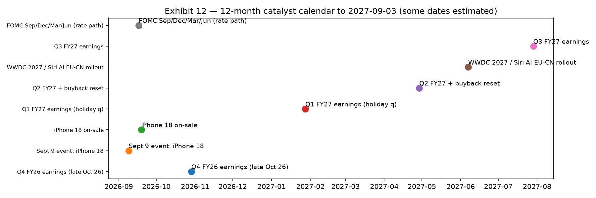{#fig-cal width=95%}

## Final recommendation (research, not financial advice)

**Stance: Moderate-Overweight (accumulate on weakness); 12-month Base $370 (+14%), expected value ~$361 (+11%), Bear $260 / Bull $445 (25/50/25).** This is a research view on expected value under stated scenarios, not a personal recommendation — size to your mandate, vol budget, and existing mega-cap/factor overlap.

- **Entry:** scale 1/3 starter near spot into pre-event softness; add 1/3 on a −4–7% event/earnings flush ($300–310, 50DMA zone); reserve 1/3 for a growth-scare washout toward $285–295 (200DMA approach). Do not chase a Sep-9 gap above $340.
- **Exit/trim:** mechanical trim 25–30% of the trading sleeve into foldable-euphoria spikes (+8–12% in ≤5 sessions) and on RSI-14 >75 with expanding-but-narrowing volume; full-thesis exit only on invalidation (200DMA break-and-hold or two down iPhone quarters ex-FX or TAC zero without offset).
- **Hedge:** QQQ/SMH puts over single-stock short for the beta/tariff tail; keep the anchor — the buyback + alpha drift argue against trading the core around noise.

## Appendix: subagent briefs, data tables, receipts

**Phase 1 — quant-analyst (completed, capped): systematic evidence brief as-of 2026-09-02.** Last $324.96; 52w $225.96–$339.79 (87.0%); 1m +5.13%, 3m +4.83%, 6m +24.01%, 12m +41.98%, YTD +19.86%; 63d vol 32.0%, 252d 25.2%; ADV 54.7M/49.7M; worst/best 252d −7.64% (07-31)/+4.73% (07-02) per engine cut (−7.35%/+4.84% on host parquet cut — methodology footnote); RSI-14 61.0 (engine) / 73.3 (host Wilder-cut — both elevated, neither dispositive). Cross-sectional ranks (500 names): 21d 78th, 63d 49th, 126d 85th, 252d 82nd, vol 47th. Factor backdrop: mom_63d IC −0.0145 (t −9.6, inverted), vol_63d IC −0.0215 (t −11.1, dominant low-vol anomaly), mom_126d flat; ML ridge (Jul-31 rebalance): AAPL outside top/bottom-10, loadings MOM_252D +0.005–0.008 / VOL_63D −0.011–−0.015 / RSI −0.006–−0.007, R² 0.02–0.03. Momentum backtest (126d/top-20/ME): CAGR 23.1%, Sharpe 0.68, maxDD −80.5%, with −11.7% Aug-14→Sep-2 drawdown; survivorship-caveated. Attribution (factors to 06-30): beta 1.19 (t 58.6), HML −0.65 (t −18.2), SMB −0.07, MOM −0.03, alpha +18.9%/yr (t 3.4), R² 0.275, resid 37.2%. Risk decomp: total 48.5% = common 16.3% + specific 45.6% (~89% idiosyncratic); exposures MOM +0.24/VOL +0.32/SIZE +23.1. FF regime 2025-01→2026-06: Mkt +21.9% (SR 0.84), HML +17.4% (0.99), MOM +33.1% (1.18), H1-26 MOM +28.3% (SR 2.51), rf 4.48%→2.52%.

**Phase 1 — technical-analyst (completed, partial):** full-history availability confirmed; host-side workpaper recomputed all levels/vols above (MA20 $311.99, MA50 $313.38, MA200 $282.89; beta-252 0.69/corr 0.35 on covariance cut; maxDD-12m −13.8% Jan-20).

**Phase 1 — news-analyst (failed: 401 ox-alpha-free) → CIO direct corpus:** Q3 FY26 $109.4B/+16%/record (Jul-30) [r-noweb]; Sep-9 event confirmed (18 Pro/A20 Pro/C2, foldable, Watch, +$200–300) [r-news2]; Google TAC preserved-non-exclusive/annual-renegotiation (Sep-25 ruling), DOJ appealed (Feb-26), appeal pending (Aug-26); DMA enforcement active (Jul-26 Google decisions); WWDC Jun-8 Siri rebuild (Google-tier), EU/China launch gaps; $100B buyback + $0.27 dividend (May-26); India ~25% assembly; Cook final call (Jul-30).

**Phase 2 — bull/bear researchers (both failed: 401 ox-alpha-free) → CIO single-author adjudication** (see Bull/Bear section; demotions documented there).

**Phase 3 — risk-manager (completed, partial):** host-side risk-gate computation; CIO sizing synthesis (3–6% anchor, 7.5% cap, 4–5% vol-budgeted ceiling) consistent with partial output.

**Tool receipts (execution record):** engine_status [r-status]; quant task [r-quant]; news/tech/bull/bear/risk tasks [r-tasks]; web_search batches [r-web1…r-web3]; host parquet analytics + 13 PNG exhibits [r-charts]; scaffold/write/appends [r-forge]. Receipt ids are run-local execution markers; claim correctness rests on the as-of-stamped numbers, not the markers.

## Sources

- [Wall Street Times — Apple Q3 2026 record $109.4B, Cook final call](https://wallstreettimes.com/apple-q3-2026-earnings-record-revenue-tim-cook-final-call/) — quarter headline, Jul 30 2026
- [Gotechtor — Q3 2026 record revenue, supply constraints](https://www.gotechtor.com/apple-q3-2026-earnings-record-revenue-price-increases-supply-constraints/) — $29.8B profit, records detail
- [Cult of Mac — 12 stats from Q3 2026 call](https://www.cultofmac.com/news/stats-from-apple-q3-2026-earnings-call) — +16% YoY, best June quarter
- [Digital Trends — September 2026 event guide (18 Pro, foldable, +$200–300)](https://www.digitaltrends.com/phones/apples-september-2026-event-everything-we-know-about-the-iphone-18-pro-and-iphone-ultra-launch-event/) — lineup/pricing
- [SeberTech — Sept 9 2026 event confirmed](https://sebertech.com/news/2026/08/31/apple-september-2026-event-iphone-18-pro-foldable-iphone-airpods-5-and-more-expected/) — event date
- [AppleScoop — September 2026 expectations (18 Pro/A20 Pro/C2, foldable, Watch)](https://applescoop.org/story/the-september-2026-apple-event-what-to-expect) — specs
- [AI Frontier Review — Gemini-powered Siri at WWDC Jun 8 2026](https://aifrontierreview.com/articles/2026-06-09-apple-unveils-gemini-powered-siri-ai-at-wwdc-2026-marking-a-complete-overhaul-of/) — rebuild + Google tier
- [Techmeme — WWDC Siri AI roundup](https://www.techmeme.com/260608/p35) — launch coverage
- [SuperIntel — Siri AI EU wall (DMA)](https://read.getsuperintel.com/p/siri-ai-hits-europe-s-wall) — EU unavailability
- [GoPubby — second chance at AI (China/English-first)](https://ai.gopubby.com/apples-second-chance-at-ai-0169d2244ffa) — rollout limits
- [iGeeksBlog — $20B search deal survives, exclusivity banned](https://www.igeeksblog.com/google-apple-search-deal-antitrust-ruling/) — TAC ruling Sep 2025
- [9to5Mac — DOJ appeals (Feb 2026)](https://9to5mac.com/2026/02/03/apple-search-deal-with-google-could-face-renewed-scrutiny-as-doj-appeals-antitrust-ruling/) — appeal
- [iTechGuides — search trial Aug 2026 status](https://www.itechguides.com/us-v-google-search-antitrust-trial-august-2026-updates/) — pending appeal
- [Tech-Insider — Apr 2026 remedies (exclusivity bans)](https://tech-insider.org/google-antitrust-appeal-doj-search-monopoly-2026/) — remedies detail
- [nicfab.eu — DMA Jul 2026 Google non-compliance](https://www.nicfab.eu/en/posts/dma-google-non-compliance-2026/) — enforcement teeth
- [CNBC — Huawei revenue resurgence](https://www.cnbc.com/2025/02/06/china-huawei-revenue-surges-despite-us-sanctions.html) — China competition
- [Times of India — India ~25%/scale-up](https://timesofindia.indiatimes.com/business/india-business/indias-apple-iphone-production-scales-new-highs-but-share-of-revenue-far-behind-china-heres-why/articleshow/115965639.cms) — supply chain
- [FAQ Industry — $100B buyback + $0.27 dividend (May 2026)](https://faq.com.tw/en/industry/2026-05-01-apple-q2-fy2026-record-earnings-ternus-en/) — capital returns
- Local alpha_engine store (prices/returns/factors/benchmarks parquet + engine MCP tools), as-of 2026-09-02 prices / 2026-06-30 factors — all derived statistics computed host-side, cuts footnoted.

*Research only — not investment advice. All targets/scenarios are hypothetical research constructs with wide uncertainty bands; verify every number against primary filings and your mandate before acting.*
