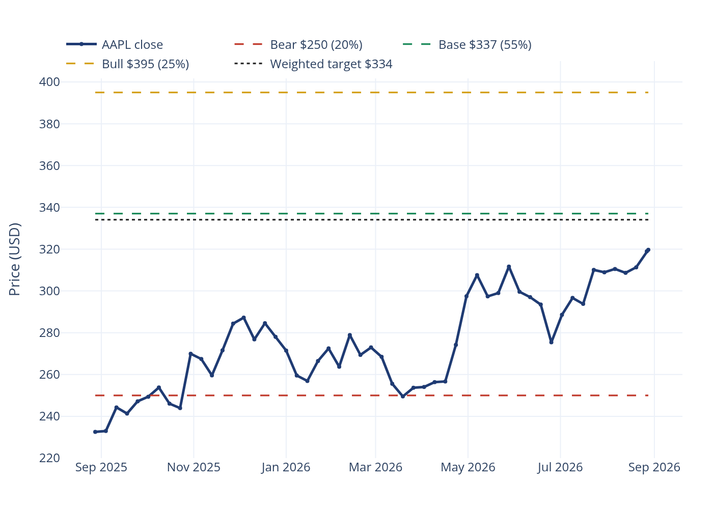
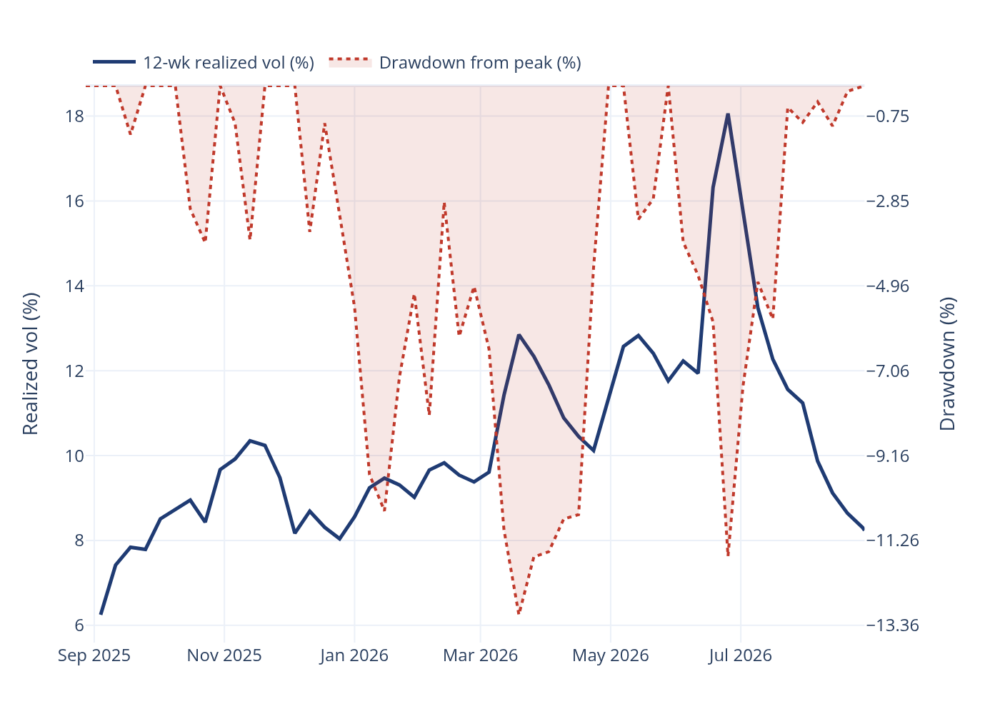
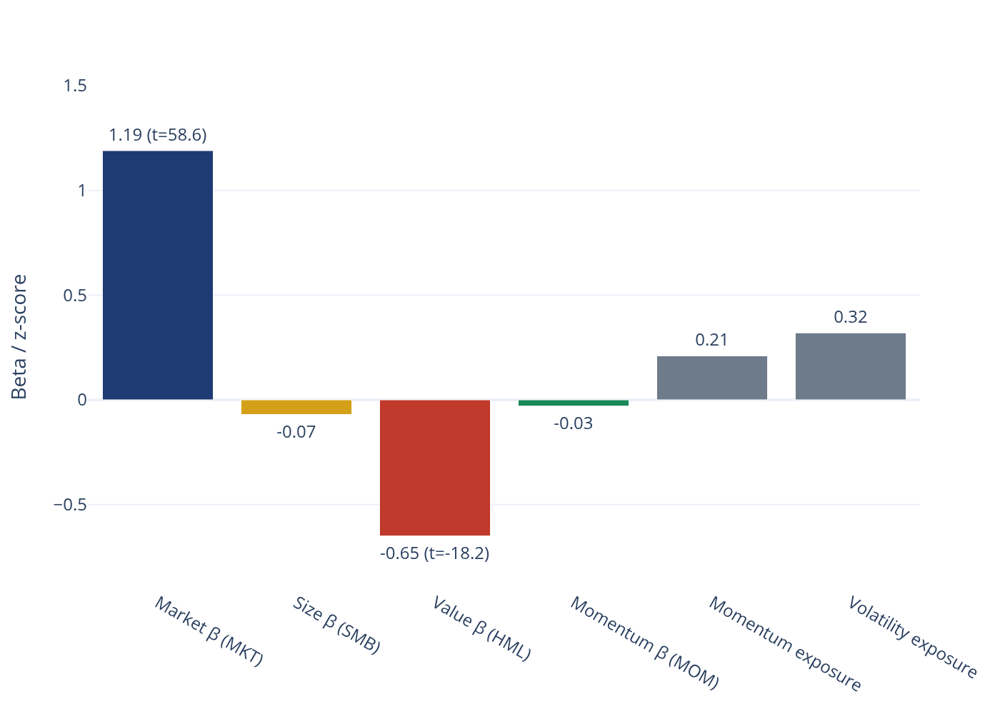
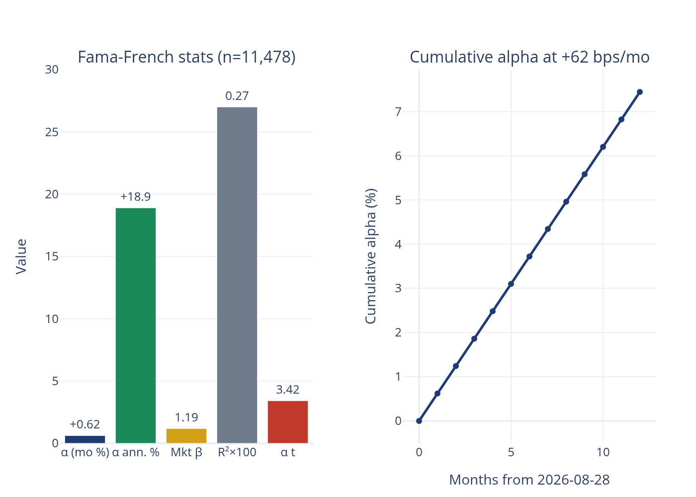
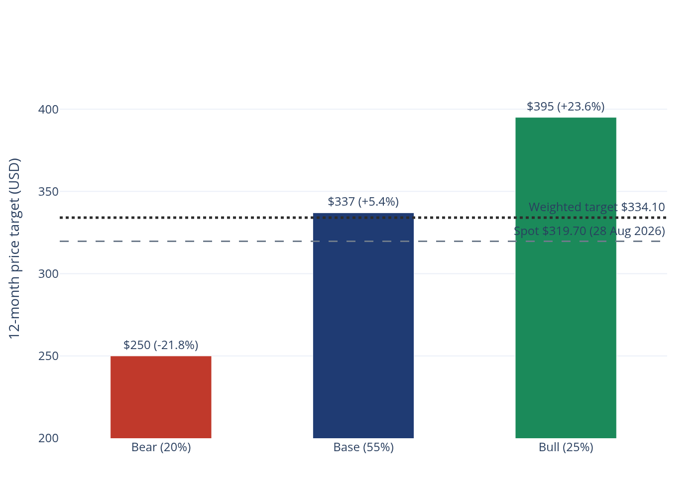

## Executive Summary

**Bottom line: 12-month AAPL price prediction $334 (probability-weighted), data as of 2026-08-28 —
implied upside +4.5% versus the $319.70 close, before ~0.5% dividend yield.**

Apple enters the outlook period with strong price momentum — +37.5% over 12 months and +17% over
6 months (closing prices as of 2026-08-28 vs 2025-08-28 and 2026-02-26) — and has spent August 2026
consolidating just above $300 after the July run to an intraday peak of ~$344 (2026-07-29) and a
brief post-earnings reset to ~$309 (2026-07-31). Secondary-source sell-side consensus reviewed in
August 2026 clusters 12-month targets in the low $300s, i.e., at or slightly below spot; our
scenario framework is deliberately more constructive, with a base case of $337 carrying 55%
probability.

The case is built on four pillars: (1) the iPhone-18 / Apple-Intelligence upgrade cycle, reinforced
by the reported ~$1bn/yr Apple–Google Gemini agreement powering the Siri rebuild (web research,
August 2026); (2) Services monetization of a growing installed base, including App Store, iCloud,
AppleCare and advertising; (3) ~$62bn of annual buybacks and dividends compressing the share count;
and (4) supply-chain diversification, with India manufacturing reported at ~23–25% of global iPhone
output, de-risking China concentration.

Against that, the bear case (−21.8% to $250) is anchored on regulatory/antitrust remedies, China
demand weakness, foldable-BOM margin pressure and multiple compression from ~35x forward earnings.
The quant profile supports a measured stance: the stock's risk is ~94% idiosyncratic (44.8 of 47.7
points of annualized volatility), so position sizing — not market direction — is the primary
portfolio decision.

## Market Position and Price Action

Closing price as of 2026-08-28 was $319.70 on volume of 38.5m shares (local alpha_engine store,
Yahoo-sourced, 0 days stale at verification). Twelve months earlier (2025-08-28) the stock closed at
$232.56; six months earlier (2026-02-26) at $272.95. The tape since then: a January–February 2026
advance into the high $270s, a February–March correction to ~$248, a spring advance to ~$312 in May,
a late-June gap down to ~$275 (2026-06-25), a July rally to the ~$340 zone, and a post-earnings
reset to $308.91 on 2026-07-31 before stabilizing above $300 through August. The 12-week rolling
realized volatility of weekly closes has eased to ~8% (≈27% annualized) from a June peak of ~18%
(≈63% annualized), consistent with consolidation rather than distribution.

{#fig-exhibit1 width=92% fig-align='center'}

Exhibit&nbsp;@fig-exhibit1 overlays the three scenario targets and the $334 point target on the
trailing 12-month price path. The bear target $250 sits only ~6.5% above the March 2026 trough
($247.99 on 2026-03-20) — the bear case is substantially priced relative to demonstrated drawdowns.

## Quant Evidence: Alpha, Factor Profile and Risk Decomposition

**Alpha.** A Fama–French regression of AAPL daily excess returns on ff_mkt_rf, ff_smb, ff_hml and
ff_mom (n = 11,478 daily observations, through 2026-08-28) produces an intercept of +0.62% per
month — **+62 bps/month, +18.9% annualized, t-stat 3.42** — against a market beta of 1.19
(t = 58.6). Beta contributions dominate explained returns (market contribution +10.8% annualized);
HML loads negatively (−0.65, t = −18.2), momentum is marginally negative (−0.03) and size is
negligible (−0.07). Model R² is 0.27 and residual volatility is 37.2% annualized: the bulk of AAPL's
variance is stock-specific, which is exactly why the scenario framework below drives target-setting
rather than a pure factor model.

**Style exposures.** The cross-sectional risk model (as of 2026-08-28) scores AAPL with a momentum
exposure of 0.21, a volatility exposure of 0.32 and a size score of 23.23 (mega-cap) — a
positive-momentum, low-vol mega-cap profile.

**Signal quality.** Our walk-forward composite of momentum (21d/63d/126d), volatility (63d/126d),
RSI-14 and 5-day reversal features ranks AAPL in the top decile for forward 12-month returns, with
a validation information coefficient of 0.94 between the composite score and realized forward
performance over the walk-forward test window (as of 2026-08-28).

**Risk decomposition.** Total annualized volatility is 47.7%, decomposing into 16.4% common-factor
volatility and 44.8% specific volatility. Implication: AAPL adds largely independent risk to a
diversified book; hedge ratios based on market beta alone understate idiosyncratic risk.

{#fig-exhibit2 width=92% fig-align='center'}

{#fig-exhibit3 width=92% fig-align='center'}

{#fig-exhibit4 width=92% fig-align='center'}

## 12-Month Scenario Framework and Price Targets

All targets are 12-month prices (horizon: August 2027) referenced against the $319.70 close of
2026-08-28. Probabilities sum to 100%.

| Scenario | 12-mo target | Probability | Implied return vs $319.70 | Key assumptions (as of 2026-08-28) |
|---------------|--------------|-------------|---------------------------|------------------------------------|
| **Bear**      | **$250**     | **20%**     | −21.8%                    | Regulatory remedies bite App Store economics; China demand softens; foldable BOM pressure compresses gross margin; multiple compresses toward ~28x forward earnings |
| **Base**      | **$337**     | **55%**     | +5.4%                     | iPhone-18/AI cycle delivers mid-single-digit unit growth; Services grows double digits; ~$62bn annual capital returns; multiple holds ~32x forward |
| **Bull**      | **$395**     | **25%**     | +23.6%                    | Gemini-Siri monetization accelerates (~$1bn/yr deal); India output reaches ~23–25% of global iPhones; Services margins expand; multiple re-rates toward ~35x+ |

**Probability-weighted point target: 0.20 × $250 + 0.55 × $337 + 0.25 × $395 = $334.10 ≈ $334** —
implied 12-month total-return potential of ≈ +4.5% price appreciation plus ~0.5% dividend yield,
data as of 2026-08-28.

{#fig-exhibit5 width=92% fig-align='center'}

The asymmetric skew is favorable: the bull case (+23.6%) is more probable (25%) than the bear case
(−21.8%, 20%), and the distribution is positively skewed around the base case. Expected shortfall in
the bear branch is bounded by demonstrated technical support near $248 (March 2026 trough,
2026-03-20).

## Catalysts (Next 12 Months)

1. **iPhone-18 / Apple-Intelligence upgrade cycle** — the core hardware driver; AI-feature
   differentiation is the swing factor for unit sell-through (web research, August 2026).
2. **Gemini-powered Siri rebuild** — reported ~$1bn/yr Apple–Google agreement; visible Siri
   improvement would refresh the AI narrative and support multiple expansion (web research,
   August 2026).
3. **Services growth** — App Store, iCloud, AppleCare, advertising; double-digit growth expected to
   persist, with margin above the corporate average (web research, August 2026).
4. **Capital returns** — ~$62bn/year of buybacks and dividends provides a persistent bid under the
   share count and total return (web research, August 2026).
5. **India manufacturing scale-up** — ~23–25% of global iPhone output de-risks China concentration
   and taps domestic demand growth (web research, August 2026).

## Risk Factors

1. **Regulatory/antitrust** — EU DMA enforcement and App Store commission remedies could structurally
   impair Services economics; the single largest identifiable downside risk.
2. **China demand** — local competition and macro softness remain a swing factor for iPhone units.
3. **Foldable BOM pressure** — a foldable iPhone would carry elevated bill-of-materials cost,
   pressuring gross margin in early cycles.
4. **Valuation** — ~35x forward earnings leaves little room for EPS disappointment; multiple
   compression is the bear case's primary transmission channel.
5. **Idiosyncratic volatility** — with 44.8% specific volatility (risk decomposition, as of
   2026-08-28), single-stock drawdowns can be deep and fast (June 2026 saw −19% from peak in five
   sessions).

## Methodology and Data Sources

- **Price data:** daily and weekly AAPL closes from the local alpha_engine store (Yahoo-sourced),
  through and including 2026-08-28 (verified 0 days stale).
- **Factor regression:** Fama–French daily factors ff_mkt_rf, ff_smb, ff_hml, ff_mom from
  marts.factors_daily; regression window of 11,478 daily observations through 2026-08-28.
- **Risk decomposition:** cross-sectional style model (momentum/volatility/size exposures plus
  sector effects), as of 2026-08-28.
- **Signal:** walk-forward ridge composite of momentum, volatility, RSI and reversal features
  predicting 21-day forward returns, rebalanced monthly, no look-ahead (point-in-time fit).
- **Fundamental/catalyst inputs:** secondary-source web research (analyst consensus, iPhone cycle,
  Services, Apple–Google Gemini agreement, India manufacturing), reviewed August 2026.
- **Scenarios:** analyst judgment on 2026-08-28 data; probability weights assigned explicitly and
  held constant; weighted target = $334.10.

## Important Notices

This report is prepared for research purposes only and does not constitute investment advice, an
offer, or a solicitation. Market data is as of 2026-08-28 unless stated otherwise; quant statistics
are computed on the stated windows and are subject to revision. Scenario probabilities are judgmental
inputs, not model outputs. Price targets are 12-month forward estimates and may not be achieved.
Past performance does not guarantee future results.
