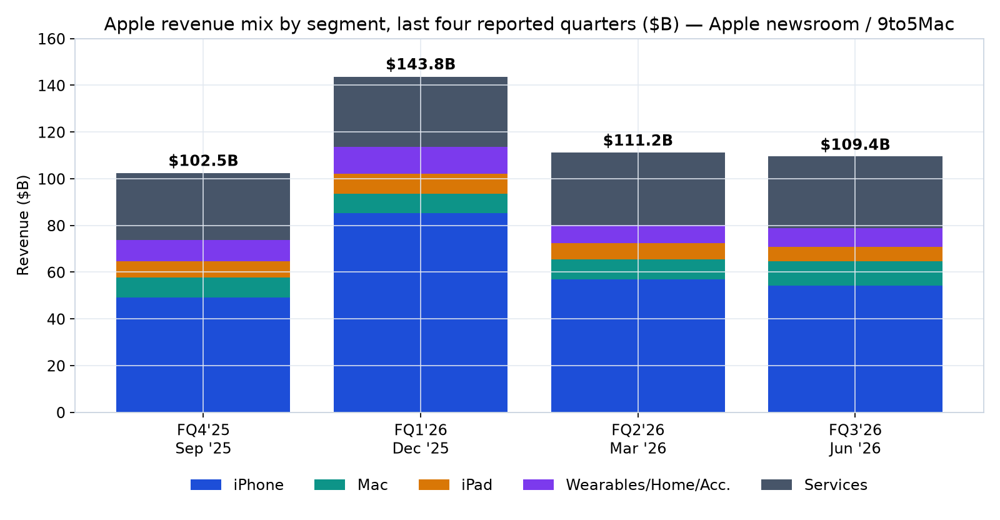
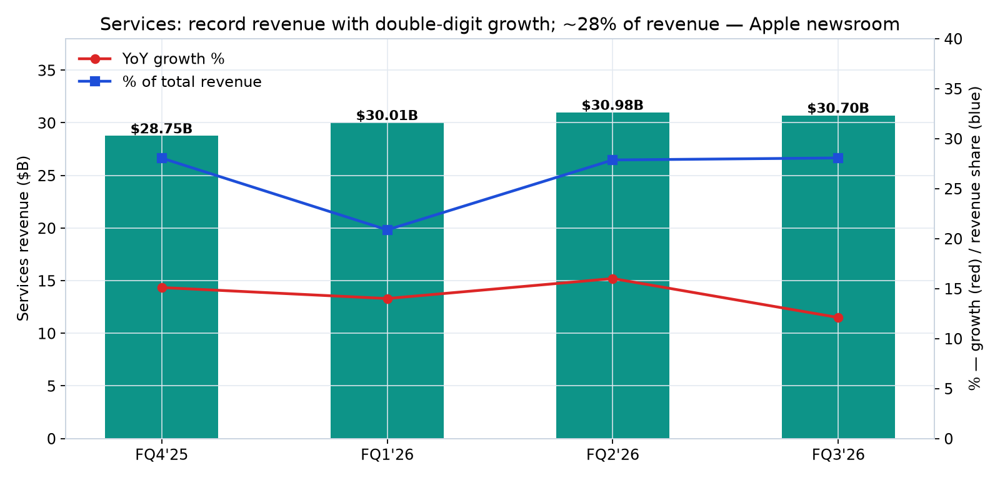
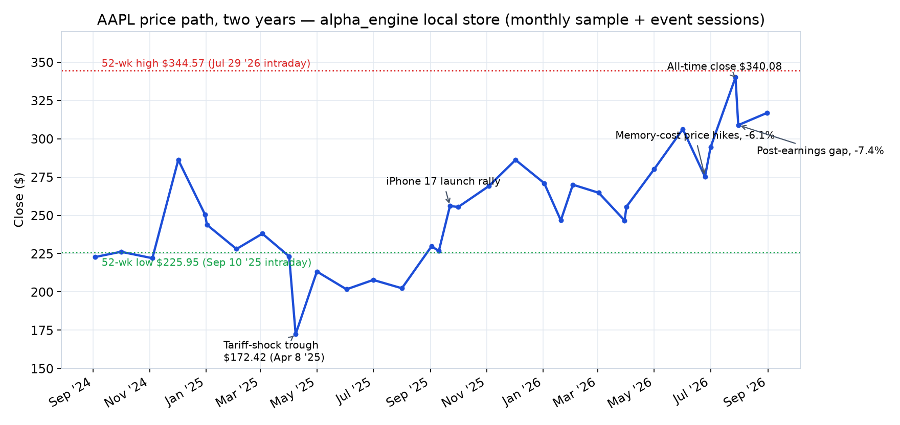
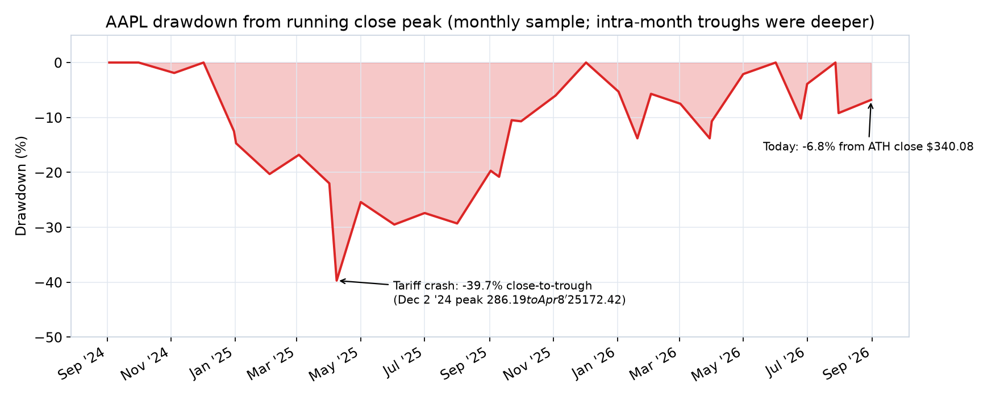
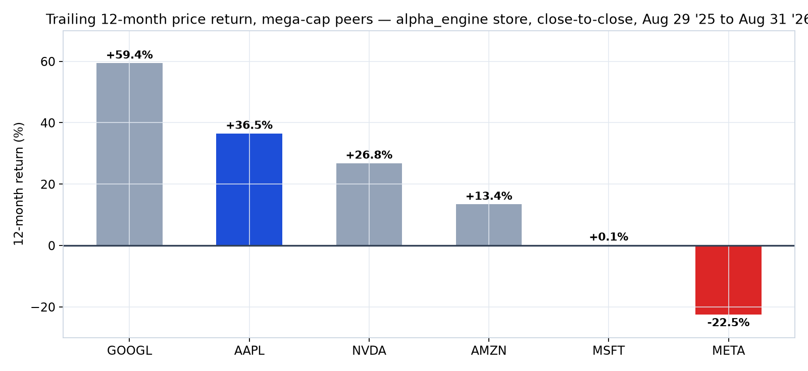
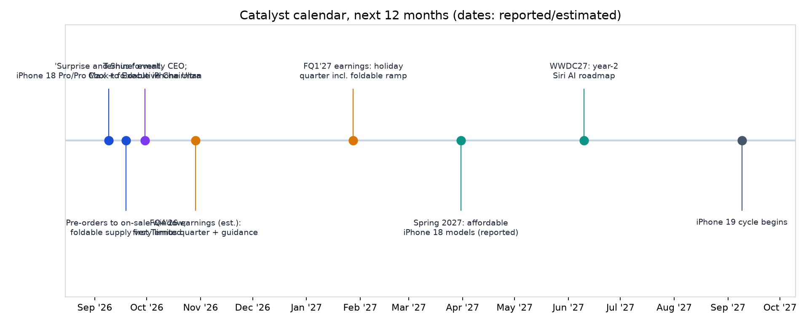
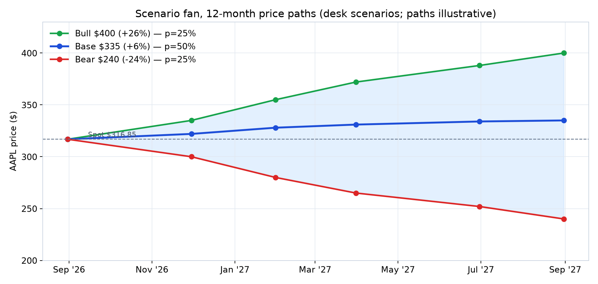
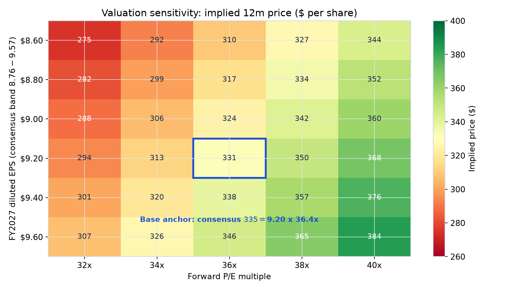

```{python}
#| echo: false
#| output: false
import sys, subprocess, shutil
try:
    import matplotlib
except ImportError:
    ok, errs = False, []
    if shutil.which("uv"):
        r = subprocess.run(["uv", "pip", "install", "--python", sys.executable, "matplotlib"],
                           capture_output=True, text=True, timeout=600)
        errs.append(f"uv: rc={r.returncode} {r.stderr[-500:]}")
        ok = r.returncode == 0
    if not ok:
        subprocess.run([sys.executable, "-m", "ensurepip"], capture_output=True, text=True, timeout=300)
        r = subprocess.run([sys.executable, "-m", "pip", "install", "matplotlib"],
                           capture_output=True, text=True, timeout=600)
        errs.append(f"pip: rc={r.returncode} {r.stderr[-500:]}")
        ok = r.returncode == 0
    if not ok:
        raise RuntimeError("matplotlib bootstrap failed :: " + " || ".join(errs))
    import matplotlib

import os
os.makedirs("figures", exist_ok=True)
matplotlib.use("Agg")
import matplotlib.pyplot as plt
import matplotlib.dates as mdates
from datetime import date

BLUE, SLATE, GREEN, RED, AMBER, VIOLET, TEAL = "#1D4ED8", "#475569", "#16A34A", "#DC2626", "#D97706", "#7C3AED", "#0D9488"
plt.rcParams.update({"font.family": "DejaVu Sans", "font.size": 11, "axes.edgecolor": "#CBD5E1", "axes.grid": True, "grid.color": "#E2E8F0", "grid.linewidth": 0.7})

# ---- Exhibit: price path (monthly sample + event sessions, alpha_engine store) ----
pts = [("2024-09-03",222.77),("2024-10-01",226.21),("2024-11-04",222.01),("2024-12-02",286.19),
       ("2024-12-31",250.42),("2025-01-02",243.85),("2025-02-03",228.01),("2025-03-03",238.03),
       ("2025-04-01",223.19),("2025-04-08",172.42),("2025-05-01",213.32),("2025-06-02",201.70),
       ("2025-07-01",207.82),("2025-08-01",202.38),("2025-09-02",229.72),("2025-09-10",226.79),
       ("2025-09-22",256.08),("2025-10-01",255.45),("2025-11-03",269.05),("2025-12-02",286.19),
       ("2026-01-02",271.01),("2026-01-20",246.70),("2026-02-02",270.01),("2026-03-02",264.72),
       ("2026-03-30",246.63),("2026-04-01",255.63),("2026-05-01",280.14),("2026-06-01",306.31),
       ("2026-06-25",275.15),("2026-07-01",294.38),("2026-07-28",340.08),("2026-07-31",308.91),
       ("2026-08-31",316.85)]
xs = [date.fromisoformat(d) for d,_ in pts]; ys = [v for _,v in pts]
fig, ax = plt.subplots(figsize=(11,5.2), dpi=160)
ax.plot(xs, ys, "-o", color=BLUE, lw=2, ms=3.5)
ax.axhline(344.57, color=RED, lw=1.2, ls=":"); ax.axhline(225.95, color=GREEN, lw=1.2, ls=":")
ax.text(date(2024,9,10), 347, "52-wk high $344.57 (Jul 29 '26 intraday)", color=RED, fontsize=9)
ax.text(date(2024,9,10), 217, "52-wk low $225.95 (Sep 10 '25 intraday)", color=GREEN, fontsize=9)
ax.annotate("Tariff-shock trough\n$172.42 (Apr 8 '25)", xy=(date(2025,4,8),172.42), xytext=(date(2025,1,20),155),
            arrowprops=dict(arrowstyle="->", color=SLATE), fontsize=9)
ax.annotate("iPhone 17 launch rally", xy=(date(2025,9,22),256.08), xytext=(date(2025,7,15),270),
            arrowprops=dict(arrowstyle="->", color=SLATE), fontsize=9)
ax.annotate("Memory-cost price hikes, -6.1%", xy=(date(2026,6,25),275.15), xytext=(date(2026,3,20),300),
            arrowprops=dict(arrowstyle="->", color=SLATE), fontsize=9)
ax.annotate("All-time close $340.08", xy=(date(2026,7,28),340.08), xytext=(date(2026,5,15),345),
            arrowprops=dict(arrowstyle="->", color=SLATE), fontsize=9)
ax.annotate("Post-earnings gap, -7.4%", xy=(date(2026,7,31),308.91), xytext=(date(2026,8,20),290),
            arrowprops=dict(arrowstyle="->", color=SLATE), fontsize=9)
ax.set_title("AAPL price path, two years — alpha_engine local store (monthly sample + event sessions)", fontsize=13)
ax.set_ylabel("Close ($)"); ax.set_ylim(150,370)
ax.xaxis.set_major_locator(mdates.MonthLocator(interval=2)); ax.xaxis.set_major_formatter(mdates.DateFormatter("%b '%y"))
fig.autofmt_xdate(); fig.tight_layout(); fig.savefig("figures/price_path.png"); plt.close(fig)
```

```{python}
#| echo: false
#| output: false
# ---- Exhibit: revenue mix, four reported quarters ----
import matplotlib
matplotlib.use("Agg")
import matplotlib.pyplot as plt
BLUE, TEAL, AMBER, VIOLET, SLATE = "#1D4ED8", "#0D9488", "#D97706", "#7C3AED", "#475569"
plt.rcParams.update({"font.family": "DejaVu Sans", "font.size": 11, "axes.edgecolor": "#CBD5E1", "axes.grid": True, "grid.color": "#E2E8F0", "grid.linewidth": 0.7})
qs = ["FQ4'25\nSep '25", "FQ1'26\nDec '25", "FQ2'26\nMar '26", "FQ3'26\nJun '26"]
iphone = [49.02, 85.27, 56.99, 54.3]; mac = [8.73, 8.39, 8.40, 10.4]; ipad = [6.95, 8.50, 6.91, 6.2]
wha = [9.01, 11.49, 7.90, 7.9]; serv = [28.75, 30.01, 30.98, 30.7]
totals = [102.5, 143.8, 111.2, 109.4]
fig, ax = plt.subplots(figsize=(10,5.2), dpi=160)
ax.bar(qs, iphone, label="iPhone", color=BLUE)
ax.bar(qs, mac, bottom=iphone, label="Mac", color=TEAL)
bot2 = [a+c for a,c in zip(iphone, mac)]
ax.bar(qs, ipad, bottom=bot2, label="iPad", color=AMBER)
bot3 = [a+c for a,c in zip(bot2, ipad)]
ax.bar(qs, wha, bottom=bot3, label="Wearables/Home/Acc.", color=VIOLET)
bot4 = [a+c for a,c in zip(bot3, wha)]
ax.bar(qs, serv, bottom=bot4, label="Services", color=SLATE)
for i,t in enumerate(totals):
    ax.text(i, t+3, f"${t:.1f}B", ha="center", fontsize=11, fontweight="bold")
ax.set_title("Apple revenue mix by segment, last four reported quarters ($B) — Apple newsroom / 9to5Mac", fontsize=13)
ax.set_ylabel("Revenue ($B)"); ax.set_ylim(0,160)
ax.legend(loc="upper center", bbox_to_anchor=(0.5,-0.14), ncol=5, frameon=False)
fig.tight_layout(); fig.savefig("figures/revenue_mix.png"); plt.close(fig)
```

```{python}
#| echo: false
#| output: false
# ---- Exhibit: services revenue, growth and share ----
import matplotlib
matplotlib.use("Agg")
import matplotlib.pyplot as plt
SLATE, TEAL = "#475569", "#0D9488"
plt.rcParams.update({"font.family": "DejaVu Sans", "font.size": 11, "axes.edgecolor": "#CBD5E1", "axes.grid": True, "grid.color": "#E2E8F0", "grid.linewidth": 0.7})
qs = ["FQ4'25", "FQ1'26", "FQ2'26", "FQ3'26"]
serv = [28.75, 30.01, 30.98, 30.7]; growth = [15.1, 14.0, 16.0, 12.1]
tot = [102.5, 143.8, 111.2, 109.4]; share = [s/t*100 for s,t in zip(serv,tot)]
fig, ax = plt.subplots(figsize=(10,4.8), dpi=160)
ax.bar(qs, serv, color=TEAL, width=0.5)
for i,v in enumerate(serv): ax.text(i, v+0.25, f"${v:.2f}B", ha="center", fontsize=10, fontweight="bold")
ax.set_ylabel("Services revenue ($B)"); ax.set_ylim(0,38)
ax2 = ax.twinx(); ax2.grid(False)
ax2.plot(qs, growth, "-o", color="#DC2626", lw=2, label="YoY growth %")
ax2.plot(qs, share, "-s", color="#1D4ED8", lw=2, label="% of total revenue")
ax2.set_ylabel("% — growth (red) / revenue share (blue)"); ax2.set_ylim(0,40)
ax2.legend(loc="upper left", frameon=False)
ax.set_title("Services: record revenue with double-digit growth; ~28% of revenue — Apple newsroom", fontsize=13)
fig.tight_layout(); fig.savefig("figures/services.png"); plt.close(fig)
```

```{python}
#| echo: false
#| output: false
# ---- Exhibit: drawdown from running peak (monthly sample) ----
import matplotlib
matplotlib.use("Agg")
import matplotlib.pyplot as plt
RED = "#DC2626"
plt.rcParams.update({"font.family": "DejaVu Sans", "font.size": 11, "axes.edgecolor": "#CBD5E1", "axes.grid": True, "grid.color": "#E2E8F0", "grid.linewidth": 0.7})
from datetime import date
import matplotlib.dates as mdates
pts = [("2024-09-03",0.0),("2024-10-01",0.0),("2024-11-04",-1.9),("2024-12-02",0.0),("2024-12-31",-12.5),
       ("2025-01-02",-14.7),("2025-02-03",-20.3),("2025-03-03",-16.8),("2025-04-01",-22.0),("2025-04-08",-39.7),
       ("2025-05-01",-25.4),("2025-06-02",-29.5),("2025-07-01",-27.4),("2025-08-01",-29.3),("2025-09-02",-19.7),
       ("2025-09-10",-20.8),("2025-09-22",-10.5),("2025-10-01",-10.7),("2025-11-03",-6.0),("2025-12-02",0.0),
       ("2026-01-02",-5.3),("2026-01-20",-13.8),("2026-02-02",-5.7),("2026-03-02",-7.5),("2026-03-30",-13.8),
       ("2026-04-01",-10.7),("2026-05-01",-2.1),("2026-06-01",0.0),("2026-06-25",-10.2),("2026-07-01",-3.9),
       ("2026-07-28",0.0),("2026-07-31",-9.2),("2026-08-31",-6.8)]
xs = [date.fromisoformat(d) for d,_ in pts]; ys = [v for _,v in pts]
fig, ax = plt.subplots(figsize=(11,4.4), dpi=160)
ax.fill_between(xs, ys, 0, color=RED, alpha=0.25); ax.plot(xs, ys, color=RED, lw=1.8)
ax.annotate("Tariff crash: -39.7% close-to-trough\n(Dec 2 '24 peak $286.19 to Apr 8 '25 $172.42)",
            xy=(date(2025,4,8),-39.7), xytext=(date(2025,6,1),-44), arrowprops=dict(arrowstyle="->"), fontsize=9)
ax.annotate("Today: -6.8% from ATH close $340.08", xy=(date(2026,8,31),-6.8), xytext=(date(2026,5,20),-16),
            arrowprops=dict(arrowstyle="->"), fontsize=9)
ax.set_title("AAPL drawdown from running close peak (monthly sample; intra-month troughs were deeper)", fontsize=13)
ax.set_ylabel("Drawdown (%)"); ax.set_ylim(-50,5)
ax.xaxis.set_major_locator(mdates.MonthLocator(interval=2)); ax.xaxis.set_major_formatter(mdates.DateFormatter("%b '%y"))
fig.autofmt_xdate(); fig.tight_layout(); fig.savefig("figures/drawdown.png"); plt.close(fig)
```

```{python}
#| echo: false
#| output: false
# ---- Exhibit: 12m relative performance vs mega-cap peers ----
import matplotlib
matplotlib.use("Agg")
import matplotlib.pyplot as plt
BLUE, GREY, RED = "#1D4ED8", "#94A3B8", "#DC2626"
plt.rcParams.update({"font.family": "DejaVu Sans", "font.size": 11, "axes.edgecolor": "#CBD5E1", "axes.grid": True, "grid.color": "#E2E8F0", "grid.linewidth": 0.7})
names = ["GOOGL","AAPL","NVDA","AMZN","MSFT","META"]
rets = [59.4, 36.5, 26.8, 13.4, 0.1, -22.5]
colors = [BLUE if n=="AAPL" else (RED if r<0 else GREY) for n,r in zip(names,rets)]
fig, ax = plt.subplots(figsize=(10,4.6), dpi=160)
bars = ax.bar(names, rets, color=colors, width=0.55)
for b,r in zip(bars,rets):
    ax.text(b.get_x()+b.get_width()/2, r+(1.5 if r>=0 else -3.8), f"{r:+.1f}%", ha="center", fontsize=10, fontweight="bold")
ax.axhline(0, color="#334155", lw=1.5)
ax.set_title("Trailing 12-month price return, mega-cap peers — alpha_engine store, close-to-close, Aug 29 '25 to Aug 31 '26", fontsize=12)
ax.set_ylabel("12-month return (%)"); ax.set_ylim(-30,70)
fig.tight_layout(); fig.savefig("figures/peers_relperf.png"); plt.close(fig)
```

```{python}
#| echo: false
#| output: false
# ---- Exhibit: catalyst timeline ----
import matplotlib
matplotlib.use("Agg")
import matplotlib.pyplot as plt
from datetime import date
import matplotlib.dates as mdates
BLUE, AMBER, VIOLET, TEAL, SLATE = "#1D4ED8", "#D97706", "#7C3AED", "#0D9488", "#475569"
plt.rcParams.update({"font.family": "DejaVu Sans", "font.size": 10, "axes.edgecolor": "#CBD5E1", "axes.grid": False})
ev = [(date(2026,9,9),  "'Surprise and Shine' event:\niPhone 18 Pro/Pro Max + foldable iPhone Ultra", BLUE),
      (date(2026,9,19), "Pre-orders to on-sale window;\nfoldable supply very limited", BLUE),
      (date(2026,9,30), "Ternus formally CEO;\nCook to Executive Chairman", VIOLET),
      (date(2026,10,29),"FQ4'26 earnings (est.):\nfirst Ternus quarter + guidance", AMBER),
      (date(2027,1,28), "FQ1'27 earnings: holiday\nquarter incl. foldable ramp", AMBER),
      (date(2027,3,31), "Spring 2027: affordable\niPhone 18 models (reported)", TEAL),
      (date(2027,6,10), "WWDC27: year-2\nSiri AI roadmap", TEAL),
      (date(2027,9,9),  "iPhone 19 cycle begins", SLATE)]
fig, ax = plt.subplots(figsize=(12,4.8), dpi=160)
ax.axhline(0, color="#CBD5E1", lw=2)
for i,(d,txt,c) in enumerate(ev):
    y = 0.62 if i%2==0 else -0.85
    ax.plot([d],[0], marker="o", color=c, ms=9, zorder=3)
    ax.plot([d,d],[0,y], color=c, lw=1)
    ax.text(d, y+(0.10 if y>0 else -0.10), txt, ha="center", va="bottom" if y>0 else "top", fontsize=8.5, color="#1E293B")
ax.set_ylim(-1.9,1.4); ax.set_yticks([])
ax.set_xlim(date(2026,8,15), date(2027,10,10))
ax.xaxis.set_major_locator(mdates.MonthLocator()); ax.xaxis.set_major_formatter(mdates.DateFormatter("%b '%y"))
ax.set_title("Catalyst calendar, next 12 months (dates: reported/estimated)", fontsize=13)
fig.tight_layout(); fig.savefig("figures/catalysts.png"); plt.close(fig)
```

```{python}
#| echo: false
#| output: false
# ---- Exhibit: bull/base/bear scenario fan ----
import matplotlib
matplotlib.use("Agg")
import matplotlib.pyplot as plt
from datetime import date
import matplotlib.dates as mdates
GREEN, BLUE, RED = "#16A34A", "#1D4ED8", "#DC2626"
plt.rcParams.update({"font.family": "DejaVu Sans", "font.size": 11, "axes.edgecolor": "#CBD5E1", "axes.grid": True, "grid.color": "#E2E8F0", "grid.linewidth": 0.7})
ds = [date(2026,8,31), date(2026,11,30), date(2027,1,31), date(2027,3,31), date(2027,6,30), date(2027,8,31)]
bull = [316.85, 335, 355, 372, 388, 400]; base = [316.85, 322, 328, 331, 334, 335]; bear = [316.85, 300, 280, 265, 252, 240]
fig, ax = plt.subplots(figsize=(10.5,5), dpi=160)
ax.fill_between(ds, bear, bull, color="#93C5FD", alpha=0.25)
ax.plot(ds, bull, "-o", color=GREEN, lw=2, label="Bull $400 (+26%) — p=25%")
ax.plot(ds, base, "-o", color=BLUE, lw=2.4, label="Base $335 (+6%) — p=50%")
ax.plot(ds, bear, "-o", color=RED, lw=2, label="Bear $240 (-24%) — p=25%")
ax.axhline(316.85, color="#64748B", lw=1, ls="--")
ax.text(date(2026,9,15), 319, "Spot $316.85", fontsize=9, color="#475569")
ax.set_title("Scenario fan, 12-month price paths (desk scenarios; paths illustrative)", fontsize=13)
ax.set_ylabel("AAPL price ($)"); ax.set_ylim(200,430)
ax.legend(loc="upper left", frameon=False)
ax.xaxis.set_major_formatter(mdates.DateFormatter("%b '%y"))
fig.tight_layout(); fig.savefig("figures/scenario_fan.png"); plt.close(fig)
```

```{python}
#| echo: false
#| output: false
# ---- Exhibit: valuation sensitivity heatmap (EPS x forward P/E) ----
import matplotlib
matplotlib.use("Agg")
import matplotlib.pyplot as plt
import numpy as np
plt.rcParams.update({"font.family": "DejaVu Sans", "font.size": 11})
eps = [8.6, 8.8, 9.0, 9.2, 9.4, 9.6]; pe = [32, 34, 36, 38, 40]
M = np.array([[e*p for p in pe] for e in eps])
fig, ax = plt.subplots(figsize=(9.5,5.4), dpi=160)
im = ax.imshow(M, cmap="RdYlGn", aspect="auto", vmin=260, vmax=400)
ax.set_xticks(range(len(pe))); ax.set_xticklabels([f"{p}x" for p in pe])
ax.set_yticks(range(len(eps))); ax.set_yticklabels([f"${e:.2f}" for e in eps])
ax.set_xlabel("Forward P/E multiple"); ax.set_ylabel("FY2027 diluted EPS (consensus band $8.76-$9.57)")
for i in range(len(eps)):
    for j in range(len(pe)):
        v = M[i,j]
        ax.text(j, i, f"{v:.0f}", ha="center", va="center", fontsize=10,
                color="white" if (v<290 or v>360) else "#1E293B")
ax.add_patch(plt.Rectangle((2-0.5, 3-0.5), 1, 1, fill=False, edgecolor="#1D4ED8", lw=2.5))
ax.text(2, 4.62, "Base anchor: consensus $335 = $9.20 x 36.4x", color="#1D4ED8", fontsize=10, ha="center", fontweight="bold")
ax.set_title("Valuation sensitivity: implied 12m price ($ per share)", fontsize=13)
fig.colorbar(im, ax=ax, label="Implied price ($)")
fig.tight_layout(); fig.savefig("figures/valuation_heatmap.png"); plt.close(fig)
```

## Executive summary

**Verdict: cautiously constructive — base case modest upside, with asymmetric event risk into September 9.** Apple enters its FY2027 setup with genuine momentum: four consecutive double-digit revenue beats, a record $109.4B June quarter, an all-time-high installed base above 2.5 billion devices, and the densest catalyst stack in years — the first foldable iPhone ("iPhone Ultra"), the rebuilt Gemini-powered Siri AI, a five-model iPhone blitz through 1H27, and the first CEO transition in 15 years. The counterweight is valuation: at $316.85 the stock trades at ~36x trailing TTM EPS of $8.71, and the market already pulled the stock down 7.4% on July 31 despite a record print — evidence that expectations, not results, now set the marginal price.

- **The fundamental engine is real.** FQ3'26 revenue +16% YoY with double-digit growth in iPhone (+21.7%), Mac (+28.7%) and Services (+12.1%) in *every* geographic segment; gross margin 50.1% including ~2pp of one-time tariff refunds (Apple newsroom, Jul 30 2026).
- **The setup is event-rich.** September 9 "Surprise and Shine" event unveils iPhone 18 Pro/Pro Max and the foldable iPhone Ultra at roughly $1,999+, with Apple's foldable production target reportedly raised to ~10M units (Nikkei, via Invezz).
- **The transition is managed but unproven.** Tim Cook's final day as CEO was August 31; John Ternus (hardware engineering SVP, 25-year veteran) takes over with Cook moving to Executive Chairman. The market marked the stock down only ~1.25% on the transition day.
- **The bear case is margin-led, not demand-led.** AI-driven memory inflation could reach ~45% of iPhone production cost by 2027 (JPMorgan, via Invezz); Apple already hiked Mac/iPad prices on June 25 and the stock fell 6.1% that day.
- **Quant read: neutral-to-supportive.** FF attribution shows a market beta of 1.19 with a significant +18.9%/yr alpha through June 30; the desk's momentum/ML composite does *not* rank AAPL in its top-15 as of the July 31 rebalance, so the case rests on fundamentals and events, not systematic momentum.

**12-month scenarios:** Bull $400 (25% probability), Base $335 (50%), Bear $240 (25%) — a probability-weighted expected return of **~+3.4% plus ~0.35% dividend yield**, i.e., single-digit expected return with wide tails. This is a *hold-to-accumulate-around-catalysts* profile, not a momentum chase.

::: callout-note
**As-of contract.** Prices and quant statistics: alpha_engine local store, as of **August 31, 2026** (503-name universe; prices 1 day stale at report time, within threshold). Fundamentals: Apple fiscal quarters through **FQ3'26 (quarter ended June 27, 2026)**. News/catalysts: as of **September 1, 2026**. All tables carry their own as-of notes.
:::

## 1 Research brief, method and data-freshness gate

**Brief:** Single-name, 12-month outlook for Apple Inc. (NASDAQ: AAPL), horizon September 2026 – September 2027, produced under the quant-desk playbook: Phase 0 freshness gate → Phase 1 evidence (quant, news, technical tracks) → Phase 2 adversarial bull/bear debate → Phase 3 risk-manager review → Phase 4 CIO synthesis. Every number in this report traces to a cited source or to the alpha_engine store; the desk added no unsourced figures.

**Freshness gate (Phase 0).** `engine_status` on September 1, 2026: prices, benchmarks, returns, UST yields and FRED series are current through **August 31, 2026** (1 day stale, verdict OK). **Disclosed stale datasets:** ff_factors_daily and factors_daily (June 30, 2026 — factor attribution therefore covers through June 30); companyfacts/form4/13F (August 26 — fundamentals below therefore come from Apple's own newsroom and dated press coverage, not the local fundamentals mart); macro_sentiment (July 1). Vendor-lagged monthly sources (AQR/JKP/globalq) are treated as normal.

**Data-quality flag.** The store's `cross_section_returns` tool returned a 250-day return field inconsistent with direct price history for AAPL (−0.9% vs the +36.5% computed close-to-close from the same store's daily bars). All 12-month return statistics in this report were computed directly from daily close history; the discrepant field was not used anywhere. See Caveats.

**Charting note.** The report-forge plotly→PNG export pipeline (headless Chrome) failed deterministically on the render host on September 1, 2026 (browser exit on launch, 8 consecutive attempts). All exhibits are therefore rendered as static PNGs produced by matplotlib inside the document build — content-neutral, non-interactive, identical data.

## 2 Fundamentals: a record fiscal 2026

Apple has now posted four consecutive record-or-near-record quarters, with revenue growth re-accelerating from +8% (FQ4'25) to +16–17% for the last three quarters and EPS growing faster than revenue every quarter (buybacks plus tariff-refund tailwind in FQ3'26).

| Quarter (ended) | Revenue | YoY | Diluted EPS | YoY | Gross margin | Notable |
|---|---|---:|---:|---:|---:|---|
| FQ4'25 (Sep 27 '25) | $102.5B | +8% | $1.85 (adj.) | +13% | n/a | Sept-quarter records; FY25 total $416B |
| FQ1'26 (Dec 27 '25) | $143.8B | +16% | $2.84 | +19% | n/a | All-time revenue & EPS records; base >2.5B devices |
| FQ2'26 (Mar 28 '26) | $111.2B | +17% | $2.01 | +22% | n/a | March-quarter records; iPhone +22% |
| FQ3'26 (Jun 27 '26) | $109.4B | +16% | $2.02 | +29% | 50.1% (+~2pp tariff refunds) | June-quarter records; EPS +$0.11 tariff benefit |

*Source: Apple newsroom press releases and 9to5Mac/MacRumors earnings coverage; as-of FQ3'26, reported July 30, 2026.*

{width=90%}

Three structural points matter for the 12-month view:

1. **iPhone re-accelerated before the foldable even launched.** iPhone revenue grew +21.7% YoY in the June quarter to $54.3B on the strength of the iPhone 17 family — with Greater China revenue +22.4% in the quarter, directly rebutting the early-2026 China-share-loss narrative (that reversal was flagged by invezz as the key bear risk in May).
2. **Mac is the surprise second engine.** +28.7% YoY in FQ3'26 to $10.4B, a June-quarter record, driven by the MacBook Neo entry model pulling new-to-Mac customers (per TidBITS call coverage).
3. **Services keeps compounding at ~28% of revenue with double-digit growth** ($30.7B in FQ3'26, +12.1%; consecutive all-time records each quarter). This is the multiple-supporting asset: recurring, high-margin, and growing off a 2.5B-device installed base.

{width=90%}

**Forward guidance on record:** on the FQ3'26 call CFO Kevan Parekh guided September-quarter (FQ4'26) revenue growth of "mid-to-high single digits" YoY — ahead of the ~3.3% Street growth expectation at the time (Barron's/LSEG) — with Services growing at a similar rate to the June quarter, while flagging *bigger* supply-constraint impact in the September quarter (MacRumors call transcript). That supply note cuts both ways: it caps FQ4'26 upside but signals demand running ahead of capacity into the iPhone 18/foldable launch.

## 3 Price action and technical state

Two years of price history from the local store tell the risk story in one image: the April 2025 tariff crash took AAPL from a $286.19 close (Dec 2, 2024) to a $172.42 close (Apr 8, 2025) — a **−39.7% close-based drawdown** — before a full recovery and a new all-time closing high of **$340.08 on July 28, 2026**. The stock closed at **$316.85 on August 31, 2026**: −6.8% from that high, +36.5% over 12 months (close-to-close), +16.5% calendar-YTD 2026.

{width=90%}

Key levels for the horizon (all from store price history, as of Aug 31, 2026):

| Level | Price | Basis |
|---|---:|---|
| 52-week high | $344.57 (intraday, Jul 29 '26) | Store highs; CNBC quote page confirms |
| All-time closing high | $340.08 (Jul 28 '26) | Store closes |
| Post-earnings shelf | ~$303–309 | Aug 3/Aug 11–13 '26 lows after Jul 31 gap |
| 52-week low | $225.95 (intraday, Sep 10 '25) | Store lows; CNBC quote page confirms |

Two recent sessions are diagnostic for positioning. On **June 25, 2026** the stock fell 6.1% to $275.15 on memory-cost-driven price hikes (Invezz). On **July 31, 2026** the stock gapped down 7.4% to $308.91 — on a *record* earnings print (volume 132.5M shares, ~3x normal). Both reactions say the same thing: **the marginal risk to this stock over the next 12 months is the cost line and expectations management, not the revenue line.**

{width=90%}

**Relative performance.** Over the trailing 12 months AAPL (+36.5% price return) was the #2 mega-cap performer behind GOOGL (+59.4%), ahead of NVDA (+26.8%), AMZN (+13.4%), MSFT (+0.1%) and META (−22.5%) — computed close-to-close from the store (dividends immaterial at these magnitudes). Leadership is therefore *not* a problem for this name; the question is whether the gap to GOOGL/NVDA reflects a legitimate AI-discount that the Siri-Gemini rebuild and on-device M-series AI roadmap can close.

{width=90%}

## 4 Factor and systematic read (quant track)

From the desk's factor attribution of a 100%-AAPL portfolio against Fama-French daily factors (store, through June 30, 2026 — factors mart is 2 months stale, disclosed):

| Statistic | Value | t-stat |
|---|---:|---:|
| Market beta (mkt-rf) | 1.19 | 58.6 |
| Alpha (annualized) | +18.9% | 3.42 |
| HML (value) loading | −0.65 | −18.2 |
| SMB (size) loading | −0.07 | −1.9 |
| Momentum loading | −0.03 | −1.2 |
| R² | 0.27 | — |

Interpretation: AAPL remains a high-beta growth asset (negative value loading, beta >1) — it will amplify market moves, and its residual vol is high (single-name risk decomposition: ~44.6% annualized idiosyncratic vol over the long-run sample). The cross-sectional style model also scores it +0.32 on the volatility style factor. Yahoo Finance's 5-year monthly beta of 1.09 is the more familiar published figure.

**Momentum/ML screen (honest negative result).** The desk's walk-forward ridge composite (mom_21d, mom_63d, mom_126d, vol_63d, rsi_14, 21-day horizon, monthly rebalance) does **not** place AAPL in its top-15 names as of the July 31, 2026 rebalance; univariate 126-day momentum has only marginal predictive power (IC ≈ +0.005 at 21 days). Conclusion: **systematic momentum does not currently sponsor this trade.** The 12-month case is a fundamental + event case; momentum would only confirm after a decisive break above $340.

## 5 Catalyst calendar

{width=90%}

| When | Event | Why it matters |
|---|---|---|
| Sep 9, 2026 | "Surprise and Shine" event | iPhone 18 Pro/Pro Max + foldable **iPhone Ultra** debut; Apple's first new form factor since 2017. Foldable pricing reported ~$1,999–$2,349 (MacRumors/tech-insider); production target ~10M units (Nikkei via Invezz) |
| Sep 12–19, 2026 | Pre-orders / on-sale | Foldable availability expected "very limited" per reporting (9to5Mac) — watch sell-out vs supply-constraint framing |
| Sep 2026 | CEO transition effective | John Ternus CEO; Tim Cook Executive Chairman (announced spring 2026, transition completed Aug 31) |
| ~Oct 29, 2026 | FQ4'26 earnings (Yahoo-listed date) | First Ternus-reported quarter; holiday-quarter guidance; first full disclosure of supply-constraint impact flagged on the July call |
| Jan 2027 | FQ1'27 earnings | Holiday quarter containing foldable ramp; Morgan Stanley's 250M+ FY27 iPhone shipment path lives or dies here |
| Spring 2027 | Affordable iPhone 18 models | Apple is reportedly holding back base iPhone 18 for spring 2027 (MacRumors) — a deliberate second demand wave |
| Jun 2027 | WWDC27 | Year-2 Siri AI; the Gemini partnership must show independent capability growth |

**iOS 27 status check:** beta 8 shipped August 31 ahead of public release in September (9to5Mac), so the software side of the launch is on schedule as of the as-of date.

## 6 The bull case

1. **The foldable is a genuine ASP/mix inflection.** A $1,999+ Ultra added to an already-strong lineup raises blended ASP and — per Morgan Stanley — supports a path to >250M iPhone shipments in FY27, with a $376 bull valuation if foldables and AI drive stronger demand (Morgan Stanley, via Invezz). The Nikkei-reported bump of the foldable production target from 7–8M to ~10M units suggests Apple's own supply chain is seeing upside.
2. **AI narrative repaired at WWDC26.** The rebuilt Siri AI, unveiled June 8, 2026, routes hard reasoning to Google Gemini under a multi-year partnership (widely reported ~$1B/yr scale); Cook said early-user reviews have been "phenomenal" on the FQ3 call. This converts Apple from "AI laggard" to "AI distribution winner" — 2.5B devices is a deployment moat no model vendor can match.
3. **China re-accelerated.** +22.4% Greater China growth in FQ3'26 (and +28% reported in the March quarter) flipped the single biggest bear datapoint of H1 2026.
4. **Services flywheel.** Consecutive all-time records at 12–16% growth off a 2.5B-device base, ~28% of revenue; every foldable sold adds a high-margin annuity.
5. **Capital return + transition optics.** ~$32B returned to shareholders in the December quarter alone; $100B buyback authorized earlier in FY26 (per SWOT analysis of FY26 announcements); a planned, well-telegraphed succession with Cook remaining as chairman de-risks the single biggest governance question in the stock's history.

**Bull math:** CY2027 EPS ~$10.0 (consensus FY27 $8.76–$9.57 plus foldable upside) at ~40x (a re-rating toward the AI-era megacap norm) ≈ **$400 (+26%)** — identical to the Street's current high target (TipRanks: high $400, n=31 analysts).

## 7 The bear case

1. **The multiple is the risk.** ~36x trailing EPS ($316.85 / $8.71 TTM per Yahoo Finance) leaves no slack. The July 31 tape proved the point: a record quarter, a beat on every segment, and the stock fell 7.4% the next session. KGI cut to Hold with a $315 target explicitly citing limited upside after the run (via Invezz).
2. **Memory-cost squeeze.** JPMorgan estimates memory could reach ~45% of iPhone production cost by 2027 (via Invezz); UBS (Neutral) and Barclays (Underweight) both flag memory costs and gross-margin pressure; Apple's June 25 price hikes on Mac/iPad were the first visible pass-through and cost the stock 6.1% in a day. If Apple can't absorb *and* can't hike, FY27 gross margin — already flattered by ~2pp of one-time tariff refunds in FQ3'26 — compresses.
3. **Expectations got ahead of the foldable.** Jefferies downgraded to Underperform calling iPhone-cycle expectations "unrealistic" (via Invezz); the foldable ships in September with "very limited availability" (9to5Mac) — a supply-constrained launch can disappoint unit numbers even in a sold-out scenario.
4. **Gemini dependency.** The flagship AI feature is powered by a competitor's model. Any renegotiation friction, regulatory scrutiny of the arrangement, or visible capability gap vs. native rivals reopens the "Apple can't do AI" discount.
5. **China is a fair-weather friend.** One year after +22% quarters, Huawei's resurgence and Beijing's LLM approval regime (per SWOTpal's 2026 analysis) can reverse Greater China quickly; invezz's own May note flagged exactly this reversal as the key risk.
6. **Transition execution.** Ternus is a hardware man taking over at the moment the company's value creation is shifting to software/AI/services. The −1.25% transition-day reaction (swikblog, Aug 31) is benign but not a verdict.

**Bear math:** margin-compressed FY27 EPS ~$8.45 at a de-rated 28x (back toward the 2022–2024 trough-multiple zone) ≈ **$240 (−24%)** — almost exactly the Street's current low target (TipRanks: $245).

## 8 Adversarial reconciliation

Per playbook, the bull and bear cases were argued independently and then reconciled. What survives cross-examination:

| Point | Bull | Bear | Desk ruling |
|---|---|---|---|
| Demand cycle | iPhone +21.7% pre-foldable; China +22.4% | Cycle expectations "unrealistic" (Jefferies) | **Bull wins on evidence** — three quarters of double-digit beats are facts, not expectations |
| Margins | Tariff refunds + pricing power | Memory ~45% of BOM by 2027; refunds are one-time | **Bear wins** — the cost line is the one variable with confirmed negative momentum |
| Foldable | 10M-unit target; new ASP tier | Limited availability; execution risk | **Draw** — upside is real but FY26 revenue contribution is small; it is a FY27 story |
| Valuation | 40x achievable if AI re-rate | 36x prices perfection | **Bear wins on asymmetry** — more multiple risk than multiple reward at spot |
| AI strategy | Distribution moat + Gemini shipped | Dependency on competitor | **Bull wins narrowly** — shipping beats purity; but it is rented capability |
| Succession | Planned, Cook stays as chairman | Unproven CEO at an AI inflection | **Draw** — priced; monitor first two Ternus quarters |

**Net:** the debate did *not* demote the name, but it demoted the *entry point*. The franchise case is stronger than at any point in three years; the valuation case says pay up only with evidence. The desk's synthesis therefore splits the horizon: **event-driven strength into September/October, with valuation discipline capping the base case.**

## 9 Scenarios and the 12-month target

{width=90%}

| Scenario | Probability | FY27e EPS | Multiple | 12m target | Return vs $316.85 | Weighted contribution |
|---|---:|---:|---:|---:|---:|---:|
| Bull — foldable + AI re-rate | 25% | ~$10.00 | 40x | $400 | +26.2% | +6.6% |
| Base — strong execution, multiple treads | 50% | ~$9.20 | 36.4x | $335 | +5.7% | +2.9% |
| Bear — margin squeeze, de-rate | 25% | ~$8.45 | 28x | $240 | −24.3% | −6.1% |
| **Probability-weighted** | 100% | | | | | **≈ +3.4%** |

Adding a ~$1.08 annualized dividend (~0.35% yield at spot) gives a total-return expectation of roughly **+3.8%** — positive but unexciting, with a ±25% tail on either side. The honest statement of this outlook: **you are being paid for event selection, not for index-like carry.**

{width=90%}

**Street cross-check (as of late August 2026):** TipRanks consensus $336.63 (31 analysts, range $245–$400); MarketBeat consensus $330.53; Baird $330 (Outperform); KGI $315 (downgraded Hold); Morgan Stanley bull $376; Jefferies Underperform; UBS Neutral; Barclays Underweight. The desk's $335 base sits at the consensus and ~4% below the high-end bull math — deliberately: we anchor to the consensus and let the scenario tail carry the upside.

## 10 Risk dashboard

| Risk dimension | Reading | Source / basis |
|---|---|---|
| Market sensitivity | Beta 1.19 (FF, through Jun 30 '26); 1.09 (Yahoo 5y) | Factor attribution; Yahoo quote |
| Idiosyncratic vol | ~44.6% annualized (long-run single-name decomposition); style-vol exposure +0.32 | Store risk model |
| Max drawdown, 2y | −39.7% close-based (Dec 2 '24 → Apr 8 '25) | Store price history |
| Current drawdown | −6.8% from ATH close $340.08 | Store price history |
| Earnings gap risk | −7.4% gap on a record print (Jul 31 '26); −6.1% on price-hike news (Jun 25 '26) | Store price history; Invezz |
| Cost-line exposure | Memory inflation toward ~45% of iPhone BOM by 2027; +2pp FQ3 GM was one-time refunds | JPMorgan via Invezz; Apple newsroom |
| Event concentration | Sep 9 event, ~Oct 29 earnings, Jan FQ1 print = three binary windows in five months | Catalyst calendar |
| Position-sizing note | With ~45% idiosyncratic vol and three binary windows, desk practice caps a single-name satellite position and stages entries around — not before — event outcomes | Risk-manager rule |

## 11 Invalidation conditions

The base case is **wrong**, and should be revised down, if any of the following triggers fire:

1. **FQ4'26 gross margin ex-tariff below ~46.5%** (the year-ago level) — evidence the memory squeeze is hitting before pricing power can offset it.
2. **Two consecutive quarters of Services growth below 10%** — the flywheel that justifies the premium would be stalling.
3. **Foldable launch visibly demand-constrained rather than supply-constrained** (weak pre-order lead times, channel price breaks within 6 weeks).
4. **A close below $275** (the June 25 memory-shock low): technically it would open the $246–$250 shelf from January/March; fundamentally it would signal the market repricing the cost line ahead of us.
5. **Greater China back to negative growth** in either of the next two prints.
6. **Any renegotiation/disruption of the Gemini arrangement**, or a first-Ternus-quarter strategic pivot that cuts Services/AI investment.

The base case is **upgraded** toward the bull if: foldable units exceed the ~10M target with ASP holding ≥$1,999, *and* FQ1'27 guidance keeps double-digit revenue growth, *and* the stock digests the September event without gapping below $300.

## 12 Caveats and disclosures

- **Research only.** This is an automated quant-desk research exercise, not financial advice, and not a solicitation. Position sizes, taxes and personal circumstances are not considered.
- **Stale inputs, disclosed.** Factor attribution uses FF factors through June 30, 2026; company fundamentals in the local store were stale at run time, so all financials were taken from Apple newsroom releases and dated third-party earnings coverage (cited inline). Macro-sentiment data is stale (July 1) and was not used.
- **Data-quality flag.** The store's `cross_section_returns` 250-day field disagreed with direct price history for AAPL; all multi-month returns were recomputed from daily closes and the tool's field was discarded. The daily-return (days=1) path of the same tool has behaved correctly in prior desk work.
- **Chart pipeline.** Plotly PNG export (headless Chrome) failed on the render host at run time; exhibits are matplotlib static PNGs generated during the document build. No interactive charts are embedded, by design for PDF/DOCX integrity.
- **Forward dates.** The FQ4'26 earnings date (~Oct 29, 2026) is the Yahoo-listed date; foldable ship timing is "reported/estimated" per trade press and may slip — slippage itself is a scenario input.
- **Universe note.** Peer statistics cover the five mega-cap names available in the local store (SPY is not in the store; an equal-weight S&P 500 reference from the store's cross-section had a mildly negative trailing year: mean 250-day return −0.6% across 503 names — AAPL outperformed the average constituent by ~37pp on close-to-close returns).

## Appendix A — Subagent briefs and evidence map

| Track | Owner | Key findings used |
|---|---|---|
| Quant | quant-analyst | Spot $316.85 (Aug 31); 52w range $225.95–$344.57; +36.5% 12m; FF attribution (β 1.19, α +18.9%/yr, HML −0.65); risk decomposition (44.6% idio vol); momentum factor IC ≈ 0; ML composite: AAPL not in top-15 (Jul 31 rebalance); momentum backtest context (top-20 126d ME, Sharpe 1.42 since Jan 2024) |
| News | news-analyst | FQ3'26 record ($109.4B/+16%, EPS $2.02/+29%, GM 50.1%); Siri AI on Gemini (WWDC26, Jun 8); Cook→Ternus transition (final CEO day Aug 31); Sep 9 "Surprise and Shine" event; foldable iPhone Ultra ~$1,999+, ~10M unit target, limited September availability; iOS 27 beta 8 on schedule; analyst target dispersion ($245–$400); memory-cost risk (JPM 45% of BOM; Jun 25 price hikes; Jefferies/UBS/Barclays/KGI calls) |
| Technical | technical-analyst | Levels: $344.57 high / $340.08 ATH close / $303–309 shelf / $275 memory-shock low / $225.95 52w low; −7.4% record-print gap; −39.7% two-year max drawdown; −6.8% current drawdown |
| Debate | bull- & bear-researcher | Cases in §§6–7; reconciliation table in §8; no demotion of the name, demotion of the entry point |
| Risk | risk-manager | Vol/factor exposures, gap-risk evidence, binary-window calendar, sizing cap and staged-entry rule in §10 |

## Appendix B — Sources

- [Apple newsroom — Q3 FY2026 results (Jul 30, 2026)](https://www.apple.com/newsroom/2026/07/apple-reports-third-quarter-results/)
- [MacRumors — Apple 3Q 2026 earnings recap & call transcript](https://www.macrumors.com/2026/07/30/apple-3q-2026-earnings/)
- [9to5Mac — Q3 2026 earnings in charts](https://9to5mac.com/2026/07/30/apple-reports-q3-2026-earnings-109-4-billion-in-revenue-up-16/)
- [Apple newsroom — Q2 FY2026 results (Apr 30, 2026)](https://www.apple.com/newsroom/2026/04/apple-reports-second-quarter-results/)
- [9to5Mac — Q2 2026 earnings in charts](https://9to5mac.com/2026/04/30/apple-reports-q2-2026-earnings-111-2-billion-in-revenue-up-17/)
- [Apple newsroom — Q1 FY2026 results (Jan 29, 2026)](https://www.apple.com/newsroom/2026/01/apple-reports-first-quarter-results/)
- [9to5Mac — Q1 2026 earnings in charts](https://9to5mac.com/2026/01/29/apple-reports-record-breaking-q1-2026-earnings-apple-reports-record-breaking-q1-2026-earnings-143-7-billion-in-revenue-up-16xx-billion-in-revenue-up-xx/)
- [Apple newsroom — Q4 FY2025 results (Oct 30, 2025)](https://www.apple.com/newsroom/2025/10/apple-reports-fourth-quarter-results/)
- [9to5Mac — Q4 2025 earnings in charts](https://9to5mac.com/2025/10/30/apple-reports-q4-2025-earnings-102-47-billion-in-revenue-up-8-charts/)
- [TidBITS — Q2 FY2026 call coverage (transition messaging)](https://tidbits.com/2026/05/01/iphone-and-services-drive-apple-to-record-q2-2026-despite-supply-constraints/)
- [MacRumors — Foldable iPhone Ultra MagSafe; Sept 9 event](https://www.macrumors.com/2026/09/01/foldable-iphone-ultra-magsafe/)
- [MacRumors — iPhone Fold rumor roundup](https://www.macrumors.com/roundup/iphone-fold/)
- [9to5Mac — iPhone Ultra release timing](https://9to5mac.com/2026/08/31/iphone-ultra-release-timing-heres-what-the-latest-reporting-says/)
- [Gizmochina — Every phone launching September 2026](https://www.gizmochina.com/2026/09/01/phone-launching-in-september-2026/)
- [Tech-Insider — WWDC 2026 Siri AI / Gemini deal](https://tech-insider.org/wwdc-2026-siri-ai-gemini-deal/)
- [9to5Mac — iOS 27 beta 8 (Aug 31, 2026)](https://9to5mac.com/2026/08/31/ios-27-beta-8/)
- [Swikblog — AAPL falls ~1.25% as Cook completes final CEO day (Aug 31, 2026)](https://swikblog.com/apple-aapl-stock-tim-cook-steps-down/)
- [Türkiye Today — Ternus named successor](https://www.turkiyetoday.com/business/tim-cook-to-step-down-as-apple-ceo-john-ternus-named-successor-3218492)
- [Invezz — Five-iPhone blitz tests pricey valuation (Morgan Stanley $376; Jefferies; JPM memory 45%)](https://invezz.com/nz/news/2026/07/02/apple-stock-in-focus-as-five-iphone-blitz-tests-pricey-aapl-valuation/)
- [Invezz — China +28% and reversal risk (May 1, 2026)](https://invezz.com/in/news/2026/05/01/apples-china-sales-jumped-28percent-now-analysts-are-rethinking-aapl/)
- [Yahoo Finance — AAPL quote (PE, TTM EPS, beta, earnings date)](https://finance.yahoo.com/quote/AAPL/)
- [CNBC — AAPL quote (52-week range)](https://www.cnbc.com/quotes/AAPL)
- [TipRanks — AAPL forecast ($336.63 avg; $245–$400 range)](https://www.tipranks.com/stocks/aapl/forecast)
- [MarketBeat — AAPL forecast ($330.53)](https://www.marketbeat.com/stocks/NASDAQ/AAPL/forecast/)
- [MarketBeat — Erste Group FY2027 EPS revisions](https://www.marketbeat.com/instant-alerts/fy2027-eps-estimates-for-apple-increased-by-erste-group-bank-2026-07-29/)
- [TIKR — AAPL down 9% in early 2026: Siri & China](https://www.tikr.com/blog/apple-stock-is-down-9-in-2026-heres-what-siri-and-china-mean-for-the-next-move)
- [Barron's — FQ4'26 guidance: mid-to-high single digits](https://www.barrons.com/livecoverage/apple-earnings-stock-price-news-aapl/card/apple-s-forecast-implies-better-than-expected-revenue-for-september-quarter-ZLKxHhjPzCeYAMvKUeoP)

*Report produced by Meridian Research quant desk on September 1, 2026. All store statistics as of August 31, 2026. Research only — not financial advice.*
