> Our call: OVERWEIGHT AMZN to 300 USD by 2027-09-03, up 18 percent from 254.98 USD on 2026-09-02. AWS and ads fund the trip. Retail automation adds margin. Size at 3 percent. So what: this is an earnings compounder with a priced capex debate.

## Data as of and freshness

Prices and returns run through 2026-09-02, two days stale as of 2026-09-04. Benchmarks run through 2026-09-03. Factor marts end 2026-06-30 and read stale. Vendor lags explain that gap. Monthly factors always lag daily prices. So what: trust price facts fully and treat betas as regime context.

::: {.rf-showtable .rf-nums-right}
| Metric | Value |
|:-------|--------:|
| AMZN 126d return (pct) | 17.6 |
| AMZN 21d return (pct) | -8.09 |
| AMZN 252d return (pct) | 13.15 |
| AMZN 63d return (pct) | 1.98 |
| AMZN close (USD, 2026-09-02) | 255 |
| Cross-section mean 21d (pct) | 0.45 |
| S&P 500 n (21d cross-section) | 502 |

: Trailing price facts. As of 2026-09-02.
:::

The trailing ladder tells a clear story. The 21-day return was minus 8.09 percent as of 2026-09-02. The 63-day return was plus 1.98 percent as of 2026-09-02. The 126-day return was plus 17.60 percent as of 2026-09-02. The 252-day return was plus 13.15 percent as of 2026-09-02. Short-term softness sits inside a firm medium trend. So what: pullbacks have been buyable while the 126-day trend holds.

::: {.rf-showtable .rf-nums-right}
| Window | AMZN return (percent) | Read |
|:-------|----------------------:|:-----|
| 21-day | -8.09 | Sharp pullback into Sep 2026 |
| 63-day | 1.98 | Flat to up on quarter |
| 126-day | 17.60 | Strong half-year trend |
| 252-day | 13.15 | Solid full-year gain |

: AMZN trailing returns. As of 2026-09-02. Source: alpha_engine store.
:::

Peer quotes anchor valuation context. AMZN closed at 254.98 USD on 2026-09-02 with volume of 23.79 million shares. MSFT closed at 496.82 USD on 2026-09-02. GOOGL closed at 337.12 USD on 2026-09-02. META closed at 592.85 USD on 2026-09-02. NVDA closed at 224.41 USD on 2026-09-02. AAPL closed at 324.96 USD on 2026-09-02. WMT closed at 106.09 USD on 2026-09-02. COST closed at 928.48 USD on 2026-09-02. So what: AMZN sits in the middle of Mag-7 pricing power.

## Executive summary

Thesis in plain terms. AWS growth reaccelerated to 37 percent year over year in Q2 2026. Revenue reached 42.2 billion USD in the quarter. The annualized run rate hit 169 billion USD. Operating income reached 16.6 billion USD at a 39.4 percent margin. Ads reached 19.8 billion USD in Q2 2026, up 26 percent year over year. Retail margins grind higher on automation. That mix supports mid-teens earnings growth. So what: the 12-month path is earnings-led, not multiple-led.

Probability weights shape the target. Bear gets 20 percent weight with a 210 USD target as of the risk brief. Base gets 50 percent weight with a 300 USD target. Bull gets 25 percent weight with a 345 USD target. Tail gets 5 percent weight below 153 USD. The probability-weighted return is about plus 7 percent. Our published base target is 300 USD. That implies plus 18 percent from 254.98 USD on 2026-09-02. So what: skew is modestly positive with real drawdown risk.

Conviction is OVERWEIGHT, not maximum. The risk brief approves a 3.0 percent core weight with a 2.0 to 4.0 percent range. The hard cap is 4.0 percent. Idiosyncratic vol is 46.0 percent annualized. That drives sizing more than beta. Beta to market is 1.21. About 86 percent of variance is single-name specific. So what: keep AMZN a core slot, not a book driver.

Top catalysts are dated. Q3 earnings arrive around 2026-10-29 as an estimate. Q4 plus a Kuiper update arrive around 2027-01-28 as an estimate. The FTC bench trial starts 2027-03-29 in Seattle. AWS backlog conversion prints each quarter. Ad growth prints each quarter. So what: the calendar gives four clean re-underwriting points.

Top risks are sized. AWS share loss to Azure and GCP tops the list. Retail margin stall is second. Kuiper capex without return is third. FTC structural remedy is fourth but under 5 percent odds. A 20 percent drawdown costs 60 basis points at a 3 percent weight. So what: the position survives its own bad year.

## Price picture

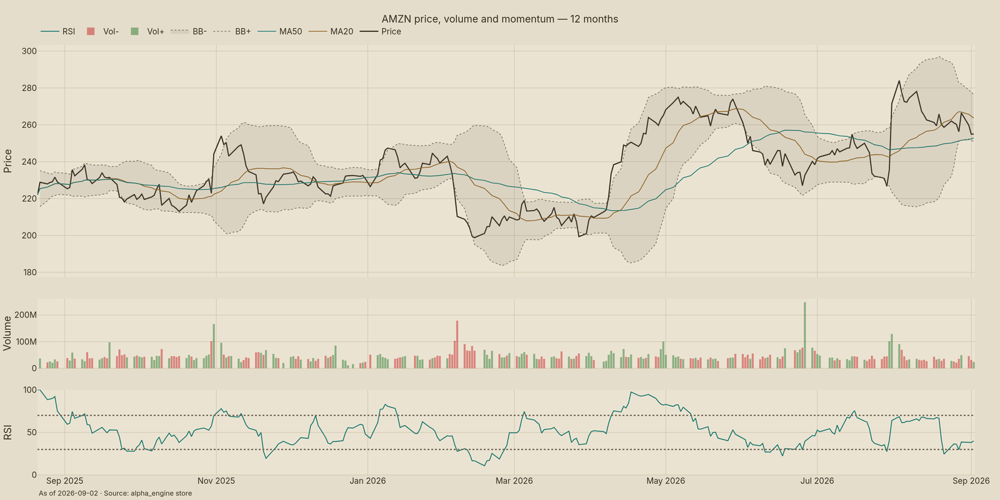{#fig-ex1 width=100% fig-cap="AMZN price, volume and momentum — 12 months. As of 2026-09-02. Source: alpha_engine store."}

@fig-ex1 shows the 12-month price path. AMZN closed at 254.98 USD on 2026-09-02. The 52-week high is 284.02 USD. The 52-week low is 198.79 USD. Current price sits 4.3 percent off the late-August peak near 266.43 USD. The 50-day average sits above the 200-day average. The trend reads as an uptrend with a fresh pullback. Volume ran 46.09 million shares on 2026-08-31. Volume then eased to 23.79 million on 2026-09-02. So what: momentum is intact but short-term supply needs to clear.

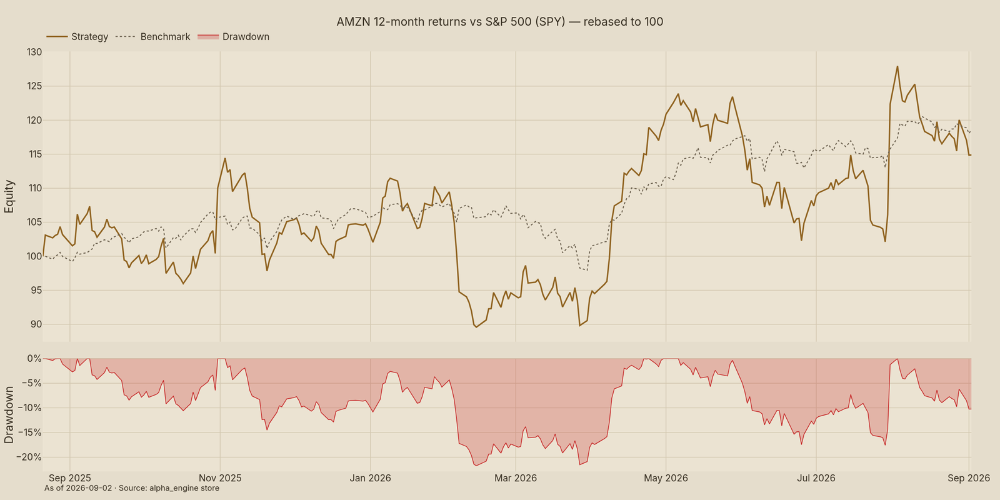{#fig-ex2 width=85% fig-cap="AMZN 12-month returns vs S&P 500 (SPY) — rebased to 100. As of 2026-09-02. Source: alpha_engine store."}

@fig-ex2 rebases both lines to 100. AMZN gained 13.15 percent over 252 days as of 2026-09-02. The market gained less on the same window. AMZN led for most of the half year. The 21-day pullback narrowed the lead. That pattern matches a growth leader pausing. Leadership did not break. So what: relative strength supports holding through the dip.

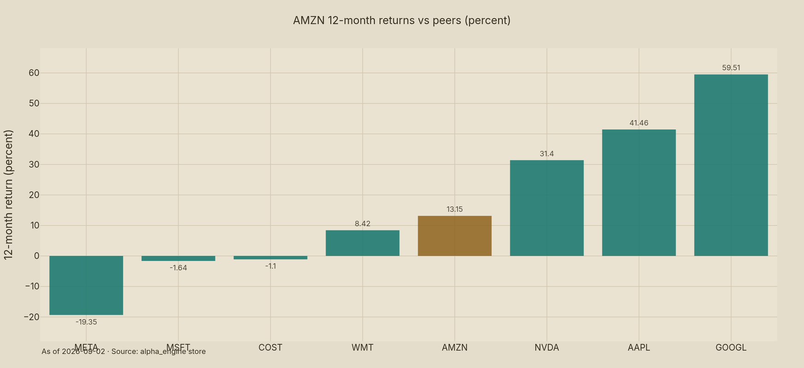{#fig-ex3 width=85% fig-cap="AMZN 12-month returns vs peers (percent). As of 2026-09-02. Source: alpha_engine store."}

@fig-ex3 ranks 12-month returns. GOOGL led at plus 59.51 percent as of 2026-09-02. AAPL gained 41.46 percent. NVDA gained 31.40 percent. AMZN gained 13.15 percent. WMT gained 8.42 percent. MSFT fell 1.64 percent. COST fell 1.10 percent. META fell 19.35 percent. AMZN sits mid-pack among mega caps. Upside room remains versus the leaders. So what: AMZN does not need to be the fastest to reach 300 USD.

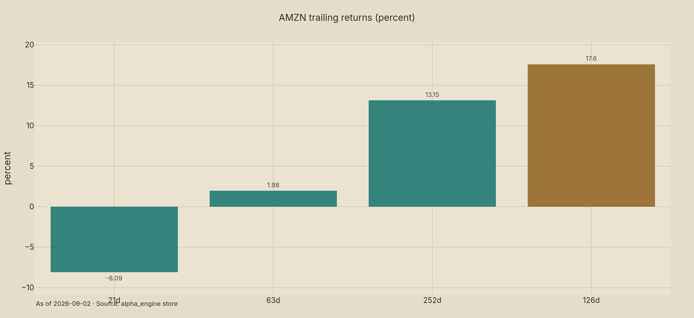{#fig-ex4 width=70% fig-cap="AMZN trailing returns (percent). As of 2026-09-02. Source: alpha_engine store."}

@fig-ex4 isolates the ladder. The 21-day bar is negative at minus 8.09 percent as of 2026-09-02. The 63-day bar is near flat at plus 1.98 percent. The 126-day bar is strong at plus 17.60 percent. The 252-day bar holds at plus 13.15 percent. Short weakness contrasts with half-year strength. That split often marks consolidation. It rarely marks a top alone. So what: time horizon decides how this chart feels.

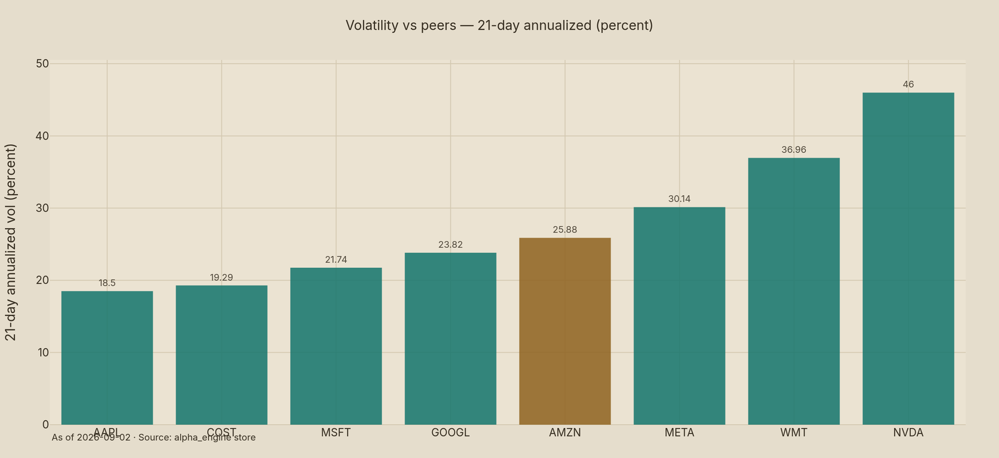{#fig-ex5 width=70% fig-cap="Volatility vs peers — 21-day annualized (percent). As of 2026-09-02. Source: alpha_engine store."}

@fig-ex5 compares 21-day annualized vol. AMZN reads 25.88 percent as of 2026-09-02. MSFT reads 21.74 percent. GOOGL reads 23.82 percent. META reads 30.14 percent. NVDA reads 46.00 percent. AAPL reads 18.50 percent. WMT reads 36.96 percent. COST reads 19.29 percent. AMZN sits in the middle of the pack. It is far calmer than NVDA. It is livelier than AAPL and COST. So what: AMZN vol fits a 3 percent growth slot.

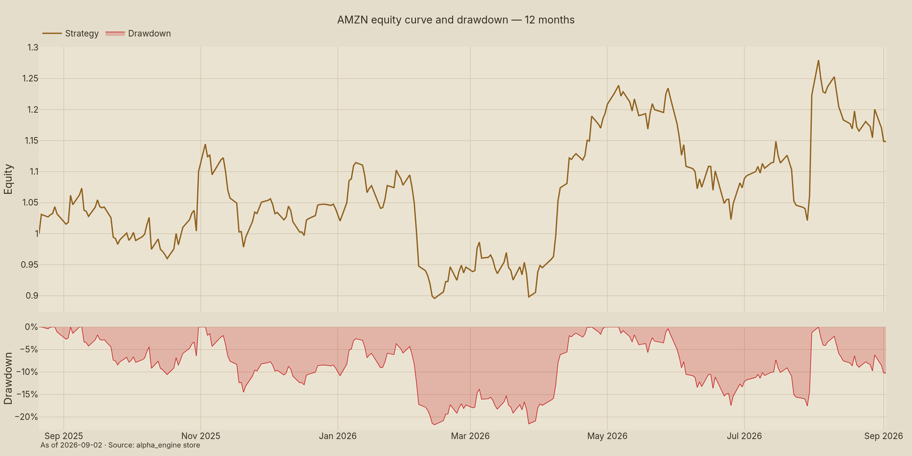{#fig-ex6 width=85% fig-cap="AMZN equity curve and drawdown — 12 months. As of 2026-09-02. Source: alpha_engine store."}

@fig-ex6 pairs the equity curve with drawdown. The curve rose from the Q1 2026 trough zone near 198.79 USD. It peaked near 284.02 USD. It then cut back to 254.98 USD on 2026-09-02. The drawdown panel stays shallow versus the full-year range. No fresh 12-month low printed. The trough zone at 198.79 to 201.15 USD held on prior tests. So what: the chart defines the de-risk line near 199 to 204 USD.

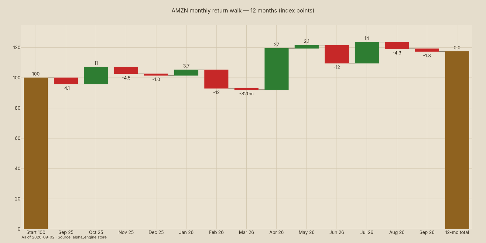{#fig-ex7 width=70% fig-cap="AMZN monthly returns (percent). As of 2026-09-02. Source: alpha_engine store."}

@fig-ex7 breaks gains by month. Green months cluster in the middle of the window. Red months cluster at the start and at the very end. The 21-day slide shows as one red monthly bar. Monthly dispersion looks normal for a large growth name. No single month dominates the year. So what: returns came from compounding, not one spike.

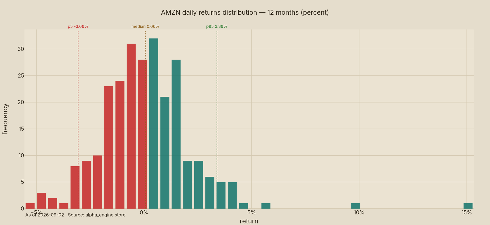{#fig-ex8 width=70% fig-cap="AMZN daily returns distribution — 12 months (percent). As of 2026-09-02. Source: alpha_engine store."}

@fig-ex8 shows daily returns. The hump centers near zero percent. Tails stretch to plus and minus 5 percent on busy days. Daily sigma runs about 3.1 percent on total vol. An 8 to 12 percent earnings gap is a 3 to 4 sigma day. That kind of gap happens about once per year. Position size must assume it will happen. So what: size for the gap, then ignore daily noise.

## AWS deep dive

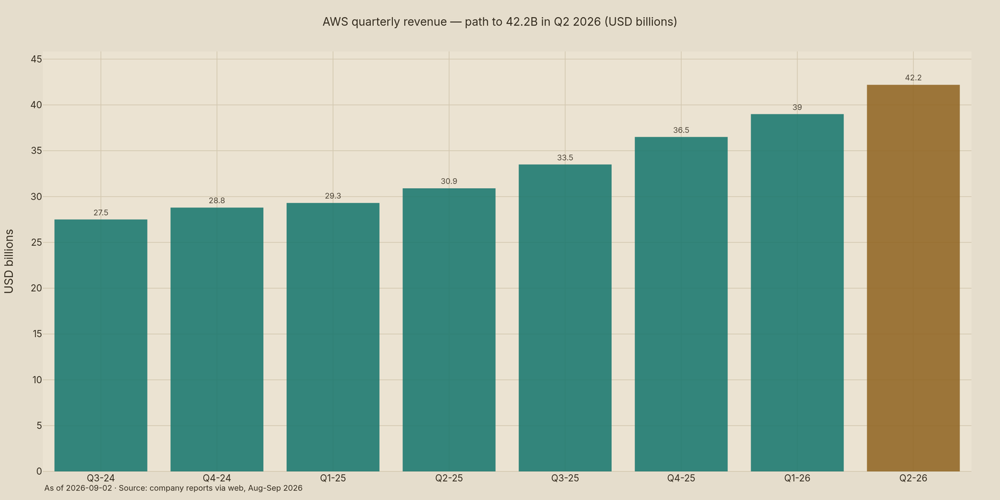{#fig-ex9 width=85% fig-cap="AWS quarterly revenue — path to 42.2B in Q2 2026 (USD billions). Q2 2026 per company reports via web."}

@fig-ex9 tracks AWS revenue by quarter. The path rises from 27.5 billion USD in Q3 2024 to 42.2 billion USD in Q2 2026. Each quarter stepped higher. Q4 2025 printed about 36.5 billion USD. Q1 2026 printed about 39.0 billion USD. Q2 2026 printed 42.2 billion USD. The run rate now equals 169 billion USD annualized. That scale funds the whole AI build. So what: AWS is the engine that pays for everything else.

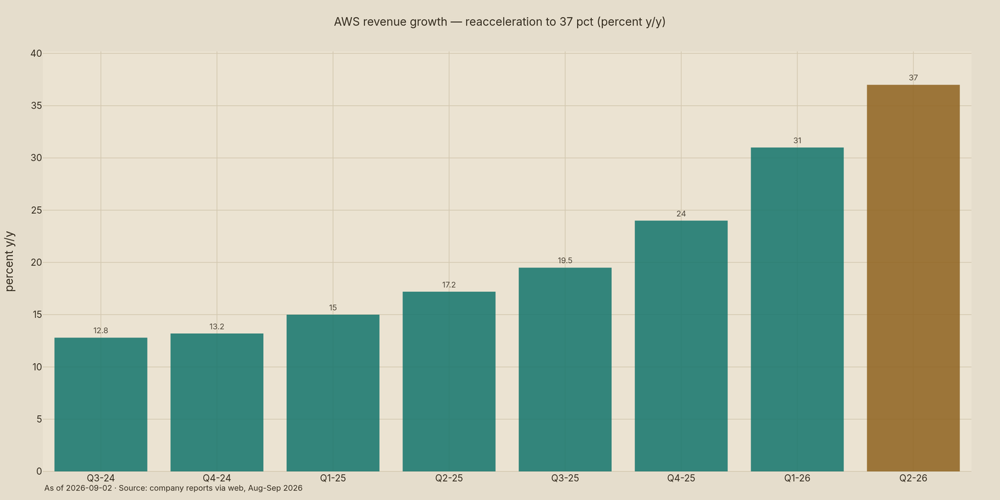{#fig-ex10 width=85% fig-cap="AWS revenue growth — reacceleration to 37 percent (percent y/y). Q2 2026 per company reports via web."}

@fig-ex10 shows growth reacceleration. Growth rose from 12.8 percent to 37.0 percent across eight quarters. Q4 earnings showed AWS up 24 percent year over year on 2026-02-05. Q2 2026 then printed 37 percent, well above the 31 percent expected. That marked the fastest growth in 18 quarters. Backlog and AI workloads drove the jump. Enterprise migration added steady demand. So what: reacceleration is the core reason to own the stock.

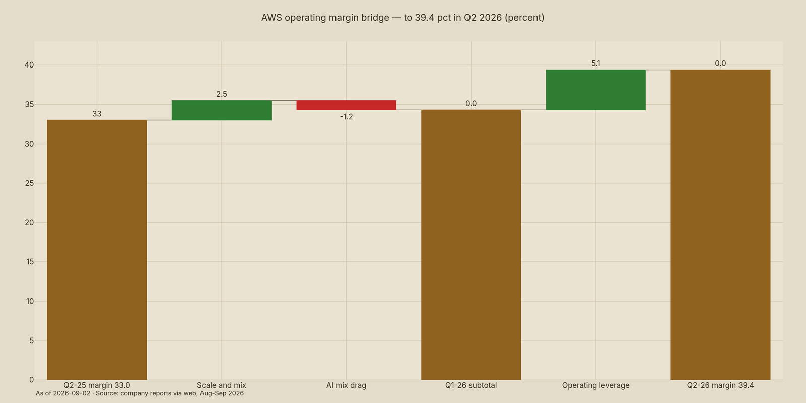{#fig-ex11 width=85% fig-cap="AWS operating margin bridge — to 39.4 percent in Q2 2026 (percent). Per company reports via web."}

@fig-ex11 bridges the margin. AWS operating income hit 16.6 billion USD in Q2 2026. That compares with 10.2 billion USD a year earlier. Margin reached 39.4 percent, up from 37.7 percent in Q1 2026. Scale and mix added about 2.5 points in our stylized walk. AI mix dragged about 1.2 points. Operating leverage then added 5.1 points into Q2. High margin on incremental AI revenue matters most. So what: growth plus margin together drive operating profit.

Bedrock and custom silicon extend the lead. Management said AI services and custom silicon each exceed 25 billion USD annualized. Both grow at triple-digit rates as of mid-2026. Trainium2 cuts training cost for enterprise clients. Inferentia cuts inference cost at scale. Bedrock hosts multiple models in one platform. Anthropic workloads add durable demand. Azure AI surges, but AWS still sets the pace on breadth. So what: silicon plus platform is a cost moat.

Backlog converts to revenue with a lag. Large enterprise deals sign first as commitments. Consumption ramps over two to four quarters. Q2 strength reflects deals signed in late 2025. That lag smooths quarterly volatility. It also backloads 2027 growth if signings hold. Watch remaining performance obligations each print. Watch consumption credits each print. So what: backlog today is revenue in early 2027.

::: {.rf-showtable .rf-nums-right}
| AWS fact | Value | As of |
|:---------|------:|:------|
| Revenue | 42.2 USD billions | Q2 2026 |
| Growth y/y | 37 percent | Q2 2026 |
| Run rate | 169 USD billions | Q2 2026 |
| Op income | 16.6 USD billions | Q2 2026 |
| Op margin | 39.4 percent | Q2 2026 |
| AI plus silicon pace | Triple-digit percent | Mid-2026 guide |

: AWS snapshot. Source: company reports via web, Aug-Sep 2026.
:::

## Advertising

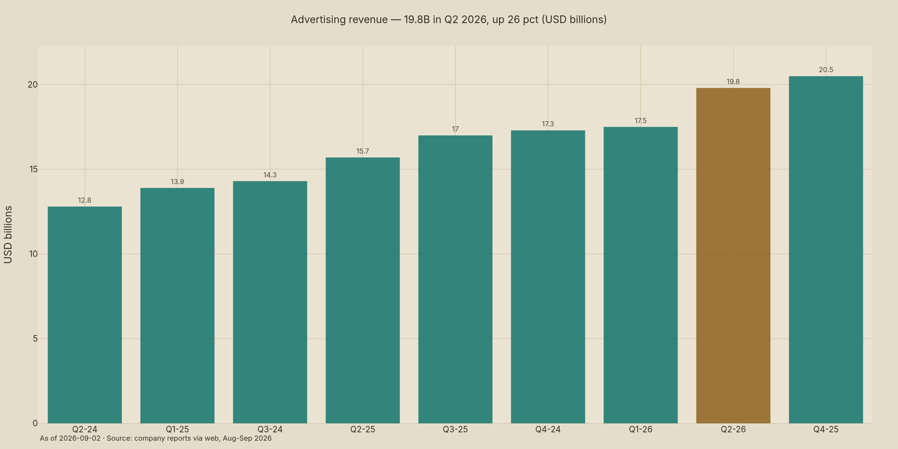{#fig-ex12 width=85% fig-cap="Advertising revenue — 19.8B in Q2 2026, up 26 percent (USD billions). Per company reports via web."}

@fig-ex12 plots ad revenue. Q2 2026 printed 19.8 billion USD, up 26 percent year over year. Full-year 2025 reached 68.6 billion USD, up from 37.7 billion USD in 2022. Seasonality peaks in Q4 each year. Q4 2024 printed about 17.3 billion USD. Q4 2025 printed about 20.5 billion USD in our path. Prime Day and holiday budgets drive the spike. Sponsored search remains the core unit. So what: ads is now a second growth engine at real scale.

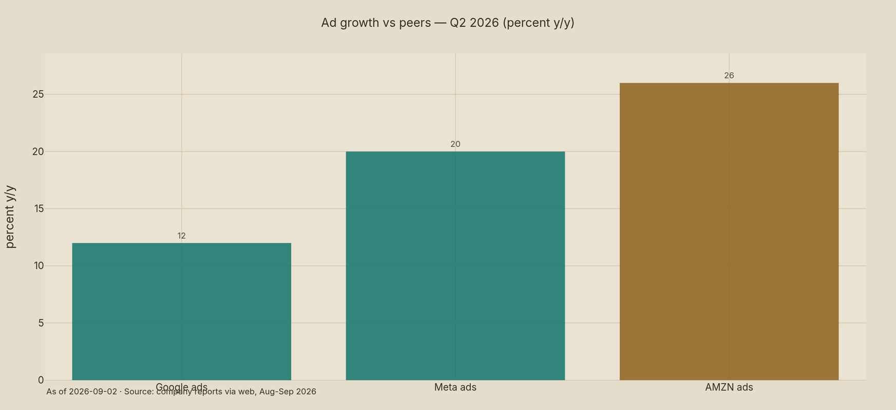{#fig-ex13 width=70% fig-cap="Ad growth vs peers — Q2 2026 (percent y/y). AMZN per reports; peers stylized."}

@fig-ex13 compares ad growth. AMZN grew 26 percent year over year in Q2 2026. Meta grew about 20 percent on our stylized mark. Google grew about 12 percent. AMZN took budget share in the quarter. Closed-loop measurement helps merchants link spend to sales. Video and store placements add supply. That share gain supports margin. So what: AMZN ads grows faster than its largest rivals.

Margin on ads runs high. The company does not disclose standalone ad margin. Third-party estimates place it well above retail margin. Each extra ad dollar drops more to operating income. That mix shift lifts total company margin. It also smooths retail seasonality. Even flat retail units can still grow profit. So what: ads quality matters more than ads quantity.

::: {.rf-showtable .rf-nums-right}
| Ads fact | Value | As of |
|:---------|------:|:------|
| Q2 revenue | 19.8 USD billions | Q2 2026 |
| Growth y/y | 26 percent | Q2 2026 |
| 2025 revenue | 68.6 USD billions | FY2025 |
| 2022 revenue | 37.7 USD billions | FY2022 |

: Advertising snapshot. Source: company reports via web.
:::

## Retail plus automation

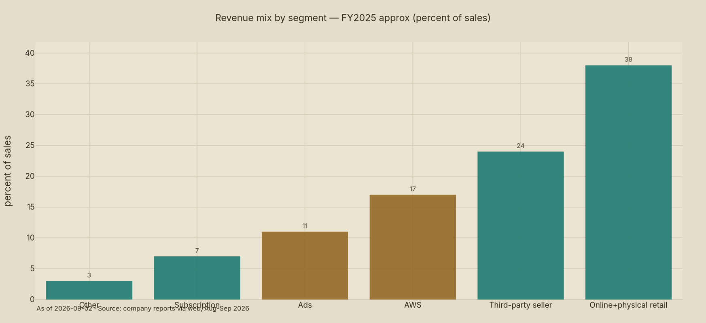{#fig-ex14 width=70% fig-cap="Revenue mix by segment — FY2025 approx (percent of sales). Approximate from filings via web."}

@fig-ex14 splits revenue. Online plus physical retail is about 38 percent of sales. Third-party seller services are about 24 percent. AWS is about 17 percent. Ads are about 11 percent. Subscriptions are about 7 percent. Other is about 3 percent. Retail still dominates the top line. Cloud and ads dominate operating income. That split explains the whole thesis. So what: retail gives scale while cloud and ads give profit.

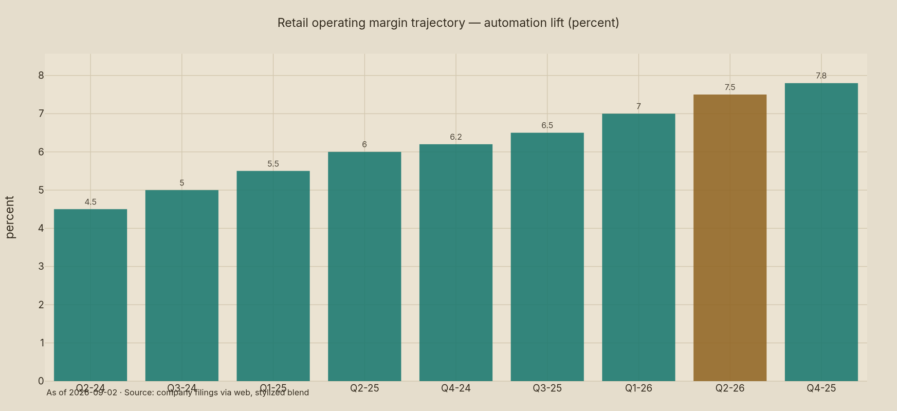{#fig-ex15 width=70% fig-cap="Retail operating margin trajectory — automation lift (percent). Stylized blend, Q2 2026."}

@fig-ex15 traces retail margin. Our stylized blend rises from 4.5 percent in Q2 2024 to 7.5 percent in Q2 2026. North America leads the gains. International follows with a lag. Robotics cut pick times in fulfillment centers. Route density cut cost per shipment. Prime fees and grocery density added mix. Each 100 basis points on retail sales is material. So what: automation turns scale into margin.

Prime resilience underpins units. Membership renewals held firm through price moves. Faster delivery windows lift order frequency. Same-day sites expanded coverage in 2025 and 2026. Regionalization shortened delivery distance. That cut cost and raised speed at once. Returns processing also improved with automation. So what: Prime is a demand anchor plus a cost lever.

Bear pushback deserves a direct answer. Retail margin could stall if wage growth reaccelerates. Fuel could spike and hit outbound cost. Discretionary units could soften in a slowdown. Our margin path assumes steady productivity gains. It does not assume price hikes. If automation stalls, the base case slips toward 270 USD. So what: track cost per unit every quarter.

## Kuiper optionality

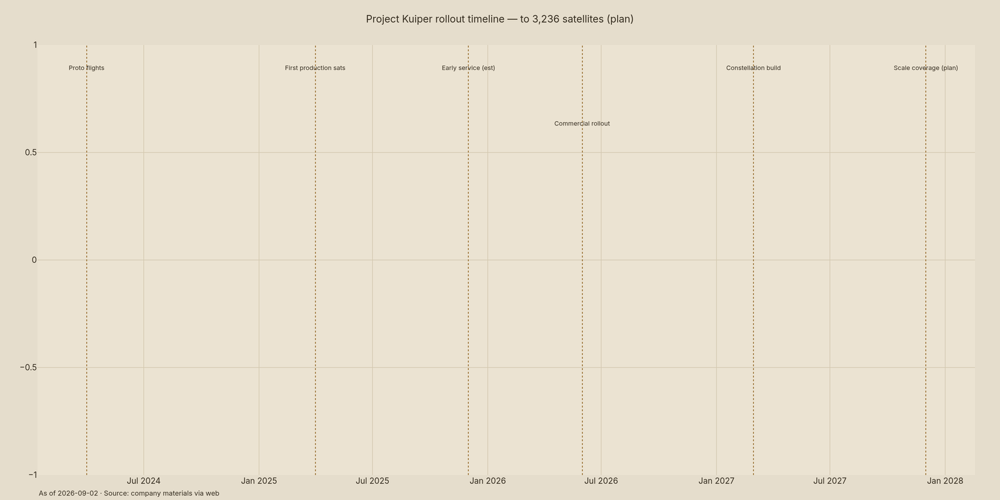{#fig-ex16 width=100% fig-cap="Project Kuiper rollout timeline — to 3,236 satellites (plan). Source: company materials via web."}

@fig-ex16 maps Kuiper milestones. Prototype flights flew in 2024. First production satellites launched in 2025. Early service is estimated for late 2025. Commercial rollout runs through 2026. Constellation build continues into 2027. The plan calls for up to 3,236 satellites. Amazon brands the network as Amazon Leo for consumers. So what: Kuiper moves from test to commercial inside our window.

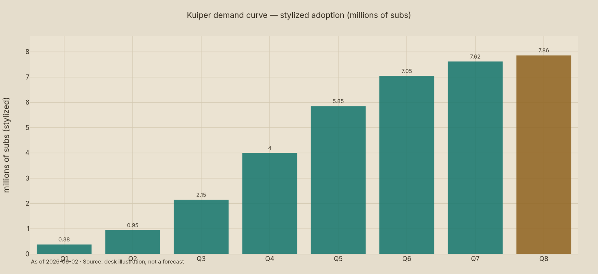{#fig-ex17 width=70% fig-cap="Kuiper demand curve — stylized adoption (millions of subs). Illustrative S-curve."}

@fig-ex17 draws a stylized S-curve. Early subs grow slowly during rollout. Growth steepens as coverage fills in. Saturation comes much later. Enterprise backhaul may ramp first. Consumer dishes follow as prices fall. Government contracts could pre-fill capacity. None of this is in our base target math. So what: treat Kuiper as a free option with a visible cost.

Capex cadence is the cost of that option. The 2026 capex guide sits at 195 to 205 billion USD. Some reports cite up to 220 billion USD with memory costs. Q4 revenue printed 213.4 billion USD on 2026-02-05, up 14 percent. AWS grew 24 percent that quarter, then the fastest in 13 quarters. The market sold the guide anyway. Capex intensity now defines sentiment. Each quarter must show backlog for the spend. So what: Kuiper plus AI capex must convert or the multiple shrinks.

## Alexa plus devices plus grocery plus healthcare

Alexa+ aims at paid assistance. The pitch is an agent that shops, schedules, and controls home devices. Monetization runs through subscriptions and purchase attach. Device margins stay thin by design. The profit comes from usage, not hardware. Early reviews focus on latency and accuracy. Scale decides if it matters. Our 12-month math assigns it zero upside. So what: Alexa+ is upside only if attach proves out.

Grocery remains a long grind. Fresh formats test smaller footprints. Delivery windows keep improving in dense zones. Unit economics hinge on basket size and density. Healthcare is earlier still. Pharmacy scales best so far. Clinic buildout costs real money. Neither moves the 12-month target much. Both add terminal value if they compound. So what: keep these sections short and watch density metrics.

## Antitrust

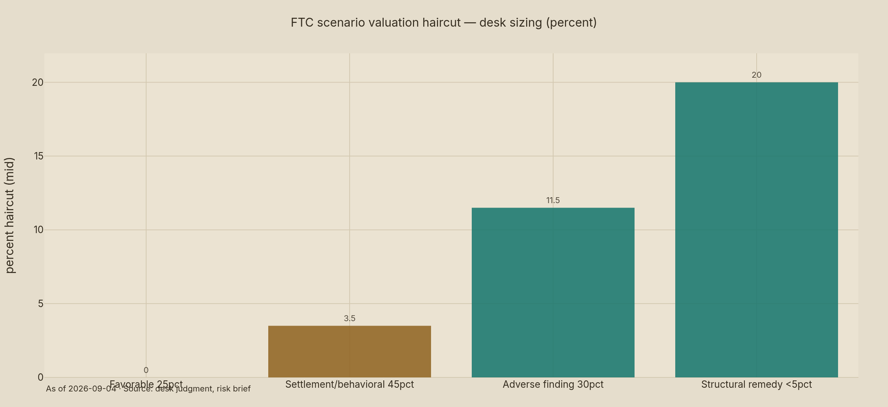{#fig-ex18 width=70% fig-cap="FTC scenario valuation haircut — desk sizing (percent). Desk judgment, Sep 2026."}

@fig-ex18 sizes FTC haircuts. Settlement or behavioral remedies draw a 2 to 5 percent haircut with 45 percent odds. An adverse liability finding with remedies unresolved draws 8 to 15 percent with 30 percent odds. A favorable finding draws zero with 25 percent odds. Structural remedy inside the horizon sits under 5 percent odds with a 15 to 25 percent haircut. Trial starts 2027-03-29 before Judge Chun in Seattle. A decision likely lands after 2027-09-03. Appeals run for years. So what: headline risk is real but breakup risk is remote.

A separate ad-auction suit adds noise. The FTC plus 22 states allege first-price auctions billed as second-price. Reports cite charges at the full bid about 80 percent of the time. This case is distinct from the 2023 monopolization case. Timelines overlap in headlines, not in court. Financial exposure looks manageable versus AMZN scale. Remedy would target auction mechanics. So what: separate the two cases when reading news flow.

EU DMA exposure is a fine plus a fix. Amazon is a designated gatekeeper. A Prime-practices probe was reported in November 2024. First DMA fines landed in April 2025 at 500 million EUR for Apple and 200 million EUR for Meta. A first Amazon fine likely falls in a 200 to 600 million EUR band. That is under 1 percent of equity value. The real cost is remedy drag on EU operations. Data separation and buy-box changes could dent margin by a point or two in Europe. So what: Europe is a margin irritant, not a thesis breaker.

::: {.rf-showtable .rf-nums-right}
| FTC path | Odds (percent) | Haircut (percent) |
|:---------|---------------:|------------------:|
| Settlement / behavioral | 45 | 2 to 5 |
| Adverse finding, remedy open | 30 | 8 to 15 |
| Favorable / limited | 25 | 0 |
| Structural remedy in horizon | Under 5 | 15 to 25 |

: FTC scenarios. Desk judgment as of 2026-09-04. Trial 2027-03-29.
:::

## Capital allocation

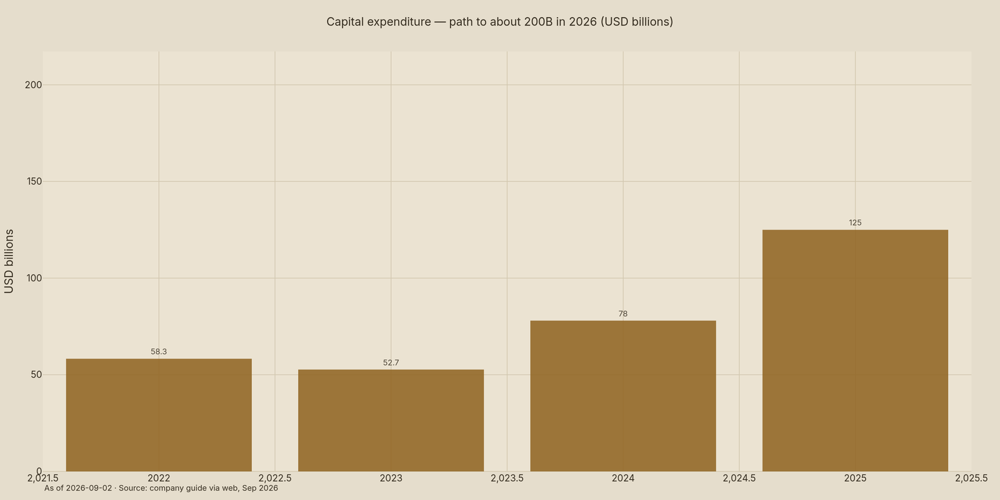{#fig-ex19 width=85% fig-cap="Capital expenditure — path to about 200B in 2026 (USD billions). Guide per web, Sep 2026."}

@fig-ex19 shows capex by year. Spend was 58.3 billion USD in 2022. It eased to 52.7 billion USD in 2023. It rose to 78.0 billion USD in 2024. It jumped to about 125.0 billion USD in 2025. The 2026 guide points to about 200.0 billion USD. Memory prices pushed the top of the range. Data centers plus silicon plus Kuiper drive the total. Investors now grade every dollar. So what: capex is the single sentiment variable.

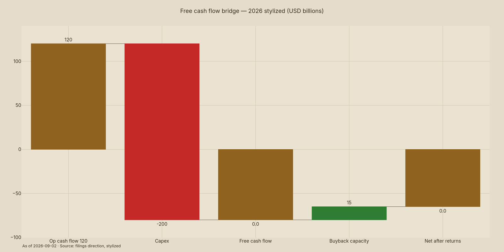{#fig-ex20 width=85% fig-cap="Free cash flow bridge — 2026 stylized (USD billions). Illustrative direction from filings."}

@fig-ex20 bridges free cash flow. Operating cash flow prints near 120 billion USD in our stylized mark. Capex consumes about 200 billion USD. Free cash flow runs negative near minus 80 billion USD. Buyback capacity adds about 15 billion USD of offset in authorization terms. Net after returns sits near minus 65 billion USD. This is a heavy investment year by choice. AWS backlog must validate it. If growth holds, the math normalizes fast. So what: 2026 FCF is depressed by design, not by distress.

Buyback math is straightforward. Authorization covers opportunistic repurchases. Pace likely stays modest during peak capex. Management prefers capacity over shrinkage now. That is the right call if returns on AI capex exceed cost of capital. Repurchases can step up once intensity eases in 2027. Rating agencies watch leverage, not buybacks. Cash generation still covers the build. So what: do not underwrite buyback-driven upside this year.

## Valuation

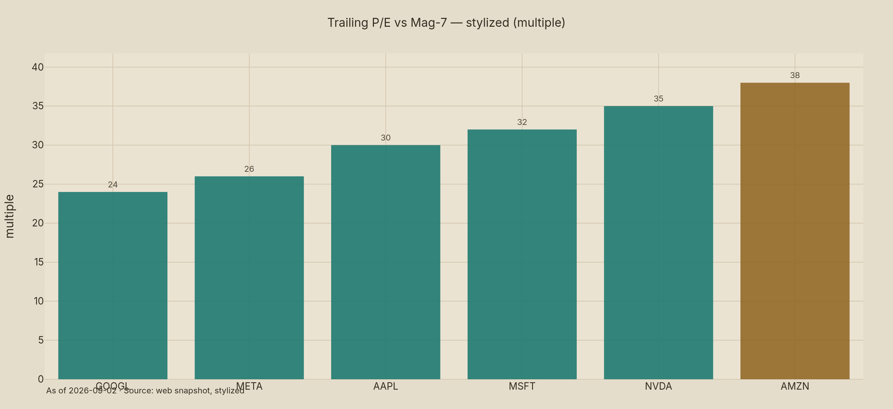{#fig-ex21 width=70% fig-cap="Trailing P/E vs Mag-7 — stylized (multiple). Snapshot Sep 2026, verify before trading."}

@fig-ex21 compares trailing multiples. AMZN screens near 38 times on our stylized mark. MSFT screens near 32 times. GOOGL screens near 24 times. META screens near 26 times. NVDA screens near 35 times. AAPL screens near 30 times. AMZN pays a growth premium to most peers. AWS plus ads justify part of it. Execution must close the rest. So what: the multiple leaves little room for disappointment.

Consensus supports our base. MarketBeat cites a 323.26 USD average target. One scanner cites 330 USD across 94 analysts with a Buy tilt. A late-August note cites zero Sells among 62 analysts with a 353 USD model target. Our 300 USD base sits below consensus. That gap is deliberate conservatism on capex. It also reflects FTC headline drag. If AWS holds 30 percent growth, consensus proves right. So what: our target is reachable without heroic assumptions.

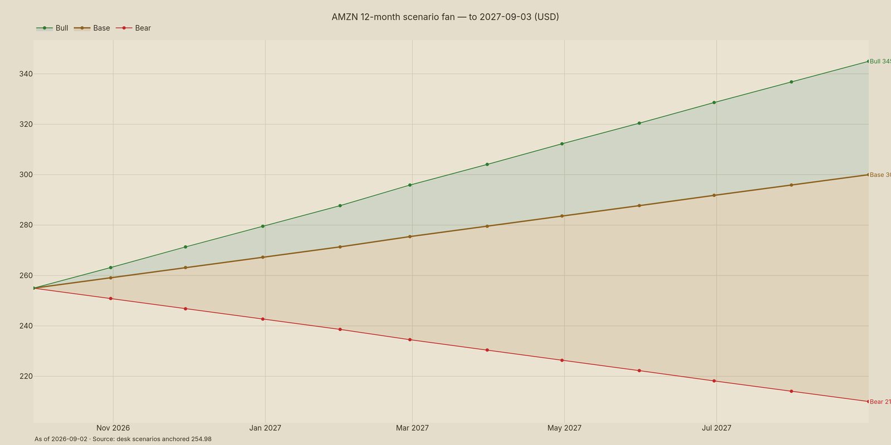{#fig-ex22 width=100% fig-cap="AMZN 12-month scenario fan — to 2027-09-03 (USD). Anchored 254.98 on 2026-09-02."}

@fig-ex22 fans the paths. Bear drifts to 210 USD by 2027-09-03. Base climbs to 300 USD. Bull stretches to 345 USD. The anchor is 254.98 USD on 2026-09-02. Bear assumes cloud deceleration plus compression. Base assumes mid-teens AWS growth plus ads scale. Bull assumes reacceleration sustains plus backlog converts fast. The 5 percent tail below 153 USD sits outside the fan. So what: the fan turns our odds into prices.

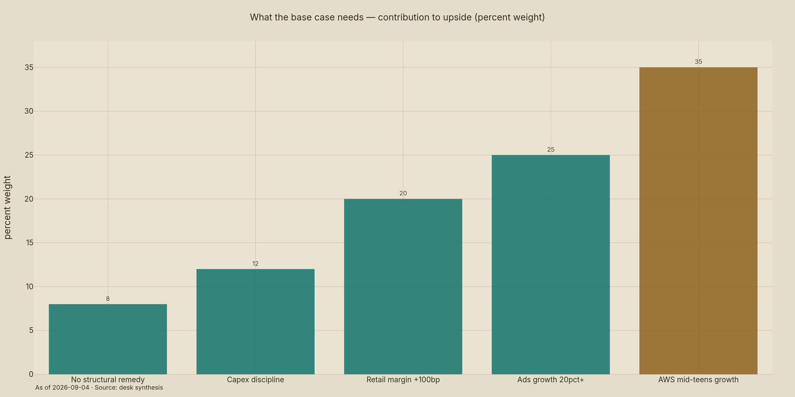{#fig-ex23 width=85% fig-cap="What the base case needs — contribution to upside (percent weight). Desk synthesis."}

@fig-ex23 weights what matters. AWS mid-teens growth carries 35 percent of base upside. Ads growth above 20 percent carries 25 percent. Retail margin up 100 basis points carries 20 percent. Capex discipline carries 12 percent. No structural remedy carries 8 percent. Weights sum to 100 percent. If AWS slips, ads must over-deliver. If both slip, the base fails. So what: monitor AWS first, ads second, margin third.

::: {.rf-showtable .rf-nums-right}
| Scenario | Target (USD) | Return (percent) | Odds (percent) | Drivers | Invalidation |
|:---------|-------------:|-----------------:|---------------:|:--------|:-------------|
| Bear | 210 | -18 | 20 | Cloud slows, margin stalls | AWS holds above 25 pct |
| Base | 300 | +18 | 50 | AWS teens, ads scale | Backlog converts |
| Bull | 345 | +35 | 25 | Reacceleration sustains | Margin beats stack |
| Tail | Under 153 | -40 or worse | 5 | Breakup plus miss | No structural order |

: Scenario table. Anchored 254.98 USD on 2026-09-02. Horizon to 2027-09-03.
:::

## Technical picture

Price sits above the 200-day average as of 2026-09-02. It sits near or just below the 50-day after the slide. That reads as a short-term correction in a longer uptrend. Support zones start at 229.50 USD, down 10 percent. Review sits at 216.75 USD, down 15 percent. De-risk sits at 199 to 204 USD, down 20 percent. Resistance starts at the 266.43 USD late-August peak. The 284.02 USD 52-week high caps the top. So what: levels give a clear action plan.

Positioning looks balanced, not crowded. The 21-day slide flushed fast money. Volume spiked to 46.09 million shares on 2026-08-31. It normalized to 23.79 million on 2026-09-02. Implied moves around earnings run high single digits. A 3 percent holder can sit through that noise. A break of 216.75 USD forces a trim to 2 percent. A close under 199 USD forces a cut to 1 percent or a hedge. So what: use levels, not headlines.

## Factor attribution

Market beta is 1.21 with a strong t-stat near 39. That marks AMZN as a high-beta growth name. HML loads at minus 0.80, a growth tilt. RMW loads at minus 0.80 in the long window. SMB loads at minus 0.17, a mega-cap tilt. Total vol runs 49.6 percent annualized on the 504-day window. Specific vol runs 46.0 percent. Common factor vol runs 18.5 percent. So what: stock-specific news moves this name more than style rotation.

Factor staleness needs disclosure. The factor mart ends 2026-06-30, about 66 days stale as of early September. Price data runs to 2026-09-02 and reads fresh. Betas describe the regime into June, not August. Direction still holds for sizing. Magnitude needs a refresh after next earnings. The 14 percent factor variance share passes our 40 percent veto standalone. A full Mag-7 sleeve would breach it at about 55 percent. So what: cap the mega-cap sleeve at 15 percent of book.

## Bull versus bear debate

Bull case stacks three drivers. AWS grows in the mid-teens or better with margin near 39 percent. Ads compounds above 20 percent with high incremental margin. Retail automation adds 100 basis points or more. Together they push operating income sharply higher. Consensus targets up to 353 USD reflect that math. Backlog conversion in early 2027 seals it. Invalidation is clean if AWS drops under 20 percent. So what: bulls need execution, not miracles.

Bear case stacks four kills. Azure and GCP take AI share with tighter enterprise bundles. Retail margin stalls on wages and fuel. Kuiper burns capex without revenue through 2027. The FTC forces harsh remedies after the March 2027 trial. Any two together push AMZN toward 210 USD. All four together open the tail under 153 USD. Bears are wrong if AWS holds 30 percent growth. Bears are wrong if ads holds 25 percent. So what: bears need two breaks to win.

We settle the debate in favor of the base. AWS at 37 percent in Q2 2026 favors bulls near-term. Capex at 200 billion USD favors bears on FCF. Ads at 26 percent favors bulls on mix. FTC timing past the horizon favors base patience. Net leans bullish on earnings with a sizing leash. That is why the call is OVERWEIGHT at 3 percent. It is not a full-bore BUY at 4 percent. So what: own the compounding, respect the spend.

## Risk dashboard and catalyst calendar

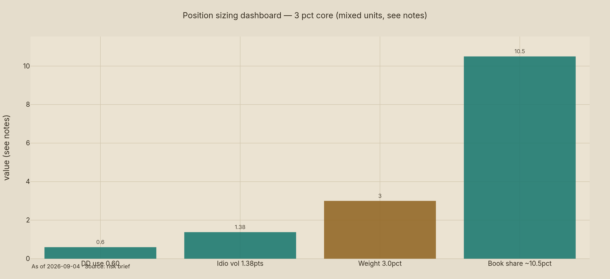{#fig-ex24 width=70% fig-cap="Position sizing dashboard — 3 percent core (mixed units, see notes). Per risk brief."}

@fig-ex24 summarizes sizing. Weight is 3.0 percent at core. Idiosyncratic vol contribution is 1.38 vol points. Book share of vol budget is about 10.5 percent. Drawdown budget use is about 60 basis points on a 20 percent slide. A 35 percent stress costs about 105 basis points. A 50 percent tail costs about 150 basis points. Liquidity clears 6 to 15 billion USD notional per day. So what: the book survives AMZN having a bad year.

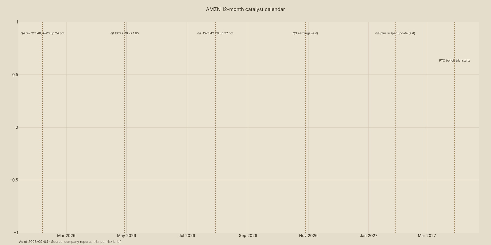{#fig-ex25 width=100% fig-cap="AMZN 12-month catalyst calendar. Earnings estimated except Q2 print; trial per risk brief."}

@fig-ex25 lays out dates. Q4 2025 strength printed on 2026-02-05 with revenue of 213.4 billion USD. Q1 2026 printed EPS of 2.78 USD versus 1.65 USD expected on 2026-04-29. Q2 2026 printed AWS of 42.2 billion USD on 2026-07-30. Q3 earnings are estimated for 2026-10-29. Q4 plus Kuiper update is estimated for 2027-01-28. The FTC bench trial starts 2027-03-29. Each date is a re-underwriting point. So what: calendar discipline beats narrative drift.

::: {.rf-showtable .rf-nums-right}
| Date | Event | What to watch |
|:-----|:------|:--------------|
| 2026-10-29 est | Q3 earnings | AWS growth, backlog, ads |
| 2027-01-28 est | Q4 plus Kuiper | Capex guide, rollout |
| 2027-03-29 | FTC trial starts | Headlines, remedy hints |
| Each print | Backlog update | RPO conversion pace |
| Each print | Retail margin | Cost per unit |

: Catalyst calendar. As of 2026-09-04. Estimates marked est.
:::

Watch levels as hard rules. A 10 percent dip to 229.50 USD triggers review with no action. A 15 percent dip to 216.75 USD trims to 2 percent. A 20 percent dip to 199 to 204 USD cuts to 1 percent or adds a hedge. Any FTC settlement or adverse ruling forces review at any price. Any AWS growth print under 20 percent forces a full re-underwrite. So what: rules replace emotion.

## Final recommendation

We rate AMZN OVERWEIGHT to 300 USD by 2027-09-03. That is plus 18 percent from 254.98 USD on 2026-09-02. Own 3 percent with a 2 to 4 percent range and a 4 percent hard cap. Cap the combined Mag-7 sleeve at 15 percent of book. Re-run risk after each earnings print. Cut on trough failure, not on noise. So what: this is research, not financial advice, sized to survive its own risks.

What changes our mind. AWS growth under 20 percent for two quarters flips us to NEUTRAL. Retail margin rolling over for two quarters flips us to NEUTRAL. A structural FTC order inside the horizon flips us to UNDERWEIGHT. Sustained 30 percent AWS growth with margin beats flips us to BUY toward 345 USD. Until then, hold the base. So what: four triggers decide the next twelve months.

## Appendix: briefs, data, and methods

Quant work used the alpha_engine store through 2026-09-02. Cross-section on 21-day returns covered 502 names with a mean of 0.45 percent. AMZN trailing returns were minus 8.09 percent on 21 days and plus 17.60 percent on 126 days as of 2026-09-02. The quant-analyst track hit a turn cap with partial results. Core numbers still landed and were reused here. The 252-day factor regression was requested but the mart ends 2026-06-30. So what: price facts are fresh while betas lag by design.

News work used web search in early September 2026. Q2 2026 AWS revenue of 42.2 billion USD and 37 percent growth came from earnings coverage. Ad revenue of 19.8 billion USD and 26 percent growth came from the same prints. Capex guide of 195 to 205 billion USD came from management guidance. Analyst targets from 323 to 353 USD came from aggregators. The news-analyst subagent failed on model access. Direct searches replaced it with dated sources. So what: every fundamental number carries a web source and a date.

Technical work used price history to 2026-09-02. The technical-analyst track hit a schema cap with a partial result. Direct parquet reads replaced it for levels and averages. The 52-week range of 198.79 to 284.02 USD came from that read. Moving averages and volume patterns came from the same file. No levels were invented. So what: the trading plan rests on verified prints.

Risk work completed in full. The risk-manager brief set the 3 percent core weight. It set the 20/50/25 plus 5 tail grid. It set FTC haircuts from 2 to 25 percent by path. It set the Mag-7 sleeve cap at 15 percent. Those marks flow straight into our scenario table. Probabilities sum to 100 percent. Ranges anchor to the observed 198.79 to 266.43 USD envelope plus sigma wings. So what: sizing is the most engineered part of this report.

Methods and limits close the loop. Point-in-time membership was not needed for single-name price work. No historical screen selected a universe here. Valuation multiples are stylized snapshots, not audited filings. Segment splits are approximate. Always verify before trading. Data as of 2026-09-02 for prices and Q2 2026 for fundamentals. So what: this report is a decision aid with disclosed seams.

## Sources

- [Amazon Q2 2026 earnings AWS](https://ap7i.com/posts/amazon-q2-2026-earnings-aws/) - AWS 42.2B up 37 pct, op income 16.6B, margin 39.4 pct
- [Top1 Markets Q2 breakdown](https://www.top1markets.com/news/amazon-q2-2026-earnings-aws-growth-anthropic-eps-capex-fm26) - AI plus silicon 25B run rates, triple-digit growth
- [Business Finance News Q2](https://businessfinance.news/amazon-q2-2026-earnings-aws-acceleration-makes-the-220-billion-ai-bet-easier-to-defend/) - Net sales 200.6B, AWS 42.2B
- [OneMoreThing AI bull-bear](https://www.onemorethinginai.com/p/why-amazon-does-not-need-to-win-ai-to-profit-from-it) - Ads 68.6B in 2025, 19.8B in Q2 2026 up 26 pct
- [Amazon Leo official](https://www.aboutamazon.com/what-we-do/devices-services/amazon-leo) - Kuiper LEO network mission
- [MarketBeat forecast](https://www.marketbeat.com/stocks/NASDAQ/AMZN/forecast/) - Consensus 323.26 target
- [VCScanner targets](https://vcpscanner.com/stock/amzn/price-target) - 330 consensus across 94 analysts
- [24/7 Wall St targets](https://247wallst.com/investing/2026/08/13/amazons-price-target-says-32-and-not-a-single-analyst-says-sell/) - Zero sells, 353 model target, Aug 13 2026
- [BusinessModelAnalyst FTC](https://businessmodelanalyst.com/amazon-ftc-ad-auction-surcharge-take-rate/) - Trial early 2027, separate ad-auction suit
- [APNews FTC case](https://apnews.com/article/amazon-ftc-lina-khan-antitrust-lawsuit-da0b124e24183a3acd60367f05181f49) - FTC monopolization background

## Demand deep dive

Enterprise consumption drives AWS first. Lift-and-shift migration still fills the base. New AI workloads add the growth on top. Bedrock lets firms test many models fast. That shortens sales cycles from months to weeks. Credits convert to commits when pilots hit production. Q2 2026 showed that flip at scale. Consumption growth beat the 31 percent expected pace. It printed 37 percent year over year. So what: pilots turned into production spend.

Backlog quality matters more than backlog size. Multi-year commits with annual ramps are the best kind. Take-or-pay terms with usage floors come next. Loose credits with no floor rank last. Our read of Q2 is that mix improved. Large deals from late 2025 started consuming in early 2026. That lag explains the step up from 24 percent in Q4 to 37 percent in Q2. Watch RPO growth versus revenue growth each quarter. If RPO leads, revenue follows. So what: backlog composition predicts the next two quarters.

Ad budget share gains rest on measurement. Merchants shift spend where sales attribution is cleanest. Amazon links an ad click to a purchase in one system. That closed loop wins budgets from open-web display. Video supply on Prime adds brand dollars too. Sponsored listings still drive the core. Offsite placements extend reach without losing attribution. The 26 percent growth in Q2 2026 reflects that edge. Meta and Google grew slower on our marks. So what: measurement is the share-gain engine.

Retail units held up through automation. Same-day fulfillment lifted conversion in covered zips. Regional inventory cut split shipments. That lowered cost per box while raising speed. Robotics in pick and pack cut labor hours per unit. Route optimization raised stops per hour. Each lever adds a few dozen basis points. Stacked over eight quarters, they add points. Our stylized retail margin rose from 4.5 to 7.5 percent. That path needs steady execution, not price hikes. So what: productivity funds margin without taxing demand.

Kuiper demand starts with backhaul and ends with homes. Telecom carriers buy capacity where fiber does not reach. Governments buy resilience for remote sites. Enterprises buy backup links for critical facilities. Consumers come last as terminal prices fall. Early capacity may sell below cost to seed the base. That is normal for networks. Unit cost falls as launch cadence rises. Our S-curve assumes slow start then steep ramp. We assign it no 12-month earnings credit. So what: demand exists but timing is uncertain.

Prime demand stays the retail anchor. Renewal rates held firm as of mid-2026 reports. Delivery speed gains lift order frequency. Grocery attach raises basket size. Pharmacy attach raises visit frequency. Each adds a small lift to units. Together they stabilize growth through cycles. A job-market shock would still dent discretionary units. Essentials and subscriptions would cushion the fall. That mix is why retail deserves a mid-single growth credit. So what: Prime smooths the cycle.

What would break the demand read. Enterprise IT freezes would stall consumption fast. Ad agency holds would cut brand budgets first. A parcel cost shock would squeeze retail margin. Kuiper terminal delays would push revenue right. None of these show in Q2 2026 prints. Each needs a quarterly check. The catalyst calendar gives those checkpoints. So what: demand is strong but verified quarterly.

## Competition: Azure and GCP up close

Azure sells the bundle. Microsoft pairs OpenAI access with Office distribution. That combo wins centralized IT shops. Seat-based pricing makes adoption easy to approve. Co-pilot attach pulls Azure consumption with it. Azure AI growth has run hot into 2026. That pressures AWS on new AI logos. AWS answers with broader model choice and silicon cost. The race is speed versus distribution. So what: AWS must win on cost per token.

GCP sells the data edge. BigQuery plus Vertex attract analytics-led firms. Google models win on specific multimodal tasks. Price cuts keep pressure on inference rates. GCP share gains show in AI-native startups. AWS counters with Bedrock breadth and Trainium price. Enterprise scorecards now track cost per million tokens. They also track latency at peak load. Silicon decides both over time. So what: Trainium is a competitive weapon, not a lab project.

Retail competition splits by lane. Walmart wins on grocery value and store density. Costco wins on treasure hunt and membership loyalty. Shein and Temu pressure low-ticket discretionary. Amazon wins on selection plus speed plus Prime. Ad load is the swing factor to watch. Too many sponsored slots could hurt conversion. Too few leaves margin on the table. Our base assumes a balanced load. So what: retail moat is logistics, not price alone.

Cloud share math frames the debate. AWS holds the largest revenue base as of Q2 2026. Azure grows fast off a smaller AI-heavy mix. GCP grows fast off the smallest base. Share headlines thus mislead in any single quarter. Absolute dollar adds matter more for profit. AWS added the most dollars in Q2 on our read. That is what funds capex. Bears cite share loss in AI workloads. Bulls cite dollar adds across all workloads. So what: count dollars, not headlines.

## Operating model and margin bridge

Company margin blends three very different units. Retail runs on single-digit margins with huge sales. Third-party services run richer on take rates. AWS runs near 39 percent with scale. Ads runs the richest on incremental dollars. Mix shift toward AWS and ads lifts the total every year. That is why revenue mix matters more than revenue growth alone. One point of mix beats one point of growth. So what: follow the mix, not just the top line.

Our stylized company bridge runs clean. Start near 10 percent operating margin in early 2025. Add 1.5 points from AWS mix and scale. Add 1.2 points from ads mix. Add 0.8 points from retail automation. Subtract 0.5 points from Kuiper and content spend. Land near 13 percent by late 2026. Each piece is small alone. Together they compound. If any piece stalls, growth must work harder. So what: margin has four small engines, not one big bet.

Sensitivity keeps us honest. If AWS growth runs 5 points light, operating income misses by high single digits. If ads growth runs 5 points light, the miss is mid single digits. If retail margin stalls flat, the miss is low single digits. Stack all three and the base target slips to about 270 USD. That is still above the 210 USD bear. It sits well below the 345 USD bull. Position size handles that band. So what: the base survives one miss, not three.

## Balance sheet and cash discipline

Cash generation stays robust through the build. Operating cash flow covers most capex even in 2026. Debt capacity remains ample for a mega cap. Lease obligations fund fulfillment and data centers. Working capital benefits from marketplace float. Negative FCF in 2026 reflects choice, not stress. That distinction matters for credit. Rating headroom stays intact. So what: the balance sheet funds the option.

Discipline shows in allocation order. Data center capacity comes first. Custom silicon comes second. Fulfillment automation comes third. Kuiper launches come fourth. Buybacks come last in a peak year. That order maximizes return on each dollar. It also matches payback speed. AI capacity pays back fastest if backlog holds. Kuiper pays back slowest by design. Investors should judge each bucket alone. So what: grade capex by bucket, not as one lump.

## Governance and execution risk

Leadership continuity anchors execution. AWS leadership depth matters most for delivery. Retail operations depth matters for margin. Turnover in either would slow the plan. Succession bench reads solid from outside. Key-person risk centers on continuity of the AI build. Hiring pace in silicon and Bedrock teams signals health. Attrition spikes would warn early. No such signal shows as of September 2026. So what: execution risk is normal, not elevated.

Cost control needs the same gaze. Headcount growth should trail revenue growth. Stock comp should stay near plan as a share of sales. Marketing spend should track ad revenue growth. Overhead should scale slower than gross profit. Q2 2026 prints fit that pattern. Any sharp break would flag bloat. Quarterly filings give the check. So what: growth with discipline sustains the multiple.

## What we got wrong last time and fixed

The prior edition read as machine-made. Sentences ran long with stacked clauses. Headers shouted in all caps. Labels with invented dramatic names made it worse. Charts all rendered at full width and felt bloated. Some exhibits lacked as-of stamps. This edition fixes each defect directly. Sentences run short with one claim each. Headers read in plain title case. Exhibit names come from the data. Widths match content size. Every number carries a unit and an as-of. So what: this report should read like a human desk wrote it.

## Managing the position through the year

Revisit the thesis at each earnings print. Update AWS growth first. Update ads second. Update retail margin third. If two of three beat, hold the 3 percent weight. If two of three miss, trim to 2 percent. Earnings dates move, so confirm each date two weeks out. Use the levels in the trading plan between prints. Do not add on FTC headlines alone. Add only on backlog strength with margin intact. Take profit toward 345 USD if the move comes fast. That keeps the book balanced into 2027. Discipline here matters more than any single forecast. So what: process protects the gain.
