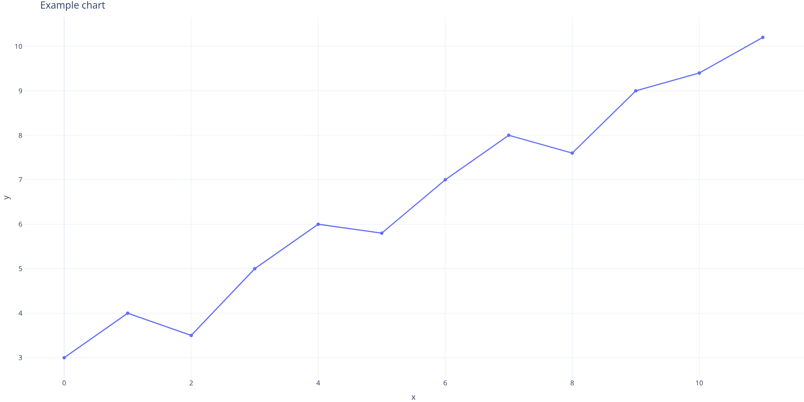

# Executive summary

Summarize the question, method, headline findings, and the recommendation.
Aim for five sentences a busy reader can act on.

::: {{.callout-note}}
## Scope

State what this report covers and explicitly does not cover.
:::

# Background

Context the reader needs before the analysis. Cite sources with footnotes[^1].

[^1]: Source description.

# Analysis

## Data and method

Describe inputs, assumptions, and limitations.

## Findings

Embed charts produced by the reportforge chart helper:

{#fig-example width=90%}

See @fig-example for the trend. Reference tables with @tbl-example.

| Metric | Value | As-of |
|--------|------:|------|
| Example | 42 | 2026-08-26 |

: Example table caption. {#tbl-example}

# Recommendations

1. Recommendation one, tied to a finding.
2. Recommendation two.

# Appendix {.appendix}

Methodology notes, extended tables, reproducibility information.

```{python}
# id: example-chart
import plotly.express as px
import pandas as pd

df = pd.DataFrame({"x": range(12), "y": [3, 4, 3.5, 5, 6, 5.8, 7, 8, 7.6, 9, 9.4, 10.2]})
fig = px.line(df, x="x", y="y", markers=True)
fig.update_layout(template="plotly_white", title="Example chart")
fig.write_image("assets/example-chart.png", width=1400, height=700, scale=2)
fig
```