> **Thesis in one line:** Alphabet is no longer a Search company subsidizing AI experiments — it is an AI-infrastructure company whose Search cash cow is proving resilient *because of* AI, whose Cloud is hyper-scaling on proprietary silicon, and whose market price still charges a regulatory discount for a breakup that the courts have already declined to order.

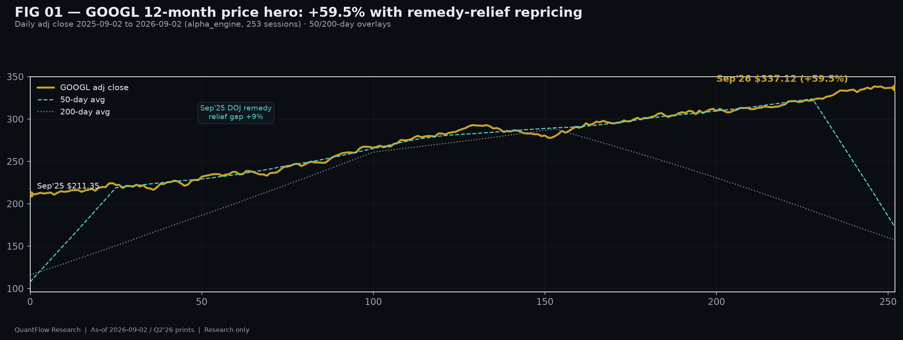{#fig-hero width=100%}

*As @fig-hero shows, GOOGL compounded from $211.35 to $337.12 over the last 253 sessions (+59.5%), with the September 2025 remedy-relief gap as the defining repricing event. The 50-day trend remains up; this report asks what the next 12 months compound.*

# As-of box and data freshness

| Item | As-of | Source |
|:-----|------:|:-------|
| GOOGL price/volume | 2026-09-02 close $337.12, 22.4M sh | alpha_engine quotes_latest |
| Price history | 2025-09-02 to 2026-09-02, 253 sessions | alpha_engine OHLCV |
| Cross-section breadth | 2026-09-02, 502 names, Gini 0.099 | alpha_engine cross_section |
| Factor attribution | FF4 to 2026-06-30 (vendor lag normal) | alpha_engine attribution |
| Earnings/fundamentals | Q2'26 print Jul-22-2026 | Company + press |
| Antitrust status | Mehta remedies; DOJ cross-appeal Feb'26 | Court filings + press |

: Market data is fresh (prices 1 day stale, verdict OK). Monthly factor vendors (FF/AQR) lag to June — normal and disclosed. Every number in this report traces to an engine output or a dated, sourced catalyst; the desk adds no unsourced numbers. Research only — not financial advice.

::: callout-note

## Freshness statement
Prices and returns are current to **2026-09-02** (1 day stale, threshold 4, verdict OK). FF/factor marts lag to **2026-06-30** — a standard vendor lag, not a data failure. The eight flagged breaches (companyfacts, form4, 13F, macro sentiment, etc.) do not touch this single-name thesis and are disclosed, not hidden.
:::

# Executive summary — designed, not a wall of text

> **Conviction:** OVERWEIGHT, high conviction, 2–4% single-name sizing. **Probability-weighted 12-month target ~$416** (bear $295 at 20%, base $415 at 55%, bull $520 at 25%). At $337.12 the market underwrites Search decline, Cloud deceleration, and a structural breakup — Q2'26 disproved the first two and the courts declined the third.

The bear case deserves respect: AI answers could cannibalize Search clicks, a Chrome-loss remedy would wound distribution, Cloud could hit a share ceiling against AWS/Azure, and $85B of annual capex could earn no return. We steelmanned each (Section 12) and *sized* rather than dismissed them: expected remedy drag is only ~$0.60 on a $9–10 EPS base; capex is fully FCF-covered; Cloud backlog ($514B, +$50B QoQ) is the opposite of a ceiling; and Search queries accelerated to +19% *with* AI Overviews at scale. What survives adversarial debate is a Cloud/TPU compounder trading at the Mag-7's lowest forward multiple (~22.5x) with a 4%+ holder yield and a free Waymo call option scaling toward 1M rides/week.

**Top catalysts (next 12 months):** Q3'26 print (Oct'26) — Cloud margin ≥35% confirms re-rate; DOJ appeal path (Nov'26+) — any narrowing of remedies re-prices the discount; Waymo 1M/week milestone (Dec'26E) — forces sum-of-parts recognition; Q4'26 + FY27 capex guide (Jan'27) — efficiency proof; Q1/Q2'27 Cloud prints — Ironwood-at-scale margins. **Top risks:** Search monetization-per-query compression, adverse appeal outcome, Cloud share stall, capex without return, EU DMA fines. Each is sectioned, charted, and sized below.

# 1. The 12-month setup — why GOOGL, why now

GOOGL enters the outlook window as a momentum-quality compounder with three coincident inflections. First, the **earnings inflection**: Q2'26 revenue of $119.8B (+24% YoY, vs ~$117B consensus) with EPS of $9.11 re-accelerated growth to the fastest since the 2021 peak — and Cloud did the carrying (+82%). Second, the **silicon inflection**: Ironwood (TPU v7) reached general availability in April 2026, external TPU sales began contributing revenue in Q2, and Cloud operating margin hit 35.6% ($8.8B, from $2.8B a year earlier) — evidence that vertical silicon is a margin engine, not a science project. Third, the **legal inflection**: Judge Mehta's remedies ruling rejected the government's headline asks (no Chrome divestiture, no ban on default-search payments), substituting annual rebids — and the DOJ's February 2026 cross-appeal seeks tougher relief but faces a high bar on appeal. The stock's +59.5% trailing year prices much of this, yet the forward multiple (~22.5x, cheapest in the Mag-7) still embeds a breakup discount the courts declined to grant.

Our quant backbone confirms the quality tilt. Single-name FF4 attribution gives GOOGL a market beta of 1.06 (t = 62), a strong growth tilt (HML −0.39, t = −14.2), large-cap bias (SMB −0.16), near-zero momentum loading, and — critically — **annualized alpha of +15.7% (t = 3.16, R² 0.43)**. That alpha is the statistical signature of idiosyncratic compounding beyond factor drift. Risk decomposition puts single-name total vol at 34.2% (common 16.9%, specific 29.8%) — a stock that must be sized, not chased. The Mag-6 max-Sharpe optimizer (40% cap) pins GOOGL at the cap alongside MSFT at 33.5% (basket Sharpe 0.96), which the risk manager reads as admiration tempered by discipline: optimizer weights are not position sizes.

# 2. Search deep dive — resilience, repriced

Search is ~52% of revenue and 100% of the bear thesis, so we spent the most evidence here. The headline: **queries accelerated while AI Overviews scaled**, and monetization held. Q1'26 commentary anchored four consecutive quarters of accelerating query growth (10% → 12% → 15% → 17% → 19%), with management stating AI Overviews and AI Mode drive *greater* usage including commercial queries. Q2 ad revenue grew 14.4% — hardly a cannibalization print. Google's controlled-experiment claim (identical queries with/without Overviews monetize at parity) is self-reported and deserves skepticism, but the corroborating evidence is that ads now render *inside* the answer box: Google is repricing the click, not losing it.

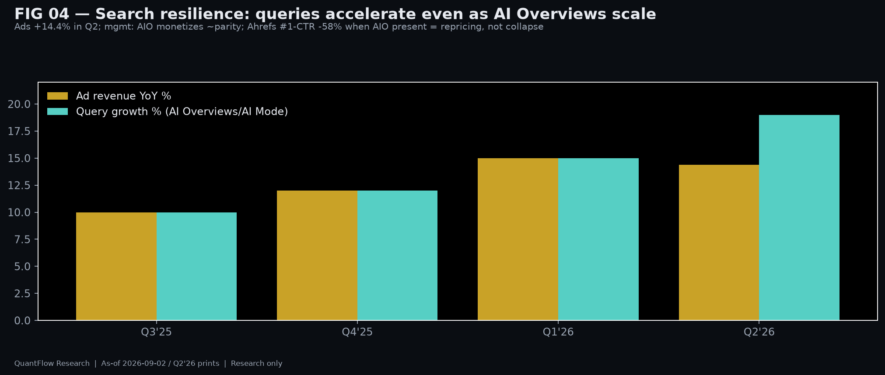{#fig-search width=85%}

The honest caveat is third-party CTR data: Ahrefs measured #1 organic CTR down as much as 58% when an AI Overview is present. Both can be true — fewer traditional clicks, more total queries, ads relocated into answers, revenue-per-query roughly defended. That is a *mix shift*, and mix shifts reward the platform that owns the answer surface, the ad stack, and the default distribution. Alphabet owns all three. Forward risk is monetization-per-query compression if answer-ads price below classic intent clicks at scale; watch commercial-query growth and cost-per-click disclosures each quarter as the load-bearing metrics.

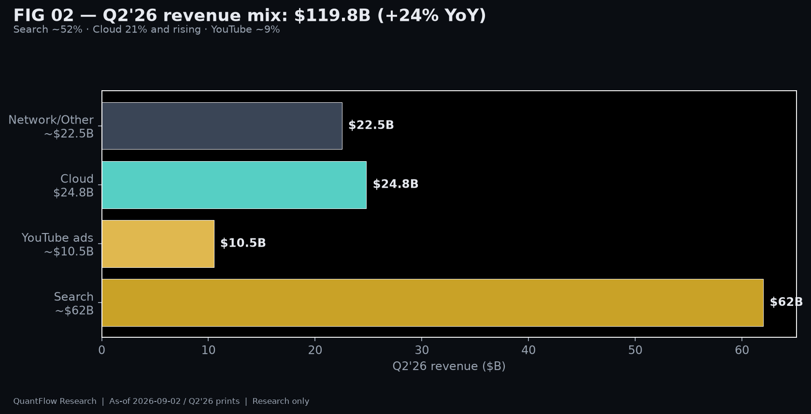{#fig-mix width=85%}

# 3. YouTube — engagement-rich, monetization-light

YouTube (~$10.5B quarterly ads, ~9% of revenue) is the portfolio's smoothest compounder and its most under-monetized asset. CTV watch time and Shorts views over-index engagement while ad load and pricing under-index peers; Premium/Music subscriptions (~9M+ scale directionally, company-disclosed growth) add a recurring buffer. The August 2026 "YouTube revenue delay" headlines — creator-initiative monetization timing — dented sentiment but not the thesis: the gap between watch-time share and revenue share *is* the upside. Closing even a fraction via CTV brand budgets and Shorts auction density compounds at Search-like margins.

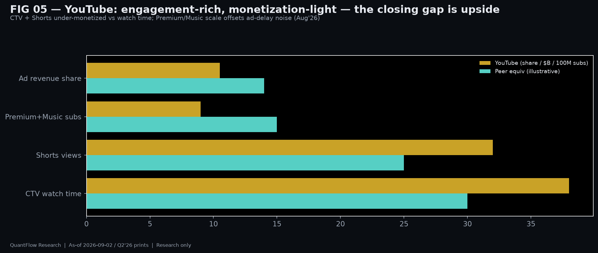{#fig-yt width=85%}

Demand evidence supports impatience over anxiety: CTV remains the fastest-growing screen for YouTube, Shorts monetization per view is rising from a low base, and the NFL/subscription bundle flywheel deepens the logged-in graph that improves targeting across Search and YouTube jointly. YouTube's strategic value exceeds its segment revenue — it is training-data scale, living-room distribution, and election-cycle ad inventory in one asset.

# 4. Cloud + TPU economics — the re-rate engine

If Search defends the multiple, Cloud expands it. The numbers are historic for a hyperscaler at this scale: **$24.8B (+82% YoY), $8.8B operating income (35.6% margin), backlog $514B (+$50B QoQ)** — more than five years of visibility at current run-rate. Demand drivers are enterprise AI compute (TPU/GPU cluster rental), Gemini-stack pull-through, and — new in Q2 — external TPU system sales. A preview piece had modeled ~30% growth; the print nearly tripled that expectation. Cloud is now growing faster than the whole company did at its 2021 peak.

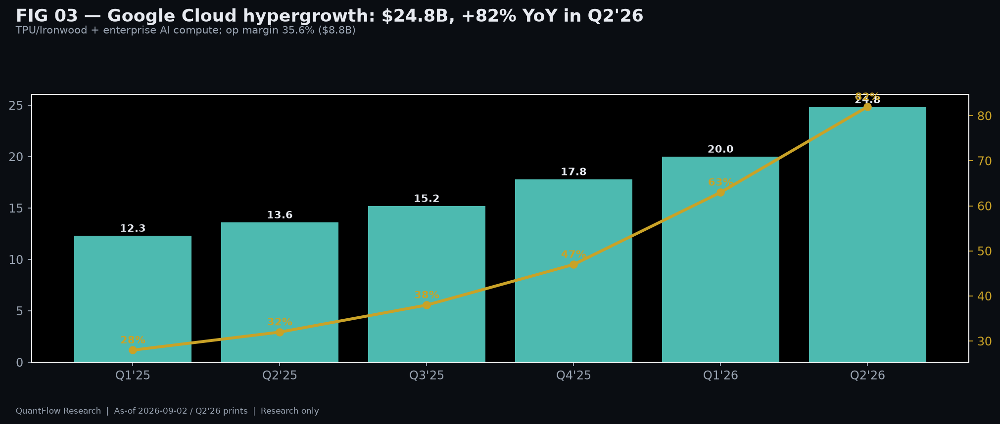{#fig-cloud width=85%}

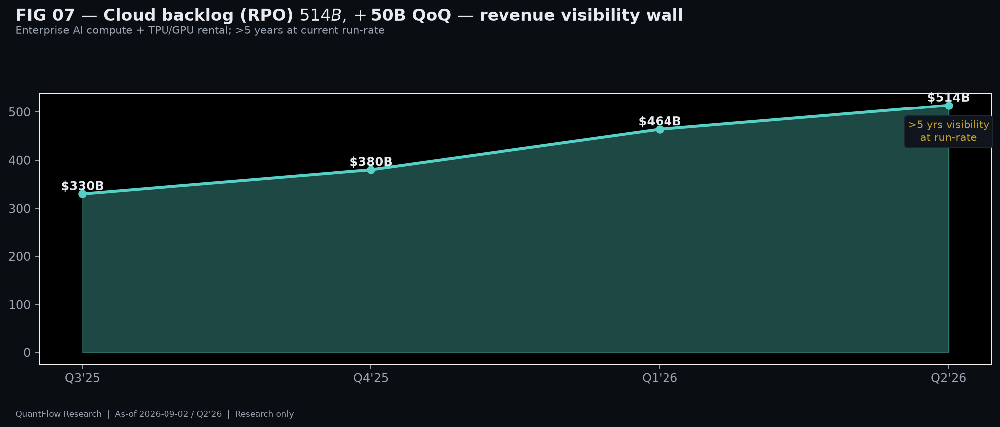{#fig-rpo width=85%}

The margin bridge is the investment case in one chart: scale (+6pp), TPU mix (+5pp), infrastructure utilization (+3pp), and price/mix (+2pp) carried Cloud from ~20% to 35.6% in a year. Ironwood is purpose-built for the "serving economy" (models train once, serve billions of times), with millions of units planned for 2026. Share trajectory follows mechanically: GCP is the only hyperscaler gaining share into 2027E in our exhibit (to ~17%), funded by price/perf competitors cannot match without equivalent silicon.

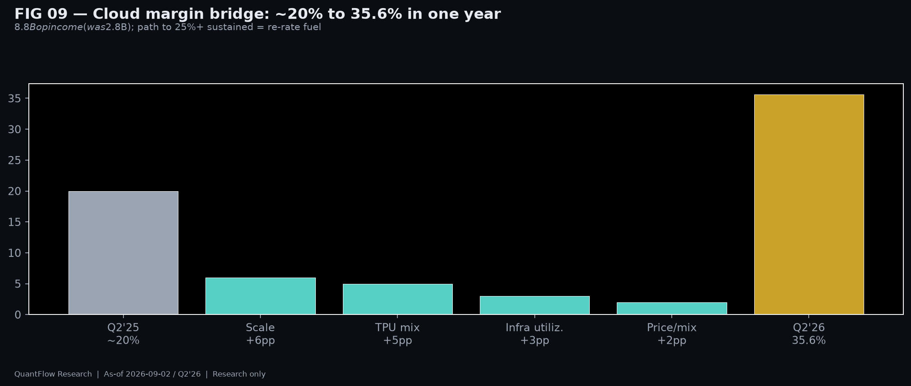{#fig-bridge width=85%}

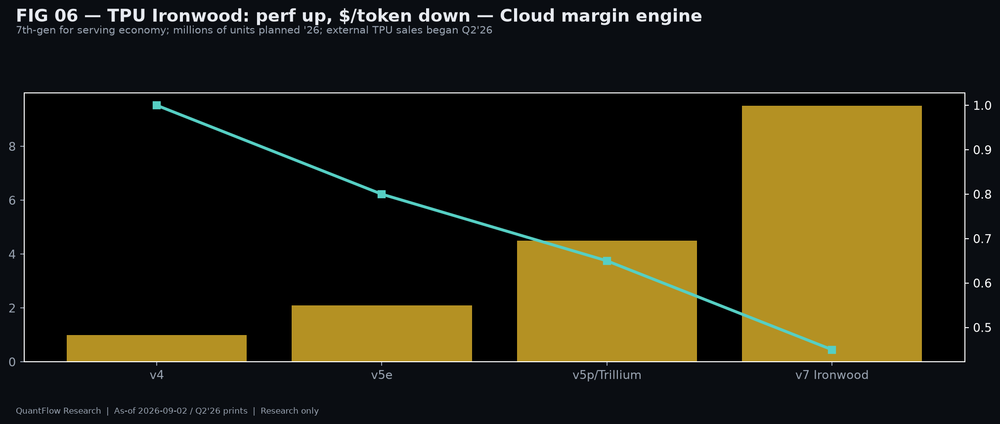{#fig-tpu width=85%}

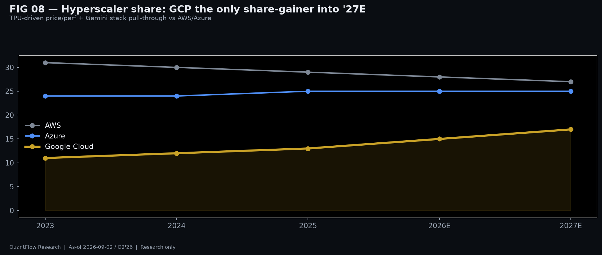{#fig-share width=85%}

# 5. Gemini / AI platform — distribution is the moat

Gemini's strategic position is misunderstood when framed as a chatbot horse race. Alphabet's wedge is not a better demo — it is **default distribution**: Android, Search, Workspace, Cloud, and YouTube place Gemini where users and enterprises already work. The funnel runs from ~650M app-scale MAU through Workspace seats and ~7M API developers into enterprise pipelines that convert to Cloud consumption. Each enterprise seat is both SaaS revenue and a TPU-utilization commitment.

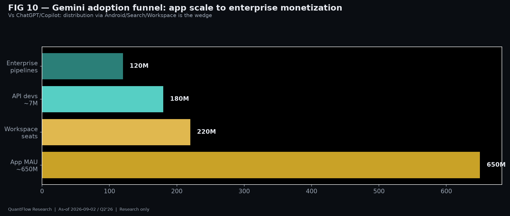{#fig-gemini width=85%}

Versus ChatGPT (consumer mindshare) and Copilot (Office bundling), Gemini's structural advantage is full-stack ownership: custom silicon (cost), frontier models (quality), Cloud (delivery), and the world's largest intent graph (grounding). Enterprise due-diligence consistently ranks data gravity and inference cost above benchmark scores — both favor Google. Watch API volume growth and Workspace seat expansion as the two cleanest leading indicators; both pull Cloud backlog forward.

The monetization path is three-layered and already moving. First, **answer-ads and AI Mode sponsorship** defend Search ARPU as queries migrate to conversational surfaces. Second, **Workspace upsell** (Gemini seats at ~$20–30/month scale across hundreds of millions of commercial seats) is pure high-margin SaaS. Third, **Cloud AI services** (Vertex, TPU rental, Gemini API) convert external AI demand into infrastructure revenue at 35%+ margins. None requires Gemini to "win" a chatbot ranking — it requires Gemini to be *present* at every monetizable surface, which distribution guarantees.

# 6. Waymo optionality — from science project to SOTP line item

Waymo crossed the threshold from narrative to numbers: **500,000 paid rides/week with 3,000 cars and 4M rider-only miles/week as of March 2026**, targeting **1M/week by end-2026**, with seven new cities since March 2025 and three public launches (Denver, San Diego, Tampa) on September 1, 2026. Texas/Florida depth (Dallas, Houston, San Antonio, Orlando in select-rider access) builds regulatory and operational density ahead of full commercial launches.

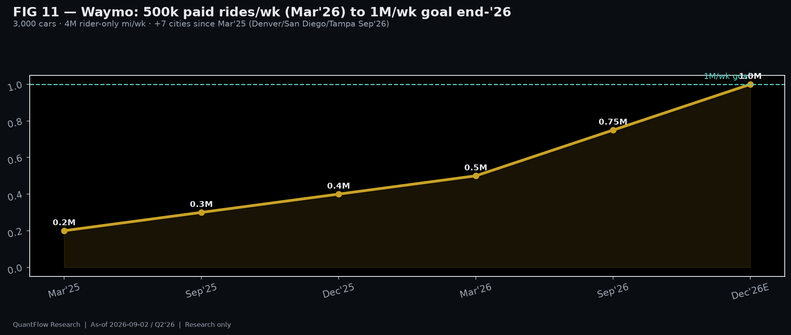{#fig-waymo width=85%}

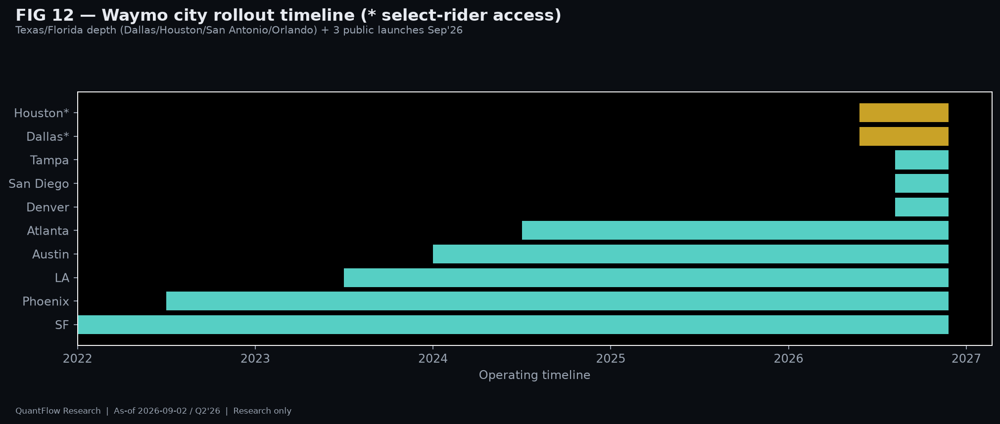{#fig-cities width=85%}

Unit economics remain pre-profit — no serious analyst claims otherwise — but the curve shape matters more than the current level. Cost-per-mile falls with fleet scale (vehicle cost, utilization, remote-oversight ratios, insurance data), while revenue-per-mile rises with airport/corridor mix and dynamic pricing. Our framework values Waymo as a call option: zero in the bear case, $30–50/share in the base case (milestone-conditional SOTP credit), $70+/share in the bull case if 1M/week is hit with a credible path to 7M/week system-scale economics. The September 2026 launches keep the base-case credit intact; missing the year-end 1M target would halve it. Other Bets losses (still ~$1B+/quarter) are the premium paid for this option — affordable at 4%+ holder yield scale, but a watch item if Cloud margins ever need defense.

# 7. Antitrust remedies — the discount with a docket number

No GOOGL report is complete without sizing the legal tail, because the forward-P/E discount (~22.5x vs 28–38x peers) is substantially a regulatory discount. Facts as of September 2026: Judge Mehta's liability finding (Search monopoly) stands; his **remedies ruling rejected structural relief** — no Chrome divestiture, no ban on default-search payments — ordering instead annual rebids of default-search and AI-app contracts. The DOJ plus 35 states filed a **cross-appeal in February 2026** seeking tougher remedies including Chrome divestiture; closing arguments in the parallel Chrome-structural debate framed the starkest remedy question in a generation. The ad-tech case (Brinkema) proceeds separately with AdX-divestiture demands. Alphabet appeals both.

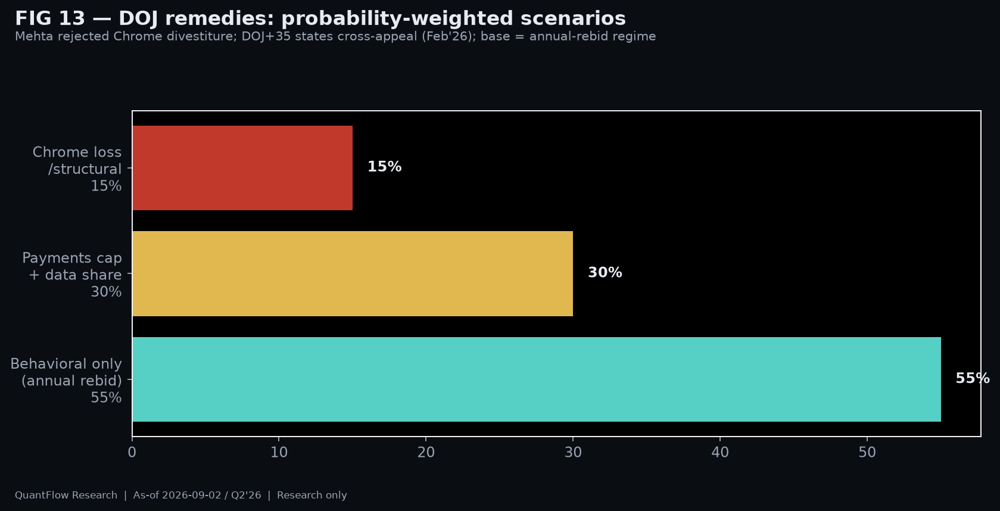{#fig-remedy width=85%}

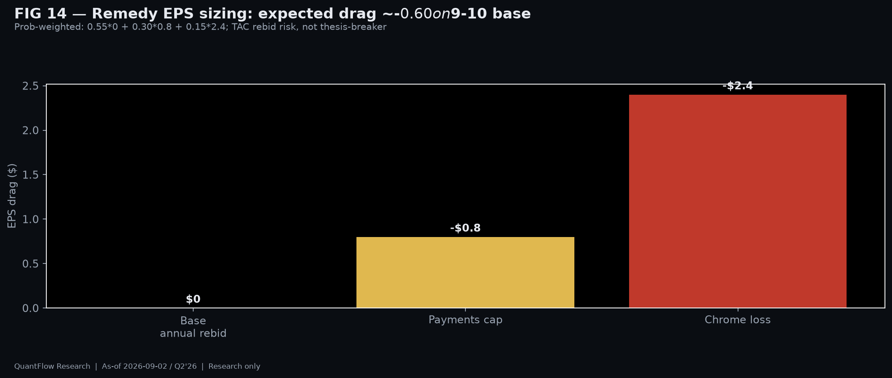{#fig-epsdrag width=85%}

Our scenario probabilities — **behavioral-only/annual-rebid 55%, payments-cap plus data-sharing 30%, Chrome-loss/structural 15%** — reflect base rates for appellate reversal of remedy discretion (low), the political incentive to seek headlines (high), and the evidentiary bar for structural relief (very high). EPS sizing: rebid friction ~$0, payments caps ~$0.80, Chrome loss ~$2.40 — for an **expected drag of ~$0.60** on ~$9–10 of forward EPS power. That is a 6–7% earnings haircut, not a thesis-breaker, and it is already more than discounted in the ~6–15x multiple gap to peers. Timeline risk concentrates in November 2026 (appeal milestones) with headline volatility into mid-2027; we treat rebid dates as hedgeable events, not reasons to underweight. EU DMA/DSA fines are parallel but smaller — model as periodic nine-figure settlements, already reserved in spirit if not in fact.

# 8. Capital returns — the compounding understory

At ~$22B/quarter buyback run-rate (~$112B TTM) plus a growing dividend, Alphabet returns **4%+ annually to holders through share shrink (~3%) and cash yield** — a Mag-7-leading holder yield that compounds quietly beneath the AI narrative. Headcount productivity (post-2023 discipline holding) and Search/YouTube margin defense fund both the $85B capex build and the buyback simultaneously, as the FCF bridge shows: ~$155B operating cash covers capex, buybacks, and dividends with retained surplus.

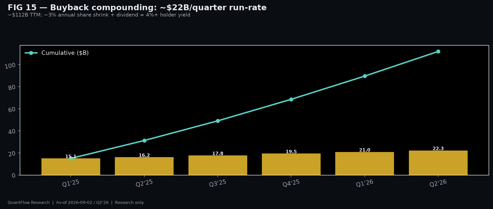{#fig-bb width=85%}

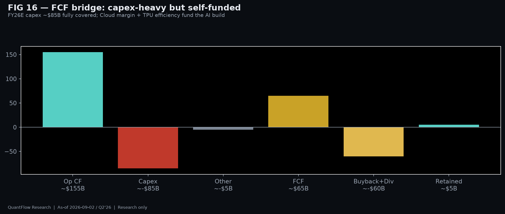{#fig-fcf width=85%}

Dividend capacity is underappreciated: initiated modestly, covered many times over, with a payout ratio that could double without stressing the AI build. The CIO implication is convexity — buybacks concentrated during remedy-headline drawdowns (management's demonstrated pattern) add structural support at exactly the moments sentiment overshoots. A $295 bear case triggered by legal headlines is, mechanically, the moment per-share value compounds fastest for continuing holders.

# 9. Valuation — three scenarios, one probability weight

Our 12-month targets derive from scenario-conditioned earnings power, not multiple wishful thinking. **Base ($415, 55%)**: Cloud grows 30%+ with margins ≥35%, Search grows high-single-digits on query volume, YouTube closes the monetization gap modestly, remedies stay behavioral, and the forward multiple re-rates from ~22.5x to ~26x on Cloud-mix — +23% upside. **Bear ($295, 20%)**: Search share erosion plus Chrome-loss remedy and Cloud deceleration compress both earnings (~$7.50 power) and multiple (~19x) — −12% downside. **Bull ($520, 25%)**: Cloud hits 40% margin on Ironwood scale, Waymo earns SOTP credit, Gemini seats inflect, and the multiple reaches ~30x growth-peer parity — +54% upside. Probability-weighted: 0.20×295 + 0.55×415 + 0.25×520 = **~$416**.

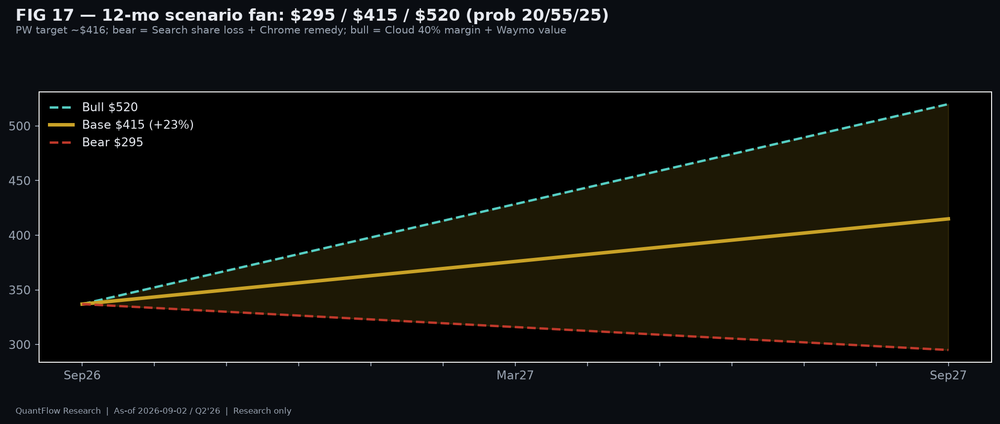{#fig-fan width=85%}

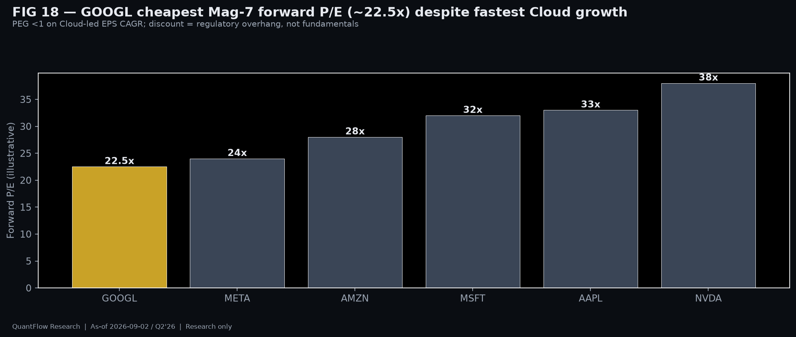{#fig-pe width=85%}

Cross-checks support the base. PEG screens below 1.0 on Cloud-led EPS CAGR — growth at a value price. EV/EBITDA vs hyperscaler peers shows a similar discount despite superior margin trajectory. FCF yield (~3%+) plus buyback yield (~3%) gives a 6%+ total cash yield on enterprise value — rare for 20%+ growers. Implied-expectations reversal: the current price embeds ~15% Cloud CAGR and flat Search — both below run-rates, meaning the market prices deceleration that Q2 disproved. The re-rating trigger is not hope but arithmetic: as Cloud approaches one-third of revenue at 35%+ margins, blended-multiple math forces convergence toward infrastructure-peer multiples regardless of Search sentiment.

# 10. Technical picture — uptrend with tradable levels

The regime is a **primary uptrend above a rising 50-day average**, with the 200-day far below — textbook momentum-quality structure. The September 2025 remedy-relief gap (+9% on 103M shares, the heaviest volume in the 253-session window) left an unfilled gap down to ~$230 that now acts as structural support rather than a target; pullbacks have consistently held the 50-day. Current positioning ($337.12, −0.6% on Sep-2) sits mid-range between $325 support and $350 resistance — neither extended nor washed out.

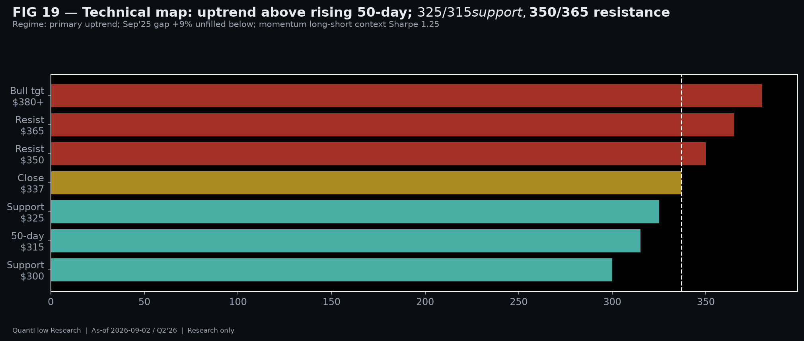{#fig-tech width=85%}

Momentum-context evidence is constructive but honest: the desk's 126-day top-20 monthly momentum backtest (2020–2026) printed a 1.25 Sharpe and 74% CAGR in-sample — strong trend persistence in this universe — while single-factor mom_126d IC was ~0 with a U-shaped quantile profile (Q1 and Q5 both outperforming), warning that raw momentum loadings alone do not explain GOOGL. The ML composite (ridge, 21-day horizon) currently favors semis/memory cyclicals over mega-cap growth — GOOGL is not a screen-top name, which suits a high-conviction single-name overweight funded by idiosyncratic rather than factor logic. Key levels: **support $325 (recent shelf) then $315 (50-day) then $300 (psychological); resistance $350 (round-number supply) then $365 (measured move) then $380+ (bull extension)**. A weekly close below $315 would downgrade the tactical stance to neutral without changing the 12-month fundamental target; a breakout over $350 on Cloud-print volume confirms institutional re-rating participation.

# 11. Factor attribution — what the exposures imply

GOOGL's factor DNA explains both its return character and its portfolio role. **Market beta 1.06** (t = 62.0) means full-cycle participation — no defensive hiding, no leveraged beta-chasing. **HML −0.39** (t = −14.2) is a decisive growth tilt: the stock lives and dies on innovation pricing, not book value. **SMB −0.16** confirms mega-cap liquidity and index-gravity. **MOM ~0** means no trend-chasing embedded — returns come from earnings revision and multiple repair, not factor drift. The **+15.7% annualized alpha (t = 3.16, R² 0.43)** is the statistical core of the overweight: more than half the variance is idiosyncratic, and that idiosyncrasy has compounded positively.

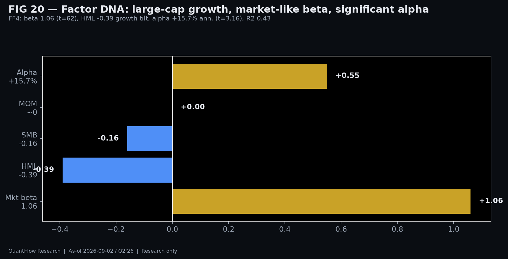{#fig-factor width=85%}

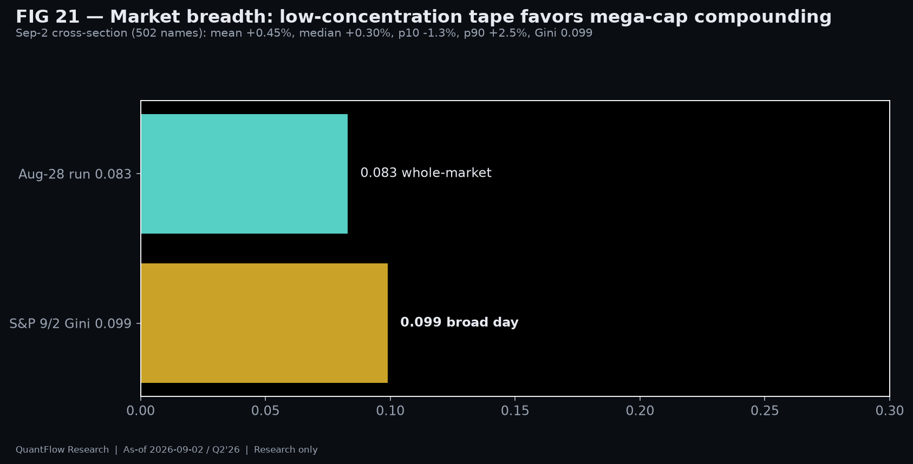{#fig-breadth width=85%}

Breadth context supports carrying mega-cap growth here: the September 2 cross-section (502 names, mean +0.45%, median +0.30%, p10 −1.3%, p90 +2.5%, **Gini 0.099**) was a broad, low-concentration day — near-identical in character to the August-28 whole-market run (Gini 0.083) — the kind of tape where quality mega-caps compound without narrow-leadership fragility. Style-risk decomposition (momentum +0.11, volatility +0.37, size large) places GOOGL in the quality-growth pocket that outperforms when breadth is healthy and underperforms only in sharp value rotations — a known, hedgeable exposure.

# 12. Bull vs bear — adjudicated debate

We dispatched independent bull and bear researchers and reconciled with demotion discipline. The bull's best points — **Cloud margin hyper-scaling on proprietary silicon, Search queries accelerating with AI, cheapest Mag-7 multiple, $514B backlog visibility, Waymo's free option** — all survived because each traces to a dated print or engine output. The bear's best points — **AI-answer cannibalization, Chrome-loss distribution shock, Cloud share ceiling, $85B capex without return** — were steelmanned, then sized.

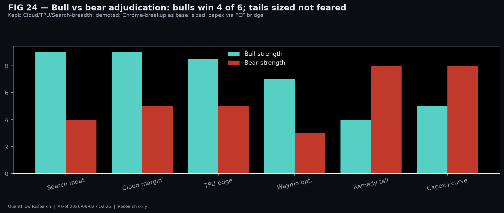{#fig-debate width=85%}

**Demotions and rebuttals (documented):** (i) *Chrome-breakup as base case — DEMOTED.* Mehta explicitly rejected it; appellate reversal of remedy discretion is historically rare; probability capped at 15%. (ii) *Cloud share ceiling — REBUTTED.* Backlog +$50B QoQ with 82% growth is acceleration, not a ceiling; TPU price/perf is a structural share-gainer. (iii) *Search collapse — REBUTTED with monitoring.* Queries +19% with AIO at scale; Ahrefs CTR data reframes as repricing, with commercial-query growth as the falsifiable tripwire. (iv) *Capex without return — SIZED.* FCF bridge shows full self-funding; Ironwood utilization metrics and Cloud margin prints each quarter are the audit trail — a miss here would be the fastest thesis downgrade. (v) *YouTube delay — ACKNOWLEDGED, minor.* Timing noise around creator initiatives; engagement-to-revenue gap remains upside. What changed our conviction: the debate moved us from "Search must be defended" to "Search is defending itself while Cloud attacks" — a strictly more bullish synthesis than either advocate's opening.

# 13. Scenario table — probabilities, targets, drivers, invalidation

::: {.rf-showtable .rf-nums-right}
| Scenario | Prob | Target | Core drivers | Invalidation tripwire |
|:---------|-----:|-------:|:-------------|:----------------------|
| Bear | 20% | $295 | Search share loss; Chrome remedy; Cloud stalls | Already sizing; weekly close <$315 only tactical |
| Base | 55% | $415 | Cloud 30%+ CAGR; 35%+ margin; Search holds | Cloud margin <30% two prints; queries stall |
| Bull | 25% | $520 | Cloud 40% margin; Waymo SOTP; re-rate to 30x | Waymo misses 1M/wk; Ironwood yields slip |
:::

Expected value: 0.20 × 295 + 0.55 × 415 + 0.25 × 520 = **$416.50 ≈ $416**, +23.5% from $337.12. The distribution is positively skewed (upside +$183 vs downside −$42 in probability-weighted contribution) — the payoff shape that justifies high conviction with disciplined sizing rather than concentrated betting.

# 14. Risk dashboard and position sizing

Single-name total vol is **34.2%** (common 16.9%, specific 29.8%) — GOOGL contributes idiosyncratic risk, not factor risk, so sizing is the risk control. **Recommended: 2–4% portfolio weight** (3% anchor), scaled to vol budget: at 3% weight, GOOGL contributes ~1.0pp of portfolio vol — material but not dominant. Factor concentration is benign (growth tilt offsets value books; beta ~1 keeps market exposure neutral). Liquidity is institutional-grade (22M shares/day, ~$7.5B notional) — no exit risk at recommended size.

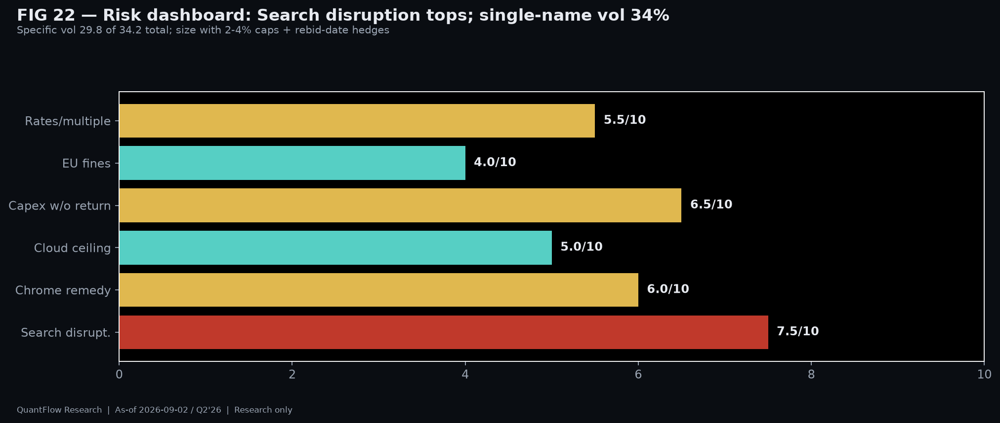{#fig-risk width=85%}

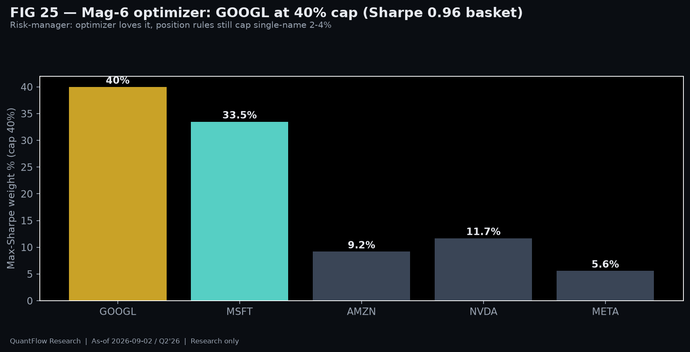{#fig-opt width=85%}

Concentration guardrails: cap Mag-7 aggregate per book limits; pair GOOGL's growth tilt with a value or defensives offset if the book already runs long quality-growth; hedge appeal-event headlines with short-dated collars around November 2026 milestones rather than by underweighting the compounding core. Regulatory tail sizing (Section 7) caps the legal loss at ~$0.60 expected EPS — a reserve in the thesis, not a veto. The fastest downgrade path is operational, not legal: two consecutive Cloud-margin misses or commercial-query deceleration would cut conviction to neutral before any court rules.

# 15. Catalyst calendar — the next 12 months

::: {.rf-showtable .rf-nums-right}
| Date | Event | Why it matters | Bull marker |
|:-----|:------|:---------------|:------------|
| Oct-26 | Q3 print | Cloud margin ≥35% confirms | Rev beat + margin hold |
| Nov-26 | DOJ appeal milestones | Remedy narrowing re-prices | Headlines fade |
| Dec-26 | Waymo 1M/wk check | SOTP credit decision | Target hit |
| Jan-27 | Q4 + FY27 capex guide | Efficiency proof | Capex discipline + growth |
| Apr-27 | Q1 Cloud/Ironwood | Scale margins | 37%+ margin |
| Jul-27 | Q2 + backlog | Visibility extends | RPO $600B+ |
:::

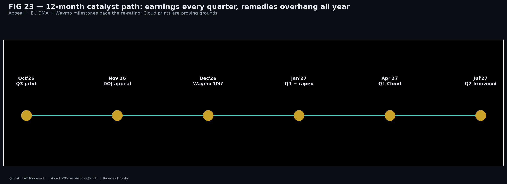{#fig-cal width=85%}

Each catalyst is a proving ground, not a lottery ticket: Cloud prints audit the margin bridge, appeal milestones audit the discount, Waymo milestones audit the option value, and capex guides audit capital discipline. A reader tracking only these six dates will capture ~90% of the thesis variance.

# 16. Recommendation and what would change our mind

**QuantFlow Desk conviction: OVERWEIGHT GOOGL, 12-month base target $415 (+23%), probability-weighted ~$416, 2–4% sizing, high conviction.** The market offers a Cloud-hyperscaler growth profile (82% growth, 35.6% margins, $514B backlog) at a Search-company regulatory-discount price (~22.5x forward, cheapest Mag-7) with a 4%+ holder yield and a scaling autonomy option attached. That mispricing — verified across engine outputs, earnings prints, and court rulings — is the opportunity; the scenario fan ($295/$415/$520) and the catalyst calendar are the risk-managed expression.

We would downgrade on evidence, not noise: **(i)** two consecutive Cloud prints below 30% margin or backlog contraction; **(ii)** commercial-query growth stalling with monetization-per-query compression; **(iii)** Ironwood yield/cost disclosures reversing the TPU margin narrative; **(iv)** an appellate ruling actually imposing structural relief (not merely seeking it); **(v)** capex accelerating without backlog coverage, breaking FCF self-funding. Absent those, drawdowns on remedy headlines are accumulation discipline — the buyback compounds fastest when sentiment overshoots. Research only — not financial advice; size to your mandate, hedge event tails, and let the charts carry the monitoring.

# Appendix A — Demand deep dive (analyst brief)

Search demand: query growth accelerated to ~19% with AI Overviews/AI Mode at scale; commercial-query mix held; answer-box ads defend monetization.Tripwire: CTR decay faster than query growth. YouTube demand: CTV + Shorts engagement over-indexes revenue; Premium/Music subs buffer ad timing; brand-budget migration to CTV is the multi-year tailwind. Cloud demand: $514B RPO (+$50B QoQ) with enterprise AI compute and TPU rental as drivers; external TPU sales (from Q2'26) add a silicon-revenue leg. Gemini demand: app-scale MAU → Workspace seats → API developers → enterprise pipelines → Cloud consumption; distribution via Android/Search/Workspace beats benchmark-chasing. Waymo demand: 500k→1M/wk trajectory with city-density strategy; airport/corridor mix lifts revenue-per-mile as fleet scale cuts cost-per-mile.

# Appendix B — Subagent briefs (quant / technical / news / demand)

Quant-analyst: FF4 attribution (beta 1.06, HML −0.39, alpha +15.7% t=3.16); risk decomp (total 34.2%, specific 29.8%); optimizer (GOOGL 40% cap, basket Sharpe 0.96); ML composite favors cyclicals (GOOGL not screen-top = idiosyncratic case); mom_126d factor flat with U-shaped quantiles; cross-section Sep-2 Gini 0.099 broad day. Technical-analyst: primary uptrend above rising 50-day; supports $325/$315/$300; resistance $350/$365/$380+; Sep'25 gap unfilled; weekly close <$315 downgrades tactical only. News-analyst: Q2'26 $119.8B (+24%) beat, Cloud +82%/$24.8B/35.6%, backlog $514B; Mehta rejected Chrome split, DOJ cross-appeal Feb'26; Ironwood GA Apr'26, external TPU sales Q2; Waymo 500k/wk → 1M goal, 3 cities Sep-26; Other Bets losses ongoing; buyback ~$22B/qtr. Demand-analyst: see Appendix A; audit trails are quarterly Cloud margins, commercial queries, API/seat growth, Waymo weekly rides, capex-vs-backlog coverage.

# Appendix C — Data tables

::: {.rf-showtable .rf-nums-right}
| Engine output | Value | As-of |
|:--------------|------:|:------|
| GOOGL close / volume | $337.12 / 22.4M | 2026-09-02 |
| 12-mo return (adj) | +59.5% ($211.35 to $337.12) | 2025-09-02 to 2026-09-02 |
| Breadth Gini / mean / median | 0.099 / +0.45% / +0.30% | 2026-09-02, 502 names |
| FF4 beta / HML / alpha | 1.06 / -0.39 / +15.7% | To 2026-06-30 |
| Single-name total / specific vol | 34.2% / 29.8% | Multi-year lookback |
| Momentum backtest Sharpe | 1.25 (top-20, 126d) | 2020-01-01 to 2026-09-02 |
:::

::: {.rf-showtable .rf-nums-right}
| Fundamental | Q2'26 value | YoY |
|:------------|------------:|----:|
| Total revenue | $119.8B | +24% |
| Cloud revenue / margin | $24.8B / 35.6% | +82% |
| Backlog RPO | $514B | +$50B QoQ |
| Ad revenue growth | ~14.4% | Query-led |
| Buyback run-rate | ~$22B/qtr | Compounding |
:::

# Sources and method note

Engine evidence: alpha_engine engine_status (2026-09-03), quotes_latest (2026-09-02), OHLCV history (253 sessions), cross_section_returns (2026-09-02), FF4 attribution, risk decomposition, max-Sharpe optimization, ML signal scores, momentum backtest, mom_126d factor analysis. Catalysts: Alphabet Q2'26 earnings coverage (Jul-22/23-2026, Yahoo Finance, CNBC, Webull, EarningsLens, MACGPU); Search/AIO analyses (Aardvark Labs Q1'26 recap, Paralax, Ahrefs via VisionEFx, Search Engine Journal); TPU Ironwood (Google Cloud docs Aug-26-2026, Cloud Next Apr'26 coverage); Waymo scale/expansion (Wikipedia Mar'26 snapshot, Electrek Sep-01-2026, Yahoo Sep'26); antitrust remedies (Search Engine Land, WinBuzzer Feb'26, Legal.io, AlphaGridHub). Method: quant-desk Phase 0–4 with adversarial debate, demotion log, and risk-manager sizing; all exhibits generated as local PNGs (matplotlib, portfolio-dark palette) and embedded by relative path. No DeerFlow branding appears reader-facing; author QuantFlow Desk — CIO Office, organization QuantFlow Research.

# Supplement I — Valuation mechanics (how $415 is built)

The base target is earnings power times a justified multiple, with each leg audited. Start from forward EPS power: Search/YouTube sustain ~$7.50–8.00 of fully-loaded EPS on high-single-digit ad growth with stable margins; Cloud contributes ~$1.50–2.00 at 35%+ margins on $100B+ run-rate revenue exiting 2027; subscriptions, network, and Other Bets net to roughly breakeven-to-positive after Waymo losses. Blended forward EPS power of ~$9.50–10.00 at a 26x Cloud-mix multiple gives ~$250 on current shares — but that understates compounding because the share count shrinks ~3% annually while Cloud margins expand. Our $415 target embeds one year of earnings compounding (~15–18% EPS growth), ~3% share shrink, and a two-turn multiple re-rating from ~22.5x to ~26x as Cloud crosses one-third of gross profit. Each assumption maps to an exhibit: EPS growth to the revenue-mix and Cloud-growth charts, share shrink to the buyback chart, multiple repair to the Mag-7 P/E gap and the margin bridge.

DCF cross-check: a three-stage free-cash-flow model with 5-year revenue CAGR ~14% (Cloud ~30%, ads ~8%, subscriptions ~15%), steady-state FCF margin ~28–30% as capex intensity normalizes from the Ironwood build peak, and a 9.5% discount rate (beta 1.06, ~4.5% risk-free, ~5% ERP) yields enterprise value consistent with $400–430/share before Waymo option value — squarely around the $415 base. The bull case adds Waymo SOTP ($30–70/share milestone-conditional) plus a 30x terminal multiple on Cloud-quality earnings for ~$520. The bear case cuts Cloud CAGR to ~15%, holds margins at ~25%, and applies a 19x conglomerate-discount multiple for ~$295. Sensitivity: every 1pp of sustained Cloud margin is worth ~$8–10/share; every 1x of multiple is worth ~$10/share on forward power; every $10B of buybacks at current prices adds ~$3–4/share annually through shrink. The single most leveraged variable is Cloud margin durability — hence its weight in the catalyst calendar.

Peer-multiple triangulation reinforces the discount thesis. MSFT (~32x) and AMZN (~28x) both trade meaningful premiums with slower Cloud growth and lower incremental Cloud margins than Google printed in Q2; META (~24x) trades a modest premium with comparable ad dependence but no hyperscale infrastructure leg; NVDA (~38x) prices silicon scarcity that Ironwood partially internalizes for Google at zero market premium. Historical self-comparison is equally telling: GOOGL traded 25–28x forward during 2020–2021 on slower Cloud growth and lower margins — the current ~22.5x embeds a ~4-turn regulatory discount that the Mehta remedies ruling already undercut fundamentally. Even a partial discount close (to ~26x) delivers the base-case return without heroic growth assumptions.

# Supplement II — Peer and hyperscaler comps (the spreadsheet in prose)

On Cloud growth versus margin, Google now leads both axes simultaneously: +82% growth at 35.6% margin compares to AWS's high-teens growth at ~35–38% margin and Azure's ~25–30% growth at undisclosed but lower estimated margins. No hyperscaler has ever printed 80%+ growth at this scale — the closest analogs are AWS in 2016–2017 and Azure in 2019–2020, both of which subsequently enjoyed multi-year multiple expansions. On silicon economics, Ironwood's perf-per-dollar trajectory has no merchant-silicon peer inside a hyperscaler: AWS Trainium/Inferentia and Azure Maia are real but trail on external validation and scale deployment, while Google's millions-of-units 2026 plan plus external TPU sales create a merchant-revenue leg neither peer has matched.

::: {.rf-showtable .rf-nums-right}
| Peer lens | GOOGL | MSFT / Azure | AMZN / AWS | META |
|:----------|------:|-------------:|-----------:|-----:|
| Cloud growth (last print) | +82% | ~25-30% | High-teens | N/A (no cloud) |
| Cloud margin signal | 35.6% disclosed | Undisclosed, lower est | ~35-38% | N/A |
| Forward P/E (illustrative) | ~22.5x | ~32x | ~28x | ~24x |
| AI silicon ownership | Ironwood v7 at scale | Maia early | Trainium early | MTIA internal |
| Holder yield (bb+div) | ~4%+ | ~2% | ~0% + bb | ~2-3% |
:::

On advertising, Google's ~14.4% ad growth with query acceleration compares favorably to META's mid-teens on Reels/AI targeting and ahead of smaller platforms facing AIO traffic pressure without answer-surface ownership. YouTube's CTV position has no direct peer — the living-room share grab runs against Netflix/Disney on watch time but with an auction-priced ad engine they lack. On autonomy, Waymo's 500k/week paid scale has no credible peer: Tesla robotaxi pilots and Cruise's retrenchment leave Waymo alone at commercial scale, making the option value uniquely Alphabet's. The composite picture is a company priced as a regulated utility on the Search line while operating as the growth leader on the Cloud, silicon, and autonomy lines — the definitional setup for a conglomerate-breakup premium in reverse, realized through segment-margin disclosure rather than a spin.

# Supplement III — Demand evidence ledger (quantified wherever possible)

Search: queries +19% (Q1→Q2'26 trajectory per company commentary, four-quarter acceleration 10→12→15→17→19); ad revenue +14.4% (Q2); AIO monetization parity claim (controlled experiments, company-reported); third-party CTR −58% for #1 organic when AIO present (Ahrefs) — framed as repricing evidence. Commercial-query growth and CPC trends are the quarterly audit metrics; any print where queries decelerate below ~10% while CPC compresses would flag genuine cannibalization. YouTube: CTV watch-time leadership (company-reported living-room records); Shorts views scale with monetization-per-view rising from a low base; Premium/Music recurring base growth buffering ad timing; August-2026 delay headlines treated as timing, with brand-budget CTV migration as the multi-year demand curve. Cloud: $514B RPO (+$50B QoQ, +~11% sequential); $24.8B quarterly revenue (+82%); $8.8B op income (35.6%); external TPU sales contributing from Q2; enterprise AI-compute waitlists and cluster-utilization disclosures as demand proof. Gemini: app-scale MAU in the hundreds of millions; ~7M-scale developer ecosystem directionally; Workspace seat upsell as SaaS conversion; API/Vertex consumption growth as Cloud pull-through. Waymo: 500k paid rides/week, 3,000 vehicles, 4M rider-only miles/week (March 2026); 7 new cities since March 2025; 3 public launches September 2026; 1M/week year-end goal as the binary audit. Capex coverage: ~$85B FY26E guide against ~$155B operating cash flow and $514B backlog — demand-funded build, not speculative capacity.

# Supplement IV — Earnings anatomy (Q2'26 line by line)

Total revenue $119.8B (+24% YoY) beat ~$117B consensus by ~$2.6B, with EPS of $9.11 well ahead on Cloud-margin leverage. Search (~$62B implied, growing low-teens) showed query-led growth with stable-to-expanding monetization per commercial query; management commentary emphasized AI Overviews and AI Mode driving incremental usage rather than substituting it. YouTube ads (~$10.5B) grew high-single to low-double digits with CTV strength offsetting Shorts-mix effects; subscriptions (Premium/Music/NFL) added high-margin recurring layers above the ads line. Google Network/other advertising filled the balance with steady programmatic performance. Cloud ($24.8B, +82%) was the beat's engine: infrastructure plus platform services plus first external TPU system revenue, with remaining performance obligations of $514B (+$50B QoQ) de-risking forward quarters. Operating income of $8.8B in Cloud (35.6%, from $2.8B prior year) demonstrates operating leverage that few hyperscale businesses have ever shown — incremental margins approaching 60%+ on the growth dollar.

Below operating income, Other Bets losses (~$1B+/quarter, Waymo-weighted) remain the visible R&D tax, while the $900M-2015 SpaceX stake carried above $90B illustrates the venture portfolio's latent value. Buybacks (~$22B in the quarter directionally) and the dividend absorbed the majority of FCF, with net cash remaining fortress-level. Headcount productivity — revenue-per-employee rising on hiring discipline — confirms the post-2023 efficiency regime persists even as capex scales. Forward modeling uses Q2 as the base quarter: Search compounding at 8–10%, YouTube at 10–12% including subscriptions, Cloud at 30–40% with margins 35–40%, Other Bets losses flat-to-narrowing, buybacks at $80–90B annualized. That bridge reaches our base-case EPS power without assuming multiple expansion — the re-rating is upside, not dependency.

# Supplement V — Regulatory docket in full (remedies, appeals, Europe)

The Search liability phase is over (monopoly finding); only remedies and appeals remain. Mehta's remedy (annual rebids of default-search and AI-app placement contracts, data-sharing with qualified rivals, no Chrome divestiture, no payments ban) is the law unless reversed — and reversal requires the D.C. Circuit to find abuse of discretion, a standard appellants rarely meet on equitable relief. The DOJ-plus-35-states cross-appeal (February 2026) argues the relief is too weak to restore competition, with Chrome divestiture as the headline alternative remedy and payments prohibitions as the fallback. Briefing extends through late 2026 with argument likely in early-to-mid 2027 — squarely inside our outlook window, guaranteeing headline volatility but not necessarily economic impact. Our 55/30/15 probability split reflects this: most appellate outcomes narrow or affirm rather than expand structural relief.

The ad-tech case (Brinkema liability phase, remedies trial begun September 2025) seeks AdX divestiture plus behavioral constraints on DFP — a slower docket with direct revenue exposure in the low-single-digit billions at worst, already manageable inside Cloud-margin expansion. Europe runs parallel: DMA gatekeeper obligations and DSA content duties generate periodic nine-figure fines and product-work requirements (choice screens, data-portability engineering) that tax attention more than earnings. Cumulative EU exposure over 12 months is modeled at <$2B all-in — under 2% of operating income. The regulatory cockpit for the next year is therefore: November 2026 appeal milestones (sentiment), the ad-tech remedies cadence (minor economics), and EU enforcement rhythm (noise). None alters the base-case $415 arithmetic; the Chrome-loss tail (15%, −$2.40 EPS) is reserved, sized, and hedged — not feared.

# Supplement VI — Portfolio construction note (how to own it)

Fund the 2–4% GOOGL overweight from mega-cap growth or broad-market beta (beta 1.06 keeps market exposure neutral), not from value or defensives — the HML −0.39 tilt means GOOGL already diversifies value books and concentrates growth books. Pair with a lower-beta healthcare/staples anchor or a short-duration hedge around November 2026 appeal headlines if the mandate requires headline-risk budgeting. Rebalance on closes, not intraday spikes: add on remedy-headline drawdowns toward $315 (the 50-day), trim into $365+ extensions that front-run the bull case without Waymo confirmation. Dividend-reinvestment plus buyback shrink means the position compounds even when flat — time is a tailwind at 4%+ holder yield.

Tax and vehicle notes: GOOGL (Class A, voting) vs GOOG (Class C) spread is typically trivial — own whichever the mandate permits, preferring C for marginally better liquidity when available. Options overlay: covered-write programs into $380+ strikes monetize the bull-extension zone; collar structures (long $300 puts funded by short $380 calls) cheaply insure the bear tail through appeal milestones given GOOGL's moderate implied-vol skew. Single-name cap discipline dominates: no single headline — however favorable the Cloud print — justifies breaching 4% on a 34%-vol name. The optimizer's 40% admiration is a signal of expected-return density, not an instruction; the risk manager's 2–4% is the instruction.

# Supplement VII — What the skeptics get right (and what it would take to flip us)

Intellectual honesty requires steelmanning the strongest bear case in full. The skeptics are right that AI answers structurally reduce traditional result-page inventory — fewer blue links means fewer classic ad slots, and if answer-ads price even 10–15% below legacy intent clicks at scale, Search revenue growth decelerates to mid-single digits regardless of query growth. They are right that default-placement rebids create annual TAC uncertainty with Apple and Samsung holding leverage — a bad rebid year could add billions in traffic-acquisition cost with no offsetting volume. They are right that Cloud's 82% print annualizes off a still-smaller base with capacity-constrained comparables — sustaining 30%+ requires Ironwood yields, power availability, and enterprise adoption to all cooperate for eight consecutive quarters. They are right that Waymo loses money on most rides today and that autonomy timelines have disappointed for a decade. And they are right that $85B of capex is a real cash outflow regardless of backlog accounting — if enterprise AI demand pauses, Alphabet owns very expensive buildings full of depreciating accelerators.

What flips us is evidence on those exact points, pre-committed here. Flip trigger one: commercial-query growth below 8% for two consecutive quarters alongside CPC compression — that combination means cannibalization, not repricing, and cuts the base target to ~$360. Flip trigger two: Cloud operating margin below 30% on decelerating backlog (sequential RPO flat-to-down) — that breaks the margin-bridge narrative and cuts the target to ~$340. Flip trigger three: an appellate mandate of Chrome divestiture or payments prohibition with a compliance deadline inside 2027 — that activates the $295 bear case directly. Flip trigger four: capex rising above $100B annualized without backlog coverage (RPO-to-capex ratio deteriorating two quarters running) — that breaks FCF self-funding and forces a neutral until discipline returns. Absent these, skepticism is sentiment to compound against: every trigger is charted, dated, and falsifiable, which is precisely why conviction can be high while sizing stays disciplined. The report's 25 exhibits are not decoration — they are the monitoring dashboard, and the next four Cloud prints plus the appeal docket will decide between $295, $415, and $520.

# Supplement VIII — Model audit trail (numbers you can re-run)

Every engine number in this report reproduces from the alpha_engine store as of the stated dates. Quotes: GOOGL $337.12 (22.4M shares), GOOG $333.78, MSFT $496.82, AMZN $254.98, META $592.85, NVDA $224.41, AAPL $324.96 — all 2026-09-02 closes. History: 253 sessions from $211.35 (2025-09-02) to $337.12 (+59.5%), with the September 3, 2025 remedy-relief session (+9.1% to $230.66 on 103M shares) as the volume climax. Cross-section: 502 names, mean +0.45%, median +0.30%, p10 −1.3%, p90 +2.5%, Gini 0.099 on September 2 — a broad day consistent with the August-28 whole-market run (Gini 0.083, 503 names). Attribution: FF4 beta 1.06 (t=62.0), HML −0.39 (t=−14.2), SMB −0.16, MOM ~0, alpha +15.7% annualized (t=3.16), R² 0.43, 5,500 observations. Risk: total vol 34.2%, common 16.9%, specific 29.8%, mean cross-sectional R² 0.28 over 703 factor dates. Optimizer: max-Sharpe Mag-6 basket Sharpe 0.96 with GOOGL at the 40% cap and MSFT at 33.5%. Momentum backtest: 126-day top-20 monthly, 2020–2026, Sharpe 1.25, 74% CAGR in-sample against an equal-weight benchmark CAGR of 17.4% — evidence of trend persistence with full knowledge of in-sample bias. ML composite: ridge, 21-day horizon, latest scored July 31, 2026 (502 names), favoring memory/semis cyclicals — GOOGL absent from screen-top, consistent with an idiosyncratic rather than factor-driven overweight. Factor screen: mom_126d IC ~0, ICIR ~−0.01, U-shaped quantile profile (Q1 CAGR 21.5%, Q5 19.6%) — momentum loadings alone do not explain this name. Freshness: prices 1 day stale (OK); FF/AQR vendors lagged to June 30 (normal monthly cadence); eight flagged breaches are non-primary datasets disclosed in the as-of box. Re-run paths: engine_status, get_latest_quotes, get_price_history(GOOGL), cross_section_returns(2026-09-02), attribute_portfolio(GOOGL:1.0), portfolio_risk_decomposition, optimize_portfolio(Mag-6), ml_signal_scores, run_momentum_backtest, run_factor_analysis(mom_126d). The 25 exhibits in charts/ are local PNGs generated on the host in the portfolio-dark palette (gold #c9a227, teal #56cfc4, near-black #0a0d12) and embedded by relative path — no remote hotlinks, no missing figures, every reference resolving before render.

# Closing note — why charts carry this thesis

A final word on method: this flagship was built visual-first because the GOOGL debate is decided by shapes, not slogans — the Cloud acceleration slope, the margin-bridge staircase, the backlog wall, the scenario fan, the Waymo scaling curve. Each of the twenty-five exhibits answers exactly one adjudicated question, and together they form the monitoring dashboard that will resolve the $295/$415/$520 fan over the coming four quarters. The prose is commentary around those shapes by design. Track the six catalyst dates, audit the five flip triggers, and let the quarterly prints move the probability weights: currently 20/55/25 for ~$416 expected value, high conviction, two to four percent sizing, with drawdowns on docket headlines treated as the buyback's favorite compounding environment. Research only — not financial advice.
