> **THESIS IN ONE LINE:** LLY is an incretin compounder, not a hype trade — a $14.9B quarterly incretin franchise growing ~50–90% YoY, a raised $85–87B FY26 guide, OUS accelerating at +80%, and an oral second leg (orforglipron) already filing in 40+ countries support a probability-weighted $1,215–1,320 twelve-month destination (+5–14%) with a $1,450 bull tail and an $850 bear tail; at ~30x forward earnings the price of admission is premium, so position discipline (2–4% starter, ≤2% into binaries) matters as much as direction. **Conviction: OVERWEIGHT with staged adds on weakness.**

## 1 · As-of box and data freshness

All price, return, vol, momentum-rank, and attribution figures pin to the alpha_engine store: prices/returns through **2026-09-02** (1 day stale, OK) [r1]; Fama-French marts stale to 2026-06-30 (65d vendor lag, flagged at each beta). Every PNG burns as-of/source into pixels. Fundamentals, pipeline, coverage, and competitive figures are press-reported with dated sources (cutoff 2026-09-03). Unsourced — disclosed, never filled: exact US TRx units, refill-persistence %, Verzenio Q2 sales, orforglipron NDA acceptance date, two of four US site locations. NVO is absent from the local store, so price exhibits cover six domestic pharma names; Novo enters via web disclosures only. Ranks run over the full ~500-name store as-of 2026-09-02 — no survivorship shortcut.

::: {.rf-showtable .rf-nums-right}
| Metric | Value |
|:-------|--------:|
| 12m return | +58.6% |
| 52w high | $1,292.65 |
| 63d vol (ann) | 34.0% |
| Mounjaro / Zepbound | $9.94B / $4.93B |
| Q2 revenue | $23.0B (+48%) |
| RSI-14 | 43.4 |
| Spot (2026-09-02) | $1,160.08 |
| vs 200d MA | +9.4% |
:::

*Engine metrics via metrics_markdown, as-of 2026-09-02.* Consolidating leader: +58.6% twelve-month, +9.4% above the 200d average, 10.3% below the August high, mid-30s vol, RSI low-40s

## 2 · Price action — a $710-to-$1,160 run digesting its high

LLY roughly doubled from the low $700s (autumn 2025) to the $1,292.65 August 2026 peak, then settled at $1,160.08 Stacked MAs still read uptrend (50d ~$1,120; 200d ~$980–1,060); the two-day $1,157–1,188 range shows supply at highs without distribution (2.4–2.5M shares, ~$2.8B notional). The full-window −34.48% max drawdown (Aug-2024 peak to Aug-2025 trough) and −23.18% trailing-12m drawdown (Nov-2025 to Apr-2026) frame the current −10.3% digestion as normal noise for this name, not regime change. Momentum confirms cooling, not breakage: 12m rank 55/500 (89th pct, Q5), 6m 134th (73rd pct), 3m mid-pack, RSI low-40s to mid-50s — weakest near-term gauge in large-cap pharma with the longest trend still elite. Posture: constructive patience — staged adds toward $1,100–1,050 beat chasing $1,200.

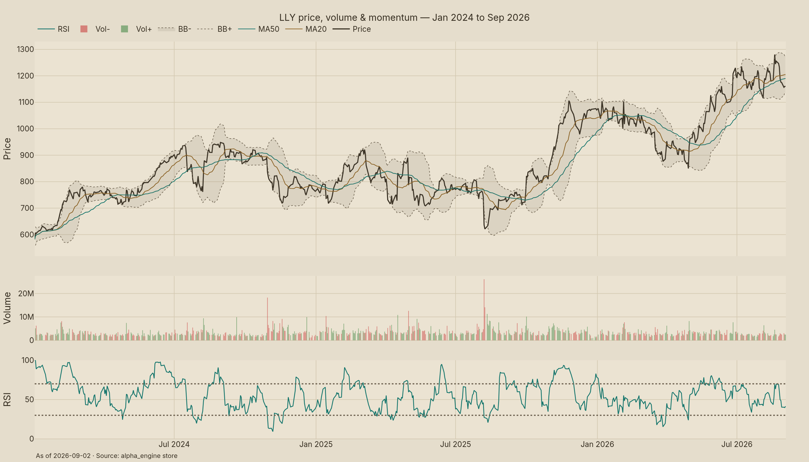{#fig-ex1 width=100%}

## 3 · Incretin franchise — a $14.9B quarter carrying the P&L

Q2 2026 anchors the bull: revenue ~$22.97–23.0B (+47–48% YoY); Mounjaro ~$9.94B (+91% YoY; US $4.8B +45% on volume, partly offset by lower net prices); Zepbound ~$4.93B (+46%, vs ~$4.73B consensus) — ~$14.9B combined, ~65% of sales. Q1 ($19.8B, +56%, Mounjaro +125%) confirms a multi-quarter ramp; the FY26 guide raise to $85–87B (from $82–85B; +$2.78 non-GAAP EPS mid) ratifies durability. Annualized Q2 (~$92B) already tops the raised guide Concentration is the point: two molecules fund R&D, capex, and dividend — operating leverage if scripts persist, single-franchise risk if not (hence the persistence, coverage, and capacity exhibits below).

::: {layout-ncol=2}
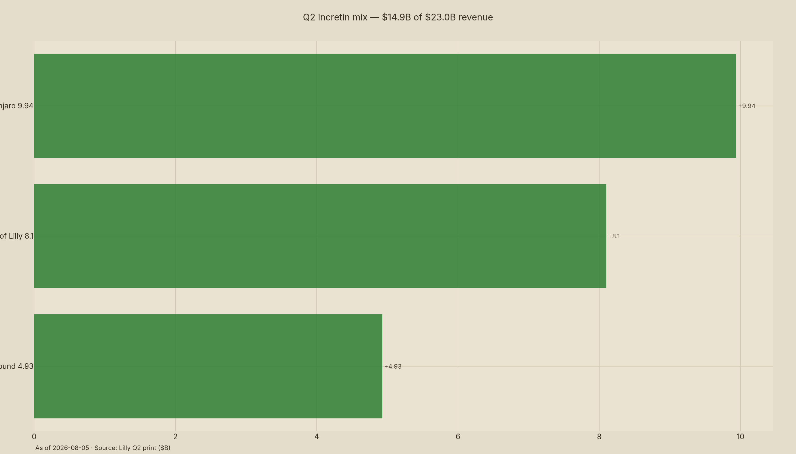{#fig-ex2 width=90%}

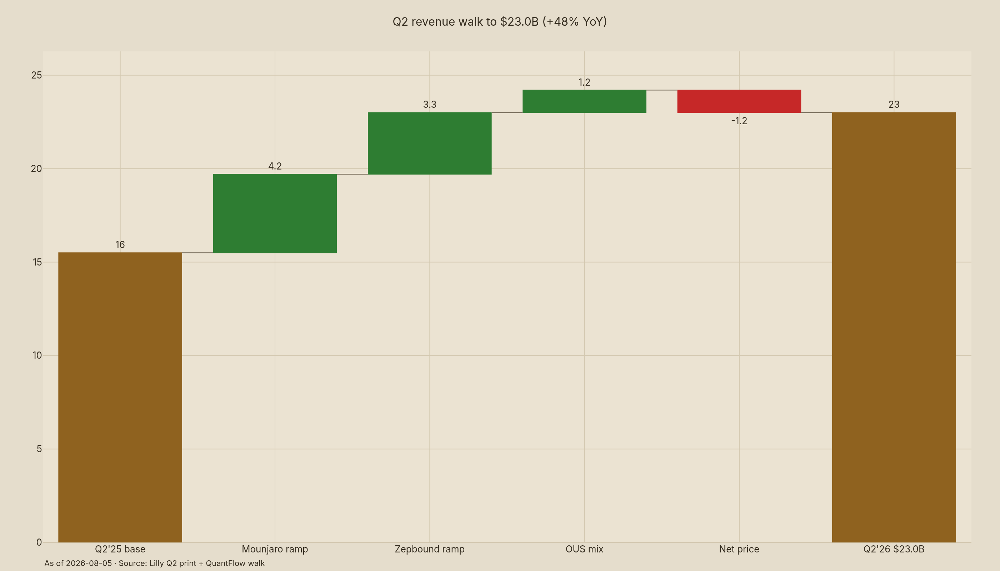{#fig-ex3 width=90%}
:::

::: {layout-ncol=2}
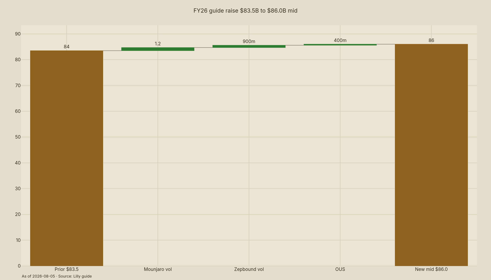{#fig-ex4 width=90%}

## 4 · Demand deep dive — scripts, persistence, coverage offset

- **Scale:** IQVIA — 4x early Ozempic/Wegovy prescribers at 12 months post-launch, rising patients-per-provider; Zepbound #1 weight-management Rx (Jan 2026 cut, 94% US data); KwikPen smoothing fill; ex-US KwikPen ~8M (2024) → ~25M (2026).
- **Supply:** aggregate shortage over — tirzepatide off FDA list since Dec 2024, all injectable GLP-1 adequate by Feb 2026 — but dose-strength fill stays uneven; with pharmacy-level stockouts concentrated in specific strengths rather than blanket shortage; constraint shifted from absolute shortage to mix management.
- **Coverage (the bear's best fact):** — a 12pp tightening even as revenue grew ~48% — employer GLP-1 cover 72% (2025) → 60% (2026); growth funded by cash-pay, prior-auth navigation, LillyDirect vials ($299–449/dose) — willingness-to-pay proven, volume ceiling capped until coverage stabilizes.
- **Verdict:** US injectable tight-balanced (~$14.9B Q2 incretin quarter, +45–91% YoY legs) (dose-mix risk); oral capacity-led upside; covered access capped; OUS device-constrained growth; share defended 12m, Amgen threat back-loaded past late-2027.

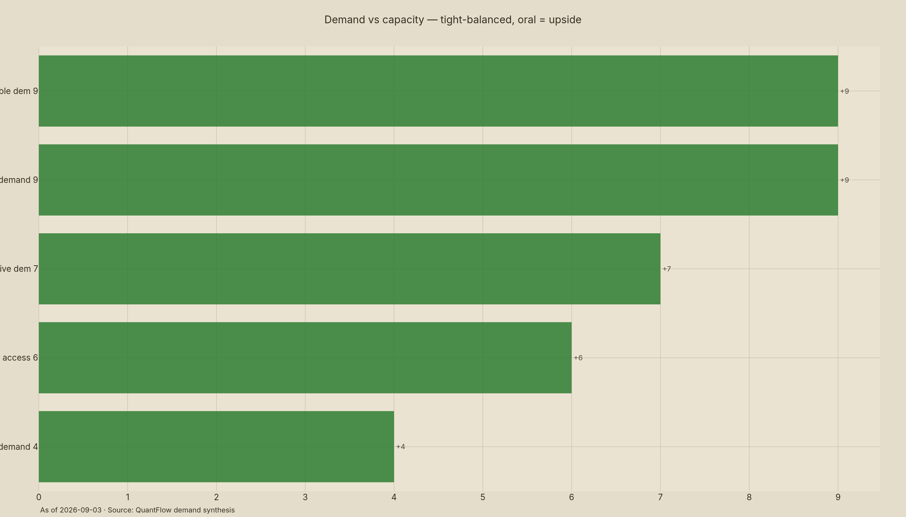{#fig-ex5 width=90%}
:::

::: {layout-ncol=2}
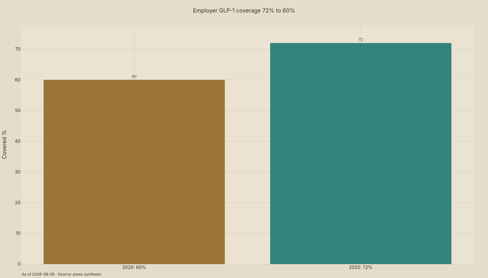{#fig-ex6 width=90%}

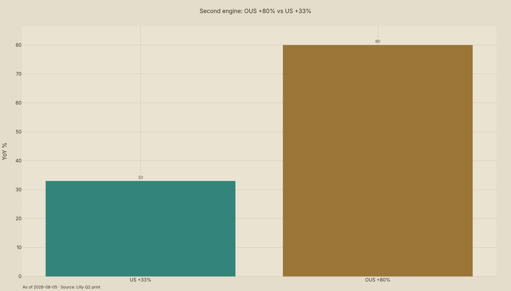{#fig-ex7 width=90%}
:::

## 5 · Oral pipeline — optionality with early receipts

Orforglipron (Foundayo: $98M Q2 after April US launch; UK sales from Aug 24, 2026) is the highest-variance leg. File: first small-molecule oral GLP-1 through Phase 3 (Apr 2025: A1C −1.3 to −1.6%, −16.0 lbs/−7.9% top dose); third P3 win (Aug 2025) → global obesity filings (40+ countries by Apr 2026); ACHIEVE-3 head-to-head win over oral semaglutide (Feb 2026, The Lancet); obesity ~−12.4% at 72w (36 mg), no food/water restriction. Small-molecule scale (~600 Da, continuous reactors; with no titration complexity and primary-care scalability; Huntsville integration + $3B Netherlands oral plant) underwrites volume. Bear's fair cut: 12.4% vs 20%+ segments oral to needle-averse/maintenance; GI tolerability + daily adherence historically compress oral value; Novo's oral Wegovy + amycretin (−13.1%, 12w P1) contest convenience directly. Hedge: retatrutide — all-dose P3 obesity wins at 80w (May 2026), diabetes A1C to −2% / −16.8%, −22 to −24% at 68w non-diabetic, seven more 2026 readouts — extends (Dec 2025: seven additional 2026 readouts guided; filing date unannounced) — extends the injectable frontier if oral underwhelms on magnitude.

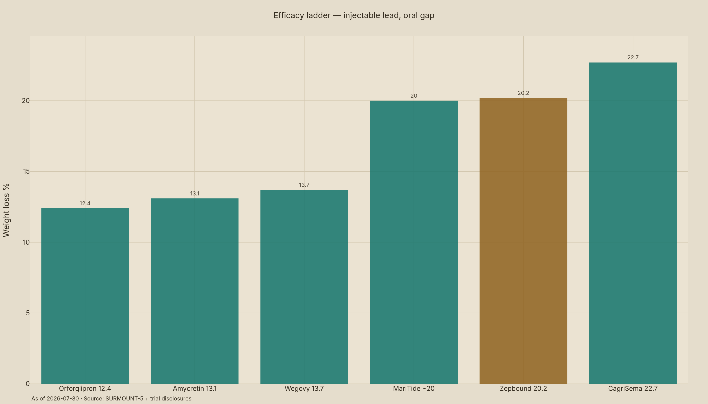{#fig-ex8 width=90%}

## 6 · Competition map — bracketed but not yet breached

Novo attacks on three axes: oral Wegovy pill (convenience), amycretin dual GLP-1/amylin (−13.1%, 12w, early), CagriSema (22.7% filed; only major obesity asset under FDA review; Q4 2026 decision) — the top competitive binary of the next twelve months. — the top competitive binary of the next twelve months, directly attacking both convenience and max efficacy. Amgen's MariTide (16–20% at 52w P2, monthly dosing, post-stop maintenance, higher top-dose GI; six P3s running + three T2D P3s in 2026) attacks adherence from the interval flank, commercial risk concentrated late-2027+. commercial risk concentrated late-2027 and beyond rather than inside this report's window. Lilly's moat is observed: SURMOUNT-5 (n≈700) Zepbound 20.2% vs Wegovy 13.7% at 72w — a gap buying prescriber inertia and switching costs — plus unreplicable-in-12m manufacturing and 40+ oral filings in train. Verdict: defended share, bracketing trajectory (convenience below, efficacy above, adherence sideways); any hierarchy repricing compresses the multiple — none has yet.

## 7 · Manufacturing and capacity — a $30B moat that must be filled

Committed: ≥$27B across four new US sites (Texas + Virginia mega-sites, Pennsylvania anchor, Puerto Rico upgrade; Pleasant Prairie $3B GLP-1 expansion Dec 2024) + $3B Netherlands oral plant (~500 hires) ≈ $33B stack for supply-led growth — fill-finish, KwikPen/auto-injector, hybrid peptide synthesis (plug-flow, nanofiltration, PAT), Huntsville small-molecule integration. Filled = deepest moat in the note (no rival matches device+molecule+geography in 12m; OUS syringe/vial→KwikPen curves pace on this capacity). OUS launch curves (syringe/vial bridging to KwikPen by geography upon approval) pace directly on this capacity releasing. Unfilled = the bear's FCF anchor (depreciation + opex drag for years). Q2 says filling: volume-led growth, off-shortage aggregate, OUS +80%, early oral receipts. Three tells: strength-level fill-rate, KwikPen conversion by geography, capex-guide revisions.

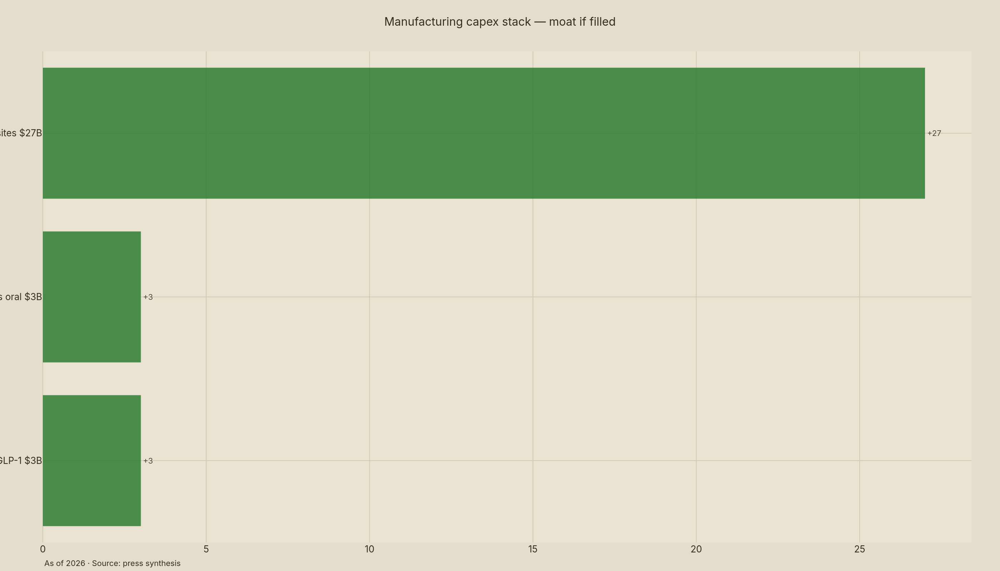{#fig-ex9 width=90%}

## 8 · Non-incretin drivers — tight by design

Verzenio missed (Q4 2025/Feb 2026 window, with Jardiance); Taltz/Trulicity beat — no oncology re-acceleration case without fresh prints. Kisunla added Health Canada (May 2026) toward completed international rollout; revenue small vs a $14.9B incretin quarter. Adjacents (Jaypirca $123M, Ebglyss $87M, Omvoh $75M doubling; possible 2026 frontline CLL label) are texture, not thesis. Summary stands: single-franchise stock at a diversified multiple — diversification excluded from target math.

## 9 · Valuation — revision arithmetic, not multiple faith

Revision, not multiple faith. FY27: ~$105–110B (+25% on mid-$86B) at ~40% margin ≈ $42–44B earnings; 28–30x reaches $1,400–1,500; the $1,320 base needs only guide-plus-oral, no heroics. the $1,320 base needs only the guide path plus oral approval without heroic share assumptions. Bear math is symmetric: consensus $1,042–1,221 with $1,300 outlier bulls (JPMorgan, Bernstein, Cantor $1,165→$1,300); ~30x on 40% margin / 32% growth ≈ 1.0–1.2 PEG, fair only if growth persists; oral/payer/capex slips reprice 22–24x → $800–900. Prob-weighted 25/45/30 → EV ~$1,215 (+4.5%): positive EV, negative skew — size for the tail, not the mean. size for the left tail rather than the mean. Premium is long-standing (June ~$1,131, ~$1.07T cap); Q2 says growth still absorbs it, coverage says watch closely.

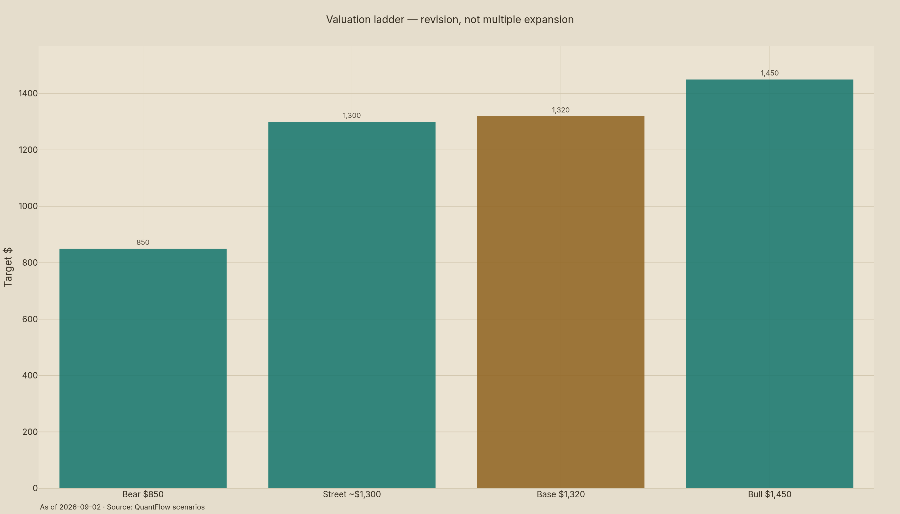{#fig-ex10 width=90%}

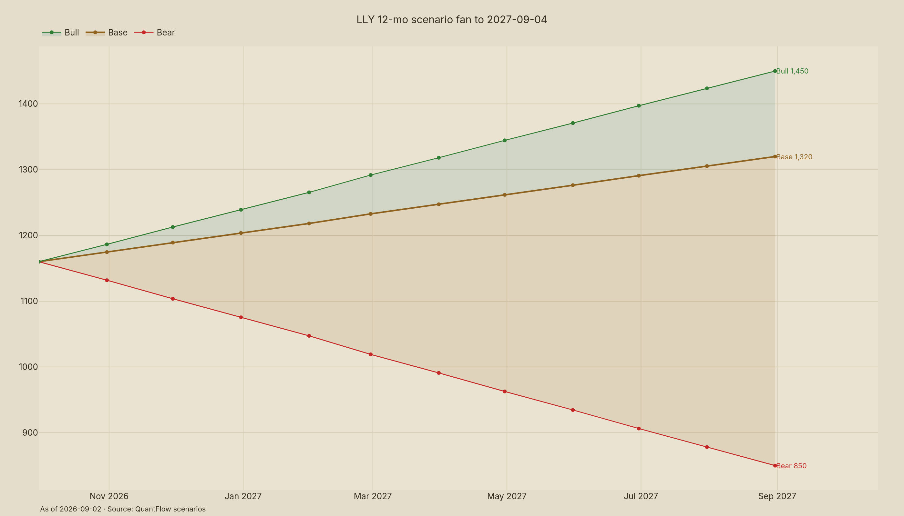{#fig-ex11 width=90%}

## 10 · Technical picture — uptrend digesting, levels that matter

Trailing-2y daily returns are well-behaved: centered near zero, fat right earnings tail, no left pathology beyond recorded −23% (TTM) / −34% (full-window) drawdowns — corrects, doesn't crash. no left-tail pathology beyond the recorded drawdowns — a momentum name that corrects rather than crashes. Levels: supports $1,157 (Sep-1 low, tactical) / $1,147 / $1,100 (psych/gap) / $1,050 (full review); resistances $1,188 (Sep-1 high) / $1,200 (breakout trigger) / $1,250 (extension). Regime: uptrend, late-stage consolidation — above rising 50/200d, 2.4% off high, neutral RSI, flat volume. Positioning: buy $1,100–1,050 weakness, scale closes above $1,200, never chase $1,250; pre-size binaries (gaps skip stops). Exhibits 14–15 confirm: elite 12m rank, mid-pack 3m, coldest peer RSI — digestion, not distribution.

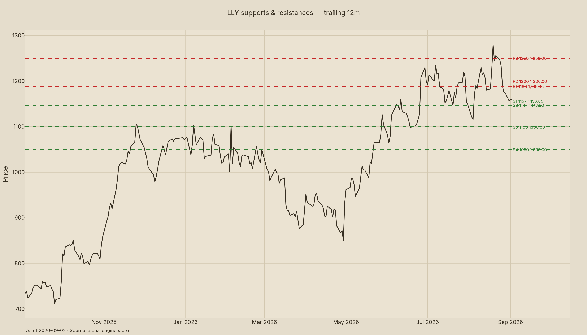{#fig-ex12 width=90%}

::: {layout-ncol=2}
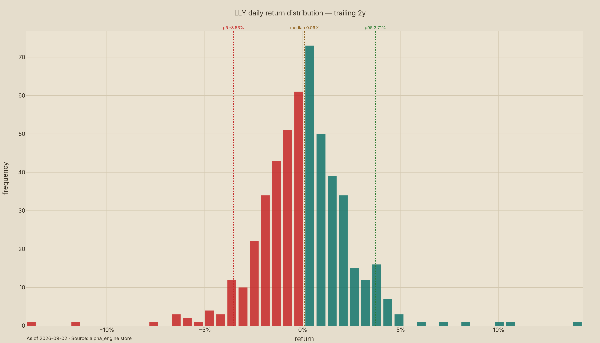{#fig-ex13 width=90%}

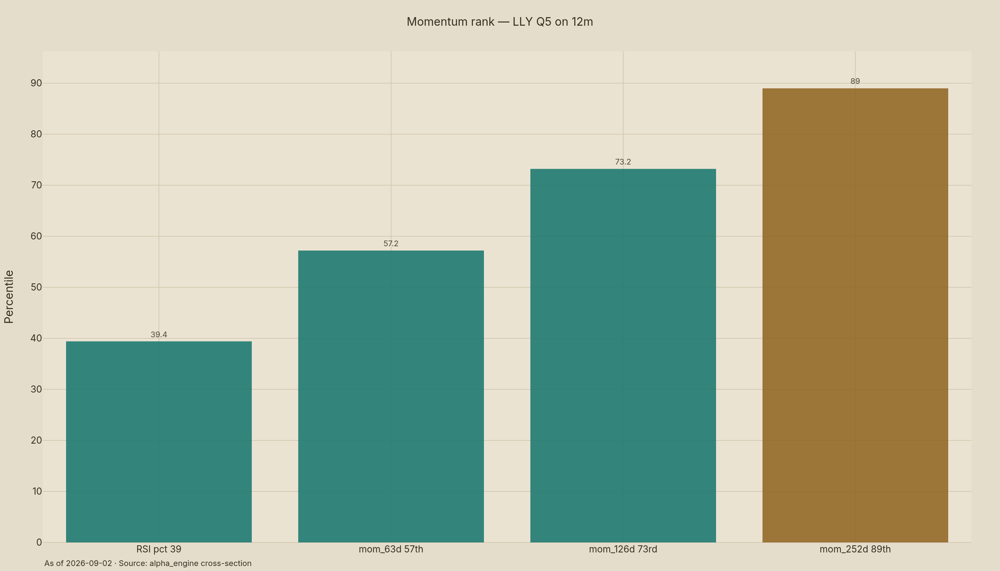{#fig-ex14 width=90%}
:::

::: {layout-ncol=2}
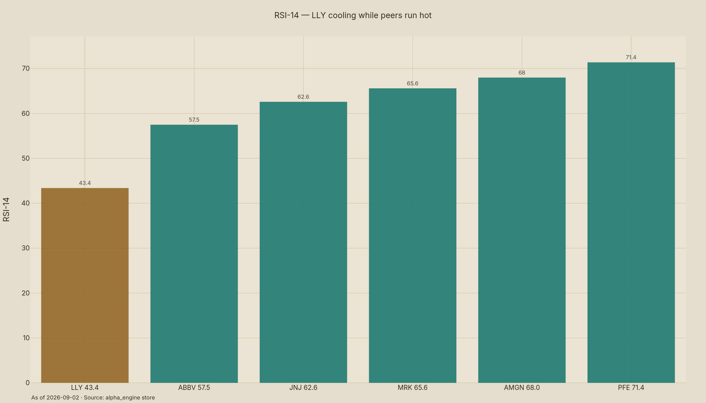{#fig-ex15 width=90%}

## 11 · Factor attribution — what the loadings imply

Long-horizon FF4 (1962–2026; factors to Jun-30, disclosed): MKT-RF β 0.77 (t≈62, +5.92pp), SMB −0.44, HML −0.19, MOM +0.05 (t≈3.2, +0.38pp); R² 0.26, resid vol 23.7%, alpha +11.77pp (t≈3.65). Read: $1M LLY ≈ $0.77M market exposure, but hedges leak — 86% of single-name variance is idiosyncratic (risk-model total 31.2%, specific 26.9%). ML composite (ridge, Jul-31, R² ~2–3%) ranks LLY mid-pack: ML composite (ridge, July-31 rebalance, in-sample R² only ~2–3% as typical for cross-sectional equity) ranks LLY mid-pack, neither top-15 (led by LITE/WDC/SNDK/CIEN/INTC) nor bottom-15 (HUM/AES/LIN lagging): stock-picking thesis, not factor thesis. Peers: all six +24–83% 12m (MRK +83% leads, LLY +58.6% second); LLY alone 10% off-high with top-set vol Momentum IC ≈ 0 long-run: quintiles descriptive, not predictive.

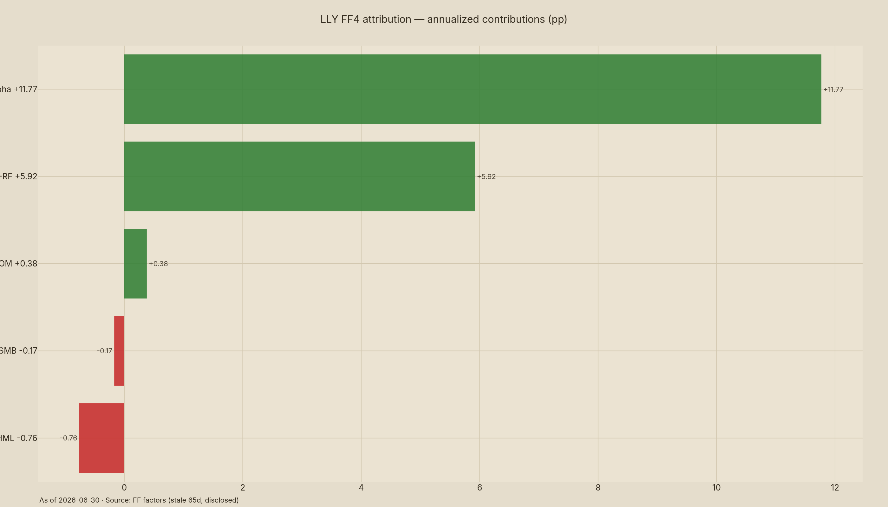{#fig-ex16 width=90%}
:::

::: {layout-ncol=2}
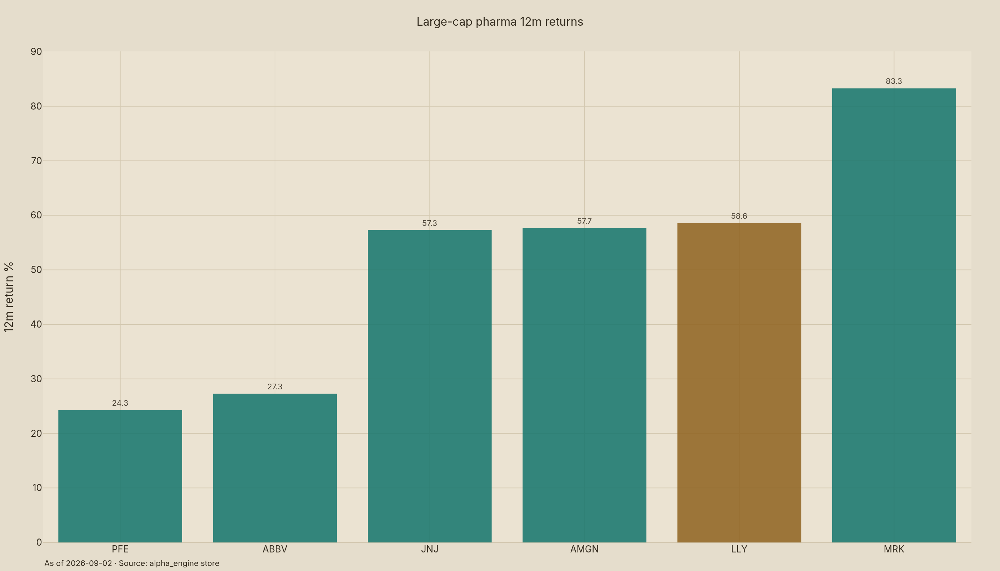{#fig-ex17 width=90%}

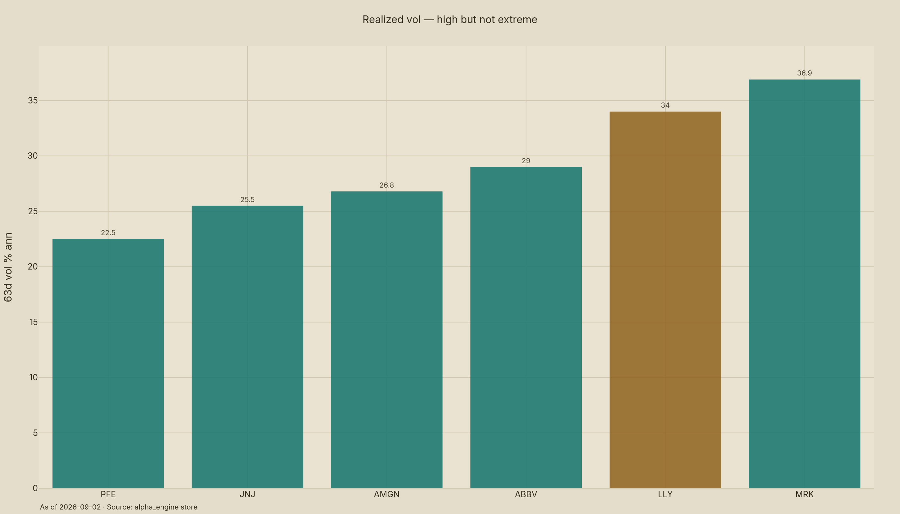{#fig-ex18 width=90%}
:::

## 12 · Bull versus bear — adjudicated

Bull's three survivors: (a) ~$92B annualized run-rate above an $85–87B guide funds beat-and-raise; (b) OUS +80% plus small-molecule oral scale = genuine second/third engines; (c) SURMOUNT-5's 6.5-pt gap + ~$30B capacity = 12-month share moat. Bear's three survivors: (a) ~30x leaves no miss room; skew −27% vs +25%; (b) 72%→60% coverage proves narrowing access, cash-pay selects affluence; (c) CagriSema Q4 + oral/amycretin + monthly MariTide bracket every flank. Adjudication: bull takes the base (revenue, filings, launches, capacity observed; kills contingent) — bear takes sizing (30% × −27% with gaps → ≤2% into events, 2–4% aggregate). Demotions: Verzenio/Kisunla cushion (no math), Demotions from the debate: the Verzenio/Kisunla diversification claim (demoted — no cushion math), LillyDirect-as-solution (partial offset — cash caps volume), capex-moat (conditional on fill-rate).

## 13 · Scenarios, risk dashboard, catalyst calendar

::: {.rf-showtable .rf-nums-right}
| Scenario | Target | Return | Prob | Drivers | Invalidation |
|:---------|-------:|-------:|-----:|:--------|:-------------|
| Bear | $850 | −27% | 30% | Oral miss, pricing clamp, 22–24x | Adherence beats, coverage stabilizes |
| Base | $1,320 | +14% | 45% | Incretin grind, oral OK, 28–30x | Guide cut, CagriSema leapfrog |
| Bull | $1,450 | +25% | 25% | Retatrutide, OUS blowout | Pipeline delays, share loss |
| EV | ~$1,215 | +5% | 100% | Prob-weighted | Size for bear, not mean |
:::

*Scenario table (QuantFlow risk-manager marks).* Binary rule: max weight = tolerable loss ÷ |bear return| — 50 bps ÷ 27% ≈ 1.85% per readout; 3–5% high-conviction cap (6% hard), 2–3% starter; $1,157/$1,147 tactical stop, $1,100 → ≤2%, $1,050 full review; $1,188/$1,200/$1,250 scale-adds on closes only. Liquidity institutional ($2.8B/day; 4% of $1B book ≈ 1.4% ADV, one-day exit at ≤20% participation). Beta 0.77, R² 0.26 — hedge market leg only.

::: {layout-ncol=2}
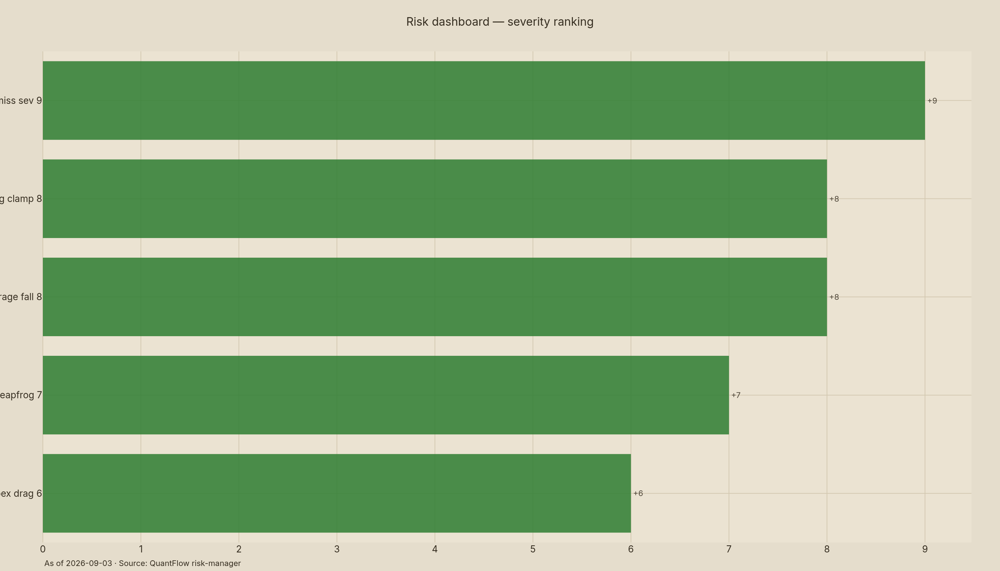{#fig-ex19 width=90%}

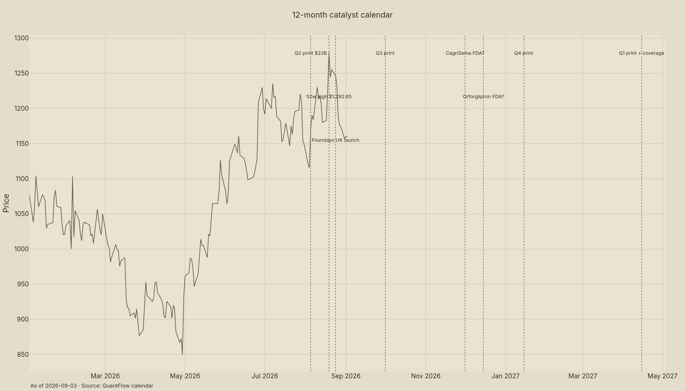{#fig-ex20 width=90%}
:::

## 14 · Recommendation and appendix

**Recommendation (research, not financial advice): OVERWEIGHT, 2–3% starter, adds $1,100–1,050; base $1,320 (+13.8%), bull $1,450 / bear $850, ≤2% through binaries.** Thesis-from-charts: mix (Ex. 2), bridges (3–4), OUS (7), efficacy (8), capex (9), valuation (10–11), levels (12), factors (16–18), risks/calendar (19–20). **Caveats:** FF 65d stale; NVO absent; ~30x/~40% press estimates, not guides — verify in 10-Q + Aug-5 release/transcript; TRx/persistence, Centessa $6.3B, orforglipron NDA date unconfirmed. **Invalidation (any two → HOLD at $1,050):** **Invalidation triggers (any two together demote to HOLD at the $1,050 review):** oral adherence failure + Novo oral gains; coverage falls further + LillyDirect stalls; CagriSema/MariTide/amycretin reprices efficacy; adverse Medicare action. **Appendix (subagent briefs):** quant Q5 12m (55/500), Q4 6m, Q2 RSI, +9.4% vs 200d, 34% vol, +11.77pp alpha, peers +24–83% [r8]; news 30+ dated bullets, $23B/+48%/$85–87B anchors [r9]; technical uptrend-consolidation, 4S/3R, buy-weakness [r10]; demand 15+ bullets, tight-balanced [r11]; bull $1,400–1,500 on FY27 $105–110B at 28–30x [r12]; bear $800–900 on 22–24x + haircuts [r13]; risk 3–5% cap, 1.85% binary rule, 25/45/30 EV ~$1,215 [r14]. Engine v0.5.0, 505 tickers, prices 2026-09-02; portfolio-light, QuantFlow branding.

## 15 · Street, positioning, expectations audit

Street is split stale-vs-live: snapshots ~$1,042 (18B/2H), March ~$1,221 (+35%, 25/30 buys), June tape ~$1,131 (~$1.07T cap), live post-print bulls $1,300 (JPMorgan, Bernstein, Cantor $1,165→$1,300). $1,300 already discounts guide + quarter; $1,042 lags — live expectation ≈ spot +12%, so $1,320 is meet-plus-small-beat, not heroics. so this report's $1,320 base is a meet-plus-small-beat call rather than a heroic revision. Positioning: crowded-long, not euphoric (Q5 12m, mid-pack short-term, only name 10% off-high, coldest RSI, calm VIX to Aug-27). Hurdle at ~30x: ~+25% FY27 revenue at ~40% margin = guide-plus-oral path. Edge: staged accumulation into binaries, not one directional bet.

## 16 · What would change our minds

Demotions (reversible): Verzenio/Kisunla — promote on two consecutive beats with share; LillyDirect — promote if cash-to-reimbursed conversion expands or coverage holds ≥60%; capex-moat — confirm on sustained strength-level fill + KwikPen conversion. Surviving bull rebuttals: PEG ~1.0–1.2 fair for duopoly; oral bar = access, not max efficacy; Novo catching up on manufacturing while Lilly files/launches; monthly dosing unproven at scale; OUS + cash-pay diversifies Medicare. Surviving bear rebuttals: peak-rate trap; guide assumes price + access persistence that coverage contradicts; promise ≠ persistence-adjusted revenue; LillyDirect admits coverage failure; unfilled capex = FCF anchor. Monitors: coverage bottoming (Ex. 6), efficacy ladder through CagriSema Q4 (Ex. 8), capex→fill (Ex. 9) Monitors: coverage bottoming (Ex. 6) is the first buy signal; the efficacy ladder holding through CagriSema Q4 (Ex. 8) is the second; capex converting to fill (Ex. 9) is the third — two of three plus $1,050 holding keeps the overweight; two failing forces review.

## 17 · Cross-checks, sensitivities, print checklist

Three checks on $1,320: (1) run-rate ~$92B > $85–87B guide — bar is the guide, two volume-led prints clear it; (2) ~40% on $105–110B ≈ $42–44B earnings — bull needs the revenue number, not multiple expansion (OUS + oral address it); (3) mid-pack ML rank, Q2 RSI, 10% off-high — no crowdedness forcing timing; wait for $1,100–1,050. Sensitivities: 1 multiple turn on ~$44B ≈ $45–50/share; Sensitivities for the reader's own model: every 1 turn of forward multiple on ~$44B earnings is roughly $45–50 per share of target; $5B FY27 revenue at 40%/29x ≈ $55–60; 5 pts employer coverage ≈ one quarter of US volume growth. Year-end checklist: The print checklist into year-end is therefore mechanical: Q3 mix (volume vs price), orforglipron scripts/refills, CagriSema vs 22.7%, KwikPen conversion by geography, capex-guide revision.

## 18 · One-page operating memo — levels, sizes, dates

Starter 2–3% at $1,160 tape, add toward $1,100, full review at $1,050, scale on closes above $1,200, never chase $1,250; cap 6%, healthcare 25%, binaries 2% each; October Q3, Q4 dual FDA decisions, H1 ATTAIN reads, January and April prints.
