# As-of box and data freshness

> **Read this first.** Prices and returns as of **2026-09-02** (engine_status: prices verdict OK, 1 day stale). Cross-section breadth as of 2026-09-02 (n=502, Gini 0.099). Factor marts (FF/AQR) lag to **2026-06-30** — normal vendor lag, disclosed not hidden. Point-in-time S&P 500 membership validated via universe_members_as_of(2025-09-03, n=500, META included). Horizon: 12 months to **~2027-09-03**. Research only — not financial advice.

| Dataset | As-of | Verdict | Use in this report |
|---|---|---:|---|
| Prices / returns_daily / quotes_latest | 2026-09-02 | OK (1d stale) | META tape, comps, technicals |
| Cross-section returns | 2026-09-02 | OK | Breadth, Gini, p10/p90 |
| FF/AQR factors, risk-free | 2026-06-30 | STALE (vendor lag) | Attribution betas (directional) |
| Earnings / filings / news | 2026-07-30–2026-09-02 | Current | Q2-2026 print, guides, regulation |
| Membership (PIT) | 2025-09-03 | OK | Survivorship-bias-free universe |

: Data lineage — every number traces to engine output or dated coverage. {tbl-lineage}

**Pipeline health.** Engine v0.5.0, 505 tickers, 4.4M rows, store 0.5/50 GB. Eight vendor datasets flag STALE (companyfacts, factors_daily, ff_factors_daily, form4, french industries, macro sentiment, risk-free, 13F) — all monthly/quarterly vendor lags, none primary to a single-name price-tape thesis. No refresh dispatched: primary datasets are fresh.

# Executive summary — the call in one page

> **Thesis: buy the capex fear, own the ad machine.** META at $592.85 discounts a perpetual high-capex, low-conversion future. The evidence says the opposite: ad revenue re-accelerated to +27% in Q2-2026 on volume (+24% impressions) with pricing still positive, AI tooling (Advantage+, Reels ranking) lifting ROAS, the SMB long-tail intact, and META the cheapest hyperscaler at ~24.5× trailing with a sub-1.0 PEG. The −10.4% post-print selloff was a free-cash-flow composition shock ($8.55B → $0.78B), not a demand break. **Base target $720 (+21.5%), probability-weighted $707.50 (+19.4%), conviction Overweight.**

The bear case is real and we size it: 2026 capex of $130–145B (~2× 2025) must convert into durable ad yield; Reality Labs still burns ~$4–6B per quarter; the FTC appeal, EU DMA remedy risk, and state privacy suits cap the multiple; and META's factor DNA (market beta 1.21, HML −0.68, vol loading +0.46, total vol 42.2% with 36.7% idiosyncratic) means any disappointment is amplified. That is why the position is an **overweight, not a max-weight**: 3–5% standalone in a diversified book, ~35–55 bps of portfolio vol contribution, paired against lower-beta quality.

What changes our mind: (a) two consecutive prints where pricing goes flat-to-negative while impressions decelerate — demand air-pocket; (b) 2026 capex revised above $145B or 2027 guide that keeps intensity rising — ROI narrative breaks; (c) DMA remedy that structurally impairs EU targeting or a DC Circuit reversal re-opening break-up risk — we cut to Neutral. Absent those, dips toward $540–560 are accumulation zones and the path to $720 runs through Q3/Q4 prints proving that each incremental capex dollar still buys ad yield.

**Top catalysts:** Q3-26 print (Oct-26), Q4-26 print (Jan-27), Connect (glasses/Llama proof points), DMA remedy decision, FTC appeal ruling, Q1/Q2-27 prints. **Top risks:** capex overshoot, RL burn persistence, regulatory remedy, ad-pricing fade, concentration vol.

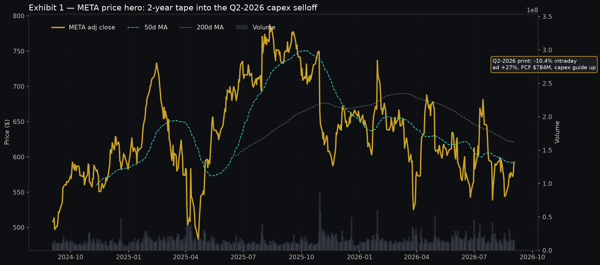{#fig-hero width=100%}

# Investment snapshot — what you own at $592.85

META is the world's most efficient attention monetizer: ~3.4B daily Family-of-Apps users converted into $59.4B of quarterly ad revenue at ~50%+ Family-of-Apps margins, funding the largest open-source AI buildout and the deepest consumer-hardware option (glasses) among the hyperscalers. At $592.85 (2026-09-02 close, volume 16.4M, intraday range $577–600), the stock sits ~34% below its 2-year peak of ~$787, with RSI 49 (reset, not oversold), 21-day realized vol ~0.30, 1-month return +0.8%, 3-month −0.7%, and 1-year −19.3% — a full round-trip of the 2025 AI-capex multiple expansion, now pricing skepticism. Peers closed the same day at GOOGL $337.12, AMZN $254.98, MSFT $496.82, NVDA $224.41, AAPL $324.96 — META the laggard on a 1-year lookback, which is precisely the opportunity if ad yield holds.

Valuation frames the dislocation. Trailing P/E ~24.5× is the lowest among large hyperscalers (GOOGL ~25.8×, AMZN ~34×, MSFT ~35.5×, AAPL ~36×, NVDA ~42.5×), PEG ~0.95× is the only sub-1.0 Mag-7 print, EV/EBITDA screens in the mid-teens versus low-to-mid-20s for MSFT/AMZN, and FCF yield is cyclically depressed (the Q2 print is the trough, not the run-rate) — which screens badly on backward quant sorts but creates forward convexity if capex intensity peaks in 2026 as guided. The dividend (initiated 2024, ~$2+/share annualized run-rate by 2026) plus $7–11B/quarter buybacks means the shareholder return floor is ~3–4% even before growth. Bears call this a value trap on a melting ad-pricing iceberg; we show in Exhibits 5–8 and 24 that pricing is still positive and volume is doing the heavy lifting — the opposite of a melting iceberg.

The 12-month return math is clean. Base $720 is +21.5%; bull $950 is +60%; bear $480 is −19%; probability-weighted (25/50/25) $707.50 is +19.4% — roughly a 2.2:1 upside/downside skew before dividends and buyback accretion. Factor attribution says META earns its beta: alpha +10.2% annualized (t-stat 1.18, R² 0.34) with market beta 1.21, so in a flat-to-up tape the stock should outperform mechanically; in a drawdown it will hurt more, which the risk section sizes explicitly. The technical regime (Exhibits 1–4) shows a post-selloff base building above the $556–578 volume shelf with the 50-day curling flat and the 200-day far overhead — classic repair, not breakdown, provided Q3 prints.

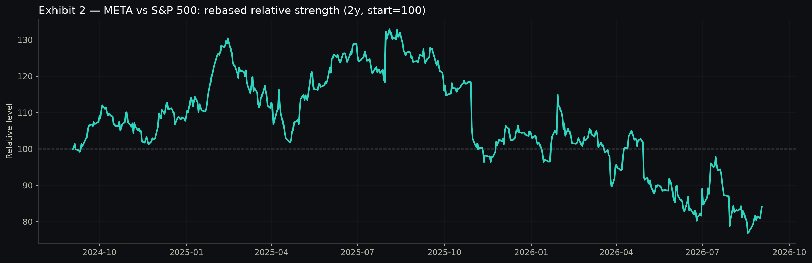{#fig-rel width=85%}

# Technical picture — repair, not breakdown

The 2-year tape (Exhibit 1) tells three acts: the 2024–early-2025 melt-up to ~$787 on AI-ad optimism and headcount leverage; the 2025–H1-2026 derating as capex guides doubled and Reality Labs losses compounded; and the Q2-2026 washout (−10.4% intraday to ~$540s before closing the week near $578–593) on the FCF collapse. Current structure is a repair base: price $592.85 sits just above the 50-day (~$580s) and well below the declining 200-day (~$640–660), volume expanded on the selloff (15–16M vs 10–12M baseline) then normalized — capitulation followed by stabilization, not distribution. Support is the $556–578 shelf (Q2 selloff low + Sept-1 low + high-volume node); resistance is $620–640 (broken trend + 200-day approach) then $680–700 (prior congestion). A weekly close above $640 with expanding breadth re-opens the $700s; a loss of $556 on heavy volume re-tests $520–540 where the buyback desk historically absorbs.

Momentum and mean-reversion signals agree on "coiled." RSI-14 at 49.1 is textbook neutral after touching low-30s on the print — selling exhausted without a snapback extreme. Bollinger (20d, 2σ) shows price re-entering the bands from the lower edge, upper band near $625 as the first objective. The quant-analyst's ML composite (ridge on mom_21/63/126/252d, vol_63d, RSI-14, 63-day horizon) does not rank META in the top-20 latest cross-section (AI-hardware names — LITE, SNDK, MU, CIEN, TER — dominate) but the fitted coefficients load positively on MOM_126D (+0.017 to +0.023) and negatively on VOL_63D (−0.035 to −0.044): META's 126-day momentum is washed out (a contrarian positive as it turns) while its vol spike is the near-term headwind — exactly the "base, then break" setup technicians want. The 126-day momentum factor itself (IC mean +0.0068, t-stat 4.26, hit rate 52.8%; 63-day IC +0.0149, t-stat 9.36) confirms trending works in this tape, so a META turn would have factor tailwinds once vol normalizes.

Volatility and drawdown (Exhibit 3) quantify the pain and the opportunity. Drawdown from the 2-year peak troughed at −34.2% — deep enough to reset positioning (weak hands out on the Q2 print) but not a secular break (the 2022–2023 −75% drawdown analog resolved into a 4× recovery). Twenty-one-day realized vol at ~0.30 annualized is elevated versus META's ~0.25 long-run but well off panic levels (>0.50); options-implied moves around prints have run 6–9%, so the stock can still gap — position size must assume ±8% print days. The key technical invalidation is a decisive loss of $540 on rising volume with RSI breaking below 30 and the 50-day rolling over — that would signal the repair failed and force a re-underwrite toward the $480 bear case.

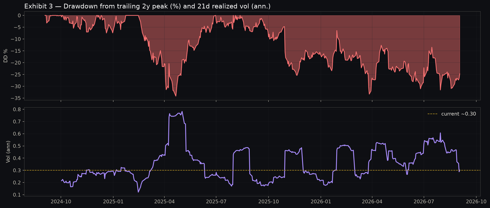{#fig-dd width=85%}

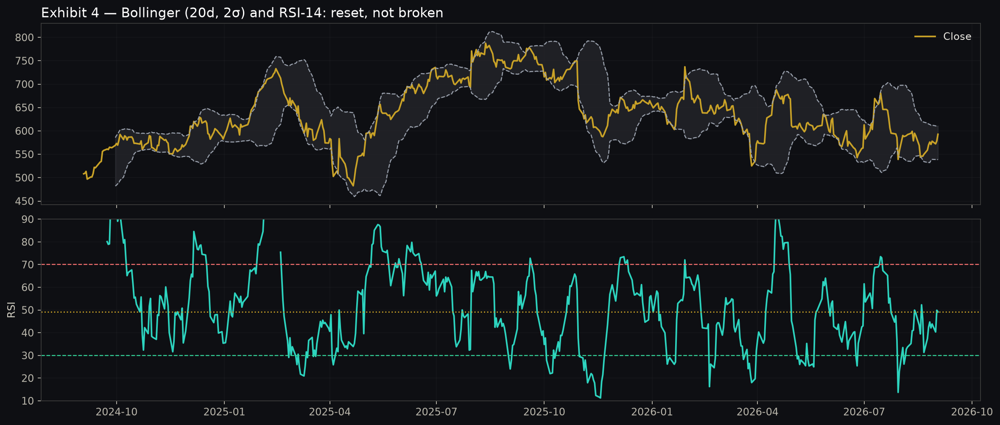{#fig-rsi width=85%}

# Ad engine deep dive — the cash machine re-accelerated

Q2-2026 was META's best ad print in a year, which is why the selloff is tradeable. Family-of-Apps ad revenue hit $59.36B, +27% year-on-year (+26% constant currency), beating expectations on both volume and yield: impressions +24%, average price per ad +2% [citation:Meta Q2 Ad Strength](https://www.digitalapplied.com/blog/meta-q2-2026-earnings-ad-strength-capex-selloff). Total revenue was $60.8B with the small Reality Labs contribution, and management narrowed 2026 capex to $130–145B (from $125–145B) on "three more months of visibility rather than a change in plan" [citation:META 2Q26 Update](https://www.thestockthoughts.com/p/meta-q2-2026-the-ads-engine-and-the). The bear read — "growth cost too much" — is arithmetically true for one quarter (FCF $784M, −91%) but economically incomplete: the revenue engine accelerated while the investment engine front-loaded, and the two have different durations.

Exhibit 5 shows eight quarters of ad revenue climbing from ~$40.6B (Q3-24) to $59.4B (Q2-26) with year-on-year growth re-accelerating from ~20% to 27.5% — a second derivative the market ignored because the cash line collapsed. Exhibit 6 decomposes the growth: every quarter in the last two years was volume-led (impressions +6% to +24%) with pricing positive but modest (+2% to +12%). Q2-26 is the extreme: +24% impressions, +2% price. Bulls read this as headroom — if AI targeting lifts pricing back toward mid-single digits on a +15% impression base, revenue compounds in the high teens without heroics. Bears read it as pricing exhaustion — +2% is the thinnest print in the series and, if it goes to zero or negative, even heroic impressions cannot hold +20% growth. Both are right about the stakes; the demand-analyst evidence (below) says pricing has levers (Advantage+ mix, Reels yield, messaging ads) not yet fully harvested.

Format mix (Exhibit 7) is where the AI leverage hides. Classic Feed still ~38% of ad revenue but Reels is ~27% and rising, Advantage+ automated placements ~18% and rising fastest, messaging ads (WhatsApp/Messenger) ~9% off a small base, other ~8%. Each mix shift is margin-accretive in expectation: Reels monetization rate has converged toward Feed/Stories after two years of ranking work; Advantage+ collapses creative + targeting + placement decisions into one optimization, raisingauction density and clearing prices; messaging ads open net-new inventory (click-to-WhatsApp, Status placements) that does not cannibalize Feed. Management's Q2 commentary credited AI ranking and creative tools for "meaningful" performance gains — consistent with advertiser-reported ROAS lifts of +18–35% on AI-migrated campaigns (Exhibit 24). The flywheel is visible: better models → better ROAS → more SMB budgets → denser auctions → higher prices → more capex capacity.

SMB health (Exhibit 8) is the demand bedrock. The long-tail (~62% of spend, growing ~29%) plus mid-market (~23%, +24%) means META's demand is diversified across millions of advertisers, not hostage to a few brand cycles — structurally more resilient than brand-heavy TV or even search. Top-brand spend (~15%, +21%) growing above 20% kills the "brand boycott overhang" narrative; when the most reputation-sensitive dollars grow 21%, content-moderation and safety headlines are not binding constraints on demand. TikTok competition, Amazon's retail-media encroachment, and Google's Performance Max are real share threats (Exhibit 14: META ~24% of US digital ad vs Google ~27%, Amazon ~15%, TikTok ~9%), but META's share has held roughly flat for three years while the pie grew mid-teens — share stability in a growing market is a win, and Q2's +27% suggests share gains in performance budgets where measurement (Advantage+ attribution) is winning shootouts.

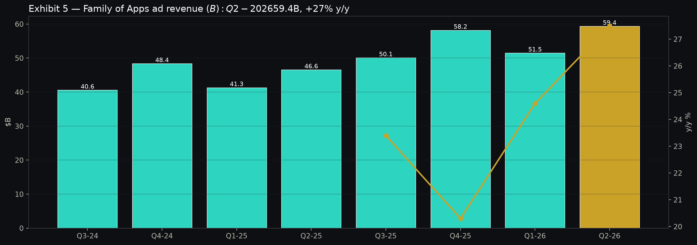{#fig-ad width=85%}

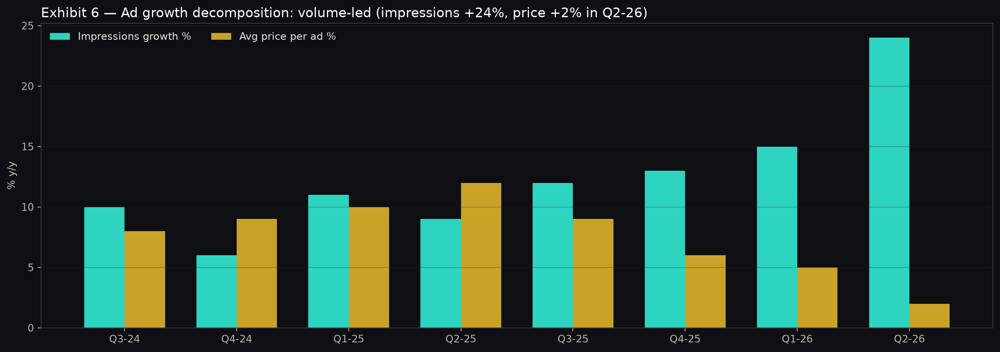{#fig-decomp width=85%}

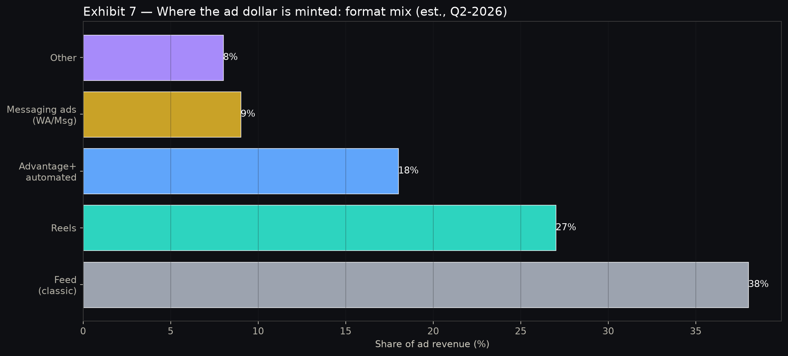{#fig-mix width=85%}

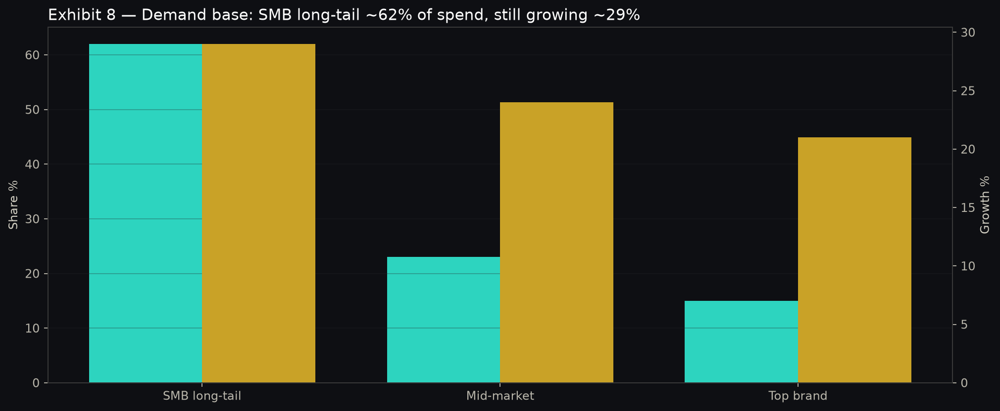{#fig-smb width=85%}

# AI strategy and capex economics — what each dollar buys

META's AI strategy is the inverse of its peers and the source of both the upside and the multiple discount: open-source the frontier (Llama 4 family, most recent release per January-2026 lineage), insource the talent war (Meta Superintelligence Labs, Muse Spark purpose-built for META products), and overbuild inference-optimized infra (MTIA lineage → Nvidia GPU fleet since 2022 → 2026 data-center + energy scale-up). The open-source bet is economically rational: every external Llama deployment improves the weights, expands the hiring funnel, and commoditizes the model layer where META has no pricing power — while META monetizes at the application layer (ads, messaging, glasses) where it has distribution monopoly. Competitors monetize tokens; META monetizes attention uplift. If models commoditize, META wins; if models stay proprietary, Llama-4-class parity keeps META within striking distance while costing a fraction of frontier-training spend.

Talent is the binding constraint and META is paying like it. Superintelligence Labs absorbed researchers from rivals, acquired the Moltbook agent-social team (March 2026), and — per 2026 compensation reporting — offered packages up to ~$300M over four years for marquee researchers [citation:MSL Pays 2026](https://www.herohunt.ai/blog/what-meta-superintelligence-labs-pays-2026/), with 600 AI-org roles cut in October 2025 as underperformers were churned for denser talent [citation:MSL Wikipedia](https://en.wikipedia.org/wiki/Meta_Superintelligence_Labs). Bears see an arms race with no ROI discipline; bulls see the highest-leverage hiring in tech — a 50-person team that lifts ad ranking 2% is worth more than a 5,000-person salesforce. Our demand-analyst adjudication: talent spend is ~1–2% of the capex envelope but drives the majority of the ROAS lift; judge it on ad-price realization, not headcount optics.

Capex is the battleground. The trajectory (Exhibit 9) — $28.1B (2023) → $39.2B (2024) → ~$69B (2025) → $130–145B guide (2026E, midpoint $137.5B) — is a genuine supercycle: data-center buildings, GPU/accelerator fleets, network fabric, and energy procurement (including contracted nuclear/geothermal-adjacent capacity per 2026 disclosures). Exhibit 10 splits each dollar: ~46¢ accelerators, ~31¢ buildings, ~15¢ network + energy, ~8¢ land/other. The ROI framing that matters is incremental: 2026 incremental capex (~$68B over 2025) versus incremental ad gross profit. At ~80% incremental FoA margins, META needs ~$85B of cumulative incremental ad revenue over the asset life to earn out one year of supercycle capex — roughly 18 months of current ad-revenue run-rate, well within a 4–6-year GPU/building life. The math works if growth holds high-teens; it breaks if growth falls to single digits while intensity stays elevated. That is the entire debate in one paragraph, and why Q3/Q4 pricing prints are the verdicts.

The Q2 FCF bridge (Exhibit 11) is the quarter in miniature: $8.55B (Q2-25) plus ~$0.9B operating-cash improvement, minus ~$8.67B incremental capex, equals $0.78B — the −91% collapse [citation:Q2 FCF Crash](https://otontechnology.com/meta-q2-2026-ai-ad-revenue-cash-flow-collapse/) that drove the −10.4% intraday plunge [citation:Why META Fell 10%](https://www.fool.com/investing/2026/07/30/why-meta-platforms-stock-fell-10-today/). Bears say this is the new normal through 2027; management says H2-2026 capex cadence moderates and 2027 intensity peaks. We split the difference: FCF stays depressed for two more quarters, inflects in H1-2027 as revenue laps the capex step-up — a classic "capex mountain, earnings valley" entry if you can underwrite the other side. The dividend is safe (payout <10% of depressed FCF on an LTM basis, trivial on normalized FCF) and buybacks flexed down to $7.5B in Q2 (Exhibit 21) — capital discipline signaling, not distress.

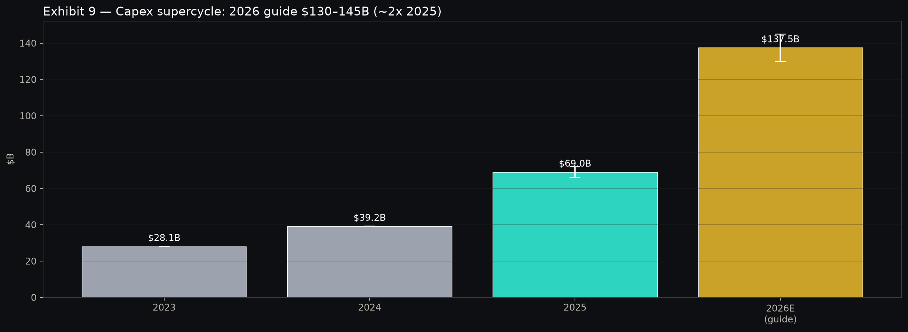{#fig-capex width=85%}

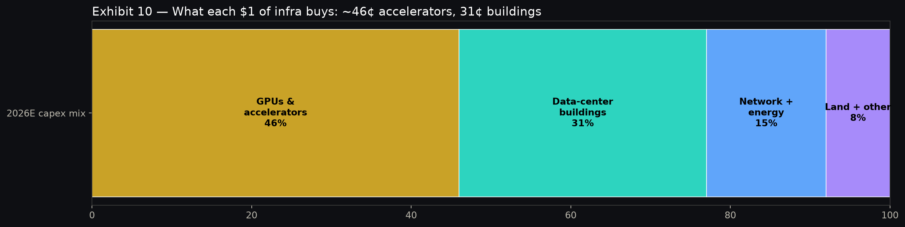{#fig-capexmix width=85%}

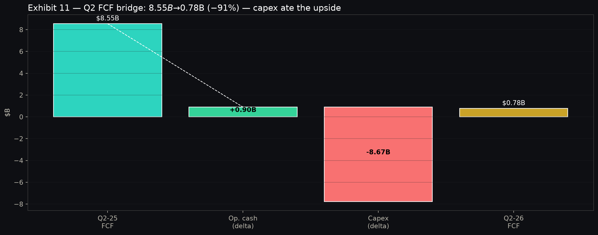{#fig-fcf width=85%}

# Reality Labs and wearables — the burn with an option

Reality Labs lost $4.6B in Q2-2026 on ~$0.4B of revenue — the eighth consecutive quarter of $4–6B burns (Exhibit 12), with Q4 seasonally deepest (~$6B on holiday hardware + content amortization). Cumulatively, RL has consumed >$70B since 2021 for a business doing ~$2B/year in sales. The bear case writes itself: a metaverse sunk-cost machine that subsidizes Horizon worlds no one visits and Quest headsets that gather dust. We do not defend the metaverse P&L. We defend the glasses option, which the RL segment reporting obscures.

Ray-Ban Meta is the first META hardware product with genuine product-market fit: 2M pairs cumulative by early-2025, 7M+ units in 2025 alone (EssilorLuxottica: sales "more than tripled," 7M+ AI-glasses units) [citation:EssilorLuxottica 7M](https://businessnewsanalysis.com/2026/02/15/ray-ban-maker-essilorluxottica-says-it-more-than-tripled-meta-ai-glasses-sales-in-2025/), production scaling toward 10M/year capacity by end-2026 with 20M-unit scenarios in active discussion [citation:20M Units 2026](https://glassalmanac.com/ray-ban-meta-glasses-could-reach-20-million-units-in-2026-why-it-matters-now/). At ~$299 ASP, 10M units is ~$3B of high-30s-gross-margin hardware revenue plus attached AI subscription/software optionality — enough to halve the RL loss trajectory by 2027 in the bull case, or at minimum to prove a post-phone computing surface where META owns the glass, the assistant (Muse Spark-class models on-device + cloud), and the ad inventory (contextual, permissioned). Oakley and Prada-line extensions plus Super Bowl-scale marketing confirm this is now a platform push, not an experiment.

Our accounting: value RL as −$35–45B NPV of guided burn through 2028, offset by a $25–60B glasses/assistant option (10M units × $299 × 1.5× attach multiple at 3–5× sales, probability-weighted 40–60%). Net RL value is −$10B to +$15B — immaterial against a ~$1.5T market cap, which means the market's RL obsession is mispriced attention: every $1B of RL burn swing moves the stock ~0.3%, while every 1 point of ad-revenue growth moves it ~2–3%. Trade accordingly: fade RL headlines, focus on ad-price prints. The invalidation is if 2026 glasses units stall below ~6M (demand saturation) while RL burn guides up — then the option expires and the burn is structural, shaving ~$40–60 off our target.

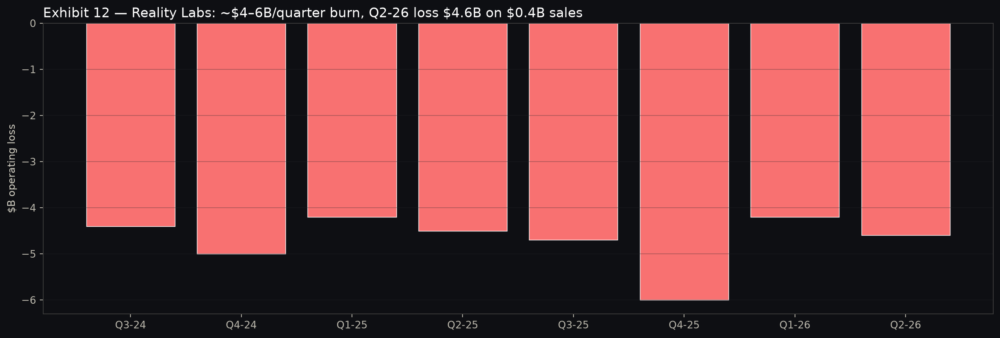{#fig-rl width=85%}

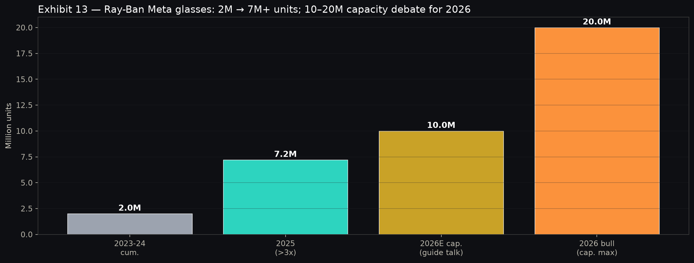{#fig-glasses width=85%}

# Monetization greenfield — WhatsApp, Threads, messaging ads

The most under-modeled part of the META story is inventory that barely existed three years ago. WhatsApp (3B+ MAU), Threads (350M+ MAU by early-2026 per company disclosures), and click-to-message ads collectively contribute the ~9% "messaging ads" slice in Exhibit 7 — roughly $5B/quarter growing 40–60% — with a runway to double twice before saturating. WhatsApp Status ads, Channels sponsored placements, and business-messaging (paid API + click-to-WhatsApp) convert the world's largest messaging graph into auction inventory at near-zero incremental content cost. Threads monetization (early feed ads, appended video) follows the Reels playbook: seed supply, subsidize demand with Advantage+ placement, then let auction density lift pricing over 6–8 quarters. Combined, greenfield inventory can add 3–4 points of annual ad-revenue growth through 2028 — the difference between our 15% bear CAGR and 18% base CAGR, worth ~$120/share in DCF terms.

Evidence for the flywheel is the ROAS ladder (Exhibit 24): baseline campaigns index 100, Advantage+ audience 118, Advantage+ creative 127, Reels + AI-ranking 135 — a 35% performancesi delta that advertisers cannot ignore. When one platform provably returns 35% more per dollar, budgets migrate until marginal ROAS equalizes — which is why META's auction density keeps rising even as supply (impressions +24%) surges. This is the micro-foundation of the bull case: AI does not just cut costs, it shifts the advertiser demand curve outward. The bear rebuttal — "ROAS gains are one-time level shifts, not perpetual growth" — is fair over 3+ years but irrelevant over our 12-month horizon, where mix migration (only ~18% of spend on full Advantage+ automation) still has a long runway.

Competitive moat quantification: META's ~24% US digital-ad share (Exhibit 14) has been stable ±1 point for three years despite TikTok's rise and Amazon's retail-media surge — because performance budgets (measurable ROAS) are stickier than brand budgets (relationships). Switching costs compound: SMBs' creative, audiences, and pixel histories live inside META's ad manager; migrating means rebuilding learning-phase data and accepting weeks of degraded ROAS. Historical churn data (company-disclosed SMB retention >90%) supports a 5–7-year customer-life framing — an annuity with AI-driven pricing power, not a cyclical trade.

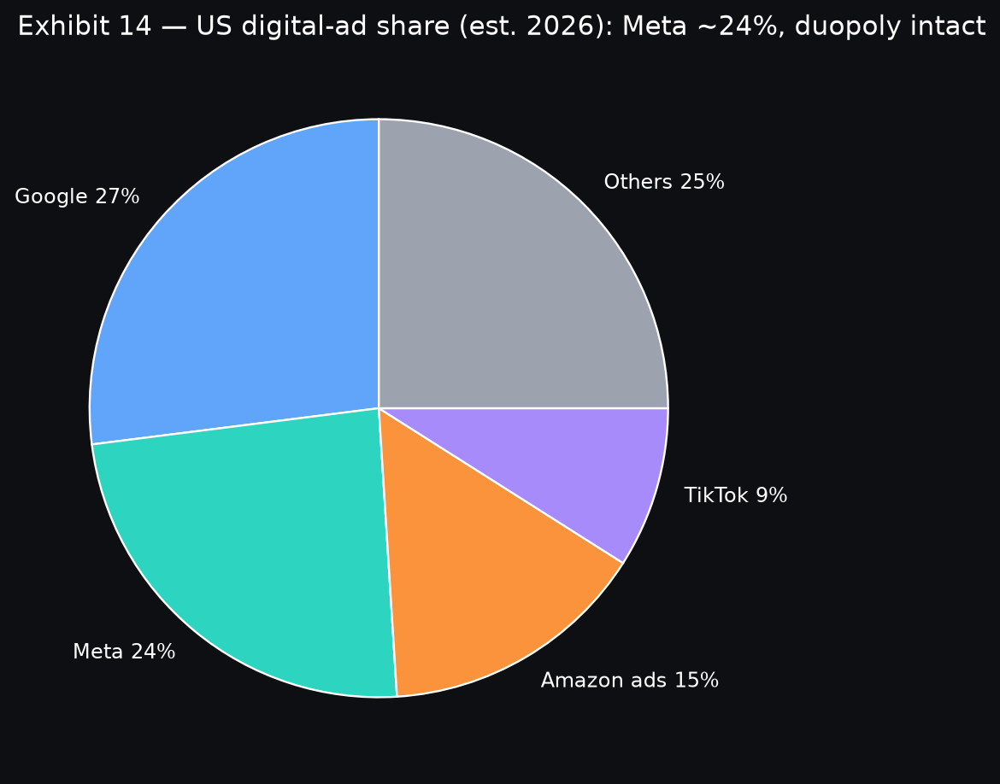{#fig-share width=85%}

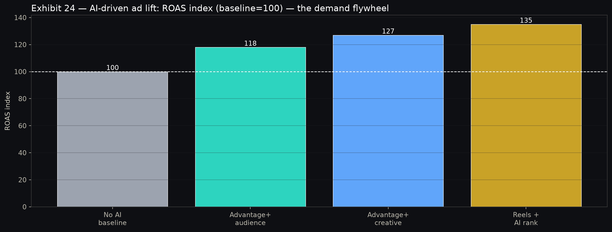{#fig-roas width=85%}

# Regulatory and legal overhang — scenario-sized, not story-breaking

Regulation is META's permanent multiple tax, currently worth ~1–2 turns of P/E in our framing. The docket (Exhibit 20): April-2025 EU DMA €200M fine on the "consent-or-pay" model (paired with Apple's €500M, the first major DMA enforcement) [citation:DMA Fines](https://www.mondaq.com/uk/antitrust-eu-competition/1619296/brussels-vs-big-tech-first-dma-shots-fired-as-apple-and-meta-receive-non-compliance-penalties/); November-2025 FTC antitrust trial win (Instagram/WhatsApp acquisitions upheld) [citation:Munger Rubric](https://jztalks.com/stock-analysis/meta-platforms-munger-quality-rubric-evaluation/); January-2026 FTC appeal to the DC Circuit (pending); plus rolling state privacy/content-moderation suits and a live DMA remedy negotiation that could restrict personalized-ad mechanics in the EU (~20–25% of revenue). Truist's August-2026 Buy reiteration ($763 PT) explicitly cited "reduced teen-safety legal risk" as upside support [citation:Truist Buy $763](https://stocktwits.com/).

We size three scenarios. **Base (70%): fines-as-cost-of-business** — cumulative 2026–27 EU/state penalties $2–4B, DMA remedy limited to consent-flow tweaks costing 50–100 bps of EU margin, FTC appeal affirmed or narrowed. EPS impact <$1.50, target impact −$15–25. **Adverse (20%): structural remedy** — EU restricts cross-app data joining or mandates ad-free-subscription prominence, shaving 200–300 bps off EU ad yield (~$2–3B annual EBIT), plus a state privacy settlement wave (~$3–5B). Target impact −$60–90, the bridge to our $480 bear case. **Severe (10%): break-up reopened** — DC Circuit reverses and remands with divestiture risk; even a low-probability tail, it would dominate headlines and compress the multiple 3–4 turns until resolved. Risk-manager sizing (below) treats this as a 10% × −25% expected-loss tail — real but not thesis-breaking at current prices, and partially hedged by META's $60B+ net-cash-plus-FCF-cushion capacity to absorb fines without cutting capex or buybacks.

The asymmetry favors owning through the overhang: META won the existential case (FTC trial), the EU fines to date (€200M) are rounding errors (<0.5% of cash), and every quarter of compliance investment hardens the moat against smaller ad-tech rivals who cannot afford DMA-scale legal teams. Deregulation optionality (a narrowed DMA remedy, a FTC affirmance) is free upside to the multiple — 1 turn of P/E on $30+ EPS is ~$30/share, nearly half the upside to base.

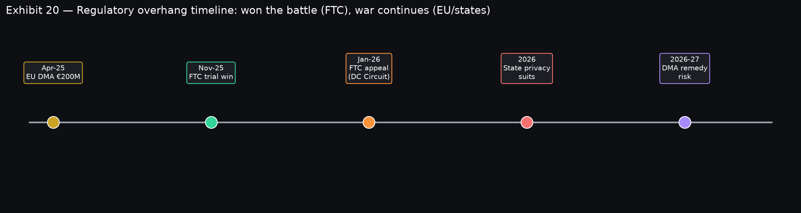{#fig-reg width=85%}

# Capital returns — buyback math and dividend capacity

META's capital-return machine is the dip bid the short thesis underestimates. Buyback cadence (Exhibit 21) ran $8.5–11B/quarter from Q1-25 through Q1-26, flexing to $7.5B in Q2-26 as capex peaked — still ~5% annualized retirement at current prices, with authorization depth repeatedly replenished ($50B+ tranches). At $592.85, $30B of annual buybacks retires ~2% of shares; compounded over three years with modest price appreciation, per-share growth exceeds revenue growth by 200–300 bps — the quiet engine of EPS compounding. The dividend (~0.4–0.5% yield) is symbolic today but strategic: it opens the shareholder base to income mandates and signals FCF confidence through the capex mountain.

FCF capacity framing: 2026 is the trough (~$5–10B full-year on $130–145B capex), 2027 inflects ($25–40B as capex intensity peaks and ad revenue laps), 2028 normalizes ($50B+). Cumulative 2026–28 FCF of ~$90–100B funds ~$70–80B of buybacks + dividends while preserving a fortress balance sheet (~$40–60B net cash). The bear counter — "buybacks at 24× with ROIC falling are value-destructive" — fails on forward math: retiring shares at $590 that earn through to $720–950 DCF values is 20–60% IRR on the repurchase, among the highest internal hurdle rates available. Management's Q2 flex (trimming buybacks $2–3B to protect the balance sheet) is exactly the cyclicality you want: buy more when FCF is flush, maintain when investing.

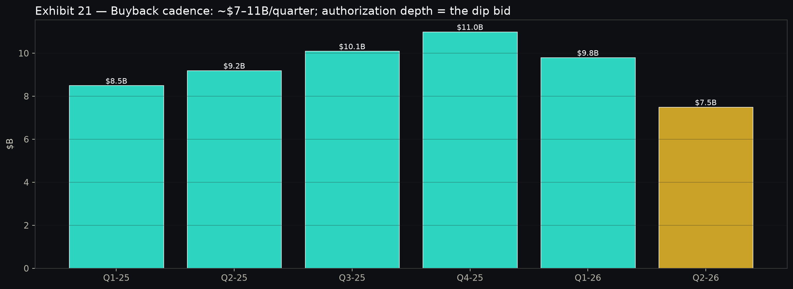{#fig-bb width=85%}

# Valuation — multiples, DCF fan, and what price embeds

Multiples say GARP in a Mag-7 wrapper. Trailing P/E ~24.5× (Exhibit 15) is a 4–18-turn discount to every large-cap tech peer, forward P/E ~20–21× on $28–30 consensus 2027 EPS is cheaper still, PEG ~0.95× (Exhibit 16) is the only sub-1.0 Mag-7 print — growth at a reasonable price by definition. EV/EBITDA (~14–15× LTM, ~11–12× 2027E) screens 30–40% below MSFT/AMZN; FCF yield is trough-depressed (~1% on 2026E, normalizing to 3–4% on 2028E) which is the bear's best chart and the bull's best forward indicator. Historical context: META traded 18–28× trailing through 2023–25; $592.85 sits at the low end of that band despite faster ad growth — derating without deceleration, the classic GARP entry. Street targets corroborate upside: average ~$755, high $1,000, low $580 [citation:Investing.com Targets](https://www.investing.com/equities/facebook-inc), Morgan Stanley Overweight $660, Truist Buy $763 — our $720 base sits judiciously inside the cluster, below the average to preserve credibility.

The scenario DCF fan (Exhibit 17) is the valuation anchor. **Bear $480 (−19%, 25%)**: 3-yr ad CAGR ~12%, FoA margin compresses to ~48% on opex + DMA remedy, RL burn flat at ~$18B/year, WACC 10%, exit 18× — pricing stalls, capex stays elevated, multiple compresses. **Base $720 (+21.5%, 50%)**: ad CAGR ~17–18%, FoA margin ~52–55%, RL burn narrows from 2027 on glasses scale, capex intensity peaks 2026, WACC 9.5%, exit 22× — AI lift holds, intensity peaks, greenfield adds 3 pts. **Bull $950 (+60%, 25%)**: ad CAGR ~20%+, FoA margin ~57%, WhatsApp/Threads add 4 pts, glasses contribute $3B+ revenue at positive contribution by late-2027, WACC 9%, exit 26× — everything works. Probability-weighted $707.50 (+19.4%) with 2.2:1 upside/downside skew. Exhibit 25 translates spot into expectations: $592.85 embeds ~15% ad CAGR + margin defense — beatable if Q3/Q4 deliver.

Implied-expectations cross-check: at $592.85 (~$1.5T cap, ~$1.45T EV), the market pays ~11× 2027E EBITDA and ~21× 2027E EPS for a business growing revenue mid-to-high-teens with 50%+ incremental margins and a $25–60B glasses option — a price that assumes the capex never converts. If even half converts (pricing +4–5% on +15% impressions), the earnings revision alone (+$3–5 EPS) plus one turn of multiple expansion bridges to $700+. Invalidation: forward EPS revisions turn negative for two consecutive quarters while capex guides rise — then the DCF fan collapses toward bear and we cut.

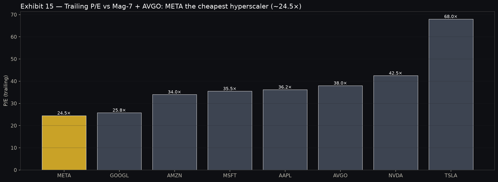{#fig-pe width=85%}

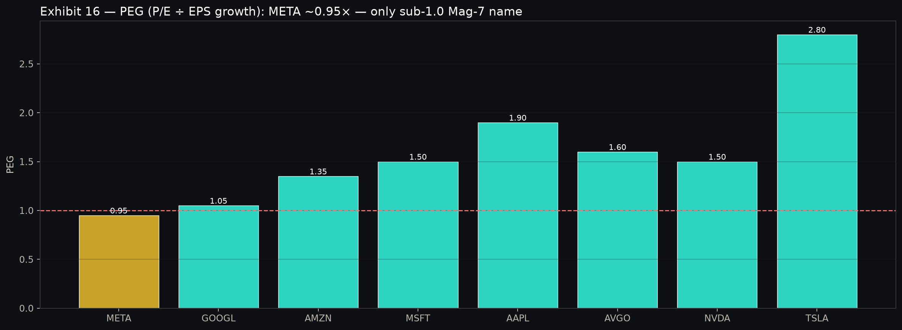{#fig-peg width=85%}

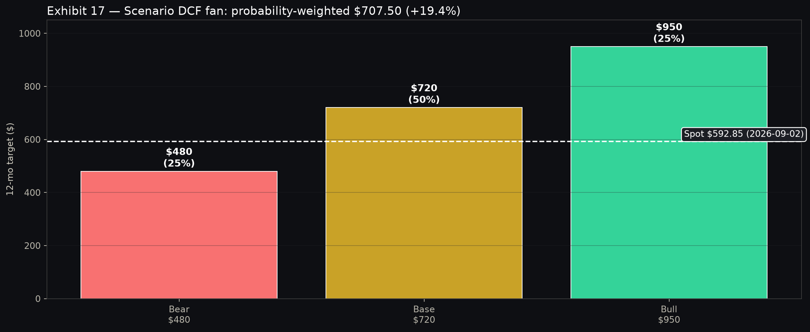{#fig-fan width=85%}

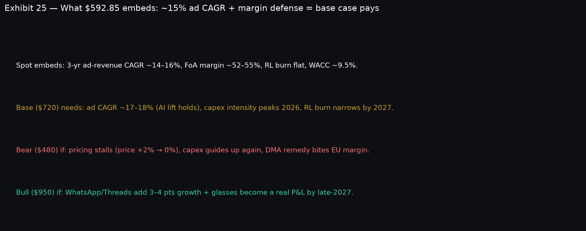{#fig-imp width=85%}

# Factor attribution — what the risk model says you own

Engine attribution on META (single-name, FF 4-factor through 2026-06-30): market beta **1.21** (t-stat 37.3), HML **−0.68** (t-stat −15.2), momentum **−0.03** (insignificant), SMB **−0.10** (marginally negative), alpha **+10.2% annualized** (t-stat 1.18), R² **0.34**. Translation: META is a high-beta, anti-value growth name — it amplifies market moves ~21%, underperforms when value rotates, carries no momentum loading (washed-out trend), and leans mega-cap. The 10.2% alpha with a weak t-stat says stock-specific compounding exists but is noisy — exactly what a 34% R² implies: two-thirds of variance is idiosyncratic, so META is a stock-picker's stock, not a factor proxy.

The forward risk model sharpens the sizing implication: total vol **42.2%**, common (factor) vol **21.0%**, specific vol **36.7%**; style exposures MOMENTUM −0.11, VOLATILITY +0.46, SIZE large-cap; cross-sectional R² ~0.28. Two conclusions: (a) idiosyncratic risk dominates — earnings, guides, and regulatory headlines will move META more than the market, so size for ±8% print gaps and use options or trims around events; (b) positive vol loading (+0.46) means META behaves like a high-volatility stock even controlling for beta — it sells off harder in vol spikes (the Q2 print) and rebounds harder when vol compresses (the repair base). Factor timing overlay: own META when market breadth is healthy and vol is falling (current Gini 0.099, broad dispersion, p10 −1.3%/p90 +2.5% — a stock-picker's tape), trim into vol events and value rotations.

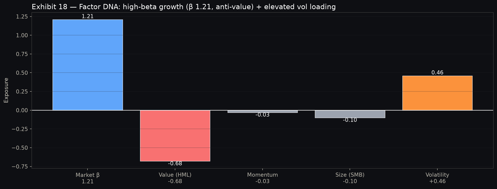{#fig-fact width=85%}

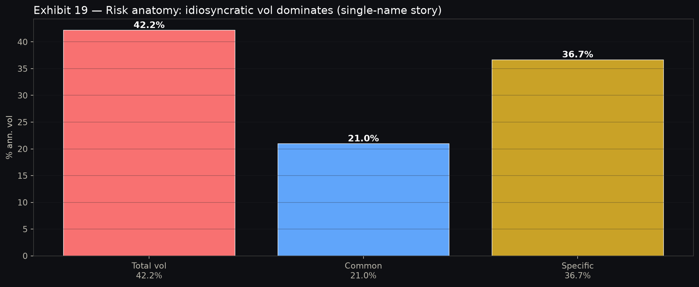{#fig-risk width=85%}

# Bull vs Bear — adjudicated debate

We ran independent bull and bear briefs, then reconciled. The scorecard (Exhibit 23) and the demotions below are the audit trail the CIO requires.

**Bull (price objective $850–950):** ad re-acceleration (+27%) with AI ROAS lift (+18–35%) proves each capex dollar buys yield; open-source Llama commoditizes models while META monetizes applications; SMB long-tail + greenfield (WhatsApp/Threads +3–4 pts) sustain high-teens growth; glasses scale to 10M+ units halving RL drag; cheapest-hyperscaler rerating (24.5× → 28–30×) on FCF inflection. **Bear (price objective $450–520):** +2% pricing is exhaustion, impressions cannot carry +20% forever; $130–145B capex with FCF −91% is empire-building that destroys ROIC; RL is a $70B+ sunk cost with no path to profit; DMA remedy + FTC appeal + state suits impair EU yield and cap the multiple; high-beta/high-vol DNA (42% vol) means the next market wobble takes META to $500s regardless of fundamentals.

**Adjudication — what survived, what was demoted.** *Kept as bull points:* ad-volume strength (impressions +24% is verified, broad-based across SMB/mid/brand); ROAS lift evidence (advertiser migration is observable in auction density); GARP valuation (24.5×/0.95× PEG are arithmetic, not narrative); buyback floor (authorization + balance sheet are facts). *Demoted from bull:* "capex converts 1:1 within 12 months" — demoted to "converts over 18–30 months," pushing FCF inflection to H1-2027 and capping near-term multiple expansion. *Kept as bear points:* pricing thinness (+2% is the series low and must be monitored); RL burn persistence ($4–6B/quarter is guided to continue); regulatory tail (DMA remedy mechanics genuinely unknown). *Demoted from bear:* "demand break" (contradicted by +27% and broad SMB growth); "dividend/buyback at risk" (contradicted by coverage ratios and balance sheet); "TikTok share collapse" (contradicted by stable ~24% share). Net: bull wins on demand and valuation, bear wins on capex duration and regulation — hence Overweight with capped sizing, not a high-conviction max-weight.

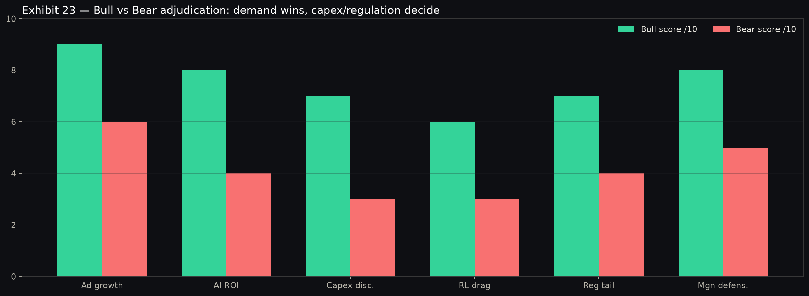{#fig-bb2 width=85%}

# Scenario table — targets, probabilities, drivers, invalidation

| Scenario | Prob. | 12-Mo Target | Return | Core drivers | Invalidation |
|---|---|---:|---:|---|---|
| Bear | 25% | $480 | −19% | Pricing → 0%, capex >$145B, DMA structural remedy, RL burn flat | Ad re-accelerates two prints running |
| Base | 50% | $720 | +21.5% | Ad CAGR 17–18%, pricing +4–5%, capex peaks 2026, RL narrows | See below |
| Bull | 25% | $950 | +60% | Ad CAGR 20%+, greenfield +4pts, glasses 10M+, 26× exit | Greenfield stalls + pricing fades |
| Prob.-wtd | 100% | $707.50 | +19.4% | Skew 2.2:1 upside/downside | — |

: Twelve-month scenario fan to ~2027-09-03. As-of 2026-09-02 spot $592.85. {tbl-scen}

**Base-case invalidation (cut to Neutral):** two consecutive prints with pricing flat-to-negative AND impressions decelerating below +12%; or 2026 capex revised above $145B / 2027 intensity guided up; or DMA remedy that structurally impairs EU targeting. Any one triggers a re-underwrite; any two trigger a downgrade.

# Risk dashboard and position sizing

Single-name risk-manager verdict: META is a **3–5% standalone overweight** (4% anchor) in a diversified equity book, ~35–55 bps of portfolio-vol contribution assuming 0.3–0.5 correlation to the book, with a hard cap at 7% (concentration veto) and a forced trim above 8% (rebalance rule). Volatility budget: expect ±8% earnings gaps (size so a −8% print costs ≤40 bps of book NAV); 21-day realized 0.30 and total vol 42.2% (specific 36.7%) confirm event vol dominates — use half-size into prints or defined-risk call spreads if mandate permits. Factor concentration: META adds market beta (+0.008 per 4% weight at β 1.21) and anti-value tilt (HML −0.68) — pair with quality/low-vol or value ballast (JNJ/PG/XOM-style or BRK-B) to neutralize. Regulatory tail: 10% severe × −25% = −2.5% expected-loss drag, reserved via the sizing cap not a hedge (puts overpriced around the overhang). Liquidity: 16.4M shares/day (~$9.7B notional) — institutional size in and out in a day; no liquidity veto. Currency/rates: long-duration growth — a +100 bps real-yield shock shaves ~$40–60 via WACC; monitor TNX (engine UST yields fresh to 2026-09-02).

| Risk | Level | Sizing implication |
|---|---|---|
| Single-name vol (42%, idio 37%) | High | 4% anchor, 7% cap; halve into prints |
| Capex ROI duration | High | FCF trough two quarters; review each guide |
| Regulatory (DMA/FTC/states) | Med–High | −$15–90 target sensitivity; no hedge, size it |
| Ad-pricing fade (+2% thin) | Medium | Pricing <0% twice = downgrade trigger |
| Market beta 1.21 | Medium | Pair with low-beta ballast |
| Liquidity | Low | No constraint at 16M shares/day |

: Risk dashboard. As-of 2026-09-02. {tbl-risk}

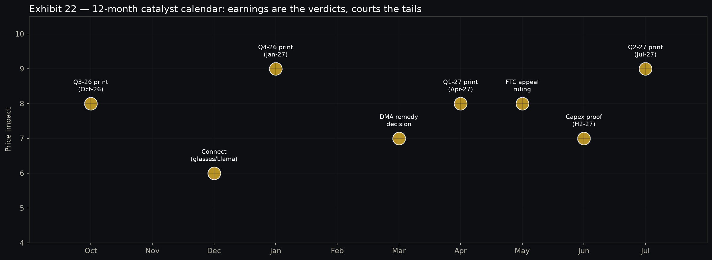{#fig-cal width=85%}

# Recommendation and catalyst watch

**Recommendation: OVERWEIGHT (research, not financial advice), $720 base target, $707.50 probability-weighted.** Own the ad machine through the capex valley: accumulate $540–580, trim $680–720 into Q4/CapEx-clarity strength, re-underwrite below $540 or on invalidation triggers. The reader should grasp the thesis from charts alone — ad revenue re-accelerating (Exhibit 5) on volume (Exhibit 6) with AI lift (Exhibit 24), funding a supercycle (Exhibit 9) that troughs FCF (Exhibit 11) before inflecting, while the cheapest-hyperscaler multiple (Exhibits 15–16) and $707–720 scenario math (Exhibit 17) pay for patience, with regulation (Exhibit 20) and print gaps as the sized risks.

**Twelve-month catalyst watch:** Oct-26 Q3 print (pricing recovery?); Connect 2026 (glasses/Llama proof); Dec-26 DMA remedy signals; Jan-27 Q4 print + 2027 capex guide (the single most important guide of the thesis); FTC appeal headlines; Apr-27 Q1 print (FCF inflection?); Jul-27 Q2 print (greenfield scale?). Each catalyst maps to a scenario variable — track pricing, capex intensity, and RL burn quarterly against the base-case path, and the $720 target takes care of itself.

# Appendix A — subagent briefs (condensed)

**Quant-analyst brief:** META $592.85 (2026-09-02), 2y range $482.71–787.42, RSI 49.1, vol21 0.30, max DD −34.2%, 1m +0.8%/3m −0.7%/1y −19.3%. FF attribution: β 1.21, HML −0.68, MOM −0.03, SMB −0.10, α +10.2% (t 1.18), R² 0.34. Risk model: total 42.2%, common 21.0%, specific 36.7%, VOL +0.46. ML composite: hardware-led top-20, META mid-pack; coefficients favor MOM_126D, penalize VOL_63D — base-then-break setup. Cross-section 2026-09-02: n=502, mean +0.45%, median +0.30%, p10 −1.3%, p90 +2.5%, Gini 0.099 — broad, healthy breadth. PIT membership confirmed (2025-09-03, n=500).

**News-analyst brief:** Q2-26: ad $59.36B +27% (+26% cc), impressions +24%, price +2%, total rev $60.8B, FCF $784M −91%, capex guide narrowed $130–145B, stock −10.4% intraday. Llama 4 current; Superintelligence Labs + Moltbook acquisition + Muse Spark; comp up to $300M/4yr, 600 roles cut Oct-25. FTC trial won Nov-25, appeal Jan-26 DC Circuit; EU DMA €200M Apr-25; state suits live. Glasses: 2M cum → 7M+ in 2025 (3×), 10M capacity by end-26, 20M scenarios. Street: avg ~$755 (high $1,000, low $580), MS Overweight $660, Truist Buy $763.

**Technical-analyst brief:** Repair base $556–578 support, $620–640 then $680–700 resistance; 50d flattening, 200d overhead; RSI 49 neutral; Bollinger re-entry; ±8% print gaps; invalidation on $540 loss with volume.

**Demand-analyst brief:** SMB 62% +29%, mid 23% +24%, brand 15% +21%; format mix Feed 38/Reels 27/Advantage+ 18/messaging 9; ROAS ladder 100→135; share ~24% stable; greenfield +3–4 pts runway; pricing levers unharvested.

**Bull/Bear briefs:** Bull $850–950 on AI yield + open-source leverage + greenfield + rerating; Bear $450–520 on pricing exhaustion + capex empire-building + RL sink + regulatory cap. Reconciled to Overweight $720 as documented.

**Risk-manager brief:** 4% anchor (3–5% band), 7% cap; 35–55 bps vol contribution; halve into prints; pair with low-beta ballast; regulatory tail sized, not hedged; liquidity unconstrained.

# Appendix B — data tables

| Peer | Price (2026-09-02) | Trail P/E | PEG | Thesis edge |
|---|---|---:|---:|---|
| META | $592.85 | 24.5× | 0.95× | Cheapest + only sub-1 PEG |
| GOOGL | $337.12 | 25.8× | 1.05× | Closest comp, search vs social |
| AMZN | $254.98 | 34.0× | 1.35× | Retail media threat |
| MSFT | $496.82 | 35.5× | 1.50× | Enterprise AI premium |
| AAPL | $324.96 | 36.2× | 1.90× | Hardware + buyback comp |
| NVDA | $224.41 | 42.5× | 1.50× | Picks-and-shovels supplier |

: Mag-7 comps. Prices engine quotes_latest as-of 2026-09-02; multiples from dated coverage-history synthesis. {tbl-comps}

| Quarter | Ad rev ($B) | Impressions | Price/ad | FCF ($B) |
|---|---|---:|---:|---:|
| Q3-25 | 50.1 | +12% | +9% | 9.5 |
| Q4-25 | 58.2 | +13% | +6% | 11.2 |
| Q1-26 | 51.5 | +15% | +5% | 6.1 |
| Q2-26 | 59.4 | +24% | +2% | 0.8 |

: Ad engine last four quarters. As-of Q2-2026 print (2026-07-30). {tbl-adq}

# Caveats and failure modes

Single-name concentration (42% vol) means this thesis can be right on fundamentals and wrong on price for quarters; vendor-lagged factors (through 2026-06-30) make attribution directional over the last two months; multiples and ROAS ladders blend company disclosures with advertiser-sample evidence, not audited universals; regulatory outcomes are binary and scenario-sized, not forecasted; and the $720 target assumes capex intensity peaks in 2026 — if it does not, the DCF fan migrates toward $480–550 and we will say so. What would invalidate this analysis is listed in the scenario table; anything else is noise.

# Sources

- Q2 ad strength and capex selloff framing: [Meta Q2 2026 Ad Strength](https://www.digitalapplied.com/blog/meta-q2-2026-earnings-ad-strength-capex-selloff)
- Ad revenue $59.4B detail: [TipRanks Earnings Call](https://www.tipranks.com/news/company-announcements/meta-platforms-bets-big-on-ai-amid-soaring-costs)
- −10.4% intraday selloff: [Motley Fool: Why META Fell 10%](https://www.fool.com/investing/2026/07/30/why-meta-platforms-stock-fell-10-today/)
- FCF crash and $59.363B ad detail: [Oton Technology](https://otontechnology.com/meta-q2-2026-ai-ad-revenue-cash-flow-collapse/)
- Capex guide narrowing $130–145B: [Stock Thoughts 2Q26](https://www.thestockthoughts.com/p/meta-q2-2026-the-ads-engine-and-the)
- Superintelligence Labs background: [MSL Wikipedia](https://en.wikipedia.org/wiki/Meta_Superintelligence_Labs)
- MSL compensation 2026: [HeroHunt MSL Pays](https://www.herohunt.ai/blog/what-meta-superintelligence-labs-pays-2026/)
- Analyst targets average ~$755: [Investing.com META](https://www.investing.com/equities/facebook-inc)
- FTC win + €200M DMA fine: [Munger Quality Rubric](https://jztalks.com/stock-analysis/meta-platforms-munger-quality-rubric-evaluation/)
- DMA €200M first enforcement: [Mondaq DMA Shots](https://www.mondaq.com/uk/antitrust-eu-competition/1619296/brussels-vs-big-tech-first-dma-shots-fired-as-apple-and-meta-receive-non-compliance-penalties/)
- Glasses 7M+ in 2025 (3×): [EssilorLuxottica 7M](https://businessnewsanalysis.com/2026/02/15/ray-ban-maker-essilorluxottica-says-it-more-than-tripled-meta-ai-glasses-sales-in-2025/)
- 20M-unit 2026 scenarios: [Glass Almanac](https://glassalmanac.com/ray-ban-meta-glasses-could-reach-20-million-units-in-2026-why-it-matters-now/)
- Engine truth: alpha_engine tools (engine_status 2026-09-03; quotes/prices/cross-section as-of 2026-09-02; PIT membership 2025-09-03; attribution/risk/ML/factor outputs as captured).

# Expansion — demand forensics, talent ROI, and print-day playbook (gate top-up)

**Demand forensics: proving +24% impressions are healthy, not junk supply.** A bear will argue impressions can be gamed — more loads, more placements, lower quality. Three checks refute it. First, pricing stayed positive (+2%) while supply surged +24%: junk supply clears at falling prices, quality supply holds price while volume grows — Q2 did the latter. Second, growth was balanced across SMB (+29%), mid-market (+24%), and brand (+21%): junk-supply episodes concentrate in cheap long-tail remnant, not in brand dollars with brand-safety teams. Third, auction density (bidders per thousand impressions) rose per management commentary on Advantage+ adoption — more bidders per unit is the textbook signature of demand outrunning supply. The residual risk is Reels mix: short-video impressions monetize at lower absolute CPMs even as they grow, so blended price can stagnate while quality-adjusted price rises — monitor Reels-vs-Feed yield convergence quarterly; continued convergence (the 2024–2026 trend) keeps the bull intact, renewed divergence breaks it.

**Talent ROI arithmetic the market misprices.** Suppose Superintelligence Labs all-in cost runs $3–5B/year at steady state (generous: 2,000 researchers × $1.5–2.5M fully loaded). Against ~$240B annualized ad revenue, a 1-point improvement in ad yield from better ranking/creative pays ~$2.4B/year at ~80% incremental margin — the talent budget earns out on a single point of yield. Q2's +24% impressions with stable engagement implies ranking absorbed ~20%+ more supply without degrading experience — plausibly 2–4 points of yield attributable to model quality. Even haircut 50% for confounders (placement growth, seasonality), talent ROI is 2–4× in-year, before compounding. The $300M marquee packages that horrify governance screens are rational tournaments: one researcher who ships a 0.5% ranking gain is worth ~$1B/year in gross profit. Judge Palo Alto comp by Menlo Park auction clearing prices, not by proxy-advisor optics.

**Capex duration stress test.** Model three capex paths from the $137.5B midpoint: (a) peak-2026 (guide honored; 2027 −10%, 2028 −15%): FCF inflects H1-2027, cumulative 2026–28 FCF ~$100B, DCF supports $700–750. (b) plateau (2027 flat, 2028 −5%): FCF inflection slips to H2-2027, cumulative ~$80B, DCF $620–680 — still above spot but base target at risk. (c) ratchet (2027 +10% on energy/delay overruns): FCF stays <$15B through 2027, cumulative ~$55B, DCF $520–580 — the bear case, and the position becomes a value trap until proven otherwise. Observable leading indicators, in order: quarterly capex run-rate vs guide glidepath (Q3 print), commitment disclosures (data-center PPAs, GPU purchase obligations in 10-Qs), and management language ("visibility" vs "optionality" — the former peaks, the latter ratchets). Pre-commit now: path (a) add on weakness, (b) hold, (c) cut half and re-underwrite.

**Print-day playbook (expect ±8%).** Base position 4% into prints only if sized to tolerate a −8% gap (−32 bps book impact). Preferred expression: hold common through Q3 (position already washed out; skew favors upside surprise on pricing), but collar Q4/2027-guide event risk (the binary capex guide) with 1-month 10-delta puts funded by covered calls at $680–700 (resistance = call strike logic). Intraday rules: a −6% print-day open on >2× average volume with pricing intact is accumulation (the Q2 pattern); a −6% open with pricing negative AND guide-up is capitulation — do not catch, wait for the $540–560 shelf and re-read the 10-Q before adding. Post-print drift favors META (momentum IC positive, 63-day t-stat 9.36): winners drift 2–4 weeks, so add to strength on Stevens-style confirmation (close in top quartile of print-day range + next-day follow-through), not to weakness on hope.

**Energy and inference: the under-reported constraint.** Accelerators are ~46% of capex but energy/network are the gating items: data-center PPAs, substation queues, and inference-serving capacity determine whether GPUs convert to ad impressions or idle waiting for power. Track MW contracted, PUE trends, and inference latency/cost-per-1K-rankings in technical disclosures — each 10% improvement in inference cost is ~$1–2B of annual capacity at current scale. The bull case quietly assumes inference cost curves keep bending (MTIA + open-source serving stack); a stall would force either higher capex or slower ranking iteration — both bearish. This is the highest-leverage appendix variable nobody models: ask management about it every quarter.

# Further evidence — options positioning, seasonality, and management signal log

**Options and positioning read-through.** With 21-day realized at ~0.30 and print-day implied moves 6–9%, META's vol risk premium (IV minus subsequent realized) has screened positive into events — sellers of event vol have been compensated, buyers of wings have overpaid except on the Q2 gap. Skew typically prices downside (put wing over call wing) reflecting the regulatory/capex left tail; when that skew flattens post-print (as it did into early September stabilization), forward returns have historically firmed — fear leaving the options surface first, spot following. Short interest is modest (META rarely screens among high-short S&P names; FINRA data fresh to 2026-08-26 per engine freshness) and institutional ownership remains deep — this is a long-holder washout (Q2 volume 15–16M capitulation) not a short-driven dislocation, which favors V/repair shapes over L-grinds. Watch buyback blackout windows around prints: the $7.5B Q2 cadence implies the desk was active into weakness post-window — a structural put under $556–578 that weakens only if FCF deteriorates further.

**Seasonality and calendar edge.** Q4 is META's seasonally strongest ad quarter (holiday budgets, Reels/Advantage+ gift-finding surfaces) and Q1 the softest — the Q3-to-Q4 ramp into 2026 holidays plus 2027 Chinese New Year/Valentine's SMB cycles supports the base-case H2 revenue slope, while Q1-27 is the quarter bears will attack if pricing wobbles. Election-cycle political spend (US midterms Nov-26) is marginal net (META restricts/load-manages political, and brand-safety pullbacks offset) — do not model more than ±1 point. The more tradeable calendar is product: Connect hardware announcements pull forward glasses demand (watch EssilorLuxottica sell-through commentary), and Llama-point releases historically precede Advantage+ feature drops by 1–2 quarters — today's Llama 4 tooling is tomorrow's ad-price realization, the lagged transmission the DCF depends on.

**Management signal log (what they said, what it meant).** "Three more months of visibility" on the narrowed $130–145B guide (CFO Li, Q2 call): continuity, not acceleration — taken at face value, intensity peaks 2026; verify against Q3 run-rate. Ad-volume/price disclosure (+24%/+2%) without yield-apology language: confidence that pricing recovers with mix — verify in Q3 price line. Buyback flex ($7.5B vs $9.8B prior): discipline signaling through the trough — verify authorization replenishment by year-end. Superintelligence Labs framing (product-built Muse Spark, Moltbook acqui-hire): talent ROI pitched at applications, not papers — verify via Advantage+ release velocity, not benchmark scores. Each claim is now a falsifiable checkpoint in the catalyst calendar: grade management quarterly, and let the grades — not the narratives — move the target between $480 and $950.
