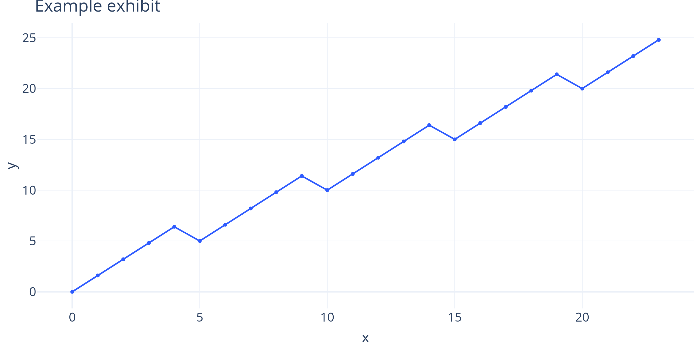

# Executive summary

Three to five sentences: what changed, why it matters, and what to do.
Modern research briefs lead with the number, not the narrative.

> **Bottom line.** One sentence a portfolio manager can repeat in a meeting.

# The signal

Build the case exhibit by exhibit. State the observation, then the
interpretation, then the implication.

{#fig-example width=90%}

As @fig-example shows, the trend supports the thesis.

::: {#fig-metric}
| Metric | Value | As-of |
|--------|------:|------|
| Example | 42 | 2026-08-26 |

Example exhibit caption.
:::

# What has changed

Regime context: the structural shift or catalyst that makes this actionable
now rather than six months ago.

# Portfolio actions

Concrete, sized, and bounded: what to add, cut, or hedge, and the expected
interaction with existing exposures.

# Risks and invalidation

1. Risk one, with its observable early-warning indicator.
2. The exact condition under which this thesis is abandoned.

# Method and data {.appendix}

Data sources, lookback windows, conventions, and reproducibility notes.

```{python}
# Writes the print-quality exhibit PNG referenced by @fig-example above.
# NOTE: do NOT use `#| label:` / `#| fig-cap:` on executable chunks —
# the typst-PDF path breaks on them. Markdown embeds + {#fig-x} instead.
import plotly.express as px
import pandas as pd

df = pd.DataFrame({"x": range(24), "y": [i + (i % 5) * 0.6 for i in range(24)]})
fig = px.line(df, x="x", y="y", markers=True)
fig.update_layout(template="plotly_white", title="Example exhibit")
fig.update_traces(line_color="#2e5bff", marker_color="#2e5bff", marker_size=5)
# width 9in = target print width; font 16 stays readable after shrink;
# scale=3 = ~450 DPI effective for print sharpness.
fig.update_layout(font=dict(size=16))
fig.write_image("assets/example-chart.png", width=9 * 100, height=4.5 * 100, scale=3)
```