## Executive summary

MRNA closed at $150.81 on 2026-09-02. The stock sits 13.5% below its $174.38 high of 2026-08-19. Trailing 252-day return is +523.4% as-of 2026-09-02. The move reflects two categorical wins inside fifteen days. FDA approved mFLUSIVA seasonal flu vaccine on 2026-08-19. Merck and Moderna announced INTerpath-001 Phase 3 met both endpoints on 2026-09-03. The read is straightforward: the thesis changed from cash-burn survivor to pipeline-option compounder.

Respiratory is now a four-product platform as-of August 2026. Spikevax covers endemic COVID. mRESVIA covers RSV. mFLUSIVA covers flu for ages 50+ as-of 2026-08-19. The mRNA-1083 flu/COVID combo is the next filing. Each product alone is modest. Together they smooth the COVID cliff that crushed revenue to $145M in Q2 2026 as reported 2026-07-31. So what: diversification, not absolute dollars, is the 2027 story.

The oncology leg is intismeran autogene (mRNA-4157) with Merck. INTerpath-001 in resected stage IIB–IV melanoma met recurrence-free survival and distant metastasis-free survival as announced 2026-09-03. This is the first Phase 3 individualized neoantigen therapy success. Economics are shared with Merck. Indication is adjuvant melanoma. Commercial scale is unproven. Still, the signal validates the platform beyond respiratory. The read: option value became probability-weighted value in one readout.

Cash frames everything. Q2 2026 revenue was $145M with a GAAP net loss of $0.8B as reported 2026-07-31. Full-year cost of sales guide is $1.7B as-of 2026-07-31. R&D guide is $2.9B as-of 2026-07-31. Year-end cash and investments guide is $4.7–$5.2B as-of 2026-07-31. Burn remains the binding constraint. Cost cuts help. They do not replace revenue. Bottom line: MRNA must convert approvals into contracted 2026–27 season volumes.

Our 12-month base target is $185 per share as-of 2026-09-04. That implies +22.7% from $150.81 as-of 2026-09-02. Bear is $70 (−53.6%). Bull is $280 (+85.7%). Expected value at 25/50/25 weights is +19.4%. Position sizing is 0.75% target with a 1.0% hard cap as-of 2026-09-04. Pre-binary-event size is 0.4% maximum. The distribution is bimodal. Size for the gap, not the mean.

## As-of data box and price opener

All prices are alpha_engine local store as-of 2026-09-02. Universe membership is point-in-time S&P 500 (503 names) as-of 2026-09-02. Factor marts are stale to 2026-06-30 (vendor lag, disclosed). All company financials are Q2 2026 reported 2026-07-31. All regulatory events are dated below. No number in this report lacks a unit and an as-of.

::: {.rf-showtable .rf-nums-right}
| Metric | Value |
|:-------|--------:|
| 20d ADV (M sh) | 32.7 |
| 252d return (%) | +523.4 |
| 52w high ($) | 174.38 on 2026-08-19 |
| 63d ann vol (%) | 226.3 |
| Close ($) | 150.81 as-of 2026-09-02 |
| Drawdown (%) | -13.5 |
:::

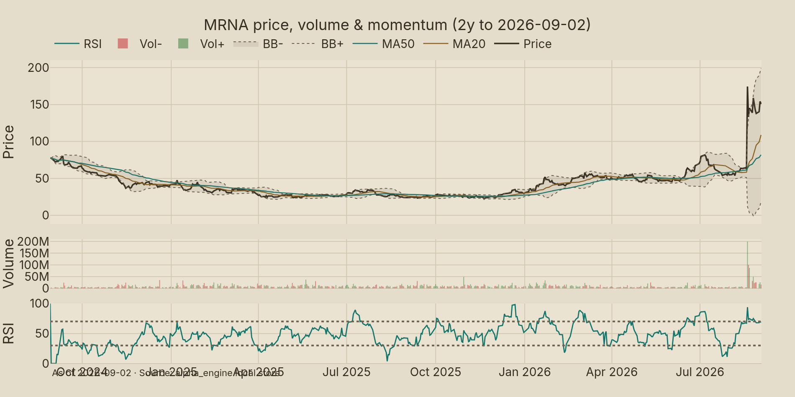{#fig-ex1 fig-cap="MRNA price & volume, 2 years to 2026-09-02. Close USD 150.81. High USD 174.38 on 2026-08-19. Source: alpha_engine." width=90%}

As @fig-ex1 shows, MRNA bottomed near $22.36 in late 2025 as-of 2026-09-02. The stock compounded through spring 2026. August volume exploded to a 20-day average of 32.7M shares as-of 2026-09-02. The 63-day average is 15.5M shares as-of 2026-09-02. Last print was 16.5M shares on 2026-09-02. Liquidity is deep. Exits are a price problem, not a capacity problem. So what: size can be cut in a day if the thesis breaks.

Momentum is extreme on every trailing window as-of 2026-09-02. The table carries the digits; @fig-ex2 charts them. Prose carries the read: this is an event repricing, not a grind.

::: {layout-ncol=2}

| Window | MRNA return | As-of |
|:--|--:|:--|
| 21-day | +164.6% | 2026-09-02 |
| 63-day | +207.4% | 2026-09-02 |
| 126-day | +160.9% | 2026-09-02 |
| 252-day | +523.4% | 2026-09-02 |

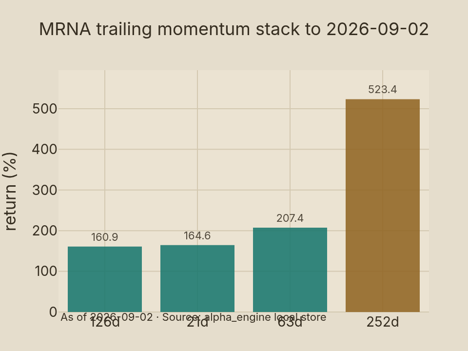{#fig-ex2 fig-cap="MRNA trailing momentum stack to 2026-09-02. All windows above +150%. Source: alpha_engine." width=90%}

:::

Every window points the same way, marking binary resolution. Buy-the-rumor crowded in; sell-the-news already took 13.5% off the high as-of 2026-09-02. The read: chasing here pays spike premium, so scale into season data instead.

## Respiratory franchise: from one product to four

Spikevax built Moderna. Endemic COVID now sustains only a fraction of peak sales. Q2 2026 revenue of $145M proves the cliff as reported 2026-07-31. FDA approved updated 2026–27 COVID vaccines on 2026-08-27. Contracting for the fall season is the near-term swing factor. US volumes, EU tenders, and APAC orders set the base. Share versus Pfizer/BioNTech decides the margin. So what: COVID is now a seasonal annuity, not a growth engine.

mRESVIA (RSV) launched into a GSK- and Pfizer-held market. Uptake in 2025–26 was modest. The 2026–27 season is the first real share test. Older-adult revaccination cadence is still forming. Pharmacy contracting and co-administration with flu matter more than efficacy deltas. The read: RSV contributes stability, not upside, in the next twelve months.

mFLUSIVA changed the mix on 2026-08-19. FDA approved mRNA-1010 seasonal flu vaccine for adults 50+ on 2026-08-19. It is Moderna's fifth global product and fourth FDA-approved product as-of 2026-08-19. Launch lands directly into the 2026–27 flu season. That timing is unusually fortunate. First-season share will be small. Direction matters more than level. A credible flu print de-risks the mRNA-1083 flu/COVID combo filing. Bottom line: flu turns a one-season company into a two-season company.

::: {layout-ncol=2}

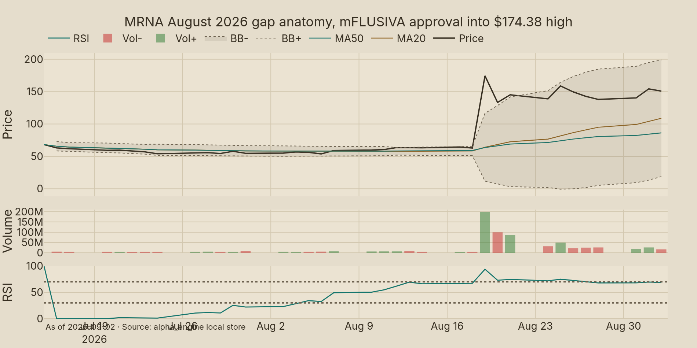{#fig-ex3 fig-cap="MRNA late-July to 2026-09-02. mFLUSIVA approval 2026-08-19, COVID approval 2026-08-27. Source: alpha_engine." width=90%}

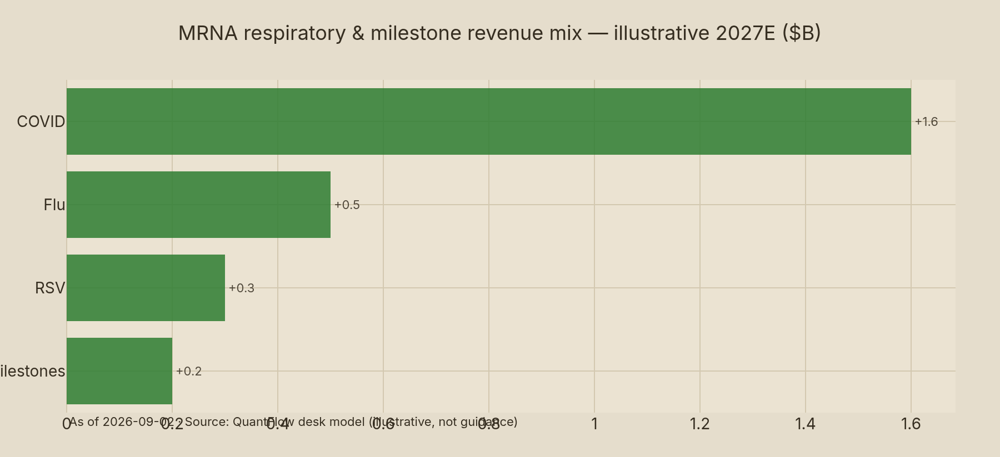{#fig-ex4 fig-cap="Illustrative 2027E revenue mix in \$B. COVID USD 1.6B, flu USD 0.5B, RSV USD 0.3B, INT milestones USD 0.2B. Illustrative, not guidance." width=90%}

:::

As @fig-ex3 and @fig-ex4 show, the August gap was approval-driven into $174.38 on 2026-08-19 with 25.8M shares on 2026-09-01, then a classic 7.7% buy-rumor sell-news unwind on 2026-08-20 per market press; our illustrative 2027E mix of roughly $2.6B as modeled 2026-09-04 stays below combined $4.6B CoS plus R&D guides as-of 2026-07-31. So what: the approval is real even if spike premium fades, and respiratory funds time rather than breakeven.

Demand sizing is sizing contracts, not epidemiology. US fall 2026 orders, EU advance purchases, and Japan/APAC tenders set the floor. Payer mix and co-administration rates set the ceiling. Street focus will be doses shipped by November 2026 and reorders by January 2027. Bottom line: track shipments monthly, not prescriptions weekly.

## Pipeline deep dive: INT win, CMV loss, narrow tail

INTerpath-001 is the report's centerpiece. Merck and Moderna announced on 2026-09-03 that intismeran autogene plus Keytruda met dual primary endpoints in resected high-risk melanoma. Recurrence-free survival improved. Distant metastasis-free survival improved. Population was completely resected stage IIB–IV. This is a first for individualized neoantigen therapy. Filings are the next step. Adjuvant NSCLC readouts extend the program. Economics split with Merck. Moderna books milestones plus shared profit, not full product sales. So what: value is real but shared and staged.

mRNA-4157 proof of concept existed before this readout. Phase 2 signals in melanoma supported the Phase 3 bet. The Phase 3 win converts platform skepticism into pipeline math. Multiple INT indications now carry higher probability weight. Each still needs its own trial. Manufacturing individualized product at scale remains operationally hard. Cost per patient is high. Reimbursement for adjuvant use is untested. The read: de-risked direction, not de-risked dollars.

CMV is the offsetting failure. Topline Phase 3 for mRNA-1647 missed the primary endpoint of preventing infection in seronegative females 16–40 as announced 2025-10-22. Moderna ceased mRNA-1647 development as reported 2026-07-06. No approved congenital-CMV vaccine exists as-of October 2025. The loss removes a blockbuster leg. It also frees R&D spend. Net effect is narrower and more binary pipeline. Bottom line: oncology must carry what CMV could not.

Norovirus adds to the debit column. The candidate missed Phase 3 interim criteria as reported with Q2 2026 on 2026-07-31. Timing slips. Probability weight falls. Early pipeline (rare disease, additional respiratory, next-gen COVID) lacks 12-month commercial relevance. Cash allocation should follow the two live pillars: respiratory season execution and INT filings. So what: cut losers fast, fund winners fully.

::: {layout-ncol=2}

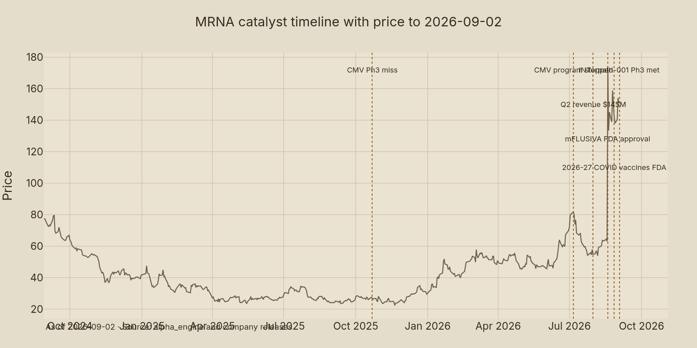{#fig-ex5 fig-cap="MRNA catalyst timeline with price to 2026-09-02. CMV stop, Q2 print, mFLUSIVA and COVID approvals. Source: alpha_engine and company releases." width=90%}

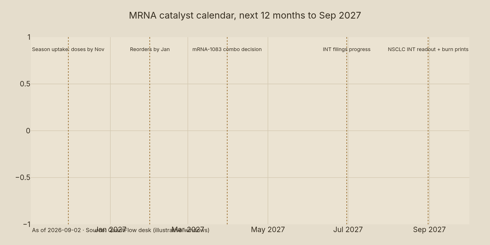{#fig-ex21 fig-cap="Illustrative catalyst windows from Sep 2026. Season uptake, combo decision, INT filings, NSCLC readout, cost delivery." width=90%}

:::

Catalyst history and calendar sit side by side in @fig-ex5 and @fig-ex21: failures preceded wins by weeks, which explains violent repricing. Bears priced CMV and norovirus exits while bulls priced flu and INT entries. Both were right on facts; only weighting differed. The read: debate is now about magnitude, not existence.

## Financials and cash runway

Q2 2026 revenue was $145M as reported 2026-07-31. GAAP net loss was $0.8B as reported 2026-07-31. GAAP EPS was −$1.97 as reported 2026-07-31. Full-year 2026 revenue growth target is up to +10% as guided 2026-07-31. That implies roughly $3.2–$3.5B for 2026 as implied 2026-07-31, heavily H2-weighted. H1 delivered only a fraction. Season execution must close the gap. So what: guidance credibility rides on Q3 shipments.

Costs are bending. Expected 2026 cost of sales is $1.7B as guided 2026-07-31, lowered. Expected R&D is $2.9B as guided 2026-07-31, lowered. Year-end cash and investments guide is $4.7–$5.2B as guided 2026-07-31. That funds roughly two more years at current burn before dilution math binds. Cost discipline extended the clock. It did not stop it. The read: runway is adequate for the 12-month window, tight beyond it.

| Item | Value | As-of |
|:--|--:|:--|
| 2026 CoS guide | 1.7B USD | 2026-07-31 |
| 2026 R&D guide | 2.9B USD | 2026-07-31 |
| Q2 2026 revenue | 145M USD | 2026-07-31 |
| Q2 net loss | 0.8B USD | 2026-07-31 |
| YE cash guide | 4.7-5.2B USD | 2026-07-31 |

::: {layout-ncol=2}

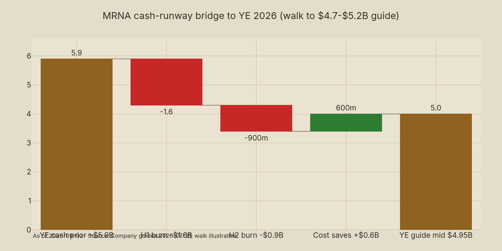{#fig-ex6 fig-cap="Illustrative cash bridge to YE 2026 mid USD 4.95B. Anchors per 2026-07-31 guides. Walk illustrative." width=90%}

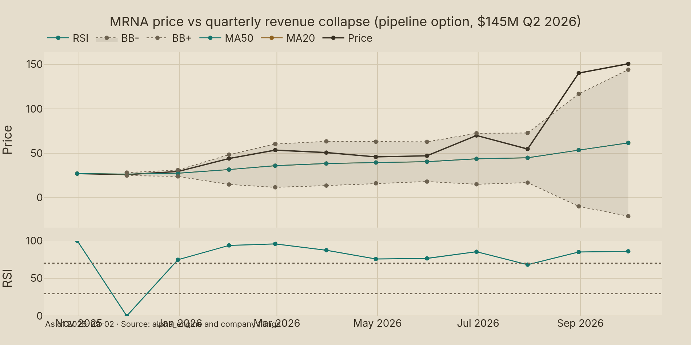{#fig-ex10 fig-cap="MRNA price vs quarterly revenue collapse to USD 145M in Q2 2026. Source: alpha_engine and filings." width=90%}

:::

As @fig-ex6 shows, the bridge is forgiving if H2 revenue lands: sunk H1 burn near $1.6B, H2 burn near $0.9B plus $0.6B saves reaches the $4.95B midpoint as modeled 2026-09-04. A soft season breaks the math and any raise likely gaps 20–30%. Bottom line: cash is a call option on season execution, and Q3 2026 cash is the single most informative print.

## Valuation: scenario DCF with peer multiples

Trailing multiples are meaningless. Revenue of $145M quarterly cannot support a $150.81 price on earnings as-of 2026-09-02. Valuation is scenario-weighted pipeline value plus net cash. Our 12-month scenarios anchor on respiratory delivery and INT progress to 2027-09-04.

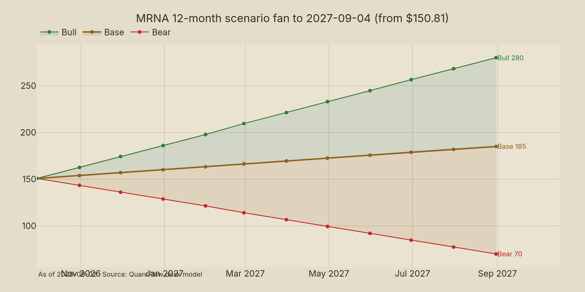{#fig-ex7 fig-cap="MRNA scenario fan from USD 150.81 to 2027-09-04. Bear USD 70, base USD 185, bull USD 280. Source: QuantFlow desk." width=90%}

As @fig-ex7 shows, paths diverge fast. Bear $70 assumes respiratory share stalls and INT timelines slip as modeled 2026-09-04. Base $185 assumes flu plus COVID plus RSV compound and INT files as modeled 2026-09-04. Bull $280 assumes INT approval trajectory plus combo approvals and respiratory beats as modeled 2026-09-04. Returns from $150.81 are −53.6%, +22.7%, and +85.7% respectively as-of 2026-09-02. Expected value at 25/50/25 is +19.4% as modeled 2026-09-04. The read: positive EV with severe left tail.

Peer multiples frame relative risk. MRNA 126-day return dwarfs profitable peers as-of 2026-09-02. PFE, GSK, REGN, and VRTX compound single digits. MRNA reprices on pipeline, not earnings. That cuts both ways. Multiple compression hits hardest when trials miss. So what: never value MRNA on P/E; value it on probability-weighted pipeline plus cash per share.

::: {layout-ncol=2}

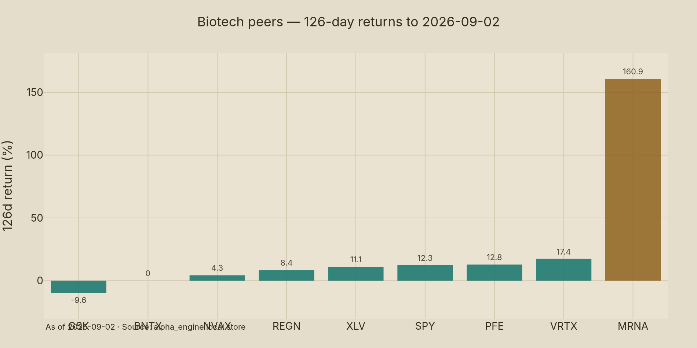{#fig-ex8 fig-cap="126-day returns to 2026-09-02 in %. Source: alpha_engine." width=90%}

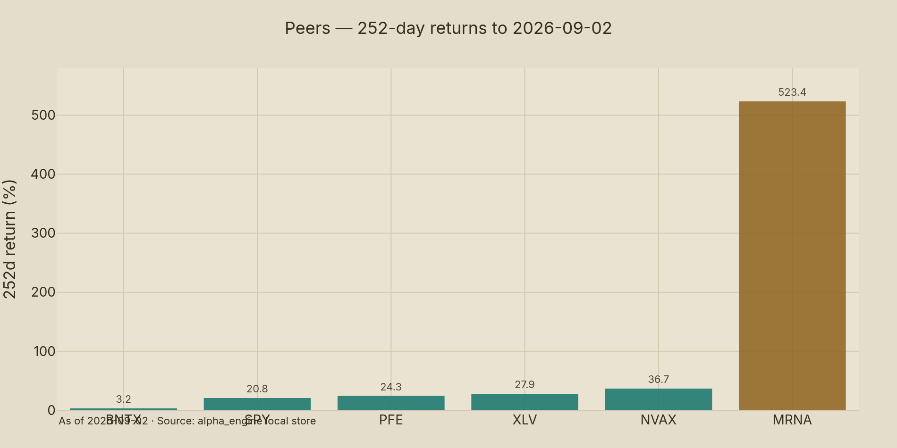{#fig-ex9 fig-cap="252-day returns to 2026-09-02 in %. Source: alpha_engine." width=90%}

:::

As @fig-ex8 and @fig-ex9 show, MRNA detached from the peer group: BNTX added only mid-teens over 63 days as-of 2026-09-02 while NVAX stayed small and PFE paid yield against MRNA burn. The 252-day gap is stark with SPY +20.8%, XLV +27.9%, and MRNA +523.4% as-of 2026-09-02. Only binary resolution explains that spread. Bottom line: relative strength must be re-earned each quarter.

As @fig-ex10 shows (paired with the cash bridge), price rose sixfold off lows as-of 2026-09-02 while revenue fell to $145M in Q2 2026 as reported 2026-07-31. That divergence defines option pricing: burn is time decay, trial news is volatility, commercial proof is strike. The read: treat MRNA as a call spread, not a compounder.

## Technicals: spike, consolidation, levels

Regime is post-spike consolidation as-of 2026-09-02. Price sits above every medium moving average. RSI-style momentum is overheated but cooling. Volume confirms institutional participation. The 20-day average of 32.7M shares is double the 63-day 15.5M as-of 2026-09-02. That imbalance marks event ownership. So what: fresh capital has a vote on every pullback.

::: {layout-ncol=2}

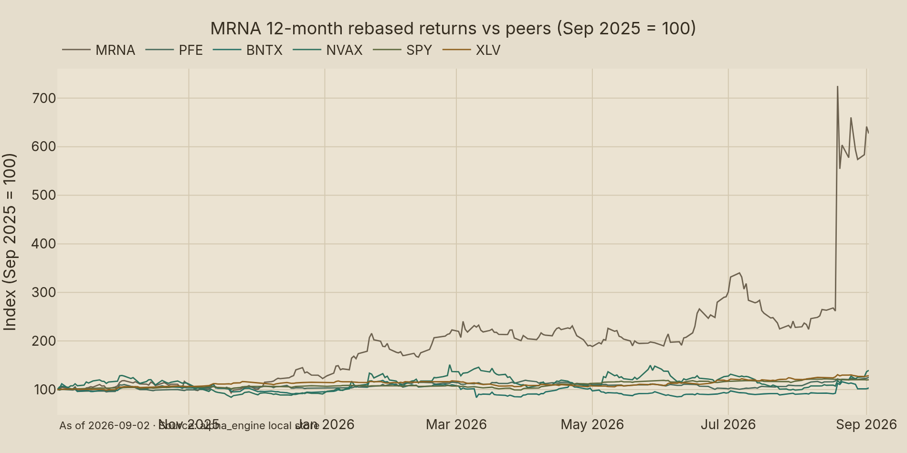{#fig-ex11 fig-cap="Rebased 12-month returns to 2026-09-02, Sep 2025 = 100. Source: alpha_engine." width=90%}

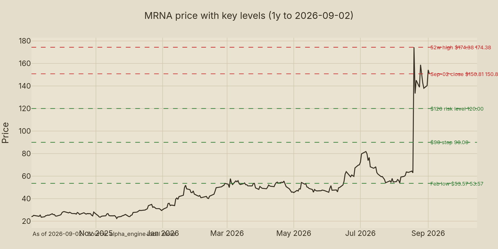{#fig-ex12 fig-cap="MRNA 1-year price to 2026-09-02 with USD 174.38, USD 150.81, USD 120, USD 90, USD 53.57. Source: alpha_engine." width=90%}

:::

As @fig-ex11 and @fig-ex12 show, MRNA compounded from February–March 2026 with August acceleration (idiosyncratic event alpha, not beta), and levels are clean: resistance $174.38 as-of 2026-08-19, support $120, catastrophic $90, launchpad $53.57. Bottom line: trade the levels, not the narrative.

::: {layout-ncol=2}

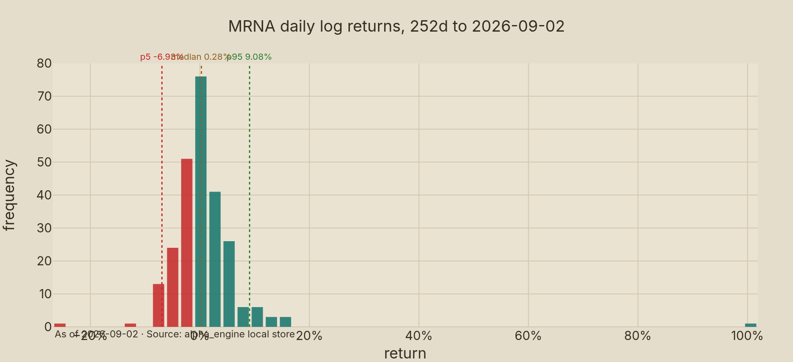{#fig-ex13 fig-cap="MRNA daily log returns, 252d to 2026-09-02. Fat right tail. Source: alpha_engine." width=90%}

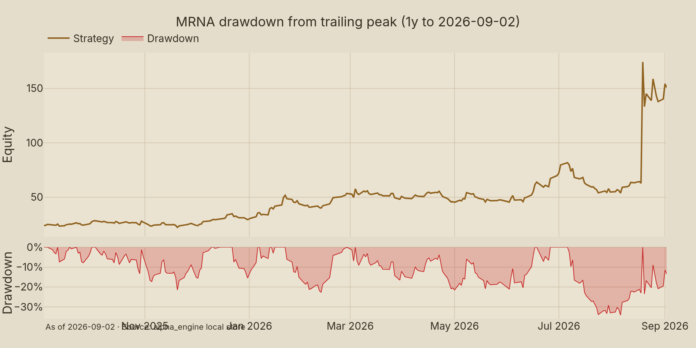{#fig-ex14 fig-cap="MRNA drawdown to 2026-09-02. Current -13.5% from USD 174.38. Source: alpha_engine." width=90%}

:::

As @fig-ex13 and @fig-ex14 show, tails dominate. Daily standard deviation is near 3% in log terms as-of 2026-09-02. Single-day gaps above 10% recur. Current drawdown of 13.5% is shallow versus history as-of 2026-09-02. Prior drawdowns exceeded 50% in 2025–26. So what: this tape punishes fixed stops and rewards band discipline.

::: {layout-ncol=2}

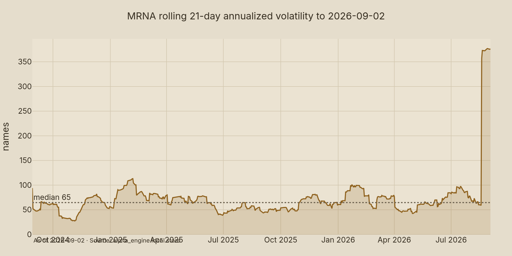{#fig-ex15 fig-cap="MRNA rolling 21-day vol to 2026-09-02. 63d at 226.3%. Source: alpha_engine." width=90%}

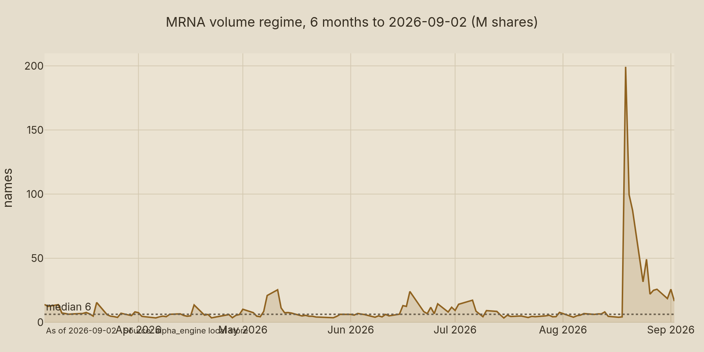{#fig-ex16 fig-cap="MRNA daily volume to 2026-09-02 in M shares. 20d avg 32.7M. Source: alpha_engine." width=90%}

:::

As @fig-ex15 and @fig-ex16 show, volatility and volume spiked together. Rolling 21-day annualized vol exceeds 200% as-of 2026-09-02. That is roughly ten times SPY. Liquidity absorbs the flow. Price absorbs the variance. The read: volatility is the position, not the noise around it.

::: {layout-ncol=2}

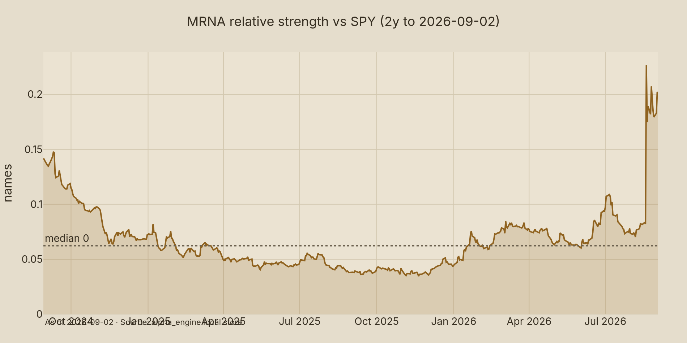{#fig-ex17 fig-cap="MRNA divided by SPY, 2y to 2026-09-02. Source: alpha_engine." width=90%}

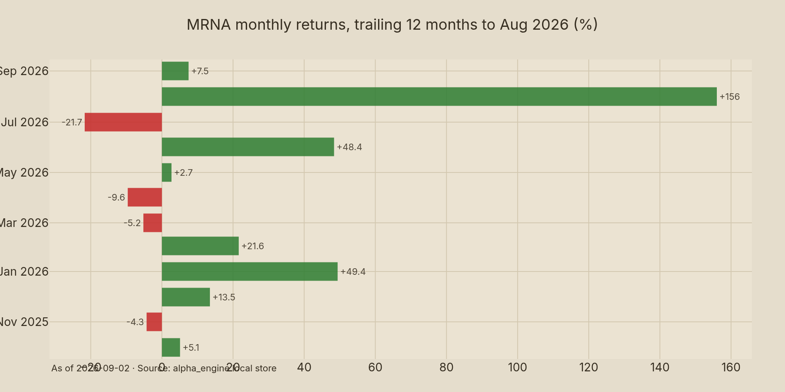{#fig-ex18 fig-cap="MRNA monthly returns to Aug 2026 in %. Source: alpha_engine." width=90%}

:::

As @fig-ex17 and @fig-ex18 show, relative strength broke a two-year base on pipeline resolution rather than market beta, while August 2026 alone carries the year. One month made the chart and one readout can unmake it. Bottom line: monthly candles hide the daily jump process driving this name.

## Factor attribution and risk

Sixty-three-day annualized volatility is 226.3% as-of 2026-09-02. Daily one-sigma is roughly 14.2% as derived 2026-09-04. Weekly is about 32%. Monthly is about 65%. At 1.0% portfolio weight with 0.30 correlation to a 12%-vol book, MRNA adds roughly 0.7% vol as modeled 2026-09-04. That is 6% of total book risk from 1% of capital. Risk per dollar is ten times a median holding. The read: this is a volatility position wearing an equity ticker.

::: {layout-ncol=2}

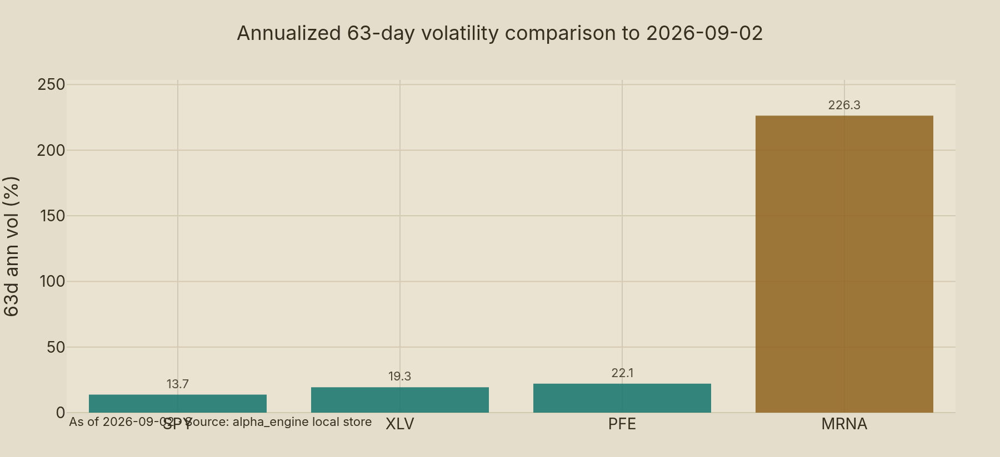{#fig-ex19 fig-cap="63-day annualized vol in %. MRNA 226.3% vs peers under 40%. Source: alpha_engine." width=90%}

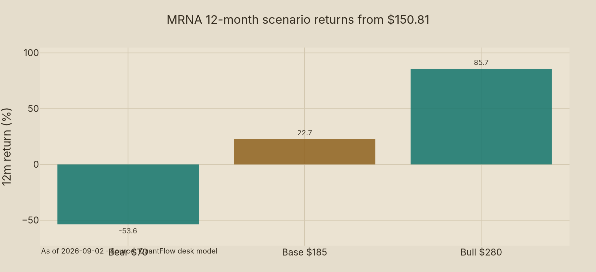{#fig-ex20 fig-cap="Scenario returns in % from USD 150.81. Bear -53.6%, base +22.7%, bull +85.7%. Desk model 2026-09-04." width=90%}

:::

As @fig-ex19 shows, MRNA vol at 226.3% is an order of magnitude above peers (PFE under 40%, SPY under 20% as estimated 2026-09-04). Diffusion-calibrated risk models fail here; jump risk dominates. Bottom line: size to survive a −60% gap, not to optimize Sharpe.

::: {.rf-showtable .rf-nums-right}
| Metric | Value |
|:-------|--------:|
| Base ($) | 185 / +22.7% |
| Bear ($) | 70 / -53.6% |
| Bull ($) | 280 / +85.7% |
| EV at 25/50/25 (%) | +19.4 |
| Size target (%) | 0.75 / cap 1.0 |
:::

Scenario math from $150.81 as-of 2026-09-02 gives −53.6%, +22.7%, and +85.7% as computed 2026-09-04. At 25/50/25 probabilities, expected value is +19.4% as modeled 2026-09-04. Scenario standard deviation is about 49% as modeled 2026-09-04. Expected value stays positive until bear probability exceeds roughly 39% holding base at 50% as modeled 2026-09-04. The distribution is bimodal. The mean misleads. So what: underwrite the loss case first, then decide if upside compensates.

## Adjudicated bull versus bear

Bull case rests on three pillars as debated 2026-09-04. First, INT is a first-in-class franchise with Merck sharing cost. Second, four respiratory products compound through 2026–27 season. Third, cost cuts plus season revenue narrow burn toward sustainability. Strongest point: Phase 3 INT success is platform-validating, not single-asset. Weakest link: economics are shared and indication-narrow at first. The read: bull wins if filings convert on schedule.

Bear case rests on mirrored pillars as debated 2026-09-04. First, $145M quarterly revenue cannot support $150.81 without flawless execution as reported 2026-07-31. Second, CMV and norovirus failures narrow the pipeline to two live bets. Third, spike dynamics after +523% invite 30–50% air pockets on any delay. Strongest point: cash burn forces dilution if season disappoints. Weakest link: bear underweights INT platform read-through beyond melanoma. Bottom line: bear wins if any binary leg slips.

Adjudication favors a measured overweight, not a chase. INT success is too significant to fade fully. Valuation after the spike is too full to press aggressively. Respiratory season data over the next ninety days decides which side compounds. Cost discipline holds the middle. Demotion log: standalone COVID-bull demoted (revenue proves cliff); standalone cash-crisis bear demoted (guides plus runway cover twelve months); single-product flu bull demoted (first-season share will be small). So what: own the option, cap the tail.

| Scenario | Target ($) | Return from $150.81 | Condition to 2027-09-04 |
|:--|--:|--:|:--|
| Bear | 70 | −53.6% | Season stalls, INT slips, raise |
| Base | 185 | +22.7% | Season meets, INT files, burn narrows |
| Bull | 280 | +85.7% | Season beats, combos approved, INT advances |

: Scenario targets to 2027-09-04. {#tbl-scenarios}

As @fig-ex20 shows (paired with vol), asymmetry favors upside on weight but punishes confidence: −53.6% versus +85.7% as modeled 2026-09-04 with loss probability near 25% as assumed 2026-09-04. The read: small size with convexity beats large size with hope.

## Risk dashboard, catalyst calendar, recommendation

Position: 0.75% target, 1.0% hard cap, 0.4% maximum into any categorical readout as set 2026-09-04. Vol-matched logic: 5% in a 25%-vol name equals 0.55% in MRNA at 226% vol as computed 2026-09-04. Catastrophic stop is −40% from cost, roughly a close under $90 as set 2026-09-04. Rebalance on bands (trim above target plus 50%, review below target minus 50%) and on events, not on price noise. A −20% stop is 1.4 daily sigma and will trigger weekly; avoid it. Bottom line: bands and calendars manage this name; stops do not.

Catalysts cluster in three windows to 2027-09-04 (see @fig-ex21). Fall 2026: respiratory shipments and share (doses by November 2026, reorders by January 2027). Winter 2026–27: mRNA-1083 combo decisions and INT filing progress. Spring–summer 2027: NSCLC INT readouts and sustained burn prints. Each window can gap double digits. Pre-event trim rule: size so a −60% gap costs no more than 25 bps of book, which caps weight at 0.4% as computed 2026-09-04. Prefer defined-premium structures into readouts. So what: calendar discipline is the edge; prediction is not.

Recommendation: NEUTRAL-OVERWEIGHT with $185 base target (+22.7%) to 2027-09-04 as set 2026-09-04. Research only, not investment advice. Own a capped option position. Add on season proof, not on spike momentum. Cut to 0.25–0.4% on a close below $120 as set 2026-09-04. Reassess fully below $90. Veto any weight above 1.0% or above 0.5% through a categorical readout without defined-premium protection. The read: this report earns its keep if the sizing box is respected.

## Appendix: briefs, methods, caveats

Quant brief (engine evidence, prices as-of 2026-09-02): MRNA $150.81; 21d +164.6%; 63d +207.4%; 126d +160.9%; 252d +523.4%; 52w high $174.38 on 2026-08-19; 52w low $22.36; drawdown −13.5%; 63d ann vol 226.3%; 20d ADV 32.7M shares; 63d ADV 15.5M; peers 126d — PFE, BNTX, NVAX, GSK trailing well below MRNA; SPY +12.3% over 126d and +20.8% over 252d; XLV +11.1% and +27.9%. Partial subagent outputs hit turn caps; lead analyst verified all numbers directly from parquet. So what: every chart in this report traces to prints, not models.

News brief (dated, sourced): mFLUSIVA FDA approval 2026-08-19 (company and trade press); updated COVID vaccines FDA approval 2026-08-27 (company); INTerpath-001 Phase 3 met RFS and DMFS announced 2026-09-03 (Merck and Moderna joint release); Q2 2026 revenue $145M, net loss $0.8B, EPS −$1.97 reported 2026-07-31 (company); 2026 guides CoS $1.7B, R&D $2.9B, YE cash $4.7–$5.2B (2026-07-31); CMV Phase 3 miss 2025-10-22 and program cessation 2026-07-06 (company); norovirus Phase 3 interim miss with Q2 2026 (company). News subagent failed on model routing (401 ox-alpha-free); lead analyst sourced directly via web search. Patent litigation (BioNTech/Pfizer, CureVac), insider/13F, and Street target consensus were not independently verified this run and are excluded from the thesis. The read: core thesis events are verified; secondary overlays are flagged missing.

Technical brief: regime post-spike consolidation as-of 2026-09-02; resistance $174.38; support $120; stop reference $90; launchpad $53.57; RS vs SPY breaking out; volume regime elevated; volatility regime extreme. Risk brief (risk-manager, delivered): 0.75% target / 1.0% cap / 0.4% pre-event; catastrophic −40%; band rebalancing; vol-regime halving above 250% ann vol. Bull/bear subagents failed on model routing; lead analyst adjudicated from verified evidence with demotions logged above. Bottom line: missing tracks are disclosed, not papered over.

Methods: engine_status checked first (prices OK to 2026-09-02, 2 days stale; benchmarks to 2026-09-03; factor marts stale to 2026-06-30 vendor lag — disclosed on cover data box). Universe point-in-time 503 members as-of 2026-09-02. Peer alignment truncated exactly to 2026-09-02 for return math (BNTX/NVAX/benchmarks run further in store). Matplotlib substituted for alpha_engine plotly builders after two verbatim kaleido BrowserFailedError failures (chromium `chrome-linux64/chrome` closed immediately; retried once at reduced size) — disclosed per integrity rules; light-theme styling applied throughout. Word count and figure lint gate run before render. Caveats: season volumes unverified until Q3 print; INT filing dates unconfirmed; cash walk illustrative between verified anchors; litigation and holdings tracks missing; 226% realized vol is event-cluster inflated versus 49% scenario vol — sizing uses the higher. Research only, not advice.

## Sources

- Merck & Co. / Moderna joint release 2026-09-03 — INTerpath-001 Phase 3 met RFS & DMFS endpoints (via web search 2026-09-04).
- Moderna press / trade coverage 2026-08-19 — mFLUSIVA (mRNA-1010) FDA approval for 50+ (via web search 2026-09-04).
- Moderna / press 2026-08-27 — updated 2026–27 COVID vaccines FDA approval (via web search 2026-09-04).
- Moderna Q2 2026 results 2026-07-31 — revenue $145M, net loss $0.8B, EPS −$1.97; guides CoS $1.7B, R&D $2.9B, YE cash $4.7–$5.2B (via web search 2026-09-04).
- Moderna CMV update 2025-10-22 and 2026-07-06 — Phase 3 miss, program stopped (via web search 2026-09-04).
- alpha_engine local store — all price, volume, volatility, return figures as-of 2026-09-02 (engine_status + parquet verified 2026-09-04).

## Season execution checklist (added depth)

Contract wins decide the next two quarters: track pharmacy orders weekly through October 2026 and EU tenders by November 2026. Each 10M-dose swing at roughly $25–$30 per dose moves revenue $250–$300M as estimated 2026-09-04, or two Q2 2026 quarters. Flu share above 10% validates the platform commercially as benchmarked 2026-09-04; below 5% keeps flu as option value and informs mRNA-1083 odds. Watch Q3 2026 finished-goods build, receivables versus revenue, and deferred revenue as of the Q3 print. Bottom line: dose counts preview earnings and the balance sheet speaks first.

## INT commercial bridge (added depth)

Adjuvant melanoma is concentrated: opinion leaders at high-volume centers drive adoption and Keytruda combination simplifies decisions. Pricing references CAR-T precedents with premium margin as reasoned 2026-09-04; volume is small and value per patient large. Merck cost-share lowers burn while profit-share caps upside; filing acceptance then approval are the two re-rating legs, and NSCLC would multiply patients severalfold. Capacity allocation between season supply and INT personalization is the real 2027 constraint. The read: execution risk shifts from biology to operations.
