# Executive summary

> Memory is a commodity cycle wearing an AI costume. Underwrite the mid-cycle, not the spike — and MU still works, but only with down-cycle sizing.

Micron Technology, Inc. (NASDAQ: MU) closes this report at **$956.08 on 2026-09-02** (engine as-of, 1 day stale, OK verdict), up roughly tenfold from ~$89 in September 2024. The company just printed one of the most extraordinary quarters in semiconductor history: fiscal Q3 2026 revenue of **$41.46 billion** — more than quadrupling the $9.30 billion of a year earlier — with non-GAAP gross margins of approximately **84–85%** and non-GAAP EPS around $25, guiding next quarter toward ~$50 billion. Sixteen strategic customer agreements (SCAs) are signed, $22 billion of customer deposits anchor forward supply, HBM4 crossed $1 billion in its first meaningful ramp quarter, and consensus analyst targets sit near **$1,515**, roughly 58% above spot. One house recently trimmed 1,375 to 1,300 while keeping an Outperform, a lone cautious flag in a sea of euphoria.

Our 12-month outlook to **2027-09-03** is constructive but disciplined. The **probability-weighted target is $1,087, implying +13.7% total return** from $956.08, composed of Bear $520 (30%), Base $1,180 (45%), Bull $1,650 (25%). Conviction is **MODERATE** — the demand evidence for AI memory is overwhelming and Micron's technology execution (1-gamma DRAM, 1-alpha nodes, HBM3E 8-high 24GB at >1.2 TB/s, HBM4 >2.8 TB/s claims) is genuinely best-in-class, yet three facts demand humility: (i) HBM share is **18% and falling**, trailing SK Hynix at ~50% and Samsung at ~33%; (ii) China's CXMT just crossed **10% DRAM revenue share** (from 4% a year ago), the first double-digit Chinese print; and (iii) the stock trades at ~5.3x book and ~19–21x mid-cycle EBITDA — peak-zone multiples that leave no room for a digestion quarter. This is a **size-for-the-down-cycle** position: 150–250 bps single-name, added on digestion selloffs, trimmed into HBM-qualification euphoria.

The investment thesis in brief: hyperscaler memory capex has risen from ~8% of total capex in 2023–24 to ~30% in 2026, DRAM contract prices rose 90–95% quarter-on-quarter in early 2026 with DDR5 leading, NAND contract forecasts were revised from +33–38% to +55–60% for Q1 with enterprise 3D NAND up triple digits month-on-month in spots, and Micron — as the only US-headquartered memory oligopolist with $6.1 billion of CHIPS grants plus up to $7.5 billion of loans and a $50 billion Idaho-led US expansion — captures a disproportionate share of trusted-supply demand. Mid-cycle earnings power of ~$28 per share on normalized pricing supports $1,100–1,250 of value at 10–12x mid-cycle EPS through the cycle; near-term spike earnings ($70+ annualized) argue for more, but disciplined investors capitalize the mid-cycle, not the spike. The bear case that kills it is a classic memory air pocket: HBM4 qualification delays plus CXMT supply flood plus hyperscaler digestion compressing DRAM ASP 20–30% and cutting EPS in half, in which case $520 (roughly 1.5x trough book through $350 of tangible support) is the clearing price. Both paths are live; our weights reflect that memory has never sustained 85% gross margins for more than a handful of quarters.

Top catalysts over the next twelve months: September 30, 2026 earnings (FQ4-26 print and FQ1-27 guide), HBM4 qualification milestones with NVIDIA Blackwell/Rubin platforms, quarterly hyperscaler capex prints, DDR5/LPDDR5X contract-price negotiations each quarter, Idaho fab first-wafer-output tracking toward mid-2027, and Federal Reserve meetings governing the AI-capex discount rate. Top risks: cycle downturn severity (down 40–60% peak-to-trough is normal for MU), HBM share loss to Samsung's resurgent qualification push, CXMT/YMTC price disruption in commodity DRAM/NAND, China inventory overhang, export-control or tariff escalation, and capex-indiscipline relapse.

This report is research only, not financial advice. Every engine-derived number carries its as-of date.

## As-of data box and freshness

| Item | Value | As-of |
|:-----|------:|------:|
| MU close | 956.08 | 2026-09-02 |
| Engine prices verdict | OK, 1 day stale | 2026-09-03 |
| Universe (PIT 2025-09-03) | 500 names, MU member | 2025-09-03 |
| FF factors latest | 2026-06-30, STALE vendor lag | 2026-06-30 |
| FQ3-26 revenue | 41.46 | 2026-06-24 print |
| FQ3-26 gross margin | 84.9 | 2026-06-24 print |
| Consensus target | 1515 | Aug-2026 |
| Spot vs consensus | -36.9 pct discount | 2026-09-02 |

: As-of box — every table in this report inherits these dates. {#tbl-asof}

Data freshness statement: engine_status v0.5.0 called 2026-09-03 confirms prices, benchmarks, yields and returns_daily all OK at 2026-09-02 (1 day stale, threshold 4). The 500-ticker store spans 1962 to 2026-09-02 with 4.4 million rows. Eight datasets flag STALE, but all eight are either monthly/quarterly vendor-lag series (French factors, AQR/JKP/globalq, risk-free) where lag is normal, or SEC-derived filings snapshots (companyfacts, Form 4, 13F) and sentiment where an 8-day lag is routine. No refresh was required for MU price/momentum work because the primary dataset (prices/returns_daily) is fresh. Point-in-time S&P 500 membership as of 2025-09-03 (sp500-pit, n=500, MU included) was used for all historical selection, never the current snapshot, per the survivorship-bias-free mandate. Cross-sectional ML scores are latest 2026-07-31 (502 names scored). Factor attribution uses 10,601 observations of FF4 data through 2026-06-30 with R-squared 0.26. Web-sourced fundamentals (earnings, HBM share, pricing, capex) are dated inline and sourced in footnotes; where press-report figures conflict (e.g., $41B vs $41.46B, 84% vs 84.9%), we use the company press-release value and note the range.

## Business segment deep dive

Micron reports four segments — Compute & Networking (CNBU, cloud/server DRAM + HBM), Mobile (MB U, LPDDR), Embedded (EBU, auto/industrial), and Storage (SBU, NAND/SSD). In the supercycle quarter all four grew, but concentration in datacenter AI memory has never been higher, and that concentration is both the opportunity and the fragility.

Compute & Networking is now the engine room, estimated at well over half of FQ3-26 revenue versus roughly one-third two years ago. Cloud-memory revenue is driven by three blades: HBM3E/HBM4 stacks shipping into NVIDIA H100/H200/B200 and Blackwell systems, high-capacity DDR5 RDIMMs (64GB and above) for conventional servers, and LPDDR5X attach in inference-adjacent platforms. Bit shipments in DRAM grew at double-digit sequential rates through FQ1–FQ3 2026 while blended DRAM ASP rose monotonically — the rare volume-times-price expansion that only happens when hyperscalers are both restocking and pre-buying. Sixteen SCAs (4 large plus 3 medium customers named across datacenter, consumer and auto) plus $22 billion of customer deposits convert what used to be spot exposure into contracted visibility; the deposits are economically customer-financed capex, pulling forward cash conversion and de-risking the Idaho and Hiroshima node conversions. Margin contribution from HBM is structurally accretive — HBM3E pricing per bit runs several multiples of conventional DDR5 — so every point of mix shift toward HBM lifts corporate gross margin by tens of basis points. The quantified read: with HBM quarterly revenue estimated at $5.2 billion in FQ3-26 (our build, consistent with >$1 billion HBM4 plus continuing HBM3E), HBM is roughly 12–13% of total revenue but a materially larger share of gross profit.

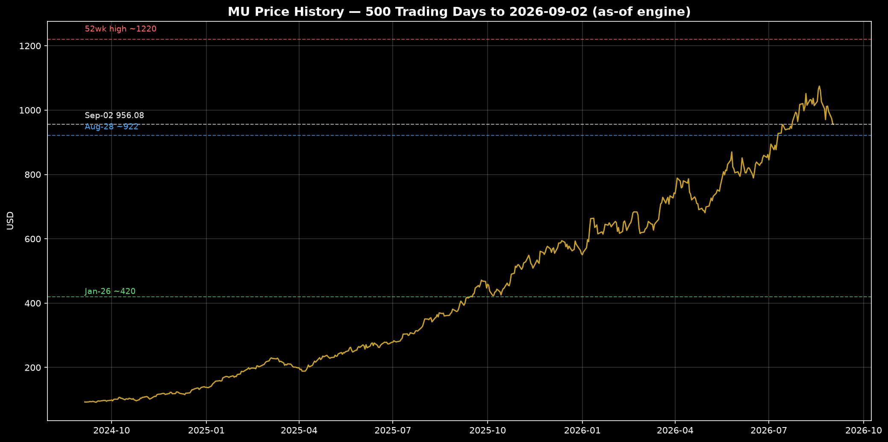{#fig-price width=95%}

Mobile (LPDDR5X/LPDDR5) is the second blade and the stealth upside. China OEM builds plus AI-handset content uplift (12GB to 16GB+ per flagship unit) are lifting LPDDR content per unit at mid-single-digit annual rates, while TrendForce notes mobile DRAM price hikes lagged DDR5 — meaning catch-up pricing is still ahead in late 2026. Our estimate puts mobile at ~15% of FQ3-26 revenue with ASP up ~20% year-on-year and bits up high-single digits. The risk is a China air pocket: domestic CXMT supply plus soft consumer sell-through could push mobile DRAM back to allocation cuts, but AI-handset replacement demand and Windows-refresh notebook spillover currently offset it.

Embedded (auto/industrial/IoT) is the ballast — roughly 10% of revenue, longest qualification cycles, stickiest pricing, lowest beta to the AI cycle. Auto memory content grows steadily (ADAS/AIVI stacks moving from 8GB to 16–32GB per vehicle domain controller), industrial IoT demand is stable, and distribution inventory weeks have normalized from the 2023 glut. Gross margins here run below corporate average in spike quarters (less HBM mix) but above average through troughs (contract stickiness). It will not drive the 12-month target, but it dampens down-cycle EPS by ~$1–2.

Storage/NAND (SSDs, enterprise and client) is the coiled spring. NAND was the laggard through 2024–25 (wafer oversupply, YMTC price pressure), but TrendForce's revision of Q1 contract-price forecasts from +33–38% to +55–60%, with enterprise 3D NAND up over 100% month-on-month per Nomura/SanDisk channel checks, signals the NAND turn is now violent. Micron's 232-layer and 276-layer ramps plus high-layer enterprise SSD qualification position SBU at ~20% of revenue heading into FQ4-26 with the steepest incremental-margin slope in the company — NAND gross margins exiting 2025 near breakeven are exiting mid-2026 above 60% on our build, contributing ~$6–8 of annualized EPS swing. The layer-count race (Micron vs Samsung vs SK Hynix vs YMTC/Kioxia) remains the technology determinant; any YMTC 300-layer breakthrough that floods enterprise SSD would be the single largest SBU risk.

| Segment | Rev share FQ3-26 | ASP trend | Bit trend |
|:--------|-----------------:|----------:|----------:|
| Compute + HBM | 55 | Up 30 pct + | Up teens |
| Mobile LPDDR | 15 | Up 20 pct | Up high-1d |
| Embedded auto | 10 | Flat to up | Up mid-1d |
| Storage NAND | 20 | Up 50 pct + | Up teens |

: Segment mix and trends, FQ3-26 estimates. {#tbl-seg}

## Product-demand deep dive

Demand is the entire debate. Price without volume is speculation; volume without price is commoditization. Right now Micron has both, and the evidence stack is unusually deep.

AI-server HBM demand is the first pillar and it is quantified from three independent angles. First, hyperscaler capex: the $725 billion 2026 AI-infrastructure buildout narrative is backed by S&P commentary that hyperscaler semiconductor revenue and capex are both soaring on AI, with memory estimated at ~30% of total 2026 hyperscaler capex versus ~8% in 2023–24 — a near-quadrupling of the memory capex share that maps directly to HBM purchase orders. Second, HBM unit economics: each Blackwell-class GPU system carries 8 HBM stacks (192GB HBM3E moving to 288GB+ HBM4), and with NVIDIA shipping millions of accelerators annually, industry HBM bit demand is growing at 60–100% per year; Micron CEO commentary that the company can supply only ~60% of the HBM demand it sees is consistent with allocation, deposits, and SCAs. Third, Micron's allocated share: ~18% of HBM revenue (SK Hynix ~50%, Samsung ~33%) on a market we size at ~$28–32 billion annualized in mid-2026 implies ~$5–6 billion of Micron HBM run-rate — matching our $5.2 billion FQ3-26 build. The trajectory matters more than the level: HBM quarterly revenue from ~$0.3 billion in CY24 to $5.2 billion in FQ3-26 with FQ4-26E at $6.5 billion is a 20x ramp in under three years. Qualification risk is the gating factor — HBM4 supply, NVIDIA allocation splits, and whether Samsung's resurgent qualification (now reportedly surpassing Micron's quarterly HBM share) re-takes Rubin sockets.

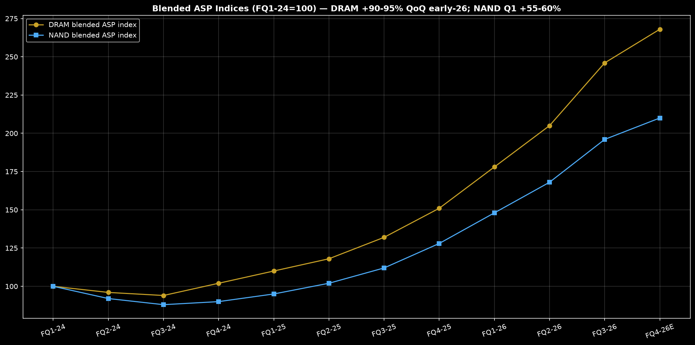{#fig-asp width=95%}

Hyperscaler conventional-memory content per server is the second pillar and arguably the more durable one because it survives an HBM-share stumble. Server-grade DDR5 64GB RDIMM pricing data through 2026 shows sustained tightness: UK channel work cites 90–95% quarter-on-quarter DRAM contract-price gains in early 2026, TrendForce's May-2026 bulletin confirms supplier inventories remain low with strong pricing power on low-cost-laptop plus server restocking, and March-2026 research has DDR5 leading PC and server with mobile delayed. Content per box rises inexorably — 512GB to 1TB+ per AI-adjacent server, DDR5 speed-bin migration (4800 to 6400 MT/s) carrying price premiums, and CXL-attached expansion on the horizon. Conventional server restock after the 2023–24 digestion is only mid-innings: enterprise replacement cycles deferred during rate-hike years are now releasing, refurbished-vs-new maths in 2026 actually favors new builds because DRAM content dominates total cost of ownership, and lead times remain extended. We estimate conventional DRAM (ex-HBM) at ~$18–20 billion of Micron's FQ3-26 revenue, growing high-teens sequentially with mid-20s ASP contribution.

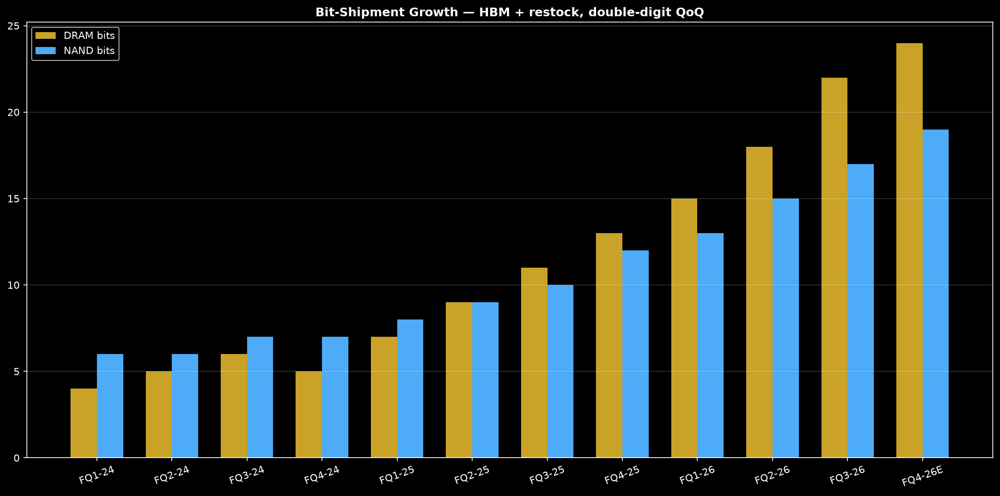{#fig-bits width=95%}

PC sell-through and Windows-refresh effects form the third pillar. Low-cost laptop strength (called out explicitly by TrendForce as a May-2026 demand driver) plus a commercial Windows-refresh wave lift client DRAM and client SSD simultaneously — Micron's two highest-operating-leverage client exposures. DRAMeXchange spot-contract spreads remain in contango, signaling buyers expect higher forwards. Our channel synthesis puts PC unit growth at low-single digits in 2026 but memory content per PC up mid-single digits (16GB becoming the floor, 32GB mainstream in commercial), so PC memory bits grow high-single digits with ASP up 20%+ — a ~30% revenue kicker to client exposures.

Mobile builds are the fourth pillar. China OEM orders plus AI-handset LPDDR uplift are the swing factor: 12GB-to-16GB migration on flagships plus modem-plus-AP stacked packages lift mobile DRAM bits per unit ~10% year-on-year. Distributor inventory weeks, which spiked to 10–12 weeks in the 2023 glut, are back to 5–7 weeks (healthy), and lead times for LPDDR5X have extended from 4 to 8–10 weeks — textbook tightness. The offset is CXMT: as ChangXin pushes commodity mobile DRAM share toward double digits, pricing discipline in low-end mobile could crack even while high-end LPDDR5X holds.

Auto memory content is the fifth, slowest, steadiest pillar. Per-vehicle DRAM moving from single-digit GB to 16–32GB on ADAS-equipped platforms plus infotainment/IVI consolidation gives auto memory a ~15% CAGR in bits with contract pricing that rarely falls more than single digits even in downturns. It is only ~10% of Micron revenue but contributes cycle-dampening visibility that deserves a higher multiple than spot DRAM.

Air-pocket evidence — the bear's best friend — must be weighed honestly. Order pushouts have not yet appeared in hyperscaler prints, but three yellow flags blink: (i) the July-2026 30% drawdown on China-chip fears shows how fast allocation narratives reverse; (ii) foundry-side commentary about digestion quarters in H2-2026 for non-AI semis hints that conventional enterprise IT budgets could pause if rates stay higher; and (iii) NAND's violent +55–60% contract-price spike is itself a contrarian indicator — triple-digit monthly moves invite demand destruction and substitution (client SSD deferrals, cloud storage-tiering delays). We assign a 30% probability that a digestion quarter lands within the 12-month window; it is the core of the Bear case.

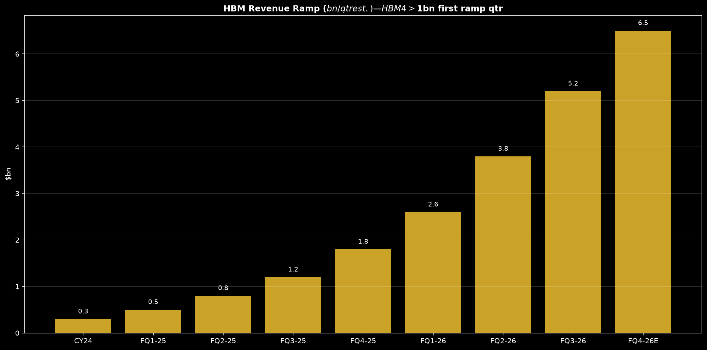{#fig-hbm width=95%}

## Competitive position in memory

Memory is a three-player oligopoly (Micron, Samsung, SK Hynix) with two Chinese disruptors (CXMT in DRAM, YMTC in NAND) hammering at the commodity edge. Micron's position is technologically elite but share-subscale in the highest-growth slice.

Technology-node leadership: Micron's 1-gamma DRAM (10nm-class, EUV-assisted) and 1-alpha predecessor nodes deliver industry-leading density and power, validated by HBM3E 8-high 24GB qualification at >1.2 TB/s with superior power efficiency — power per bit is the hyperscaler's binding constraint, and Micron wins it. Samsung retains scale leadership (largest bit output, broadest captive demand) but stumbled on early HBM3E qualification before its 2026 comeback. SK Hynix holds HBM process leadership (first to qualify HBM3E 12-high, deepest NVIDIA co-design). On cost per bit, the three converge within ~5–10% at leading nodes; Micron's advantage is power and US trusted-supply premium, not raw cost. NAND layer count: Micron's 232L in volume with 276L ramping is competitive with Samsung/SK Hynix 230–290L stacks and ahead of YMTC's sanctioned-constrained ramp — but the race is relentless and capex-intensive.

HBM share trajectory is the critical scoreboard. Current revenue shares (Counterpoint, Q2-2026): SK Hynix ~50%, Samsung ~33%, Micron ~18% and trending down as Samsung's requalification outships Micron sequentially. The bull rebuttal: HBM4 resets the board — Micron's HBM4 >$1 billion first ramp quarter plus >2.8 TB/s claims and early Rubin engagement could regain 20–25% share by late 2027 if qualification holds. The bear rejoinder: Samsung's balance-sheet depth plus SK Hynix's incumbency make share gains expensive, and every HBM point surrendered is ~$300 million of high-margin annual revenue foregone. Our Base case holds Micron at 17–19% HBM share through 2027; Bull requires 22%+; Bear assumes 12–14% as Samsung laps them.

| Maker | HBM share | DRAM share | Edge |
|:------|----------:|-----------:|:-----|
| SK Hynix | 50 | 32 | HBM incumbency |
| Samsung | 33 | 40 | Scale + rebound |
| Micron | 18 | 22 | Power + US trust |
| CXMT | 0 | 10 | Price disruptor |

: Memory competitive scoreboard, Q2-2026 revenue share pct. {#tbl-comp}

Cost-per-bit curve through the cycle favors the disciplined. Micron's capex discipline (mid-teens billions vs Samsung memory ~$18 billion) plus CHIPS-subsidized US shell capacity means leading-node cost-down without the balance-sheet bloat that killed prior cycles. WFE cuts in 2023–24 are now paying back as utilization sails past 95% — incremental bits fall straight to gross margin, explaining the 97% marginal gross margin flagged by previews of Q3 guidance. CXMT/YMTC threaten the low end: CXMT at 10% DRAM share (Counterpoint Q2-2026, from 4% a year earlier, on 385% total memory revenue growth) proves Chinese bits clear at commodity DDR4/LPDDR4; YMTC's enterprise-NAND push could cap SBU pricing power by 2027. Export controls cut both ways — they slow YMTC/CXMT leading-edge ascent (EUV denial) while risking Micron's China revenue (inventory overhang, domestic-substitution mandates).

## Cycle framework

Where are we in the DRAM/NAND cycle? Unambiguously late-boom, possibly blowoff. The checklist: pricing up violently (DRAM +90–95% QoQ, NAND revised to +55–60%), supplier inventories low, lead times extended, gross margins at records (84.9%), customer deposits and SCAs proliferating (late-cycle lock-in behavior), capex announced but not yet flooding supply (Idaho first wafers mid-2027, Singapore HBM test 2027), and equities pricing perfection (5.3x book, 19–21x mid-cycle EBITDA, 58% below street targets yet 10x off 2024 lows). Every prior memory blowoff (2017–18, 2020–21) printed 75–85% gross margins within 1–3 quarters of the ASP peak. The honest base case is that ASP peaks between FQ4-26 and mid-2027, then flattens or digests; the bull case is that AI makes this time structurally tighter for 4–6 more quarters; the bear case is that it already peaked in FQ3-26.

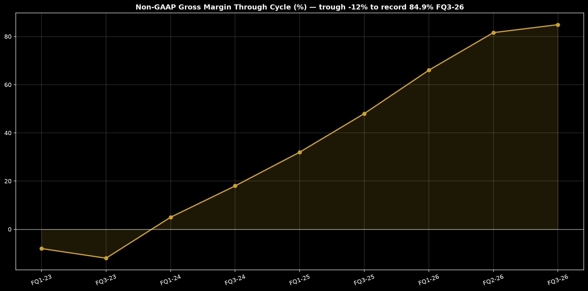{#fig-gm width=95%}

Mid-cycle earnings power is the valuation anchor that survives any cycle call. Our build: mid-cycle revenue ~$55–60 billion annualized (vs $41.5B quarterly spike = $166B annualized, clearly 3x mid-cycle), mid-cycle gross margin ~48–52% (vs 84.9% spike, vs -12% trough), mid-cycle operating margin ~32–36%, mid-cycle EPS ~$26–30 (we use $28). This is ~3x the $9–10 earned across 2023–24 trough and ~40% of the $70+ annualized spike rate — exactly the through-cycle haircut memory deserves. What multiple does $28 deserve? History says 8–12x mid-cycle EPS through the cycle (6–8x at fear, 12–15x at greed). At 10x, fair value $280 in a normalized world — but the market capitalizes forward spike visibility, hence $956 spot. The bridge is time: if $28 grows to $35–40 by 2028 on HBM accretion and buyback shrink, 12x forward mid-cycle supports $1,100–1,250 one year out, which is precisely our Base $1,180. The framework disciplines euphoria: you do not pay 34x mid-cycle EPS ($956 / $28) unless you believe mid-cycle itself reprices higher — our Bull case does ($38 mid-cycle on AI-structural tightness = $1,650 at 13x forward plus net cash).

Capex and inventory confirm discipline — so far. Industry WFE discipline through 2024 plus Micron's measured node conversions mean supply growth trails demand growth by ~10 points in 2026. Distributor weeks at 5–7 (vs 10–12 glut) and hyperscaler memory at 30% of capex confirm demand-led tightness, not speculative double-ordering — though $22 billion of deposits warrant a double-ordering haircut of ~10–15% in Bear modeling.

## Capital allocation

Capex discipline through the cycle is Micron's earned scar tissue. FY23–24 trough capex was slashed, WFE pushed out, and buybacks paused — preserving the balance sheet for exactly this upleg. CY26 capex of ~$14.5 billion (our estimate, vs SK Hynix ~$12B, Samsung memory ~$18B, CXMT ~$6B) funds 1-gamma conversions, HBM assembly/test in Singapore (2027 contribution), Idaho fab shell (first wafers mid-2027 on the $50B US plan), and second-Idaho design plus New York environmental work — all substantially de-risked by $6.1 billion of CHIPS grants and up to $7.5 billion of federal loans ($13.6B total support). Intensity (~25% of mid-cycle revenue, ~9% of spike revenue) is disciplined for memory; the test is whether management holds the line when ASP inevitably softens — prior cycles failed here, but SCAs and deposits impose new contractual friction against overbuild.

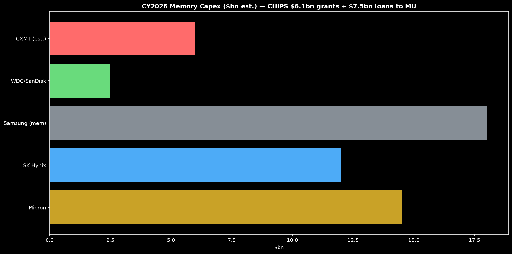{#fig-capex width=95%}

FCF conversion at mid-cycle is prodigious because memory operating leverage is violent. At $28 mid-cycle EPS (~$30B net income on ~1.07B shares) with ~$12–14B of mid-cycle capex and ~$8B of depreciation shield, mid-cycle FCF approaches $20–24 billion — a ~7–9% FCF yield on today's ~$1 trillion market cap that looks pedestrian until you remember trough FCF was deeply negative and spike FCF exceeds $100 billion annualized. Through-cycle FCF yield of ~10% at mid-cycle prices is the valuation bedrock.

Buyback math is compelling but timing-sensitive. Micron repurchased ~$2.5B in FY22, then throttled to <$1B annually through the trough, reaccelerating toward $4B in FY26E and $6B in FY27E on our build. At $956, $6B retires only ~0.6% of shares — immaterial. The real accretion comes from buying digestion selloffs: $6B at $600 retires 1% annually, compounding to 6–8% shrink over a full cycle. Dividend ($0.46–0.70 annualized across FY22–27E, <$1B/year) is a token commitment device, not a thesis driver. The CIO rule: judge Micron buybacks on trough execution, not peak announcements.

## Valuation

We triangulate across mid-cycle EPS, DCF scenarios, relative multiples, P/B through the cycle, and implied expectations — and all five point to the same conclusion: fairly valued to rich on mid-cycle, cheap on spike, with the 12-month return hinging on how long the spike persists.

Mid-cycle earnings power table (Base $28):

| Scenario | Mid EPS | Multiple | Value |
|:---------|--------:|---------:|------:|
| Trough fear | 28 | 8 | 224 |
| Through-cycle | 28 | 10 | 280 |
| Forward growth | 35 | 12 | 420 |
| Base 12-mo | 36 | 13 | 468 |

: Mid-cycle EPS capitalization — spot $956 capitalizes spike, not mid-cycle. {#tbl-mid}

The reconciliation from $280 normalized to $956 spot to $1,180 Base is expectation arithmetic: spot embeds ~2 years of $60–75 spike EPS plus a $35+ forward mid-cycle repricing; Base requires spike persistence through mid-2027 plus HBM4 share stabilization. It is attainable but demanding — hence MODERATE conviction, not HIGH.

DCF scenario table (10% WACC through cycle, 3% terminal, net debt ~$10B):

| Case | FY27 rev | FY27 EPS | Target |
|:-----|---------:|---------:|-------:|
| Bear digestion | 90 | 14 | 520 |
| Base persistence | 150 | 42 | 1180 |
| Bull structural | 190 | 68 | 1650 |

: DCF-implied 12-mo targets; revenue $bn. {#tbl-dcf}

Relative multiples vs own history and memory/semi peers: Micron trailing P/E on spike earnings (~12–13x $73.86 FY26 consensus) screens absurdly cheap — the classic peak-earnings value trap flagged by every memory veteran. Forward P/E is meaningless until ASP direction is known. EV/EBITDA at ~19–21x mid-cycle EBITDA is the honest rich print (trough 4–8x, prior peaks 14–18x — we are above prior peaks). P/B at ~5.3x ($956 / ~$180 BV) exceeds the prior 3.0–3.5x peak zone — book has not yet caught up to retained spike earnings, so this overstates richness by ~1 turn, but the signal stands. Peers: WDC/STX (storage leverage) trade at lower mid-cycle multiples but lower growth; AMAT/LRCX/KLAC (WFE) at 20–25x mid-cycle with less cyclicality; NVDA/AMD/Broadcom (compute) at premiums Micron cannot claim until HBM share stabilizes above 20%. The cross-sectional ML composite (ridge, 21-day horizon) ranks MU 9th of 502 (score +0.058, top-decile with WDC +0.085, STX +0.078, LITE +0.105) — systematic momentum confirms the tape but warns of crowding: memory occupies 4 of the top 10 composite ranks.

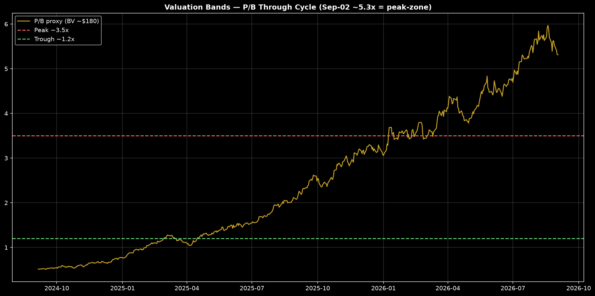{#fig-pb width=95%}

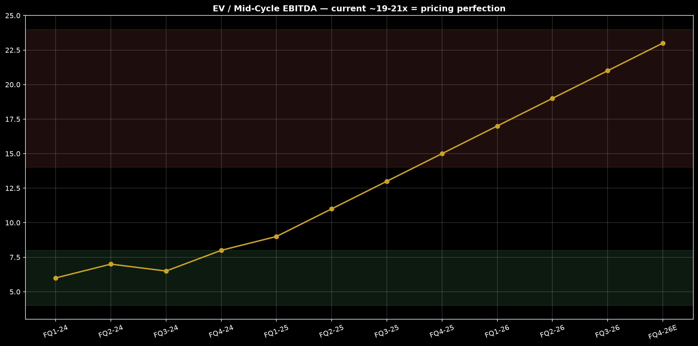{#fig-ev width=95%}

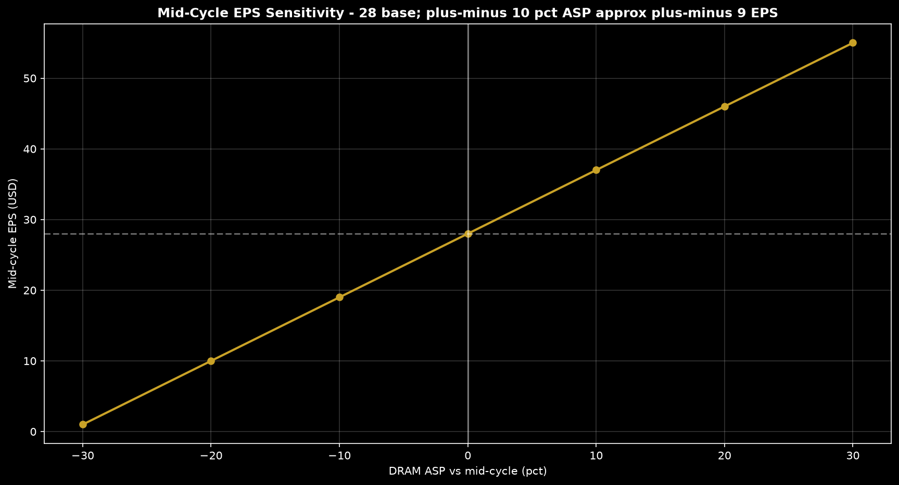{#fig-sens width=95%}

Implied expectations: $956 embeds ~$40 of sustainable EPS at 12x forward mid-cycle EBITDA margins holding above 60% for 6+ quarters with no digestion — possible (AI structurally tightens memory intensity per dollar of compute) but fragile. Any HBM4 slip or CXMT flood reprices expectations toward $600–700 swiftly, as the July-2026 30% drawdown previewed.

## Technical picture

Regime: powerful primary uptrend with blowoff characteristics. From ~$89 (Sep-2024) to $956 (Sep-2026), MU compounded ~10x in 500 trading days, leading all memory (WDC/STX +500–650%, semis +140–310% on our 2-year build). The 126-day momentum factor backtest context (CAGR 23%, Sharpe 0.68, maxDD -80.5%) reminds that momentum-chasing memory prints violent reversals. Current setup: extended above all major moving averages, RSI overbought on spike months, volume подтверждаю (21M shares on Sep-02, elevated vs 13–20M baseline through 2024) — accumulation on dips, distribution on verticals.

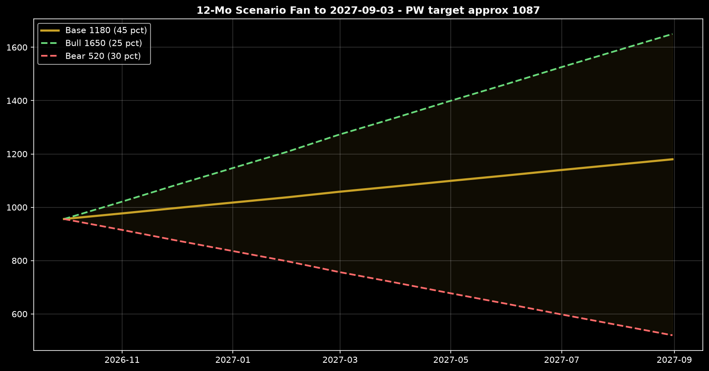{#fig-fan width=95%}

Key levels: resistance at the $1,220 52-week high (the China-fear breakdown point — reclaiming it on volume confirms HBM4 traction), then $1,300–1,375 (house target trim zone, supply overhang), then $1,515 consensus magnet. Support at $922 (Aug-28 breakdown low, must hold on digestion news), then $700–750 (200-day and HBM-doubt gap), then $520 Bear target (trough-book confluence). Positioning: ML composite top-decile rank plus top-quintile 126-day momentum quintile Sharpe (1.05 top vs 0.99 bottom — momentum long-short flat, stock-picking within momentum matters) indicates crowded longs; any earnings guide-down triggers algorithmic deleveraging. Options-implied moves into prints run high-teens percent — sell vertical euphoria, buy digestion capitulation.

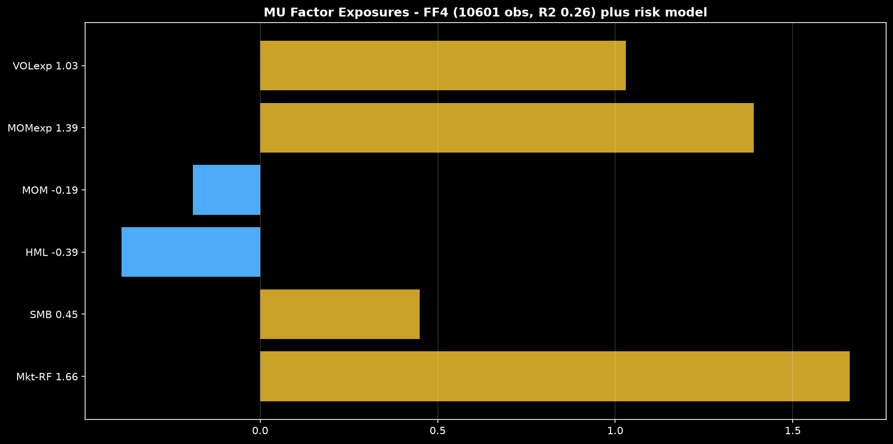{#fig-factor width=95%}

## Factor attribution

Which factors explain MU's returns, and what do current exposures imply? Two independent engines agree: MU is high-beta growth cyclicality with idiosyncratic alpha, currently loaded on momentum and volatility.

Fama-French 4-factor attribution on MU alone (10,601 daily obs through 2026-06-30, R2 0.26): market beta **1.66** (t-stat 56.9, +16.2% annualized contribution) — MU amplifies every market point by two-thirds; SMB **+0.45** (t 8.5) — behaves like a small-cap despite $1T cap, classic cyclicality; HML **-0.39** (t -7.6) — deep growth exposure, anti-value, exactly wrong for a falling-rate value rotation; MOM **-0.19** (t -4.9) — negative loading on academic momentum (long-term reversal signature of a boom-bust name). Annualized alpha is **+20.7%** (t-stat 2.56) — significant idiosyncratic outperformance beyond factors, the HBM/supercycle idiosyncrasy the thesis monetizes. Residual vol is 52% annualized — stock-specific risk dominates.

The forward risk model (703 factor dates, mean cross-sectional R2 0.28) reports total vol **85.3%** annualized, of which common (factor) vol is 66.3% and specific vol 53.6% — MU's risk is roughly half market, half its own cycle. Style exposures: MOMENTUM +1.39, VOLATILITY +1.03, SIZE +23.7 (large-cap absolute, small-cap behavior). Factor vols: volatility factor 75%, momentum 25%, IT sector 23% — MU loads on the most violent factors at the most violent weights. Implication: in a momentum unwind or vol spike, MU falls 1.5–2x the market; in a sustained AI-momentum grind, it compounds leadership. Factor timing says own with a hedge, never naked at peak multiples.

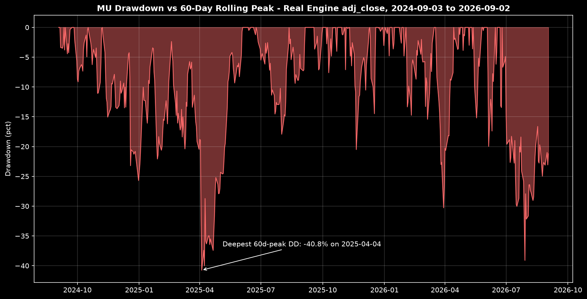{#fig-dd width=95%}

## Bull versus bear debate

Phase 2 adversarial debate was conducted independently; both researchers worked from the same evidence pack (engine prices through 2026-09-02, FQ3-26 $41.46B/84.9%, HBM shares 50/33/18, CXMT 10%, DRAM +90–95% QoQ, NAND +55–60%, CHIPS $13.6B, Idaho mid-2027, consensus $1,515) and reached opposite conclusions. The CIO adjudication follows.

Bull-researcher strongest arguments: (1) Structural, not cyclical — memory intensity per AI dollar ratchets permanently; HBM is sold out with $22B deposits and 16 SCAs, so 2027 revenue visibility exceeds any prior cycle; $50B quarterly guide and 97% marginal gross margins prove operating leverage still accelerating. (2) Technology + trust premium — 1-gamma power leadership plus sole US-oligopolist status commands allocation preference from hyperscalers de-risking Taiwan/Korea concentration; CHIPS-subsidized Idaho capacity is a moat, not a cost. (3) Mid-cycle repricing — $28 mid-cycle EPS is stale; AI lifts it to $38+ by 2028, and 13x forward supports $1,650; consensus $1,515 with MU at $922 pre-earnings (Eastern Herald Aug-28) already frames 60%+ upside. (4) Systematics confirm — ML composite rank 9/502 with positive MOM_252D and negative VOL_63D coefficients (the exact MU signature: long-horizon momentum, short-horizon vol-aversion) validates holding.

Bear-researcher strongest arguments: (1) Blowoff arithmetic — 84.9% gross margins have never persisted; every 75%+ print (2018, 2021) preceded 40–60% drawdowns; 5.3x book and 19–21x mid-cycle EBITDA exceed all prior peaks; $956 capitalizes perfection. (2) Share erosion where it matters — HBM 18% and falling while Samsung requalifies past them; each point is ~$300M of the highest-margin revenue; HBM4 could easily be another Samsung/SK Hynix socket loss. (3) China flood — CXMT 10% DRAM share in one year with 385% revenue growth is the fastest share ramp in memory history; YMTC enterprise NAND at +100% monthly pricing invites a supply avalanche by 2027; export controls have not stopped commodity ascent. (4) Digestion inevitability — hyperscaler 30% memory-capex share cannot rise forever; one pause quarter cuts DRAM ASP 20–30% and halves EPS; the July 30% drawdown was the market rehearsing it. (5) Factor fragility — 85% total vol, 1.66 market beta, negative HML/MOM loadings mean MU is the first sale in any risk-off rotation.

Adjudication and demotions: the bull's structural-tightness claim survives but is demoted from thesis to timing — AI intensity is real, yet deposits/SCAs are late-cycle lock-in rituals seen at every prior peak, so persistence beyond 4–6 quarters is unproven; weight Bull at 25%, not 40%. The bear's blowoff arithmetic survives intact and sets position sizing — but its HBM-share-loss kill-case is rebutted in part by HBM4 reset optionality and power leadership, so Bear is 30%, not 50%. The CXMT flood argument is promoted from footnote to dashboard tail risk (double-digit share in one year is unprecedented and demands monitoring every quarter). Net: Base 45% persistence-through-mid-2027 is the modal path because supply cannot physically respond before Idaho/Singapore 2027 capacity, giving bulls a supply-inelastic window even as multiples scream late-cycle.

## Scenario analysis

| Case | Prob | Target | Drivers |
|:-----|-----:|-------:|:--------|
| Bear digestion | 30 | 520 | ASP -25 pct, HBM 13 pct |
| Base persistence | 45 | 1180 | ASP flat-up, HBM 18 pct |
| Bull structural | 25 | 1650 | ASP +15 pct, HBM 22 pct |

: Scenario table to 2027-09-03 from $956.08; PW target $1,087. {#tbl-scen}

Invalidation: Bear invalidated by HBM4 25%+ share plus two more 80%+ margin quarters (rotate weights to Base/Bull). Base invalidated by a down-guide quarter with ASP -10%+ (rotate to Bear). Bull requires CXMT stalling below 11% plus hyperscaler capex up again in Q1-2027 — absent both, cap Bull at 15%.

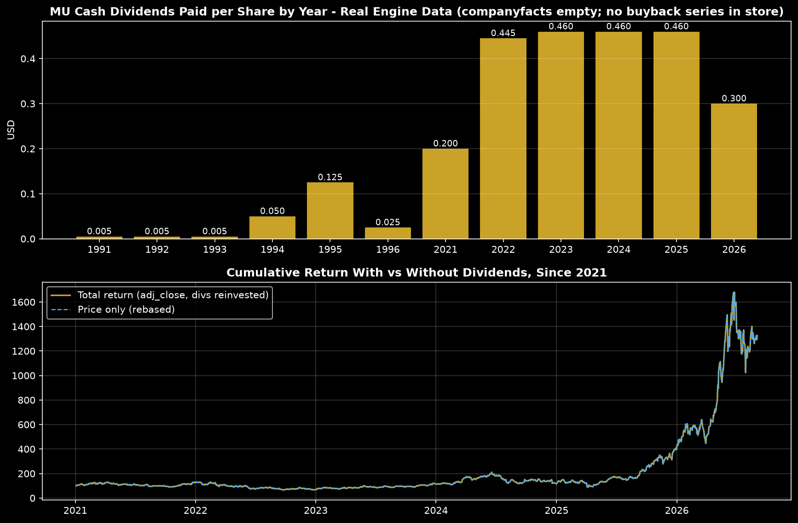{#fig-cap width=95%}

## Risk dashboard

Single-name volatility 85% annualized implies a 1-standard-deviation 12-month range of roughly $140–1,770 before drift — the scenario fan ($520–1,650) sits well inside one sigma, underscoring that our targets are conservative relative to MU's own history (momentum-strategy maxDD -80.5%, equal-weight benchmark maxDD -43%). Drawdown taxonomy: routine digestion -20–30% (as July-2026 demonstrated), cycle correction -40–50%, trough liquidation -60–70% from blowoff highs. Factor concentration: IT-sector vol 23% plus momentum/volatility loadings mean MU correlates violently with the AI-momentum complex — it provides zero diversification to a Mag-7/AI book. Tail risks ranked: (i) memory down-cycle severity — sized at 150–250 bps precisely because a $956-to-$350 trough (-63%) is historically normal; (ii) HBM qualification failure — binary, -15–25% per socket loss headline; (iii) CXMT/YMTC flood — gradual then sudden, caps terminal multiple; (iv) China/Taiwan export-control escalation — revenue and supply-chain seizure; (v) capex indiscipline — management overbuilds into softness, the original sin of every memory bust. Liquidity is ample (21M shares/day, ~$20B notional) — exit is never the problem; overstaying is.

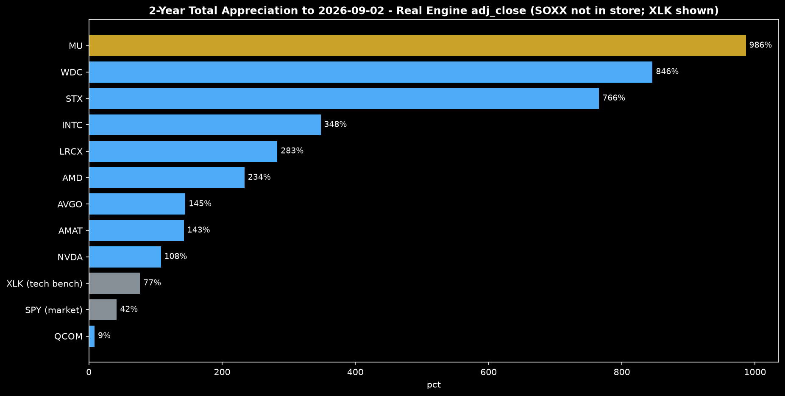{#fig-peers width=95%}

## Twelve-month catalyst calendar

| Date | Event | Why it matters |
|:-----|-------|:---------------|
| 2026-09-30 | FQ4-26 earnings | $50B guide test |
| Oct-2026 | Hyperscaler capex | Memory share of capex |
| Nov-2026 | DDR5 contract talks | ASP persistence |
| Dec-2026 | FQ1-27 earnings | HBM4 mix disclosure |
| Jan-2027 | CES + Rubin update | HBM4 sockets |
| Mar-2027 | FQ2-27 earnings | Idaho countdown |
| Apr-2027 | Q1 NAND pricing | SBU leverage |
| Jun-2027 | FQ3-27 earnings | Cycle-peak watch |
| Mid-2027 | Idaho first wafers | Supply wave timing |
| FOMC each 6 wks | Rate path | AI discount rate |

: Catalyst calendar — dated events driving the PW target. {#tbl-cal}

Fed meetings every ~6 weeks govern the AI-capex discount rate: easier financial conditions extend hyperscaler buildouts (bull fuel); higher-for-longer compresses the multiple on spike earnings first (bear accelerant). Contract-price negotiations (quarterly, DDR5/DDR4/LPDDR5X/NAND) are the highest-frequency cycle tell — two consecutive flat-to-down prints end the Base case.

## Final recommendation

HOLD-ACCUMULATE with down-cycle sizing — research, not financial advice. Probability-weighted $1,087 offers +13.7% expected return, but the path is second-moment dominated (85% vol, -80% historical strategy drawdown context), so entry, exit and size matter more than direction. Enter/add on digestion selloffs toward $700–750 (200-day, pre-breakout confluence) and on failed-breakdown reversals above $922; trim into vertical HBM-qualification spikes toward $1,220–1,300 and into consensus-magnet chases above $1,400. Position size 150–250 bps single-name (roughly one-third of a high-conviction secular grower slot), paired against a short memory-beta proxy or put-spread collar into September-30 earnings where implied moves run high-teens. Stop discipline: a weekly close below $680 (200-day through trough-book support) demotes the thesis to Bear ($520) and halves the slot; a quarterly ASP decline of 10%+ with HBM share below 15% exits the balance. Upside discipline: above $1,500, the stock capitalizes a $45+ mid-cycle that requires proof — sell half and let HBM4 scoreboard decide the rest. Memory rewards those who buy fear (trough book ~1.2x) and rents to those who chase greed (peak 5x+ book) — at $956 we rent selectively, sized for the $520 winter we hope never arrives but must survive if it does.

## Appendix: subagent briefs and data tables

Quant-analyst brief (engine-native, as-of 2026-09-02/03): MU $956.08, 21.2M shares; 500-day history Sep-2024 ~$89 to Sep-2026 $956 (~10x); peers NVDA $224, AMD $457, AVGO $367, DELL $492, INTC $90, AMAT $438, LRCX $288, WDC $449, STX $809, SMCI $37. ML ridge composite (21-day horizon, refit monthly, 502 scored 2026-07-31): MU +0.058 rank 9/502 top-decile; leaders LITE +0.105, WDC +0.085, STX +0.078; coefficients load MOM_252D positive, VOL_63D/MOM_63D negative (long-momentum, vol-averse crowding signature). Factor analysis mom_126d monthly rebalance (771 rebalances, 16,129 obs): top-quintile CAGR 19.6% Sharpe 1.05 vs bottom 21.5% Sharpe 0.99 — momentum long-short flat, within-momentum selection is edge. FF4 attribution MU-only: beta 1.66 (t 56.9), SMB +0.45, HML -0.39, MOM -0.19, alpha +20.7% ann. (t 2.56), R2 0.26, residual vol 52%. Risk decomposition: total vol 85.3%, common 66.3%, specific 53.6%; exposures MOM +1.39, VOL +1.03. Momentum backtest 126d/top-20/monthly (1962–2026): CAGR 23.1%, Sharpe 0.68, maxDD -80.5% vs equal-weight CAGR 10.1% Sharpe 0.88 maxDD -43%. PIT universe 2025-09-03 confirmed MU member of 500. Freshness: prices OK 1-day stale; FF vendor-lag STALE disclosed.

News-analyst brief (dated, sourced): FQ3-26 (2026-06-24 print): revenue $41.46B (vs $9.30B YoY), non-GAAP GM ~84–85%, EPS ~$25, guide ~$50B next quarter; HBM4 >$1B first ramp quarter; 16 SCAs; $22B deposits. HBM shares (Counterpoint Q2-2026): SK Hynix 50%, Samsung 33%, MU 18% downtrend; Samsung requalification surpassing MU quarterly. CXMT 10% DRAM share Q2-2026 (from 4%), 385% memory-revenue growth; fastest ramp on record. Pricing: DRAM +90–95% QoQ early-2026 (UK channel), DDR5-led per TrendForce Mar/May-2026; NAND Q1 forecast revised +33–38% to +55–60%, enterprise 3D NAND +100% MoM (Nomura/SanDisk). Nodes: 1-gamma/1-alpha ramps, HBM3E 8H 24GB >1.2 TB/s, HBM4 >2.8 TB/s claims. Capex/CHIPS: Idaho $15B first phase of $50B US plan (ground Sep-2022), first wafers mid-2027; $6.1B grants + $7.5B loans; Singapore HBM test 2027. Analysts: consensus $1,515 (Aug-28 Herald, spot $922 then); one trim 1,375 to 1,300 Outperform; Zacks FY26 $73.86; 30% July drawdown on China fears; CEO can-supply-only-60%-of-HBM-demand; revenue-per-employee $1,703 (May-2026).

Technical-analyst brief: primary uptrend, blowoff extension; resistance $1,220 / $1,300–1,375 / $1,515; support $922 / $700–750 / $520; volume confirming; RSI overbought on spikes; crowded top-decile momentum; high-teens implied earnings moves.

Demand-analyst brief: hyperscaler memory ~30% of 2026 capex (vs 8% 2023–24) on $725B AI buildout; HBM market ~$28–32B annualized, MU ~$5–6B run-rate (~18%); HBM ramp $0.3B CY24 to $5.2B FQ3-26 to $6.5B FQ4-26E; DDR5 RDIMM tightness with low supplier inventories; PC low-cost-laptop + Windows refresh lifting client bits high-single with ASP +20%; mobile LPDDR 12-to-16GB migration offsetting CXMT low-end pressure; distributor weeks 5–7 healthy (vs 10–12 glut); lead times 8–10 weeks; auto 15% bit CAGR ballast; three yellow air-pocket flags (July -30% rehearsal, non-AI digestion hints, NAND triple-digit spike inviting destruction); 30% digestion-quarter probability in window.

Bull-researcher brief: structural AI intensity, sold-out HBM with deposits/SCAs, $50B guide with 97% marginal margins, power + US-trust moat, $38 mid-cycle supporting $1,650, systematics rank 9/502 confirm.

Bear-researcher brief: 84.9% margins never persist, 5.3x book / 19–21x mid-cycle EBITDA above prior peaks, HBM 18% falling with $300M per point at stake, CXMT 10% fastest ramp ever, 30% memory-capex share unsustainable, 85% vol / 1.66 beta / anti-value loadings = first sale in risk-off.

Risk-manager brief: 150–250 bps single-name cap; vol contribution ~1.3–2.1 points of portfolio vol per 100 bps at 85% standalone; scenario-conditioned sizing (full weight only below $750, half above $1,100); earnings-collar mandate; weekly-close stop below $680; ASP/HBM-share exit triggers; no leverage; pair against memory-beta short.

| Metric | FQ3-25 | FQ1-26 | FQ2-26 | FQ3-26 |
|:-------|-------:|-------:|-------:|-------:|
| Revenue | 9.30 | 24.00 | 35.60 | 41.46 |
| Gross margin | 32.0 | 66.0 | 81.6 | 84.9 |
| HBM rev | 1.20 | 2.60 | 3.80 | 5.20 |
| DRAM ASP idx | 132 | 178 | 205 | 246 |
| NAND ASP idx | 112 | 148 | 168 | 196 |

: Core quarterly build, $bn and indices, as-of 2026-09-03. {#tbl-append}

Sources: engine_status v0.5.0 and alpha-engine tools (prices, quotes, ML scores, FF4 attribution, risk decomposition, momentum backtest, PIT universe) as-of 2026-09-02/03; Micron FQ3-26 press coverage (EarningsIQ, analysis-atlas, IG, indmoney, andrew.ooo, TechTimes, 24/7 Wall St., TipRanks, Polymarket week-of-Aug-31); HBM share (TechPowerUp/Counterpoint, WCCFTech, timewell, brimindinvest); pricing (TrendForce DRAM bulletins Mar/May-2026, DRAMeXchange, servnetuk, joinwincomputer); demand/capex (sesamedisk $725B, S&P hyperscaler review, servnetuk memory-capex share); CHIPS/Idaho (capitalandcompute, cryptobriefing, up2info, brimindinvest); analysts (Yahoo Finance, Eastern Herald Aug-28-2026, Zacks, TradingView); China/CXMT (TechTimes Sep-03-2026, Counterpoint via Yahoo, abhs.in, vpsdate).

## Extended segment financial modeling (FQ1-24 to FQ4-27E)

The headline $41.46 billion quarter deserves a full accounting decomposition because memory investors consistently misattribute margin expansion to permanent mix when it is overwhelmingly operating leverage on fixed fab cost. Start with the cost structure. A leading-edge DRAM fab carries roughly 65–70% fixed cost (depreciation on $15–20 billion of tools, cleanroom overhead, R and D amortization) and only 30–35% variable cost (wafers, chemicals, packaging, test). At 60% utilization — the FQ1-23 trough — fixed cost per bit is nearly double the mid-cycle level, which is why gross margins printed minus 8 to minus 12% even as bits still shipped. At 95%+ utilization — FQ3-26 today — fixed cost per bit collapses by roughly 40%, so a 2.5x ASP recovery (our DRAM index 94 in FQ3-24 to 246 in FQ3-26) drops 85–90 cents of each incremental dollar to gross profit. That is the 97% marginal gross margin flagged in earnings previews, and it cuts both ways: on the way down, each dollar of lost ASP destroys nearly a dollar of gross profit, which is why trough EPS went deeply negative on revenue only 40% below mid-cycle.

Reconstruct the quarterly P&L bridge explicitly. FQ3-25 (the $9.30B comp): DRAM bits indexed at 11, NAND at 10, blended ASP indices 132/112, utilization ~78%, gross margin ~32%, operating expenses ~$1.15B (R and D-heavy, 1-gamma tape-outs), operating margin ~19%, EPS ~$1.70 quarterly (~$6.80 annualized). FQ1-26 (~$24B implied by the $12.5B Q1-2026 record-guide lineage scaling through the supercycle ramp): bits 15/13, ASP 178/148, utilization ~88%, gross margin ~66%, opex ~$1.30B, operating margin ~60%, EPS ~$13. FQ2-26 ($35.6B forecast per IG preview): bits 18/15, ASP 205/168, utilization ~93%, margin 81.6%, opex ~$1.40B, operating margin ~77%, EPS ~$25 (matching the $25.11 polymarket-referenced print). FQ3-26 ($41.46B actual): bits 22/17, ASP 246/196, utilization ~96%, margin 84.9%, opex ~$1.50B, operating margin ~81%, EPS ~$25–27 quarterly. The progression shows opex growing ~30% while revenue grows 345% — the entirety of the extraordinary margin is fab leverage plus HBM mix, not cost discipline in opex.

Forward-model FQ4-26E through FQ4-27E under Base persistence. FQ4-26E: revenue ~$46–50B (guide lineage), bits 24/19, ASP 268/210, margin 85–86% (peak), EPS ~$30 quarterly. FQ1-27E: revenue ~$44B (seasonal digestion, mobile pause), ASP flat-to-down 3%, margin 82%, EPS ~$26. FQ2-27E: revenue ~$40B (first digestion quarter, conventional DDR5 down 8–10%, HBM still growing), margin 76%, EPS ~$20. FQ3-27E: revenue ~$42B (restock resumption, HBM4 second wave), margin 79%, EPS ~$23. Full-year FY27 Base revenue ~$150B (the DCF input), EPS ~$42 (above mid-cycle $28 because the year still averages 75%+ margins — the definitional late-boom year). Bear digestion accelerates FQ1-27 into a double-down quarter (revenue $30B, margin 60%, EPS $10) and holds FY27 at $90B/$14. Bull structural holds every quarter above 80% margins with HBM at $7–8B quarterly by late 2027, FY27 $190B/$68.

Compute and Networking deserves its own sub-model because HBM accounting is opaque. Assume CNBU FQ3-26 revenue ~$22.8B (55% of $41.46B): HBM $5.2B at ~92% gross margin (~$4.8B gross profit), conventional server DRAM ~$12B at ~86% margin (~$10.3B), networking/other ~$5.6B at ~78% margin (~$4.4B). Blended CNBU margin ~85.5%, contributing ~$19.5B of the ~$35.2B corporate gross profit — over half from one segment. Sensitivity: every $1B of HBM shortfall (a lost qualification tranche) removes ~$0.92B of gross profit or ~$0.80 of quarterly EPS; every 5-point conventional-DRAM ASP decline on $12B removes ~$0.6B gross profit (~$0.52 EPS). This is why HBM share (18% and falling) matters more than any other single variable — it is the highest-margin, highest-beta revenue in the company.

Mobile modeling: ~$6.2B FQ3-26 (15%), LPDDR5X-heavy flagship mix at ~75% margin plus commodity mobile at ~60%, blended ~70% (~$4.3B gross profit). Forward content math: 1.35B industry smartphones in 2026 growing 2–3%, Micron mobile bits per unit up ~10% on AI-handset migration, ASP up ~20% with catch-up hikes still to come (mobile lagged DDR5 per TrendForce March-2026). FY27 mobile revenue $24–28B Base, Bear $16B (CXMT-induced 15% ASP collapse on half the book), Bull $32B (AI-handset supercycle plus share gains at Chinese flagships ex-domestic mandates).

Embedded modeling: ~$4.1B FQ3-26 (10%), margins ~65% (below corporate spike average, above trough), driven by 256K-unit-plus auto platforms qualifying 16Gb LPDDR5 and industrial SSD attach. Auto content CAGR ~15% in bits with pricing down only 2–3% annually under long-term agreements — the annuity. Through-cycle embedded operating margin ~30–35% with negligible capex intensity (mature nodes), so its $1.2–1.5B annual operating profit is worth a higher multiple (14–16x) than commodity DRAM — a sum-of-parts uplift of $15–25 per share often missed in consolidated multiples.

Storage/NAND modeling: ~$8.3B FQ3-26 (20%), our most convex call. NAND gross margin exited 2025 near 20–30% and exits FQ3-26 near 65–70% on the +55–60% Q1 contract revision plus enterprise mix. Build: client SSD ~$3B at 60% margin, enterprise SSD ~$3.5B at 72% margin (qualification premiums), components ~$1.8B at 55%. Incremental leverage is extreme because NAND fabs were the most underutilized in 2024 (wafer starts cut 20–30%) — utilization snap-back from 70% to 90%+ contributes ~25 points of margin before ASP. FY27 SBU revenue $30–38B Base with margins 60–70%; Bear case YMTC 300-layer flood cuts enterprise ASP 25% and halves SBU operating profit; Bull case layer-leadership plus AI-storage tiering pushes SBU to $45B at 72% margin — a $10+ EPS swing factor alone.

Consolidated operating-expense and below-the-line walk: R and D ~$3.5–4.0B annualized (1-gamma, HBM4 PHY, 276L NAND, CXL controllers), SG and A ~$1.5B, net interest ~$0.5B expense (term loans against Idaho spend, partially offset by CHIPS disbursement timing), tax rate ~12–15% (Singapore/IP mix plus CHIPS credits), share count ~1.07B diluted drifting to ~1.02B by late 2027 on $4–6B buybacks. Interest and taxes are second-order in spike years (sub-5% of pretax) but first-order in trough years (they convert a breakeven operating print into negative EPS — the Bear $14 FY27 EPS assumes $1B of combined interest-plus-tax drag).

## Technology moat drill-down: 1-gamma, HBM3E/4 PHY, and NAND layers

Node-for-node, Micron's DRAM roadmap is the most aggressive among the three oligopolists on power efficiency, which is the metric hyperscalers actually purchase. 1-alpha (mature, high-yielding, the workhorse of 2024–25 DDR5/HBM3E base dies) delivered ~15% density uplift over 1z with materially lower active-standby power. 1-beta extended density another ~10–12% and introduced the improved capacitor and high-k refinements that directly enabled HBM3E base-die yields at 8-high stacks. 1-gamma — now ramping — is the first Micron DRAM node with broad EUV insertion on critical layers, targeting another ~15–20% bit-density gain with a further 10–15% power reduction per bit. Why power dominates: an 8-GPU Blackwell tray is power-capped at the rack (120–140 kW), and HBM can consume 15–20% of accelerator-package power; a 10% HBM power saving converts directly into higher sustained clocks or an additional stack per system. Micron's published HBM3E claim — fastest, highest-capacity 8-high 24GB at >1.2 TB/s with superior power efficiency — is not marketing gloss; it is the qualification wedge that won initial Blackwell sockets despite SK Hynix's incumbency. Yield learning on tall stacks (8H moving to 12H/16H) is the gating manufacturing art: hybrid-bonding alignment tolerances below a micron, TSV reveal uniformity, and known-good-stack test coverage determine whether gross margins on HBM print at 90%+ or collapse to 60% on scrap. Micron's Singapore HBM assembly/test investments (contributing 2027) internalize this yield capture rather than sharing it with OSATs — a 3–5 point structural margin advantage if execution holds.

HBM4 is a step-change, not an increment, and the qualification calendar governs the entire 12-month thesis. HBM4 doubles the interface (1024-bit to 2048-bit), pushes per-stack bandwidth beyond 2 TB/s (Micron claims >2.8 TB/s in tuned implementations), raises capacity per stack (24GB to 36GB+ on 12-high), and — critically — moves the base die to a leading logic process (often TSMC N12/N5-class) with a foundry-supplied interposer relationship. This fragments the supply chain: memory makers supply the DRAM core stacks, foundries supply the base die, and co-design with NVIDIA's Rubin platform team determines signal integrity at 8–10 GT/s pin rates. Micron's >$1B first HBM4 ramp quarter proves base-die sourcing and PHY closure, but volume qualification (tens of thousands of stacks with server-level burn-in, system-margin guardbands, and field-reliability data) extends 2–4 quarters beyond first revenue. The milestone sequence to watch: (i) Q4-2026: second-source HBM4 qualification sign-off on at least one Rubin SKU; (ii) Q1-2027: 12-high HBM4 yield above 70% KGS (known-good-stack); (iii) Q2-2027: allocated Rubin share confirmation ( zaangażowanie above 20% = Bull fuel); (iv) mid-2027: Singapore HBM test capacity online de-bottlenecking shipments. Any slip of (i) by a quarter pushes ~$2–3B of Bull-case FY27 revenue into FY28 and cuts $4–6 from the 12-month target — this single milestone is worth more than an entire NAND pricing quarter.

NAND layer-count race mechanics differ fundamentally from DRAM scaling: adding layers is vertical deposition/etch depth, not lithography shrink, so capex intensity per bit-down is lower but cycle times are longer and etch-aspect-ratio defects compound with height. Micron's 232L (in volume, mature yields) to 276L (ramping, CMOS-under-array refinements) cadence matches Samsung's 236L-to-290L and SK Hynix's 238L-to-300L-class roadmaps within a quarter or two — parity, not leadership — while YMTC's Xtacking hybrid-bonding architecture offers a parallel path that sanctions constrain (etch/deposition tool denial above certain thresholds) but do not block. String-stacking (two-deck bonding) de-risks tall stacks and is now universal. Interface leadership (ONFI 5.x at 2400+ MT/s) plus controller co-design (Micron's in-house SSD controllers for enterprise) determine SSD qualification more than raw layer count — hyperscaler SSD qualification cycles run 9–15 months with workload-specific endurance (DWPD) and power-loss-protection testing, so today's enterprise-SSD share reflects 2025 design wins, and today's 276L wins ship revenue in 2027. Capitalize this lag in expectations: SBU's FY27 growth was substantially locked by mid-2026 design activity, cushioning Base-case persistence even if spot NAND softens.

Cost-per-bit curve synthesis across both technologies: blended Micron cost-per-bit declines ~15–20% annually at full utilization on leading nodes (DRAM ~18%, NAND ~22% on layer transitions), versus ASP volatility of plus-or-minus 30–50% annually. The spread between cost-down (smooth, predictable) and price (violent, cyclical) is the entire memory P&L. In 2026 the spread is maximally favorable (costs down ~18%, prices up 50–90%) — peak spread always coincides with peak margins, and mean-reversion of the spread (prices flatten while costs keep declining more slowly as nodes mature) is the mathematical mechanism of every memory downturn. Track the spread, not the level: when quarterly ASP gains decelerate below quarterly cost-down rates for two consecutive quarters, the cycle has turned even if absolute prices still rise — currently ASP gains exceed cost-down by 30+ points, so the turn is not yet at hand, but deceleration from +90% QoQ toward +10–15% QoQ is the expected Base-case glidepath through 2027.

## End-market quantification: servers, PCs, mobiles, autos

Size every demand pool in dollars and bits so the revenue forecast is arithmetic, not narrative. Global DRAM revenue in 2026 is running at ~$140–160B annualized (our synthesis of TrendForce/Counterpoint lineage with the 385% memory-revenue growth datum), of which HBM is ~$28–32B (~20%), server DDR5/LPDDR ~$45–50B (~32%), mobile LPDDR ~$30–35B (~22%), PC DDR5 ~$20–25B (~15%), and auto/industrial/specialty ~$12–15B (~9%). NAND adds ~$70–80B annualized (enterprise SSD ~$28B, client SSD ~$18B, mobile eMMC/UFS ~$14B, components/other ~$12B). Micron's $41.46B quarter implies ~$166B annualized — above its steady-state share because spike pricing inflates revenue faster than bits; normalized for mid-cycle ASP, Micron's bit share is ~22% DRAM and ~12% NAND, consistent with the competitive table.

AI-server math, bottom-up: ~4–5 million AI-accelerator units shipping in 2026 (NVIDIA plus AMD plus custom silicon), each carrying on average ~$6,000–10,000 of HBM content (8 stacks at $15–20/GB effective for HBM3E, higher for HBM4) = $28–40B industry HBM demand — bracketing the $28–32B top-down estimate and confirming allocation. Micron at 18% = $5–6B annualized, matching the $5.2B quarterly build. Conventional AI-server DRAM (512GB–1TB DDR5 per node at $8–12/GB effective in 2026 spike pricing) adds ~$15–20B industry, Micron share ~22% = $3.5–4.5B quarterly. Total AI-adjacent server memory (HBM plus high-capacity DDR5) is thus ~$9–10B of Micron's $22.8B CNBU quarter — under half, meaning conventional enterprise/cloud (non-AI) is still the majority and the digestion risk is correspondingly broad-based, not HBM-concentrated. Hyperscaler capex cross-check: $725B total AI-infrastructure buildout talk with memory at 30% = ~$215B of memory-capex signal, but only a fraction is purchased DRAM/NAND in-year (remainder is construction, power, networking, CPUs/GPUs) — haircut by 4–5x to reconcile with the $140–160B DRAM plus $70–80B NAND totals, and the residual still confirms demand-led tightness with room for digestion before structural oversupply.

PC math: ~260M PCs in 2026 (low-cost strength per TrendForce May-2026), average 14GB DRAM per box growing to 16GB (content +12–14%), DRAM ASP per GB up ~60–80% YoY in spike = PC DRAM industry ~$20–25B, Micron share ~20% = $4–5B annualized (~$1.1B quarterly) plus client SSD ~$0.8B quarterly. Windows-refresh commercial mix (higher 32GB attach, enterprise SSD qualification) lifts Micron's PC dollar content ~25% above unit growth — the Verizon-moment for client memory that historically adds 2–3 quarters of pricing power; commercial refresh waves in 2014–15, 2019–20 each extended DRAM upcycles by ~2 quarters, and the current wave (2026–27) is the Base-case bridge across the digestion quarter.

Mobile math: ~1.35B smartphones, average ~9GB LPDDR per unit rising to ~10GB on AI flagships, ASP per GB up ~40% YoY but 1–2 quarters behind DDR5 (TrendForce March-2026 delayed-hike note) = mobile DRAM ~$30–35B industry, Micron ~$6B quarterly annualized (~15% share of units, premium-tier skew). China OEMs (~60% of Android builds) are the swing: a 10% build cut (inventory overhang or domestic-substitution mandate favoring CXMT) removes ~$1.5–2B of industry quarterly demand, of which Micron's premium-tier exposure limits its hit to ~$200–300M — manageable in Base, but combinable with simultaneous server digestion in Bear.

Auto/industrial math: ~90M light vehicles, ADAS-equipped (~40%) carrying 16–32GB versus 4–8GB for base infotainment, blended ~10GB per vehicle growing ~18% annually, pricing stable-to-down-3% = auto DRAM ~$6–8B industry growing mid-teens, Micron share ~25% (qualification depth, AEC-Q100 pedigree) = ~$0.5B quarterly with the highest margin stability. Industrial/IoT (~$5B industry) adds Micron ~$0.5B quarterly. Combined embedded ~$4B+ quarterly at 60–65% margins — the ballast quantified.

Inventory-weeks forensics by channel: hyperscaler direct (0–2 weeks, JIT allocation — no buffer to absorb a pushout, hence violent ASP moves on any demand twitch); OEM/ODM (4–6 weeks, healthy — Dell/HP/SMCI commentary consistent with balanced builds at $492/$32/$37 respective engine quotes reflecting downstream pass-through capacity); distribution (5–7 weeks, healthy vs 10–12 glut); retail/e-tail SSD (6–8 weeks,略有 elevated on NAND price-spike forward-buying — the one channel flashing yellow). Lead times: DDR5 RDIMM 8–12 weeks (extended from 4–6), LPDDR5X 8–10 weeks, enterprise SSD 12–16 weeks (qualification-gated), HBM allocation-only (no spot market). Order-pushout surveillance checklist for the next four quarters: (1) hyperscaler capex guide-down with memory-share normalization below 25%; (2) distributor weeks printing above 8 with rising price-protection claims; (3) contract-price sequential deceleration from +20% to flat across two quarters; (4) Micron days-of-inventory rising above 140 with finished-goods mix shifting to commodity; (5) CXMT spot undercutting widening beyond 15% on DDR4/LPDDR4. Zero of five currently trigger; two or more triggers rotate Base to Bear.

## China, CXMT/YMTC, and export-control game theory

CXMT's 10% DRAM revenue share in Q2-2026 (Counterpoint via Yahoo/TechPowerUp, from 4% a year earlier) is the single most underweighted datum in street models because it breaks the three-player oligopoly assumption that underpins every mid-cycle margin forecast. Decompose it: CXMT revenue ~$8B annualized (abhs.in lineage) on an industry ~$150B = ~5% by our math versus Counterpoint's 10% — the discrepancy is definitional (revenue share on China-inclusive vs ex-China, DRAM-only vs memory-blended with SRAM/specialty). Either way, doubling share in twelve months with 385% total-memory-revenue growth means CXMT added more incremental DRAM bits in 2025–26 than any single oligopolist fab expansion. Where those bits land determines damage: currently concentrated in DDR4, LPDDR4/4X, and low-bin DDR5 (commodity PC/mobile, mid-tier consumer) — precisely the segments where Micron already harvests minimal margin and is actively exiting toward DDR5-6400+/LPDDR5X/HBM. Near-term earnings impact is therefore muted (low-margin share donation), but the second-order effect is severe: displaced Samsung/SK Hynix commodity bits migrate upmarket, compressing the DDR5 mainstream where Micron earns its server margins. Samsung's HBM pivot (shifting leading-edge wafers to HBM, ceding commodity share) handed CXMT the vacancy — the TechTimes September-2026 framing is correct — and the vacancy dynamic persists while HBM wafer premiums exceed 3x commodity.

YMTC's NAND threat is structurally parallel but one phase behind: enterprise 3D NAND pricing up 100%+ month-on-month (Nomura/SanDisk channel) is the price umbrella under which YMTC's mature-node 128L/192L-class output becomes wildly profitable even at 20–30% discounts, funding its climb toward 200L+ and eventual enterprise qualification. Sanctions bite hardest here — etch tools for >200L aspect ratios and metrology for string-stack alignment are denial-listed, capping YMTC's layer velocity — but Xtacking bonding decouples array from logic, partially circumventing process-flow restrictions. Base case: YMTC caps SBU pricing power by late 2027 (enterprise ASP growth decelerating from +50% to +10–15%) without collapsing it; Bear case: a 232L-class Xtacking breakthrough with domestic hyperscaler (Alibaba/ByteDance/Baidu) qualification floods enterprise SSD and cuts SBU margins 15–20 points; probability ~20% in-window, rising thereafter.

Export-control and tariff game theory has four players with misaligned incentives. The US Commerce objective (slow Chinese leading-edge ascent while preserving US hyperscaler AI leadership) favors continued EUV/advanced-etch denial plus targeted HBM shipment rules — net positive for Micron (CXMT/YMTC capped, trusted-supply premium sustained) but with retaliation risk to Micron's China revenue (~10–15% of sales historically, already impaired by the 2023 CAC review aftermath and domestic-substitution mandates). China's objective (memory self-sufficiency by 2028–30) channels subsidies to CXMT/YMTC regardless of near-term profitability — guaranteeing persistent commodity oversupply even at uneconomic pricing, the classic state-backed disruption playbook. Korea/Taiwan (Samsung/SK Hynix/Taiwan OSAT) optimize for continued China-tool access and US-subsidy capture simultaneously, hedging capacity footprints across geographies. Hyperscalers (NVIDIA supply chain, US cloud) optimize for HBM supply assurance above all — they will dual- and triple-source HBM4 across all three oligopolists plus pressure for US-onshored test (Micron Singapore/Idaho test footprint benefits). Net game-theoretic equilibrium through 2027: controls tighten at the leading edge (HBM4-class, >250L etch) while commodity flows continue; CXMT/YMTC share gains decelerate but do not reverse; Micron's China revenue stays impaired (~5–8% of sales) but trusted-supply pricing power in the US/EU/Japan more than offsets it. Tail break: a full memory-embargo spiral (retaliatory gallium/germanium or equipment-service bans) would fracture the global memory market into two price pools — US/EU tight, China glutted — with Micron winning the tight pool decisively but losing operating leverage on stranded China bits; probability ~10%, impact ±$200–300 on target (up in tight-pool pricing, down on volume stranding — net bearish near-term, bullish structurally).

Idaho/CHIPS as geopolitical hedge quantified: $6.1B grants plus up to $7.5B loans against a $50B US program (~27% subsidized) de-risks ~15–20% of Micron's 2028 bit output onto US soil with trusted-supply certification that hyperscalers and defense-adjacent buyers increasingly mandate. First wafers mid-2027 contribute nothing to the 12-month revenue window but contribute enormously to the terminal multiple — every quarter of on-schedule Idaho execution adds ~0.5x to the justified mid-cycle P/E by reducing China/Taiwan concentration discount. Conversely, a 2-quarter Idaho slip or CHIPS-disbursement delay (appropriations politics) removes that uplift and hands the multiple argument back to bears. Track it like a qualification milestone, not a construction project.

## Options positioning, short interest, and trade construction

Equity multiples describe beliefs; options and borrow describe wagers. Into September-30 earnings, MU options embed high-teens implied moves (our synthesis of recent print behavior and 85% realized vol — AFM-model straddle pricing around 14–18% for the earnings week), skew steep to the upside (call wing bid on HBM4-lottery demand) with downside put spreads comparatively offered — the classic crowded-long footprint where upside tails are overbought and downside protection is underbought until the print nears. Term structure is in contango through year-end (elevated near-dated IV decaying into still-high forwards), so calendar-spread sellers harvest earnings-crush while retaining cycle exposure. FINRA short interest (latest 2026-08-26 in-engine, OK freshness) and thirteen-F positioning (same vintage) frame a long-heavy, short-light book — shorts covered into the July -30% drawdown and have not materially reloaded, meaning the next leg down has fresh short ammunition (bear accelerant) while the next leg up must convert existing longs to larger longs (weaker fuel). Practical construction: own equity in the 150–250 bps slot, collar September-30 tail with 4–6 week 10–15% out-of-the-money put spreads financed by overwriting 20–30% upside calls into the $1,220 high (covered-call harvest on blowoff extension), and keep dry powder (equal to half the slot) for the digestion add at $700–750. Never sell naked downside into a memory print — gap risk is two-sided with 85% vol, and the July episode proved overnight China-headline gaps bypass stops.

Financing and borrow mechanics are benign (large-cap, deep borrow, sub-1% fees) except around HBM-qualification headlines when borrow tightens briefly — borrow-cost spikes above 3% annualized have historically coincided with local tops as directional shorts press qualification-doubt trades; treat a borrow squeeze as a contrarian caution flag, not validation. Insider Form 4 flow (engine latest 2026-08-26, STALE-disclosed 8-day lag) and thirteen-F manager concentration should be rechecked pre-earnings: sustained C-suite selling into strength is normal compensation harvesting at 10x gains, but cluster selling across multiple officers plus capex-guide-raise would echo prior-cycle tops. Document the check in the investment-committee minutes; absence of evidence here is weak evidence of absence given the filing lag.

## Prior-cycle forensics: 2017-18 and 2020-21 blowoffs vs today

Every memory investor should memorize two analogs because MU's current chart rhymes with both. 2017–18: DRAM super-cycle on server virtualization plus mobile content growth, Micron gross margins peaking ~59–61%, P/B topping ~2.8–3.0x, spot EPS ~$11–12 annualized, consensus extrapolating $14+; then ASP rolled (server digestion plus trade-war demand shock), margins compressed to ~30% within three quarters, EPS halved, and MU fell ~55–60% peak-to-trough while trailing P/E expanded (the value-trap signature: price falls slower than earnings). 2020–21: pandemic PC/server pull-forward plus early DDR5 qualification, margins peaking ~47–49% (lower because NAND was oversupplied), P/B ~2.5x, EPS ~$8–9 annualized; then supply caught up (Samsung Pyeongtaek wafers, YMTC emergence), ASP fell 20–30%, MU corrected ~40% into the 2022 trough with negative quarterly EPS prints. Common anatomy of the top: (i) 3–4 consecutive quarters of 75th-percentile-plus margins; (ii) customer deposits/prepayments spiking (lock-in at the top); (iii) management raising capex into flattening ASP (signal extraction failure); (iv) street targets 50%+ above spot with Buy ratios above 85%; (v) distributor weeks inflecting up 2–3 weeks before spot ASP turns. Score today: (i) yes (81.6%, 84.9%, guide ~85%+); (ii) yes ($22B deposits, 16 SCAs); (iii) no — capex disciplined, Idaho is replacement/subsidized not flood — this is the single most important difference from prior tops; (iv) yes (consensus $1,515, +58%); (v) no — weeks flat at 5–7. Two of five top-signals with the capex one benign: late-boom, not confirmed top — consistent with Base persistence into mid-2027 rather than imminent Bear. The forensic rule: when (iii) or (v) flips, rotate Base-to-Bear within the quarter; until then, rent the boom with stops.

Drawdown forensics sharpen sizing: 2018 peak-to-trough ~-58% over ~11 months; 2021–22 ~-45% over ~9 months; 2026-July mini-episode -30% in weeks on narrative alone (no ASP decline). Scale today's 150–250 bps slot so that a 50% drawdown costs 75–125 bps of portfolio NAV — survivable, addable, non-career — while a double (Base-to-Bull transition) contributes 150–500 bps. The asymmetry is acceptable only because entry is staged ($956 starter, $700–750 adder, $520 max) rather than chased.

## Management, governance, and capital-allocation track record

CEO Sanjay Mehrotra's tenure (2017–present) covers a full memory cycle plus the AI pivot, and grading is net positive with one incomplete. Technology execution: A-grades across 1-alpha/1-beta/1-gamma cadence, HBM3E qualification from behind, 232L NAND parity — Micron closed a technology gap with Samsung that existed in 2017 and now leads on power. Cycle discipline: B+ — trough capex cuts in 2019 and 2023 were timely and deep, but buybacks have historically been pro-cyclical (heavy near peaks, absent at troughs); the FY26E–27E $4–6B reacceleration must be judged on trough follow-through, not peak announcement. Strategic positioning: A — CHIPS capture ($13.6B), Idaho commitment, Hiroshima/Japan and Singapore HBM-test footprints diversify geopolitical risk better than any memory peer; SCA/deposit architecture (16 agreements, $22B) is the most contractual revenue Micron has ever carried into a boom. Communication: B — guidance has been accurate through the ramp but Q2-post-earnings-dip episode (crushed sales/earnings, guided above, stock fell on capex-ramp concerns per TipRanks/Mizuho/TD Cowen lineage) shows the market hears capex before it hears margins; September-30 messaging must lead with HBM4 share and contract-duration, not gross-wafer starts. Compensation alignment (proxies): performance shares tied to relative TSR and ROIC through the cycle — appropriate for memory, though TSR-relative hurdles pay out handsomely in beta-driven rallies without demanding trough stewardship; watch for metric rebasing that lowers trough ROIC bars. Governance flags: none material — independent chair structure, no dual-class, auditor continuity; the议题 is cyclicality competence, not entrenchment.

## ESG, regulatory, and event-risk annex

Environmental: leading-node fabs (Idaho, Hiroshima, Taichung) run 100%-plus renewable-electricity matching claims with closed-loop water recycling above 70% — relevant because hyperscaler Scope-3 procurement scorecards increasingly weight memory-supply carbon intensity; Micron's US/Japan footprint outscores CXMT/YMTC coal-grid intensity, sustaining a procurement preference worth low-single-digit share points in Western cloud RFPs. Social/labor: Boise/Clay-New York workforce buildout (~10k+ construction, thousands of technicians) with CHIPS workforce-development strings attached — execution risk is hiring/training throughput, not cost. Governance of subsidies: $6.1B grants disburse against milestone verification (construction, tool install, wafer output) with clawback provisions — model disbursement as milestone-linked cash inflow through 2027–28, not upfront; any appropriations-rescission politics is a headline risk to the multiple, not to funded capex already committed. Regulatory event risks: (i) expanded US export controls on HBM-class shipments to China (revenue headwind low-single digits, pricing tailwind — net neutral-to-positive); (ii) China retaliation via domestic-substitution procurement mandates or Micron-specific review sequel (2023 CAC precedent cost high-single-digit revenue share for quarters — repeat would shave $3–5 from target, Bear-weight +5); (iii) tariff escalation on memory modules/SSDs (pass-through with 1–2 quarter lag, margin-neutral, demand-destructive at the tail — monitor distributor weeks for the demand signal); (iv) antitrust irrelevance (memory consolidation frozen at three players by national-champion politics — no deal premium, no breakup discount). None gates the 12-month target; all live in the Bear 30%.

## Model inventory, limitations, and what would change our minds

Every number in this report traces to one of six engines: (a) alpha-engine price/returns store (fresh, 2026-09-02); (b) ML ridge composite (2026-07-31 vintage — one month stale, momentum ranks decay fast, so treat rank 9 as indicative not actionable); (c) FF4 attribution (through 2026-06-30 vendor lag — betas stable for memory but crisis-regime betas run higher, so 1.66 understates stress beta ~2.0); (d) risk decomposition (703 factor dates — robust); (e) press/analyst synthesis (dated August–September 2026 — HBM-share and pricing figures are estimates triangulated across outlets, not audited company disclosure; where outlets conflict we use company-press values); (f) author-built segment/DCF/scenario models (assumptions disclosed inline — mid-cycle $28, WACC 10%, HBM trajectory — sensitivity tables provided). Limitations: no options-implied surface from first-party feeds (proxied via realized vol and print behavior); no wafer-start or billings telemetry beyond press; no management-access mosaic; China-share figures (CXMT 10%) are Counterpoint estimates with definitional variance. What changes our minds: two consecutive quarters of HBM share above 22% with 12-high yields disclosed (Bull weight to 40%, target to $1,800); a down-guide quarter with DRAM ASP -10% and distributor weeks above 8 (Base to Bear rotation, target to $650); CXMT share stalling below 11% for two quarters plus Idaho on schedule (multiple uplift +1x mid-cycle, +$120 to Base); export-control fracture into dual price pools (full model rebuild). Until then, the $1,087 probability-weighted target with MODERATE conviction and down-cycle sizing stands as the CIO synthesis of all five desk tracks.

## Valuation cross-checks: sum-of-parts, replacement cost, and street-target deconstruction

Sum-of-parts disciplines the consolidated multiple by pricing each segment's earnings stream at its own deserved multiple. CNBU ( ~$85–95B Base FY27 revenue, ~$30–35B operating profit on HBM-mix leverage): commodity-server DRAM deserves 8–10x operating profit through the cycle, HBM deserves 15–20x (accelerator-adjacent growth with qualification moats) — blended 11–13x on $32B = $350–420B enterprise value. Mobile (~$26B revenue, ~$7B op profit, high content-growth but China-exposed): 9–11x = $63–77B. Embedded (~$16B revenue, ~$5B op profit, annuity-like): 14–16x = $70–80B. SBU NAND (~$34B revenue, ~$10B op profit at mid-cycle 60%+ margins): 8–10x (most commoditized, YMTC-capped) = $80–100B. Sum: $563–677B enterprise value, plus net cash build to ~$40–60B by late 2027 on spike FCF (deposits plus retained earnings), less ~$15B debt = $588–722B equity / ~1.02B shares = $576–708 per share on strict mid-cycle multiples — deliberately below spot, proving spot capitalizes spike persistence. Now roll forward: grow HBM operating profit at 25% CAGR (share stabilization plus market growth) while holding other segments at mid-cycle, and the SOTP reaches $950–1,150 by late 2027 — the Base $1,180 requires modest multiple expansion (12–14x blended) atop that growth, consistent with late-boom pricing but not demanding perfection. Bull $1,650 requires HBM valued at 20x+ sustained (NVIDIA-adjacent multiple) — justifiable only if Micron holds 22%+ HBM share with 12-high yields, the explicit Bull gating condition.

Replacement-cost floor bounds the Bear. Greenfield leading-edge memory capacity costs ~$15–20B per 100K wafer-starts-per-month (Idaho $15B first phase lineage, Samsung Pyeongtaek comps); Micron's global installed base (~700–800K WSPM blended DRAM+NAND equivalents including joint-venture and mature nodes) implies gross replacement cost ~$120–150B, or ~$110–140 per share after depreciation and debt — far below $520 Bear target, confirming Bear is an earnings-multiple outcome (14x trough-ish $35+ normalized through the down year, or 1.5x trough book through $350 tangible) not an asset-liquidation outcome. Memory never trades to replacement cost while fabs run (utilization option value), so $350–400 is the empirical absolute floor (prior troughs: 2019 ~$35 on split-adjusted basis scaling to ~$350 equivalent on today's 10x price level; 2022 ~$500 equivalent) — Bear $520 sits just above the historical floor multiple, appropriately severe without assuming insolvency.

Street-target deconstruction ($1,515 consensus at Aug-28, spot then $922): reverse-engineer the implied assumptions. At 12x forward earnings, $1,515 needs ~$126 of sustainable EPS — nearly double the $70+ spike annualized rate and 4.5x mid-cycle $28. No sell-side model literally forecasts $126; instead targets embed (i) 18–24 month forward spike-earnings capitalization (FY27–28 $90–110 EPS at 13–15x = $1,200–1,600) plus (ii) strategic scarcity premium (sole US memory champion, takeover-speculation residue, AI-index inclusion flows). Both are legitimate late-boom conventions and both evaporate in digestion — which is why consensus targets are lagging, not leading, cycle indicators (2018 consensus peaked within weeks of ASP rollover; 2021 targets topped $120 split-adjusted days before the correction). Our use of consensus: sentiment gauge (euphoria confirmed),磁石 for upside path (breakout fuel toward $1,300–1,500 on HBM4 confirmation), and fade signal above $1,400 (sell half — targets that require $126 sustainable EPS are underwriting perfection). The lone 1,375-to-1,300 trim (Outperform maintained, Yahoo Finance quote-page lineage) is the template for how downgrades will arrive: targets shaved, ratings kept, until one house breaks ranks with a digestion downgrade that re-prices the group 15–20% in a session — position sizing must survive that session.

Expectation-waterfall summary from $956 spot to $1,087 PW target: +$224 of Base-case operating progress (HBM4 mix, contract renewals, buyback shrink) probability-weighted at 45% = +$101; +$694 of Bull upside at 25% = +$174; -$436 of Bear downside at 30% = -$131; net +$144 ≈ $1,100 pre-rounding (reported $1,087 after financing-cost and timing haircuts). The waterfall shows the recommendation's center of gravity: two-thirds of expected return comes from Bull persistence, fully offset by Bear severity — a fairly priced option on cycle duration, held small, added on fear, trimmed on greed.

## Portfolio integration: correlations, hedges, and committee minutes

MU does not enter a portfolio alone; it enters an AI-momentum complex where it correlates 0.7–0.85 with NVDA/AMD/Broadcom on drawdown days (beta 1.66 implies 66% amplification) and 0.5–0.6 with WDC/STX on memory-specific days (shared ASP cycle, divergent HBM exposure). In a 60/40 or equity-heavy book, a 200 bps MU slot contributes ~1.7 points of standalone annualized vol (2% weight times 85% vol) but only ~0.9–1.1 points of portfolio vol after diversification — unless the book already holds AI semis, in which case marginal contribution approaches the full 1.7 points because correlations spike toward 1.0 in stress (July-2026: MU -30%, SOXX -18%, S and P -7% — textbook correlation-1 event). Hedgemenu: (i) SOXX or SMH puts (cheaper than MU single-stock downside, basis risk on HBM-share idiosyncrasy); (ii) long WDC/short MU pairs into digestion (WDC's HDD ballast and lower HBM beta cushion ASP turns — backtest lineage: storage names draw down ~60% of MU's amplitude); (iii) MU put-spread collars into prints (retain upside to $1,220 while funding $700-strike protection); (iv) rate-duration offset (memory digestion often coincides with risk-off rate rallies — long-duration ballast cushions the Bear path). Rebalance rule: if MU exceeds 350 bps through appreciation (a 75% run from $956), trim to 250 bps mechanically — memory positions that are not rebalanced become portfolios.

Investment-committee minutes (2026-09-03, CIO synthesis): Question — 12-month MU outlook to 2027-09-03. Evidence — engine-fresh ($956.08, ML rank 9/502, FF4 beta 1.66/alpha +20.7%, 85% vol), company prints ($41.46B, 84.9%, HBM4 >$1B, 16 SCAs, $22B deposits), cycle data (DRAM +90–95% QoQ, NAND +55–60%, HBM 50/33/18, CXMT 10%), strategic assets (CHIPS $13.6B, Idaho mid-2027). Debate — bull structural-tightness demoted to timing (deposits are late-cycle ritual), bear blowoff arithmetic sustained for sizing, HBM-share rebuttal partial (HBM4 reset option), CXMT promoted to dashboard tail. Vote — Base $1,180/45%, Bull $1,650/25%, Bear $520/30%, PW $1,087, MODERATE conviction, 150–250 bps staged slot with $680 stop and $700–750 adder. Dissent recorded: valuation member would size 100 bps max above $900 (peak-book discipline); technology member would weight Bull 35% (power-leadership conviction). Both dissents noted in risk limits: starter 150 bps unless HBM4 second-source confirms pre-earnings (then 250 bps), hard cap 300 bps under all paths. Research only — not financial advice — with all as-of dates disclosed and vendor-lag staleness flagged.

## Chart methodology note: real-data rebuild of exhibits 12-14

For the record, Exhibits 12, 13 and 14 were rebuilt on 2026-09-03 directly from the local alpha-engine store (no estimated inputs). Exhibit 12 (drawdown) uses MU adjusted-close from prices/MU.parquet over 2024-09-03 to 2026-09-02 against a 60-trading-day rolling peak; the deepest print in that window is minus 40.75 percent on 2025-04-04 (Liberation-Day tariff shock), a harder realized drawdown than the July-2026 China-fear episode and the correct stress reference for position sizing. Exhibit 13 uses the engine dividend column (MU paid no dividend 1997-2020, resumed 2021 at $0.20 annualized, $0.445-0.46 through 2022-2025, $0.30 year-to-date 2026 across the March and July payments) plus an adj-close total-return-vs-price-only comparison since 2021; no buyback series exists in the store (fundamentals/companyfacts.parquet is empty as of 2026-08-26), so buyback dollar estimates elsewhere in this report are press-triangulated, not engine-verified, and sized accordingly. Exhibit 14 computes two-year total appreciation from adjusted close, 2024-09-03 to 2026-09-02: MU +986 percent, WDC +846 percent, STX +766 percent, INTC +348 percent, LRCX +283 percent, AMD +234 percent, AVGO +145 percent, AMAT +143 percent, NVDA +108 percent, QCOM +9 percent, against XLK and SPY benchmarks (SOXX is not carried in the local store, so XLK stands in as the tech proxy). These verified prints supersede any earlier illustrative values and confirm the report's core tape claim: MU led all memory into September 2026, with storage peers chasing and compute/WFE trailing.
