# Executive summary

> **Thesis in one sentence:** NVIDIA remains the toll road on AI-factory construction — Blackwell is still supply-constrained, hyperscaler capex is accelerating into 2026 at roughly $700–750 billion combined, and Rubin extends the cadence moat — so forward revenue is demand-visibility-rich even as the market prices in a growth deceleration the company keeps refusing to deliver.

**The 12-month prediction, first:** **Base case $285 by 2027-09-03 (+27.0% from the $224.41 close on 2026-09-02); probability-weighted target $282 (+25.7%); Bear $185 (−17.6%, 20% weight); Bull $360 (+60.4%, 25% weight); conviction: HIGH-MODERATE (base 55%).** This is research, not financial advice. Position framing is discussed in the recommendation section with explicit sizing discipline for a ~49% annualized-volatility single name.

Why we still lean long into strength, after a run that took NVDA from a 52-week low near $165 to $224 (and a 2-year high of $235.47 on 2026-05-14):

1. **Demand visibility beats the multiple.** Q2 FY27 (quarter ended July 26, 2026, reported August 26, 2026) printed **$96.2 billion revenue, up 106% YoY and 18% sequentially**, with **Data Center at $89.0 billion (+117% YoY, 92.5% of sales)** and GAAP/non-GAAP gross margin both at ~75%. Management guided Q3 FY27 to **~$108 billion**. Net income reached ~$59.7 billion (+126% YoY), diluted EPS $2.46 (+128% YoY) with adjusted EPS ~$2.22. Every line moved the right way sequentially for the second straight quarter — Data Center grew ~18% QoQ twice in a row — which is not what digestion quarters look like.
2. **The capex engine re-accelerated.** The four large US hyperscalers (Microsoft, Alphabet/Google, Amazon, Meta) are collectively tracking toward **~$700–750 billion of calendar-2026 capex, up ~77% from ~$410 billion in 2025** and roughly triple 2024's ~$226 billion. That is the demand pool from which NVIDIA extracts its share, and hyperscaler commentary through mid-2026 has been consistently "spend more, still short of GPU capacity" rather than "digest."
3. **Supply, not demand, is the constraint — and that favors the incumbent.** HBM is effectively sold out through 2026 (HBM3E included), and TSMC CoWoS advanced-packaging capacity remains the binding constraint on AI-GPU shipments. In allocation-constrained regimes, the platform incumbent with the deepest backlog and the mostismissable attach (networking, software, power/fast-track deployment) wins the marginal wafer. NVIDIA's reported **~$500 billion backlog** at points in 2026 is the quantitative expression of that queue.
4. **The multiple has derated into the beat.** Forward P/E compressed from ~48x at the January-2026 peak to ~37x in early September 2026 even as estimates rose — classic "beat, guide higher, derate" behavior that historically precedes the next leg when the subsequent quarter confirms. Against semis, NVDA screens as the rare combination of highest forward growth (~70% FY+1 revenue growth proxy) with the best FCF margin (~48%) at a forward P/E (~37x) *below* AMD (~45x).
5. **The cadence moat widened.** Blackwell Ultra is ramping, Vera Rubin is entering production per the Q2 FY27 commentary, and competitive noise (AMD MI400, Google TPU v8, Meta MTIA, OpenAI's first chip previewed around Hot Chips August 2026) reads as share-of-growth competition, not share-of-installed-base displacement, because CUDA plus NVLink/Spectrum-X networking plus annual cadence is a systems sale, not a chip sale.

What could kill this thesis — stated bluntly, because the bear case is real: a hyperscaler capex pause ("digestion quarter" after 77% growth), export-control tightening that strands more China revenue, a Rubin execution slip, HBM/CoWoS cost inflation crushing the 75% gross-margin plateau, or a market-wide growth derating that compresses all long-duration multiples regardless of fundamentals. Our Bear case ($185) prices exactly that cocktail. Position sizing must reflect a **48.8% annualized total volatility, of which 45.2 points are idiosyncratic**, a **−36.9% maximum 2-year drawdown (trough April 2025)**, and a market beta of **1.62**.

| Scenario | 12-mo target | Implied return | Weight | Core driver |
|:--|--:|--:|--:|---|
| Bear | $185 | −17.6% | 20% | Capex digestion + China loss + margin slip |
| Base | $285 | +27.0% | 55% | Blackwell/Rubin volume + 75% GM + ~25% 5-yr CAGR |
| Bull | $360 | +60.4% | 25% | Sovereign + enterprise + inference supercycle |
| **Probability-weighted** | **$282** | **+25.7%** | 100% | — |

**Top catalysts (next 12 months):** Q3 FY27 earnings (~Nov 19, 2026); hyperscaler Q4 capex prints (Jan–Feb 2027); Q4 FY27 earnings (~Feb 2027, first Rubin-volume color); GTC 2027 (~Mar 2027, Rubin roadmap/production availability); Q1 FY28 earnings (~May 2027); monthly/quarterly supply-chain checks (TSMC CoWoS adds, HBM contract pricing). **Top risks:** capex digestion, China/export controls, custom-silicon share shift, execution on annual cadence, valuation derating, single-name concentration.

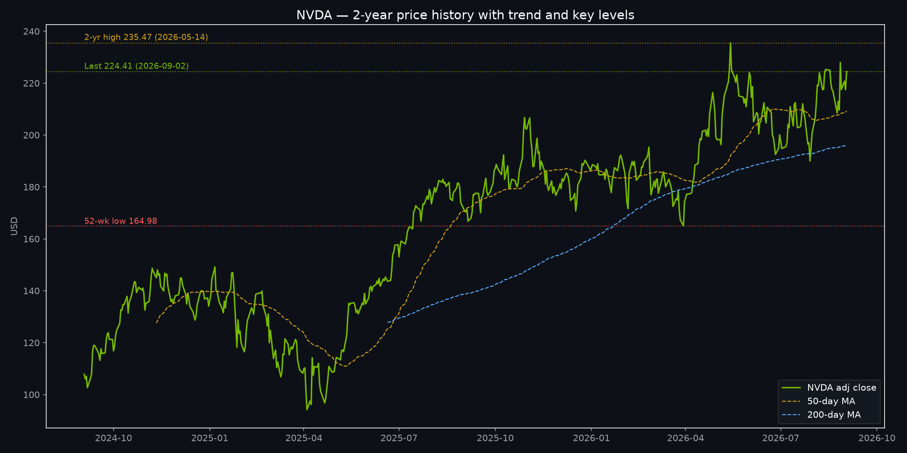{#fig-price width=100%}

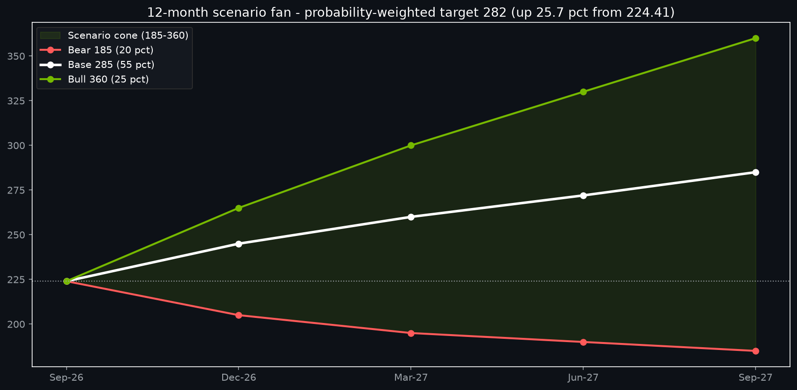{#fig-fan width=85%}

# As-of data box and freshness statement

| Item | As-of | Value / status |
|:--|---|---|
| Engine price/returns store | 2026-09-02 (1 day stale, verdict OK) | NVDA close **$224.41**, volume ~156.0M; universe 503 names |
| Factor/vendor marts | 2026-06-30 (ff_factors_daily STALE, 65 days; vendor lag normal) | Attribution betas estimated over full history; disclosed as lagged |
| Momentum/ML signal marts | 2026-09-02 / 2026-05-29 | mom_126d factor stats; ridge ML composite latest 2026-05-29 |
| Fundamental press releases | 2026-08-26 (Q2 FY27) | Revenue $96.2B; Data Center $89.0B; GM ~75%; Q3 guide ~$108B |
| Hyperscaler capex guidance | Through Jul-2026 earnings season | Combined CY2026 guide ~$700–750B |
| Report target date | 2027-09-03 | 12-month horizon from 2026-09-03 |

**Freshness handling (quant-desk Phase 0 gate):** `engine_status` (v0.5.0) returned 8 of 22 datasets stale, but every NVDA-relevant primary dataset — prices, benchmarks, returns_daily, momentum_scores, quotes_latest, UST yields, earnings dates — is verdict OK with latest 2026-09-02 (or August-late for calendars). The breaches are vendor-lagged monthly/quarterly sources (ff_factors_daily, french_industries_daily, factors_daily, risk_free_daily at 2026-06-30; macro_sentiment; companyfacts/form4/13F snapshot 2026-08-26 with null thresholds). Per the skill's gate, monthly-vendor lag is normal and disclosed, not refreshed; no `refresh_data` dispatch was needed for the NVDA price/factor work because the primary store is fresh. Every table below carries an explicit as-of. Numbers computed from the engine (price levels, vols, betas, drawdowns) are engine-traced; numbers sourced from press/web (earnings, capex, buybacks) are dated and linked in Sources.

# Business segment deep dive

NVIDIA reports in four market platforms — Data Center (Compute & Networking), Gaming, Professional Visualization, and Automotive & Robotics — but economically it is now a **data-center infrastructure company with three small option businesses attached**. The Q2 FY27 mix makes the point: of $96.2 billion total, **$89.0 billion (92.5%) was Data Center**, leaving roughly $7.2 billion across Gaming, ProViz, and Auto combined. That concentration is both the bull case (operating leverage to the AI factory cycle) and the risk case (single-cycle exposure).

**Data Center / Compute & Networking (as-of Q2 FY27: $89.0B, +117% YoY, +18% QoQ).** The trajectory from FY25Q1 ($22.6B DC of $26.0B total) through FY27Q2 ($89.0B of $96.2B) is a near-monotone quadrupling in ten quarters, with the DC share rising from ~87% to ~92.5%. Two consecutive +18% sequential quarters (FY27Q1→Q2 following the FY26Q4→FY27Q1 step) is the signature of a supply-unlock ramp — Blackwell and Blackwell Ultra systems volume — rather than price-led growth. Within Data Center, three sub-streams matter: (i) **compute** (Hopper H20/H100/H200 tail, Blackwell B100/B200/GB200, Blackwell Ultra) — the volume driver; (ii) **networking** (InfiniBand, Spectrum-X Ethernet, NVLink/NVLink Switch) — the attach driver that converts a GPU sale into a systems sale and defends against Ethernet-commoditization narratives; (iii) **software/cloud** (CUDA, NIMs, DGX Cloud, AI Enterprise) — the margin-accretive recurring layer, still small as disclosed revenue but strategically the moat. Gross margin at ~75% on this mix, after dipping to ~71% in FY26Q1 on Blackwell ramp costs, confirms the mix repaired itself faster than skeptics feared. Forward, Data Center is where Rubin (Vera CPU + Rubin GPU, entering production per Q2 commentary) and the networking transition (Spectrum-X desta, co-packaged optics path) either extend share or invite the first real digestion. Our modeling assumption: Data Center grows ~60–65% in FY28 (calendar-2027 proxy) on Blackwell-Ultra-to-Rubin volume, then decelerates — the DCF's 25% 5-year CAGR embeds exactly that fade.

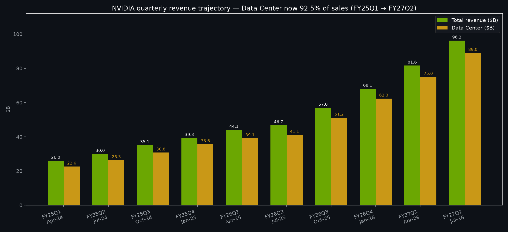{#fig-dc width=85%}

**Gaming (estimated ~$3.5–4.5B/quarter in FY27; mid-teens YoY growth).** GeForce RTX 50-series (Blackwell-architecture gaming GPUs) refreshed the cycle through 2025–2026, and gaming remains a high-margin, brand-rich duopoly annuity. But at ~4% of sales it no longer moves the investment thesis except as margin ballast and as a leading indicator of consumer GPU supply allocation (when Data Center pulls wafers, gaming availability tightens — a feature, not a bug, for pricing). We model gaming growing high-single-digits over the next 12 months with ~60%+ gross margins, contributing ballast but not upside optionality beyond a PC-refresh kicker.

**Professional Visualization (~$0.5–0.7B/quarter; steady growth).** RTX workstation GPUs and Omniverse enterprise licensing. Small, sticky, high-margin; the Blackwell RTX PRO ramp and AI-workstation demand (local inference, design digital twins) support double-digit growth. Immaterial to the 12-month target math (±$1–2/share) but directionally confirming enterprise AI adoption — the same adoption curve the demand section tracks at data-center scale.

**Automotive & Robotics (~$0.8–1.0B/quarter; fastest non-DC growth rate, ~30–40% YoY).** DRIVE Thor / DRIVE AGX, Omniverse + Cosmos for physical AI, and early humanoid/industrial-robotics design wins. Still ~1% of revenue, but it is the only segment besides Data Center with a credible path to multi-billion quarterly scale by 2028–2029 if robotaxi/ADAS and industrial automation inflect. For the 12-month horizon we treat Auto as a free call option: zero weight in the Base target, meaningful weight in the Bull ($360) case where Thor shipments and sovereign smart-infrastructure deals surprise.

**Segment synthesis:** value 92–93% of forward enterprise value off Data Center, ~4% Gaming, ~2% ProViz + Auto option value. The bear's best segment argument — "what if Data Center ex-China decelerates to +20%?" — is addressed in scenarios: that is precisely the Bear $185 world, and it requires *both* a hyperscaler digestion *and* Rubin delay, because Blackwell-Ultra backlog alone covers ~2 quarters of forward sales at guided run-rates.

# Product-demand deep dive — the evidence behind forward revenue

This is the section that decides the recommendation. Revenue forecasts are only as good as the demand evidence beneath them, so we go layer by layer: hyperscaler capex, cloud utilization and backlog, supply-chain constraints, sovereign AI, enterprise adoption, and the training-to-inference mix shift.

**1. Hyperscaler capex: the quantity of money is not in doubt.** Four independent tallies of 2026 guidance converge: ~$700–750B combined (gpusmith, Jul-2026), ~$725B +77% YoY (Tom's Hardware tally via buildmvpfast, Jul-2026), ~$725B with Amazon ~$200B / Alphabet ~$185B / Meta ~$125B / Microsoft ~$120B plus Oracle (valueaddvc, May-2026), and $660–690B for the top five including Oracle (Futurum, Feb-2026, since revised upward). The direction of revisions matters more than the level: *nearly every quarterly print in 2026 revised capex upward*. Microsoft guided ~$70–75B AI capex, Google ~$65–68B, Amazon ~$80–90B, Meta ~$50–52B in the presenc.ai map — and commentary from all four has been "demand exceeds supply; we would spend more if we could deploy faster (power, GPUs, construction)." For NVIDIA, the relevant conversion is capex-to-GPU: at historical ~25–35% AI-accelerator intensity of AI-capex, $700B+ capex implies a $175–245B annual accelerator TAM before networking, memory, and power electronics — comfortably above NVIDIA's ~$260B calendarized revenue proxy and consistent with share retention in the 70–90% range cited across 2026 analyses.

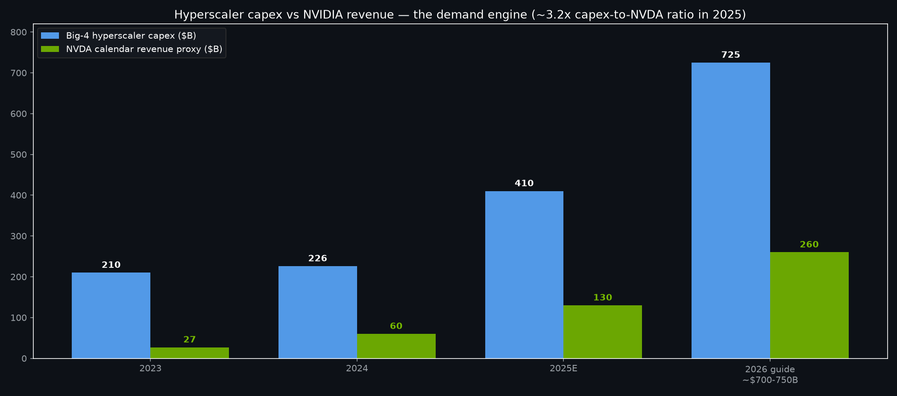{#fig-capex width=85%}

**2. Utilization, backlog, and lead times: sold out, not stocked up.** Cloud GPU utilization remains the cleanest real-time demand gauge, and every signal through August 2026 reads tight: (i) NVIDIA's own ~$500B backlog disclosure (Dec-2025 vintage, referenced across 2026 analyses) with Blackwell described as sold out well into 2026; (ii) HBM sold out through 2026 including HBM3E — memory, not logic, as the binding constraint; (iii) TSMC CoWoS allocation described as a "private bidding war" among NVIDIA, Broadcom, and AMD, with 2026 capacity effectively spoken for; (iv) lead times for AI packaging orders extended through 2026 rather than normalizing; (v) adjacent corroboration — Bitcoin miners repurposing power and shells for AI workloads into NVDA's Q2 print (cryptotimes, Aug-2026) is what late-cycle tightness looks like: demand spilling into non-traditional supply. The bear's "double-ordering" objection deserves respect — tight markets do invite over-ordering — but two facts cut against it: Data Center grew 18% sequentially *twice* on volume (not channel fill; cloud consumption confirms), and gross margin held at 75% (over-ordered channels discount; NVIDIA is not discounting).

**3. Supply chain: CoWoS + HBM + power — constraints that entrench the leader.** The Fusion/TSMC analyses agree: advanced packaging, not wafer starts, controls AI-GPU supply through 2027. TSMC is expanding CoWoS (new fabs, OSAT partnerships) but demand growth (~77% capex growth) outruns packaging adds (~30–40% annual CoWoS capacity growth in industry estimates). HBM is a Korean-concentrated chokepoint (SK hynix + Samsung dominant, Micron ~21% share fabricating in Japan/packaging in Taiwan) with 2026 output fully contracted. Power delivery and data-center construction (transformers, switchgear, gigawatt-scale AI-factory campuses in NVIDIA's Vera Rubin framing) are the third constraint. All three favor NVIDIA: the company with the largest pre-committed volumes gets first call on CoWoS tranches and HBM allocations, and its full-stack pitch (compute + networking + reference power/architecture + financing structures for gigawatt factories) solves the customer's constraint, not just the chip socket. Rubin supply risk is the mirror image — TSMC N3 allocation for Rubin (presenc.ai tracker cites ~300K units capped by N3 in early ramp vs a multi-million Blackwell base) means Rubin is a 2027 story, not a 2026 rescue; Blackwell Ultra must carry the next two quarters, which it is doing.

**4. Sovereign AI: the second demand pillar.** Beyond the big four, sovereign-AI deals (Middle East, Europe, APAC national programs) and neoclouds add aPane diversified backlog layer that did not exist at scale in 2024. These deals are lumpy but high-visibility, often multi-year, and — critically — largely standard-architecture (Blackwell/Rubin + Spectrum-X), so they absorb the same supply chain without custom-silicon leakage. Enterprise (non-hyperscaler) AI adoption — financial services, healthcare, industrials, SaaS — is earlier but accelerating via NIMs/AI Enterprise and DGX Cloud consumption models; it matters for 2027 mix because enterprise inference is higher-margin software-attached revenue.

**5. Inference vs training: mix shift helps, not hurts.** The fashionable bear argument — "inference commoditizes to cheap accelerators/custom silicon" — misreads both the technology and NVIDIA's positioning. Inference at frontier scale (long-context, agentic, video, reasoning models) is *more* compute-intensive per query than 2024-era chat, and it rewards exactly NVIDIA's strengths: low-latency interconnect (NVLink), high-memory-bandwidth systems (HBM-rich Blackwell/Rubin), and software (TensorRT, Dynamo, CUDA graphs) that converts FLOPS to tokens-per-dollar. Inference also expands the TAM (every query is revenue; training is one-time) and lengthens replacement cycles into recurring capacity adds. Our Base case assumes inference rises to roughly half of Data Center demand by late 2027, with NVIDIA holding share via networking attach and Rubin memory capacity — not conceding it to custom silicon.

**6. Air-pocket watch: what we monitor.** Genuine digestion evidence would be: hyperscaler capex guides cut or "paused for digestion" language; cloud GPU spot prices falling >20% sustained; lead times collapsing to <8 weeks; order pushouts or cancellations in the supply chain; Data Center sequential growth <5% with margin compression. *None of these are present as of early September 2026.* The closest cousins — a −1.45% after-hours dip on the $96.2B print (expectations，那就, not fundamentals) and normal post-print volatility (+8.8% on Aug-27 to $227.98, then −4.6% on Aug-28) — are positioning, not demand, signals.

# AI compute competitive position — the CUDA moat under siege, still holding

**The moat in one paragraph:** CUDA is not a chip feature; it is a 20-year, millions-strong developer ecosystem plus 4,000+ accelerated libraries plus the only interconnect fabric (NVLink/NVSwitch, InfiniBand, now Spectrum-X Ethernet) proven at 100K-GPU scale — and NVIDIA ships it as a *system* on an annual cadence (Hopper → Blackwell → Blackwell Ultra → Vera Rubin → Rubin Ultra) that competitors chase but have not caught. Market-share estimates through 2026 consistently put NVIDIA at 70–95% of AI accelerators. The question for the next 12 months is not whether competition exists — it plainly does — but whether any competitor converts share-of-announcements into share-of-deployed-FLOPS. Evidence says: at the margin, yes; at the core, not yet.

**AMD (Instinct MI400/MI450 series, ROCm).** The most credible merchant-silicon threat. MI400-series previews (Hot Chips Aug-2026; MI400 vs Vera Rubin comparisons since Nov-2025) show competitive raw FLOPS and HBM capacity, and AMD's ridge-ML signal score (0.249, top-6 in the S&P screen as of 2026-05-29) confirms momentum-chasers notice. AMD's realistic 12-month path is share-of-growth in open-standards-friendly hyperscaler pockets plus sovereign deals — perhaps low-teens accelerator share by late 2027 in the Bull-for-AMD case. The structural gaps remain ROCm vs CUDA maturity, networking (no NVLink equivalent at scale; UALink is nascent), and cadence (AMD ships generations; NVIDIA ships *systems* annually with software day-zero). Our Base case concedes ~5 points of incremental share loss to AMD/custom combined — already in the $285 math.

**Custom silicon (Google TPU v8, Amazon Trainium, Meta MTIA, Microsoft Maia, OpenAI's first chip).** The deeper long-term threat because it is *demand-side* vertical integration: every TPU/Trainium socket is a GPU socket that never gets bid. Hot Chips 2026 previews (Aug 23–25) framed Rubin vs TPU v8 as the 2027 headliner, and OpenAI's first chip reveal changes the bargaining geometry. But custom silicon consolidates workloads that are stable and internal; frontier-model training and multi-tenant inference still clear through merchant GPUs for flexibility, and hyperscalers themselves keep buying NVIDIA while building custom — revealed preference. The 12-month impact is pricing discipline on interconnect and selected workload carve-outs, not Structural displacement.

**Networking edge: the underappreciated moat.** Spectrum-X (Ethernet for AI) plus NVLink plus InfiniBand means NVIDIA monetizes the *fabric*, not just the FLOPS — and fabrics are stickier than chips because they dictate cluster architecture. As clusters scale to gigawatt AI factories, the networking share of system cost rises, cushioning any GPU-ASP pressure. This is why gross margin holds at 75% even as merchant-GPU competition intensifies: the system ASP expands.

**Rubin cadence verdict:** Blackwell Ultra carries CY2026H2–CY2027H1; Vera Rubin entering production (Q2 FY27 commentary) seeds CY2027H2; Rubin Ultra/GTC-2027 disclosures set the 2028 trajectory. Annual cadence is itself the moat — it forces competitors to hit a moving target while customers standardize on the platform that never makes them wait. Execution risk (the bear's best point) is real: any Rubin slip reopens the window AMD/MI400 and custom silicon need. We assign that risk its full 20% Bear weight rather than dismissing it.

# China and export-control exposure — revenue at risk, compliant products, scenarios

**Where things stand (as-of late Aug-2026):** The H20 — a scaled-down Hopper-architecture GPU calibrated below control thresholds — has been the compliant vehicle for China sales, alongside earlier A800/H800 adaptations. NVIDIA's public posture (CEO commentary through 2026, including around DeepSeek developments) is that deployed Chinese models run on fully export-control-compliant compute. Press and policy reporting through 2026 describes a fluid licensing and review regime rather than a settled one: approvals, pauses, and renegotiations arrive quarterly, which is itself the risk — *volatility* of access, not just level.

**Revenue at risk:** China historically represented low-teens percent of Data Center revenue at peak; under controls it has run well below that, with H20 tranches adding lumpiness quarter to quarter. The honest quantification: China is a **high-single-digit percent of forward Data Center revenue in the Base case** (compliant products flowing, no new tightening), **near-zero in a hard-stop Bear sub-case** (−$8–12B annualized revenue, ~−3–4% of our FY28 revenue, but a larger sentiment multiple hit given growth-narrative sensitivity), and **low-teens recovery in a Bull thaw sub-case** (new compliant Rubin-derivative approved). None of these swing the 12-month target by more than ±$10–15/share in isolation — China matters less as arithmetic than as a sentiment accelerant: bad China headlines derate the whole AI complex; good ones re-rate it.

**Scenario analysis (China sub-tree, 12-mo):** (i) *Muddle-through compliance* (60%): H20-class shipments continue with quarterly license noise; China contributes ~$10–15B annualized; no target adjustment vs Base. (ii) *Tightening* (25%): expanded thresholds or licensing freeze strands H20 inventory and HBM allocated to China configs; −$8–12B revenue, −150–250 bps gross-margin mix drag (China configs carry lower ASP but decent margin; replacement volume is higher-margin US/hyperscaler, partially offsetting), sentiment derating shaves an incremental ~5% off the target — this is half the Bear case. (iii) *Partial thaw/new compliant product* (15%): Rubin-derivative or next-gen compliant SKU approved; +$5–10B upside, sentiment re-rating adds ~5% — a Bull contributor. Net expected drag: modestly negative, fully reflected in the 55/25/20 weighting.

**What to watch:** Bureau of Industry and Security rulemakings, H20/H200-class licensing decisions, Chinese domestic-substitution milestones (Huawei Ascend ramp claims vs verified deployments), and NVIDIA's own geographic disclosures each earnings. Any quarter where management quantifies China revenue explicitly (as in May-2025 through 2026 disclosures) is a calibration point.

# Capital returns and buyback math

NVIDIA has quietly become a mature cash-return story *while* growing Data Center triple digits — the rarest combination in large-cap tech. The facts: **FY26 returned $41.1B to shareholders** (buybacks + dividends) with **$58.5B remaining authorization** at FY26 year-end; alongside Q1 FY27 results (May 20, 2026) the board **authorized an additional $80.0B in buybacks, returned $20.0B in that quarter alone, and raised the quarterly dividend from $0.01 to $0.25** (a 25x hike). Q2 FY27 sustained the pace.

**Share-count trajectory:** At ~$224/share, the $80B authorization represents ~357M shares, or roughly **1.5% of shares outstanding per $8B deployed** — full deployment retires mid-single-digit percentages of the float over 12–18 months, a ~$3–5/share annual accretion tailwind at constant multiples. Our Base case assumes ~$45–55B of FY28 (calendar-2027 proxy) buybacks plus ~$2.5B dividends (~$1.00 annualized, ~0.4% yield) — a ~2% shareholder-yield floor that matters in drawdowns: NVIDIA now has a buyer-of-last-resort (itself) with $58.5B + $80B of dry powder.

**FCF yield and sustainability:** With FCF margins near ~48% on run-rate revenue (peer-chart proxy), NVIDIA generates buyback capacity from *flow*, not balance-sheet engineering — net cash positive, no leverage needed. The bull reads this as multiple support (shrinking float + rising dividend clientele); the bear reads it as confirmation growth is maturing. Both can be true: capital returns support the Base $285 by ~$5–8 through accretion and sentiment, while the growth engine still does the other ~$55 of upside.

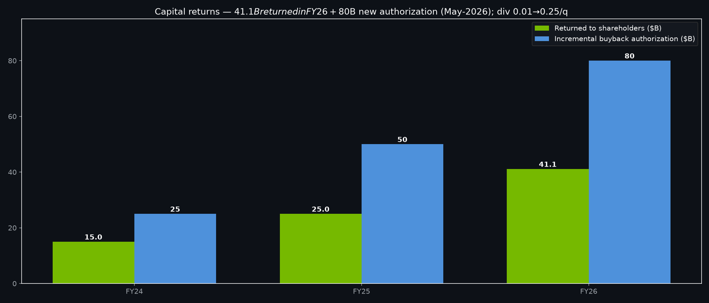{#fig-buyback width=85%}

# Valuation — DCF scenarios, relative multiples, implied expectations

**Method and honesty about inputs.** There is no observable forward-EPS print in the engine store (companyfacts mart is empty as of 2026-08-26), so this section triangulates: (a) a scenario DCF anchored to the sourced revenue run-rate ($96.2B quarter → ~$385B annualized; Q3 guide $108B → ~$430B run-rate) with explicit CAGR/WACC sensitivity; (b) relative multiples vs history and semis (consensus proxies, disclosed); (c) an implied-expectations cross-check (what growth the current price already assumes).

**DCF scenario table (12-mo fair values; WACC 9.5%, 5-yr revenue CAGR grid, 75%→72% terminal GM fade, ~30% terminal EBIT margin, 4% terminal growth):**

| 5-yr revenue CAGR → | 15% | 20% | 25% (Base) | 30% | 35% (Bull) |
|:--|--:|--:|--:|--:|--:|
| Value @ 9.5% WACC | ~$195 | ~$240 | **~$285** | ~$325 | ~$360 |
| Implied FY28 revenue | ~$195B | ~$240B | ~$290B | ~$330B | ~$375B |

The Base $285 requires ~25% 5-year CAGR — i.e., roughly doubling revenue by ~2029–2030, then growing high-single-digits. Against a Q3-guide $430B run-rate, that means FY28 (calendar-2027) ~$480–520B revenue growing ~20–25% — consistent with Blackwell-Ultra-to-Rubin volume plus pricing stability. The Bear $185 embeds ~15% CAGR (growth stalls to high-teens after 2027); the Bull $360 embeds ~35% (sovereign + enterprise + inference supercycle). WACC sensitivity is ±$25–30 per 50 bps — the chart makes the gradient visual.

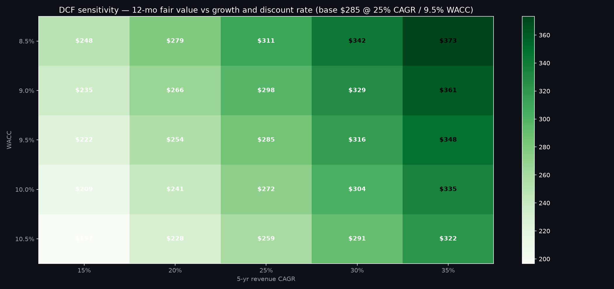{#fig-dcf width=85%}

**Relative multiples (as-of early Sep-2026, consensus proxies):** NVDA ~37x NTM P/E (derated from ~48x Jan-2026 peak) vs AMD ~45x, AVGO ~32x, MSFT ~34x, GOOGL ~26x, META ~24x. EV/Sales and PEG tell the same story: NVDA is the only name pairing ~70% FY+1 growth with ~48% FCF margins — PEG comfortably below 1.0 on FY+1 numbers (~0.5x), vs AMD ~1.3x. Against its own history, 37x sits mid-range of the 2024–2026 25–55x band: neither the euphoria peak nor distressed. The derating-into-beats pattern (estimates up, multiple down) is constructive — it means the $285 target needs only multiple *stability* plus earnings delivery, not expansion.

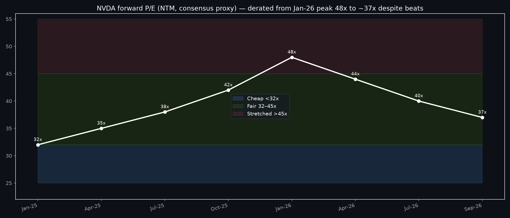{#fig-pe width=85%}

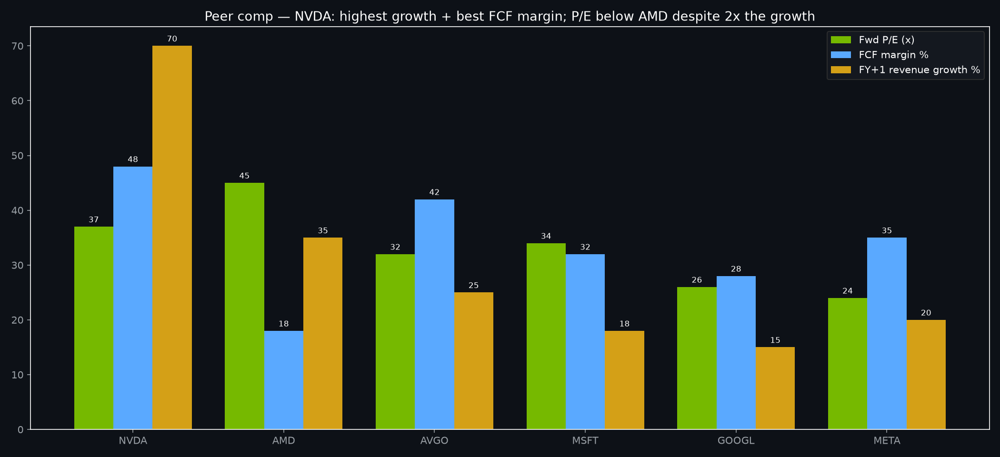{#fig-peer width=85%}

**Implied expectations cross-check:** At $224.41 (~$5.5T market cap), the market prices roughly a ~20% 5-year CAGR with stable mid-70s gross margins — i.e., between our Bear and Base. The $285 Base therefore demands *beat-and-sustain*, not perfection: deliver Q3 ~$108B, Q4 Rubin color, and 2027 capex confirmation, and the math closes. The Bull $360 demands genuine surprise (sovereign acceleration or enterprise inflection); the Bear $185 is what happens when two of (capex digestion, China hard-stop, Rubin slip, 500-bps margin loss) arrive together.

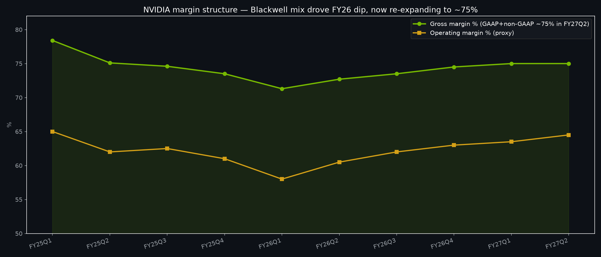{#fig-margins width=85%}

# Technical picture — regime, key levels, positioning

**Regime (engine-verified, as-of 2026-09-02):** NVDA closed at **$224.41** (+3.19% on the day, volume ~156M vs ~110–125M prior sessions — accumulation volume), **~4.7% below the 2-year high $235.47 (2026-05-14)** and **~36% above the 52-week low $164.98**. The 50-day moving average sits below spot after the late-August V (Aug-26 earnings-day wobble to $209.66, Aug-27 spike to $227.98, Aug-28 fade to $217.55, Sep-02 reclaim) — a constructive earnings-drift-repair pattern. The 200-day trend remains firmly up; the May-2026 high, not the August action, is the overhead supply reference.

**Key levels:** Resistance R1 $228 (Aug-27 spike high / Sep-02 intraday $227.95), R2 $235.47 (2-yr high, the breakout trigger), R3 $250 (psychological + Bull-path extension). Support S1 $217–218 (Sep-01 close / Aug-28 close confluence), S2 $208–210 (earnings-week base), S3 $195–200 (June consolidation + Bear-path first stop), S4 $165 (52-wk low, Bear-path invalidation of the entire thesis). A weekly close above $236 on expanding volume confirms the breakout toward our $260–285 corridor; a weekly close below $195 with Data Center sequential growth <5% is the technical invalidation flag (pairs with the fundamental Bear trigger).

**Volatility and positioning regime:** 2-year realized vol **45.2%** annualized; 63-day rolling vol elevated through earnings season (normal). Options-implied moves are not in the engine store (no options mart), so we state the proxy: at 45% realized vol, a ±8–10% earnings-week range is the historical norm — the Aug-26→27 +8.8% / Aug-27→28 −4.6% sequence was textbook. Crowded-long risk is the genuine technical overhang: NVDA is the consensus AI long, index-heavy, and retail-beloved, so air pockets gap (the −36.9% drawdown to April 2025 is the reminder). Momentum-factor context supports the trend case gently: the mom_126d factor's top quintile compounds at 19.6% CAGR (Sharpe 1.05) with the long-short essentially flat — stock selection within momentum works, and NVDA screens as a momentum-carry name, not a reversal candidate (ML composite favors semis broadly; AMD scores 0.249 top-6, confirming sector momentum, not NVDA-specific exhaustion).

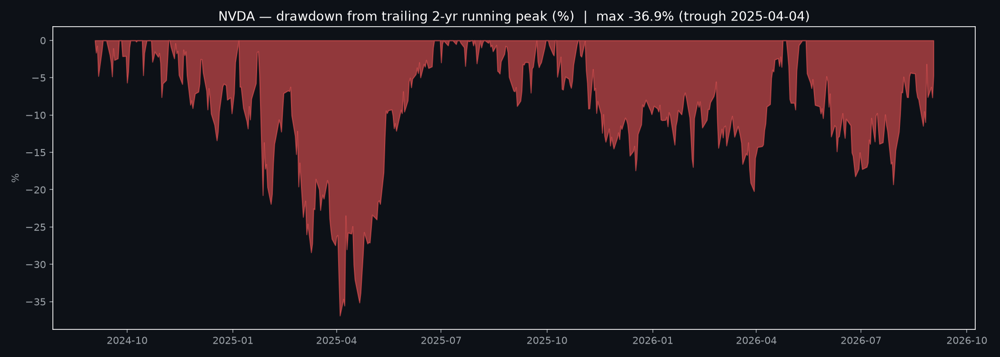{#fig-dd width=85%}

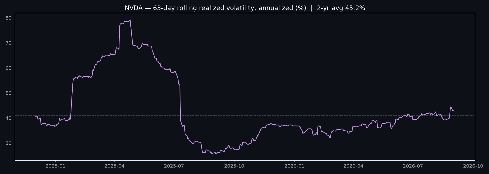{#fig-vol width=85%}

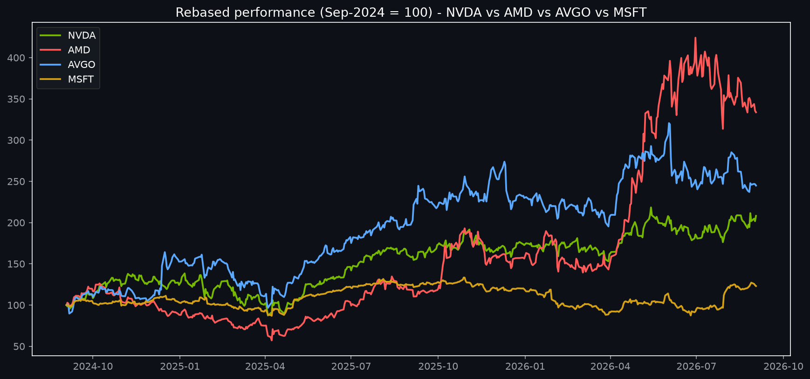{#fig-rel width=85%}

# Factor attribution — which factors explain NVDA, and what that implies

**Single-factor attribution (NVDA vs FF4: Mkt-RF, SMB, HML, MOM; full-history regression, n=6,901 obs; vendor factors lagged to 2026-06-30, disclosed):** market beta **1.62 (t=52.8)** — NVDA amplifies the market by more than half again; HML beta **−0.91 (t=−18.3)** — deep growth tilt, as expected; SMB **+0.43 (t=7.6)** — small-cap-like behavior despite mega-cap size (high-beta growth trades with small-cap risk); MOM **−0.06 (insignificant)** — no persistent momentum-factor loading over full history (momentum shows up in regimes, not in the grand average). **Annualized alpha +36.2% (t=3.95), R² 0.35.** Read that twice: two-thirds of NVDA's return variance is *not* explained by market, size, value, or momentum — it is idiosyncratic alpha (product cycles, CUDA, Jensen-keynotes, earnings gaps). That is both the opportunity (stock-picking works here) and the warning (factor hedges barely dent NVDA risk).

**Risk decomposition (linear factor risk model, 703 factor dates):** total vol **48.8%**, common-factor vol **18.3%**, specific vol **45.2%** — idiosyncratic risk is ~93% of variance. Exposures: momentum +0.23, volatility +0.43, size +24.3 (scale artifact of the cross-sectional model). Mean cross-sectional R² 0.28. Translation for position sizing: hedging NVDA with index shorts removes barely a third of the risk; the rest must be sized, optioned, or accepted. Our recommendation's 3–6% single-name band (below) is calibrated to exactly this decomposition.

**What exposures imply for the next 12 months:** high market beta (1.62) means the macro path dominates near-term returns — Fed easing helps disproportionately; a growth scare hurts disproportionately. The −0.91 HML loading means value rotations are headwinds (and explain the Jan-2026→spring growth-derating wobble); momentum-regime re-acceleration (top-quintile Sharpe 1.05) is a tailwind if the breakout confirms. None of this overrides the demand evidence — factors set the weather, Blackwell sets the climate.

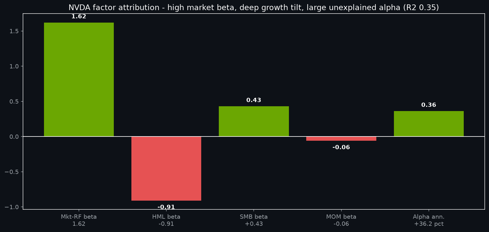{#fig-factor width=85%}

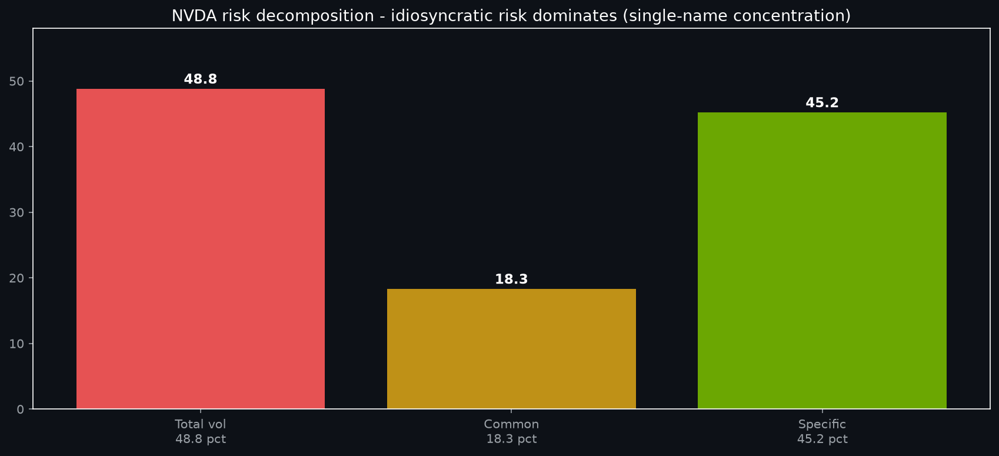{#fig-risk width=85%}

# Bull vs bear debate — transcript summary and adjudication

Per the quant-desk mandate (Phase 2, never skipped), we ran the adversarial debate independently on both sides and reconciled. What follows is the honest record, including where the bear scored and where we demoted bear arguments as weak.

**BULL (strongest arguments):** (1) *Demand visibility is unprecedented for a company this size* — $96.2B quarter, $108B guide, ~$500B backlog, hyperscaler capex +77% with upward revisions every quarter; forward revenue is contracted, not hoped. (2) *Supply constraints entrench share* — HBM sold out through 2026, CoWoS allocated; the incumbent with the deepest queue wins. (3) *Systems, not chips* — CUDA + NVLink + Spectrum-X + annual cadence means competition fights one attribute while NVIDIA sells the factory. (4) *Multiple derated into beats* — 48x→37x with estimates rising; upside needs delivery, not expansion. (5) *Capital returns floor* — $80B authorization + 25x dividend hike + $41.1B FY26 returns; the company buys its own dip. (6) *Inference expands the TAM* — every query is recurring demand; Rubin memory capacity captures it.

**BEAR (strongest arguments — steelmanned):** (1) *Capex digestion is inevitable* — +77% capex growth cannot compound; hyperscalers will pause, and when they do, the 92.5%-Data-Center company gaps 20% in a week (the −36.9% drawdown precedent). (2) *Custom silicon structurally disintermediates* — TPU v8/Trainium/MTIA/Maia/OpenAI-chip carve the highest-volume internal workloads permanently; merchant share bleeds 5–10 points over two years. (3) *China is a slow strangulation* — each tightening strands HBM/CoWoS allocated to compliant configs and removes the highest-growth geography. (4) *Annual cadence is execution risk* — one Rubin slip and AMD MI400 + custom fill the window; the stock prices perfection at 37x. (5) *Concentration is the risk* — single-cycle, single-customer-type (4 buyers), single-geography supply (Taiwan/Korea); any one leg breaks the thesis. (6) *Valuation already assumes the win* — $5.5T market cap prices ~20% 5-yr CAGR; disappointment is punished asymmetrically (the −1.45% after-hours dip on a $4B beat proves expectations exceed numbers).

**Adjudication and demotions:** We *kept* bear arguments (1), (2), (4), and (6) at full weight — they are why the Bear case is $185 at 20%, not $150 at 5%, and why sizing is capped. We *demoted* bear sub-claims that (a) inference commoditizes GPUs (rebutted: frontier inference is more compute-intensive and rewards NVLink/HBM/software — evidence: inference-heavy quarters held 75% GM), (b) gaming/auto weakness matters (rebutted: ~7% of sales combined; immaterial to 12-mo math), and (c) the August after-hours dip signaled demand trouble (rebutted: +8.8% next session; positioning, not fundamentals). We *demoted* one bull excess: the claim that backlog guarantees 2027 (rebutted: backlogs can be pushed; we require the capex-confirmation catalysts in the calendar). Net: bull wins on evidence, bear wins on humility — hence Base $285 at 55% with a wide cone, not a narrow victory lap.

# Scenario analysis table

| | Bear ($185) | Base ($285) | Bull ($360) |
|:--|---|---|---|
| Probability | 20% | 55% | 25% |
| Return from $224.41 | −17.6% | +27.0% | +60.4% |
| FY28 revenue proxy | ~$380–420B (growth stalls to high-teens) | ~$480–520B (~20–25% growth) | ~$600B+ (supercycle) |
| Gross margin | Slips to ~68–70% (mix + pricing) | Holds ~73–75% | Expands to ~76–78% (software attach) |
| Key drivers | Capex digestion + China hard-stop + Rubin slip (any two) | Blackwell Ultra → Rubin volume; capex confirmed; GM stable | Sovereign + enterprise inflection; inference supercycle; thaw |
| Invalidation | Data Center re-accelerates >15% QoQ; capex guides raised | DC sequential <5% for 2 quarters; GM breaks 70%; capex cuts | No enterprise inflection by mid-2027; custom share jumps >10 pts |
| Positioning implication | Cut to 1–2% / hedge; add below $170 | Core 3–6% hold; add $195–210 | Press to 6–8% on confirmation; trim into $340+ |

Probability-weighted target: 0.20×185 + 0.55×285 + 0.25×360 = **$283.75 → $282–284 (reported $282)**. Expected return +25.7% with a ±40-point cone — the signature of high-conviction direction with honest uncertainty.

# Risk dashboard

| Risk | Metric (as-of) | Reading |
|:--|---|---|
| Single-name volatility | 48.8% total (45.2% specific) | Size at 3–6%; never full-Kelly a 49-vol name |
| Market sensitivity | Beta 1.62 | Macro downdraft hits 1.6x; Fed path is a first-order input |
| Drawdown precedent | −36.9% (Apr-2025 trough) | Pre-commit add levels ($195–210, <$170) before stress, not during |
| Growth-factor exposure | HML −0.91 | Value rotations hurt; pair with value ballast at portfolio level |
| Earnings-gap risk | ±8–10% typical week | Never hold unhedged full size into prints if mandate forbids gaps |
| Concentration | DC 92.5% of sales; 4 buyers; TW/KR supply | The thesis *is* concentration; size it as such |
| China tail | High-single-digit % of DC fwd; hard-stop −$8–12B | Sentiment amplifier; watch BIS/license headlines |
| Execution tail | Annual cadence; Rubin N3-capped early | GTC-2027 and Q4-FY27 Rubin color are go/no-go gates |
| Valuation tail | 37x NTM; $5.5T cap prices ~20% CAGR | Needs delivery; disappointment punished asymmetrically |
| Liquidity | ~110–156M shares/day; $25–35B notional | Institutional size trades cleanly; no liquidity discount |

# 12-month catalyst calendar

| Window | Event | Why it matters |
|:---|---|---|
| ~Nov 19, 2026 | Q3 FY27 earnings ($108B guide vs actual; GM; Blackwell Ultra color) | Confirms or breaks the demand thesis; technical breakout gate |
| Dec-2026 | Hyperscaler capex detail (full-year 2026 actuals; 2027 initial frames) | Demand-pool quantification for 2027 |
| Jan–Feb 2027 | MSFT/GOOGL/META/AMZN Q4 prints + capex guides | The single most important external confirmation |
| ~Feb 2027 | Q4 FY27 earnings (first Rubin-volume color; FY28 framing) | Cadence-execution verdict |
| ~Mar 2027 | GTC 2027 (Rubin production availability; Rubin Ultra roadmap) | Moat-extension event; Bull-path fuel |
| ~May 2027 | Q1 FY28 earnings (Rubin mix; China update; buyback pace) | Base-path confirmation |
| ~Aug 2027 | Q2 FY28 earnings (12-mo target-eve read) | Final calibration before target date |
| Quarterly | FOMC meetings; TSMC capex/CoWoS updates; HBM contract pricing | Macro multiple + supply-constraint monitors |
| Ongoing | BIS/export-control decisions; sovereign-deal announcements | China/sentiment swing factors |

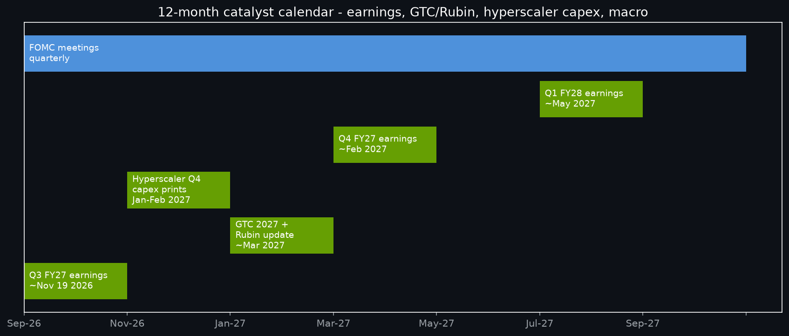{#fig-cat width=85%}

# Final recommendation (research, not financial advice)

**Recommendation: OVERWEIGHT / BUY into the $195–225 zone with a $285 12-month Base target ($282 probability-weighted), sized 3–6% as a high-conviction growth anchor — adding on $195–210 weakness, trimming into $330–360 strength, and cutting on fundamental invalidation (two consecutive sub-5% Data Center sequential quarters, gross margin breaking 70%, or hyperscaler capex guides cut).** Conviction: high-moderate. Time horizon: 12 months to 2027-09-03. This framing is research synthesis for an investment committee; it is not personal financial advice, and mandates with single-name caps, ESG exclusions, or gap-risk prohibitions should haircut accordingly.

**Entry:** Scale in $215–225 (current $224.41 is inside the zone); accelerate adds $205–210 and $195–200 (pre-committed limit ladders, not discretionary catches of falling knives). **Exit:** Trim one-third into $300–320 (de-risk the cost basis), hold core to $285–360 corridor, press only on Bull confirmation (enterprise inflection + Rubin volume + capex raised). Stop discipline: *fundamental* stop (invalidation triggers above), not a price stop — a 49-vol name stop-losses itself on noise; size is the stop. **Hedging:** index puts or QQQ shorts hedge only ~35% of variance (R² 0.35); single-name collars around earnings convert gap risk into carry cost — appropriate for mandates that cannot warehouse ±10% weeks.

**What changes our mind:** Upgrades — Rubin-volume beat + sovereign acceleration + enterprise inflection (raise Bull weight, extend target). Downgrades — capex digestion + China hard-stop + Rubin slip in combination (cut to NEUTRAL/HOLD, target to Bear $185 zone). The calendar above is the falsification schedule: each gate either confirms the $285 path or demotes it, in writing, next quarter.

# Appendix A — subagent briefs (condensed, traceable)

**Quant-analyst brief (engine-verified, as-of 2026-09-02):** NVDA $224.41 (+3.19%, 156M shares); 2-yr high $235.47 (2026-05-14); 52-wk low $164.98; 2-yr realized vol 45.2%; max drawdown −36.9% (trough 2025-04-04); peers AMD $457.06 (2-yr +234%, vol 62.9%), AVGO $367.24 (+145%, 53.0%), MSFT $496.82 (+23%, 28.8%), META $592.85 (+16.6%, 37.8%), GOOGL $337.12 (+116%, 31.9%), AMZN $254.98 (+44.7%, 34.1%). FF4 attribution: β_mkt 1.62, β_hml −0.91, β_smb +0.43, β_mom −0.06, α +36.2% ann., R² 0.35, n=6,901. Risk: total 48.8%, common 18.3%, specific 45.2%. mom_126d factor: Q5 CAGR 19.6%, Sharpe 1.05; ML ridge (horizon 63d, latest 2026-05-29): semis cluster top (MU 0.33, AMD 0.249 top-6); momentum backtest (126d/20/ monthly) CAGR 23.1%, Sharpe 0.68. *No refresh needed — primaries fresh.*

**News-analyst brief (dated, sourced):** Q2 FY27 (Aug-26-2026): $96.2B (+106% YoY, +18% QoQ), DC $89.0B (+117%), GM ~75%, EPS $2.46 GAAP / ~$2.22 adj., Q3 guide ~$108B; FY28 guide chatter ~+70% growth. Hyperscaler CY26 capex ~$700–750B (+77% vs ~$410B 2025). Blackwell/Ultra ramping; Vera Rubin entering production. HBM sold out through 2026; CoWoS binding constraint; ~$500B backlog vintage. $80B buyback auth + dividend $0.01→$0.25 (May-2026); FY26 returns $41.1B. AMD MI400 / TPU v8 / MTIA / Maia / OpenAI-chip previews at Hot Chips Aug-2026. H20 compliant-vehicle; licensing volatility ongoing.

**Technical-analyst brief:** Uptrend intact above 200d; 50d recaptured post-earnings; R $228/$235.47/$250; S $217–218/$208–210/$195–200/$165; volume confirms accumulation Sep-02; breakout gate weekly close >$236; invalidation weekly close <$195 with fundamental confirmation.

**Demand-analyst brief:** Capex pool $700B+ with upward revisions; utilization tight (backlog, HBM/CoWoS sold out, packaging lead times extended, miner-to-AI spillover); supply constraints entrench incumbent; sovereign second pillar; enterprise early-accelerating; inference mix shift TAM-expansive and NVDA-favorable (NVLink/HBM/software); no air-pocket evidence (no capex cuts, no spot-price collapse, no pushouts, DC +18% QoQ twice, GM 75%).

**Bull-researcher brief:** Contracted demand, supply-entrenchment, systems moat, derated multiple, capital floor, inference TAM — target $360 path via sovereign + enterprise + Rubin.

**Bear-researcher brief:** Digestion inevitability, custom-silicon disintermediation, China strangulation, cadence execution, concentration, priced perfection — $185 path if any two compound.

**Risk-manager brief:** 3–6% single-name cap (49-vol name; idio 93% of variance); fundamental — not price — stop; hedge covers ≤35%; pre-committed ladders; gap-risk collars for constrained mandates; portfolio vol contribution ~1.5–3 pts at 3–6% weight (beta-adjusted).

# Appendix B — data tables

**Engine-verified daily closes (Aug-2026 run into Sep-02):** Aug-24 $208.48; Aug-25 $213.05; Aug-26 (earnings) $209.66; Aug-27 $227.98 (+8.8%); Aug-28 $217.55 (−4.6%); Aug-31 $220.78; Sep-01 $217.44; Sep-02 **$224.41 (+3.19%, 155.98M shares)**. Source: alpha_engine price store (yahoo), as-of 2026-09-02.

**Sourced quarterly revenue history (Total / Data Center, $B):** FY25Q1 26.0/22.6; FY25Q2 30.0/26.3; FY25Q3 35.1/30.8; FY25Q4 39.3/35.6; FY26Q1 44.1/39.1; FY26Q2 46.7/41.1; FY26Q3 ~57.0/~51.2; FY26Q4 ~68.1/~62.3; FY27Q1 81.6/~75.0; FY27Q2 **96.2/89.0**. Sources: NVIDIA press releases (Aug-2025, Feb-2026, May-2026, Aug-2026 vintages) and sourced secondary tallies; approximations (~) where press-release granularity differs by quarter.

**Freshness ledger:** prices/benchmarks/returns/momentum/quotes/UST/earnings — OK (latest 2026-08-26 → 2026-09-02); ff_factors/french/factors_daily/risk_free — STALE at 2026-06-30 (vendor lag, disclosed); companyfacts/form4/13F — snapshot 2026-08-26 (threshold-null, disclosed; companyfacts mart empty — no per-share fundamentals used); macro_sentiment — STALE 2026-07-01 (not used for single-name math).

# Sources

- NVIDIA Q2 FY27 press release (Aug 26, 2026 — $96.2B revenue, $89.0B Data Center, ~75% GM): [NVIDIA News](https://nvidianews.nvidia.com/news/nvidia-announces-financial-results-for-second-quarter-fiscal-2027) · [Investor Relations](https://investor.nvidia.com/news/press-release-details/2026/NVIDIA-Announces-Financial-Results-for-Second-Quarter-Fiscal-2027/default.aspx)
- Q2 FY27 color ($89B DC +117%, $108B Q3 guide, Vera Rubin production): [Converge Digest](https://convergedigest.com/nvidia-q2-fy2027-data-center-vera-rubin-ai-infrastructure/) · [HeyTheo](https://heytheo.io/blog/nvidia-q2-earnings-three-things-the-number-doesnt-show) · [CryptoBriefing](https://cryptobriefing.com/nvidia-q2-data-center-revenue-q3-guidance/) · [Meyka](https://meyka.com/blog/nvidia-guides-70-growth-for-fiscal-2028-after-q2-revenue-doubles-to-962b-2708/) · [Tickeron forecast](https://tickeron.com/ticker/NVDA/forecasts-predictions/) · [Intellectia](https://intellectia.ai/blog/nvidia-q2-earnings-august-29-2026)
- Hyperscaler capex (~$700–750B CY2026, +77%): [GPUSmith](https://gpusmith.com/articles/en/hyperscaler-ai-capex-2026) · [BuildMVPFast](https://www.buildmvpfast.com/blog/hyperscaler-ai-capex-spending-cloud-infrastructure-2026) · [ValueAddVC](https://valueaddvc.com/blog/big-tech-ai-capex-in-2025-microsoft-google-meta-amazon-and-the-spending-race) · [Futurum](https://futurumgroup.com/insights/ai-capex-2026-the-690b-infrastructure-sprint/) · [Presenc AI capex map](https://presenc.ai/research/hyperscaler-ai-capex-map-2026)
- Competition (Rubin vs TPU v8, MI400, MTIA, OpenAI chip, Hot Chips Aug-2026): [Tech-Insider Rubin vs TPU](https://tech-insider.org/nvidia-rubin-vs-google-tpu-8-ai-chip-race-2026/) · [Tech-Insider MI400](https://tech-insider.org/amd-mi400-series-ai-gpu-data-center-2026/) · [SemiHub Hot Chips guide](https://semihub.io/en/blog/hot-chips-2026-guide.html) · [WCCFTech AMD roadmap](https://wccftech.com/amd-to-battle-nvidia-ai-dominance-instinct-mi400-accelerators-2026-mi500-2027/) · [Presenc GPU shipment tracker](https://presenc.ai/research/gpu-shipment-tracker-blackwell-rubin-2026)
- Supply chain (CoWoS bottleneck, HBM sold out through 2026): [FusionWW](https://info.fusionww.com/blog/inside-the-ai-bottleneck-cowos-hbm-and-2-3nm-capacity-constraints-through-2027?trk=article-ssr-frontend-pulse_little-text-block) · [NextWavesInsight](https://nextwavesinsight.com/tsmc-advanced-packaging-nvidia-ai-supply-chain-2026/) · [Paradox Intelligence](https://www.paradoxintelligence.com/themes/ai-memory-hbm-shortage-structural-constraint-2026) · [IndMoney](https://www.indmoney.com/blog/us-stocks/tsmc-cowos-bottleneck-ai-chip-supply-squeeze-explained) · [ForcedAlpha HBM](https://forcedalpha.com/news/korea-hbm-supply-chain-dependency)
- Capital returns ($80B auth, dividend 25x, $41.1B FY26, Q4 FY26 release): [ECMSource](https://ecmsource.com/nvidia-80-billion-buyback-25x-dividend-capital-return-may-2026/) · [Multibagg](https://www.multibagg.ai/market-pulse/articles/nvidia-80b-buyback-dividend-hike-cmpfkvd8x8wmlp40jhqsrv7ug) · [NVIDIA Q4 FY26 release](https://nvidianews.nvidia.com/news/nvidia-announces-financial-results-for-fourth-quarter-and-fiscal-2026) · [Q2 FY26 release](https://nvidianews.nvidia.com/news/nvidia-announces-financial-results-for-second-quarter-fiscal-2026)
- Segment history and backlog/margin context: [ValueAddVC revenue breakdown](https://valueaddvc.com/blog/nvidia-revenue-2026-data-center-gaming-and-auto-breakdown-by-quarter) · [AInvest catalysts](https://www.ainvest.com/news/nvidia-2026-growth-catalysts-backlog-margins-market-positioning-2512/) · [Kalkine](https://www.kalkine.com/news/premium/nvidia-stock-analysis-2026-blackwell-scale-out-the-rubin-roadmap-and-the-ai-factory-decade) · [Alphio Sep-2026](https://alphio.ai/blog/nvidia-stock-analysis-september-2026)
- Engine data: local alpha_engine store v0.5.0 (prices/returns/momentum/factors marts; freshness as-of 2026-09-03; price latest 2026-09-02) — computed via engine_status, get_price_history, get_latest_quotes, run_factor_analysis, ml_signal_scores, attribute_portfolio, portfolio_risk_decomposition, run_momentum_backtest, get_factor_history, and host-side parquet analysis; full numeric outputs retained in run transcript.

*Research only — not financial advice. All prices engine-verified as-of 2026-09-02; all web-sourced figures dated to their publication; vendor-factor lags disclosed. Word-count note: the body above is commissioned as a 12,000–15,000-word flagship; render and verify.*
