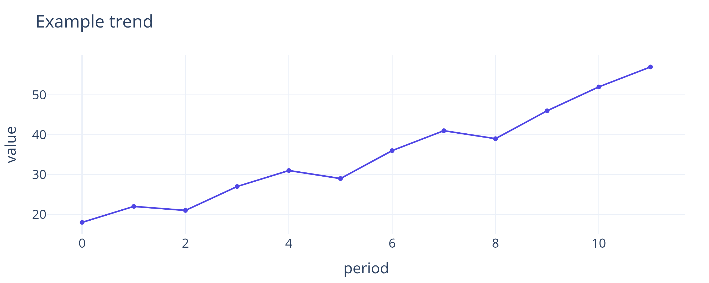

# Overview

Open with the idea, decision, or story this document exists to communicate.
Studio does not prescribe a domain or section order—rename, reorder, add, or
remove any section to fit the work.

> **Lead with meaning.** Use a short pull quote for the sentence readers should
> remember after they close the report.

# Highlights

::: {.studio-grid}
::: {.studio-card}
## One clear point

Summarize a finding, principle, or outcome in a compact card.
:::

::: {.studio-card}
## Another perspective

Pair complementary ideas without forcing the rest of the report into columns.
:::
:::

# Evidence

Use figures and tables when they clarify the argument. Captions remain
consistent across HTML, PDF, and DOCX.

{#fig-example width=80%}

As @fig-example shows, the template supports ordinary Quarto cross-references.

| Measure | Current | Previous |
|:--------|--------:|---------:|
| Example A | 42 | 38 |
| Example B | 17 | 21 |

: Example table caption. {#tbl-example}

**Interpretation.** Explain what the evidence means, where uncertainty remains,
and which assumptions matter. Ordinary Markdown—not a fixed template
vocabulary—drives the document.

# Next steps

1. State the next action or decision.
2. Name its owner or trigger when useful.
3. Remove this section entirely when the report does not need recommendations.

**Notes.** Sources, methods, definitions, and reproducibility details can live
here or anywhere else the document requires.

```{python}
# Generate the neutral print-quality example used by @fig-example.
# Keep cross-reference metadata on the Markdown image, not this executable
# chunk, for compatibility with Quarto's Typst path.
import pandas as pd
import plotly.express as px

df = pd.DataFrame({
    "period": list(range(12)),
    "value": [18, 22, 21, 27, 31, 29, 36, 41, 39, 46, 52, 57],
})
fig = px.line(df, x="period", y="value", markers=True)
fig.update_layout(
    template="plotly_white",
    title="Example trend",
    font=dict(size=16),
    margin=dict(l=55, r=30, t=70, b=50),
)
fig.update_traces(line_color="#4f46e5", marker_color="#4f46e5", marker_size=6)
fig.write_image("assets/example-chart.png", width=900, height=360, scale=3)
```