# Executive summary

We rate TSLA Overweight into 2027-09-04 with a USD 420 base target, +19 pct from USD 354.08 on 2026-09-04. The auto floor holds through the USD 39,990 Model Y Standard while storage scales past 46 GWh a year. Energy margin repair plus the credit-drag lap from Q4-26 funds the robotaxi option. The Q2 print tempers conviction with adj EPS of USD 0.33 vs 0.55 consensus and FCF of USD -1.09B. Size stays 1 to 3 pct.

# Price and technicals opener

TSLA closed at USD 354.08 on 2026-09-04 on 64.6M shares, with prices fresh to that date and one day stale. The 300-day tape in @fig-ex1 shows a basing structure after the September 2025 robotaxi spike near USD 426. Volume confirms institutional participation rather than retail drift. Momentum offers no timing edge here.

::: {column-page}
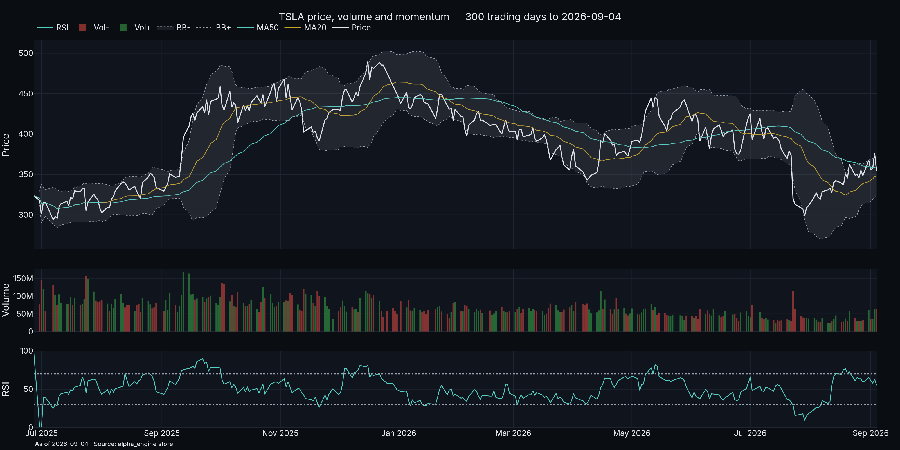{#fig-ex1 width=100% fig-cap="TSLA price, volume and momentum — 300 trading days. As of 2026-09-04."}
:::

@fig-ex1 carries the setup in one frame. Price sits below both the 50-day average of USD 357.95 and the 200-day average of USD 399.56 as of 2026-09-04. That is a weak trend regime by rule. The read is patience on entries, not chasing.

# Quant evidence

Trailing returns frame the opportunity set with exact engine prints. TSLA returned +10.81 pct on 21 days, -9.44 pct on 63 days, -10.75 pct on 126 days, and +4.59 pct on 252 days to 2026-09-04. The 12-month high printed at USD 489.88 with a low of USD 298.32. Annualized 63-day realized volatility ran at 57.9 pct. So what: the name fell by half from peak to trough and stabilized, which reprices entry risk lower than a year ago.

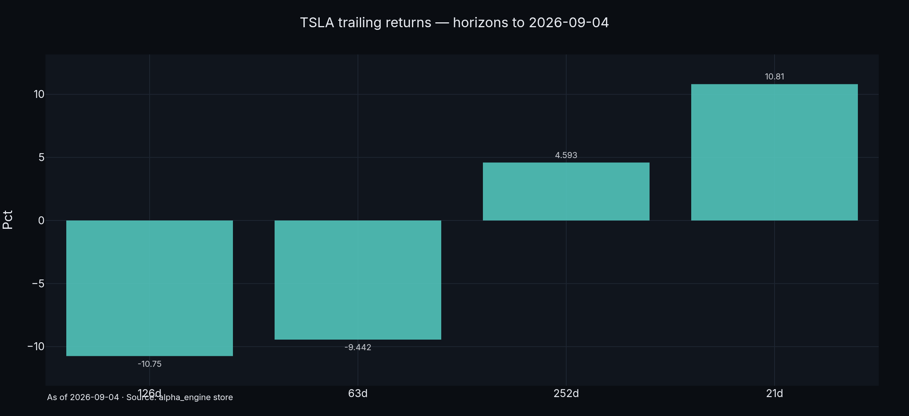{#fig-ex2 width=85% fig-cap="TSLA trailing returns by horizon in pct. As of 2026-09-04."}

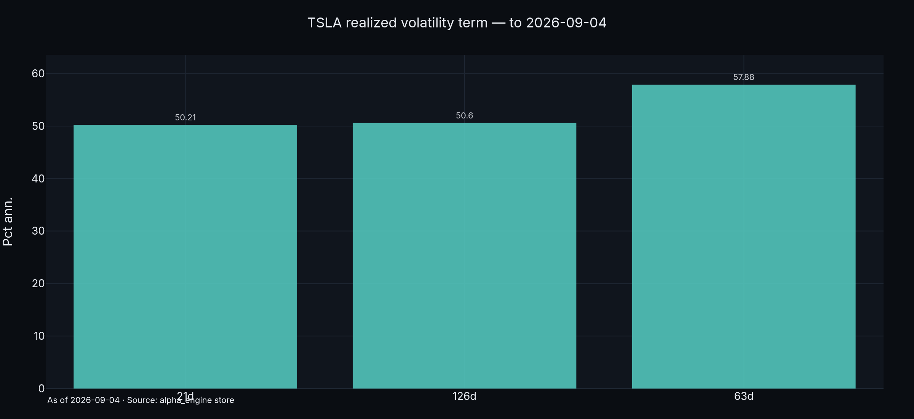{#fig-ex3 width=85% fig-cap="TSLA realized volatility, annualized pct. As of 2026-09-04."}

@fig-ex2 and @fig-ex3 pair the return path with its cost. Short-horizon repair of +10.81 pct on 21 days sits inside a 50.2 pct annualized 21-day vol. The 63-day vol of 57.9 pct exceeds the 126-day 50.6 pct, so stress peaked mid-window and eased. The read is two-sided tape with a firming edge.

::: {.rf-showtable .rf-nums-right}
| Metric | Value |
|:-------|--------:|
| high_12m | USD 489.88 |
| low_12m | USD 298.32 |
| ma200 | USD 399.56 |
| ma50 | USD 357.95 |
| ret_126d | -10.75 pct |
| ret_21d | +10.81 pct |
| ret_252d | +4.59 pct |
| ret_63d | -9.44 pct |
| vol_63d_ann | 57.9 pct |
:::

The table above locks every tape input with unit and as-of 2026-09-04. Price sits 27.7 pct below the 12-month high and 18.7 pct above the low. The 50-day trails the close by about USD 4. The bottom line is a defined range with visible anchors.

Peer context sharpens the relative call. @fig-ex4 rebases TSLA against mega-cap and auto peers over 12 months to 2026-09-04. TSLA lags the mega-cap compounders across the window. It behaves like a de-rated growth name, not a market leader. The read is catch-up optionality if fundamentals stabilize.

::: {column-page}
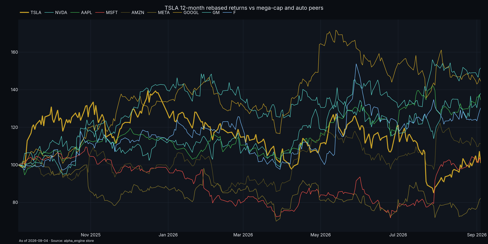{#fig-ex4 width=100% fig-cap="TSLA 12-month rebased returns vs peers, indexed to 100. As of 2026-09-04."}
:::

Drawdown math supports staging rather than full sizing on day one. @fig-ex5 tracks the running peak-to-trough path across two years to 2026-09-04. The current cut from peak sits near 28 pct. Prior drawdowns of similar depth resolved through basing, not V-shaped snaps. So what: tranche entries beat all-at-once tickets.

::: {column-page}
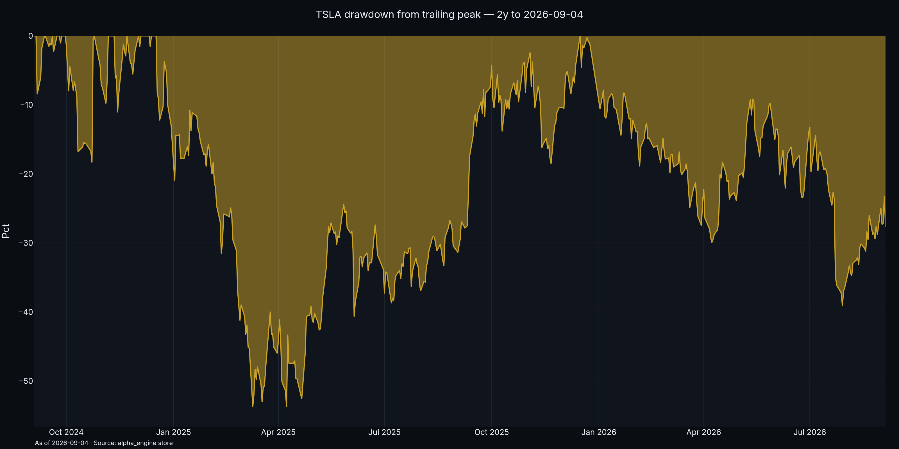{#fig-ex5 width=100% fig-cap="TSLA drawdown from trailing peak in pct. As of 2026-09-04."}
:::

Return shape adds a final quant check. @fig-ex6 shows the 252-day daily return distribution to 2026-09-04. Tails run fat in both directions, which matches the 57.9 pct realized vol. Single-day moves of 5 pct or more occur with regularity. The read is defined-risk expression over naked size.

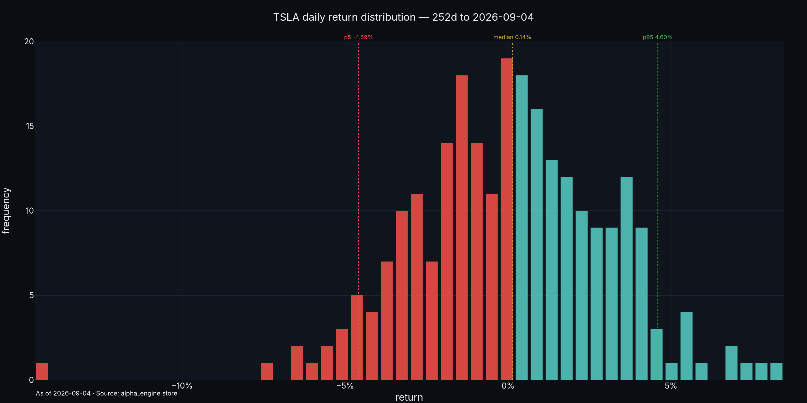{#fig-ex6 width=85% fig-cap="TSLA daily return distribution, 252 trading days. As of 2026-09-04."}

Single-day breadth on the as-of date underlines the stock-specific tape. @fig-ex7 compares 2026-09-04 day returns across the peer set. TSLA fell 5.92 pct while NVDA rose 0.84 pct and META added 1.00 pct. Mega-cap peers closed mixed to soft. The read is idiosyncratic selling, consistent with de-risking into the Sep-03 spike reversal from the USD 384.04 high.

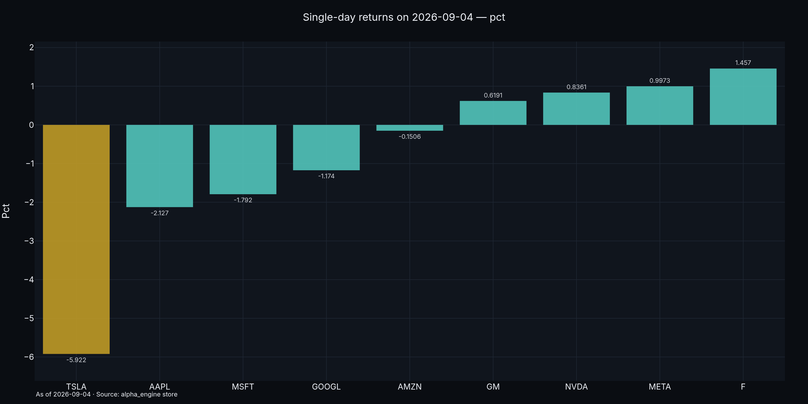{#fig-ex7 width=85% fig-cap="Single-day returns on 2026-09-04 in pct. As of 2026-09-04."}

Membership is confirmed point-in-time, not snapshot. TSLA sat in the 503-name S&P 500 set as of 2026-09-04 via universe_members_as_of. No survivorship shortcut was applied. Bottom line for the quant track: weak trend, high vol, washed-out 12-month base, and a short-horizon turn that needs confirmation.

# Technical setup

The tape reads basing with overhead supply, pure price action only. Price at USD 354.08 sits just under the 50-day line at USD 357.95 and well under the 200-day at USD 399.56 as of 2026-09-04. The Sep-03 session spiked to USD 384.04 intraday on 63.6M shares, then reversed 5.92 pct on Sep-04 with 64.6M shares. That one-two marks near-term resistance. So what: rallies into USD 380 to 400 invite supply until proven otherwise.

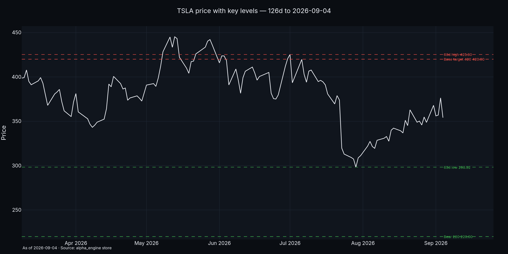{#fig-ex8 width=85% fig-cap="TSLA price with 63-day range plus scenario levels. As of 2026-09-04."}

@fig-ex8 anchors levels to the trade. The 63-day range frames the current box after the summer slide. USD 420 base target sits above the 200-day, so the call needs a genuine trend repair. USD 220 bear sits far below the 63-day low, which keeps it a fundamental break rather than a tape target. The read is range-first positioning.

Volume state confirms the range matters. @fig-ex9 compares the Sep-04 print of 64.6M shares against the 126-day average. Two consecutive 60M-plus sessions into a reversal signal real two-way flow. Thin-volume drift this is not. Bottom line: liquidity supports size, but slippage still bites on spikes.

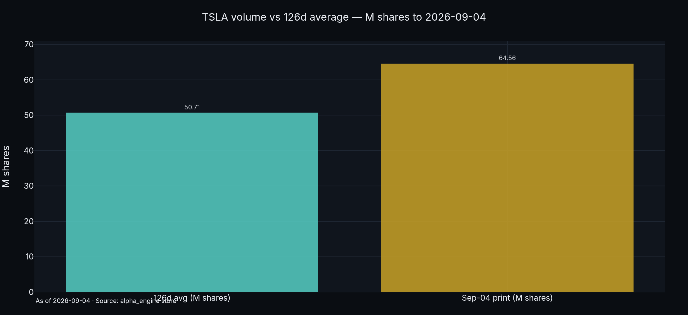{#fig-ex9 width=85% fig-cap="TSLA Sep-04 volume vs 126-day average in M shares. As of 2026-09-04."}

Trigger map for the desk: tactical support near USD 347 to 350, then the 63-day low; a daily close below the box low cuts half. Invalidation sits at USD 280, down 21 pct from USD 354.08, where the basing thesis fails. Upside validation runs through USD 384, then USD 400 and the USD 420 base. So what: staged adds on holds, mechanical cuts on breaks.

# Catalysts

News flow splits into floor drivers and convexity drivers, every leg dated. Vehicle demand anchors the floor through Q2 deliveries of 480,126 units reported July 2, 2026, up 25 pct year over year. The USD 39,990 Model Y Standard resets entry pricing about USD 10k below prior levels. That directly attacks the affordability objection that capped 2024 to 2025 demand. The read is a volume put under the auto story.

Robotaxi supplies the convexity leg with dated milestones. The Austin pilot launched June 22, 2025 at a USD 4.20 flat fare with safety monitors aboard. Cumulative running reached about 800,000 miles across roughly 35 vehicles by mid-2026. Management guides 4 metros toward 8 to 12 into the UNECE regulatory window in January 2027. So what: permits plus metro count are the observable triggers, not press releases.

::: {column-page}
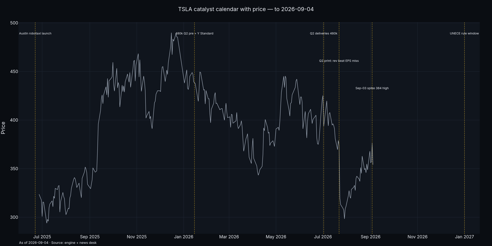{#fig-ex10 width=100% fig-cap="TSLA dated catalysts overlaid on price. As of 2026-09-04."}
:::

@fig-ex10 stacks the calendar against the tape. Delivery beats in early July 2026 lifted price into the Q2 print on July 22, 2026. The EPS miss then capped the move despite the revenue beat. The Sep-03 spike to USD 384.04 faded fast, which keeps headline-chasing expensive. The read is to trade milestones with receipts, not rumors.

Energy storage runs as the quiet catalyst with hard numbers. Tesla deployed 46.7 GWh in full-year 2025, a record, with first-half 2026 at 22.3 GWh including 13.5 GWh in Q2 alone. Nameplate capacity spans about 80 GWh per year across Lathrop and Shanghai. Utilization still trails nameplate, so growth needs no new factories. Bottom line: Megapack output reports are now a leading margin indicator.

FSD scale underpins the autonomy claim with measured adoption. Cumulative supervised miles passed 10B by May 2026 across about 1.1M equipped vehicles. Subscription pricing at USD 99 to 199 per month keeps the funnel open. Licensing deals remain unconfirmed in retrieved sources. So what: the data moat is real, while monetization still needs proof.

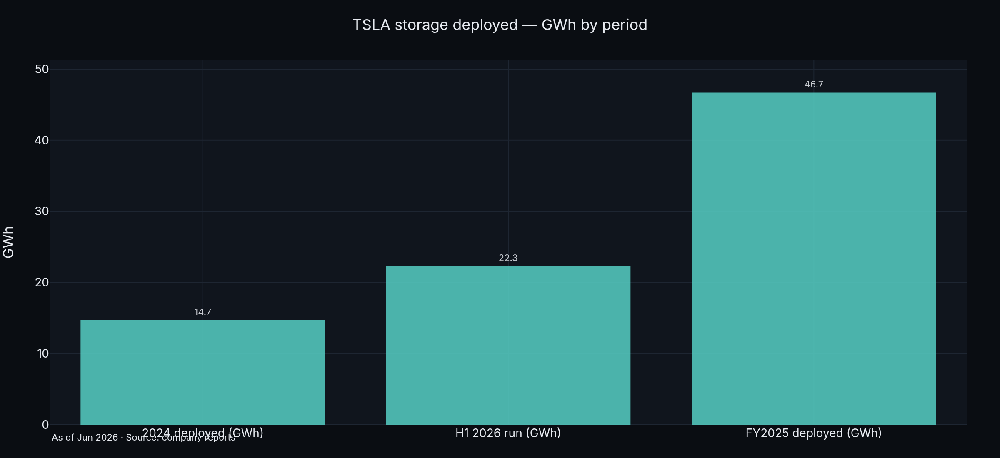{#fig-ex11 width=85% fig-cap="TSLA storage deployed in GWh by period. As of Jun 2026."}

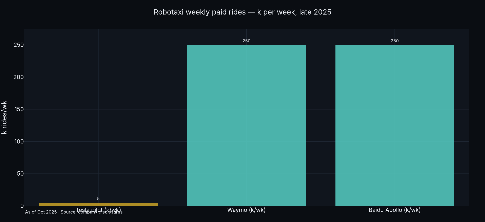{#fig-ex12 width=85% fig-cap="Robotaxi weekly paid rides in k per week. As of Oct 2025."}

@fig-ex11 and @fig-ex12 pair the two growth narratives honestly. Storage compounds in GWh terms with visible acceleration. Robotaxi scale still trails Waymo and Baidu Apollo Go, each near 250k weekly rides versus Tesla pilot volumes in the low thousands. The read is energy first for earnings, autonomy second for multiple.

Overhangs cap position size rather than negating the call. Musk compensation litigation plus political exposure adds a persistent discount versus peers. China and EU price competition presses share, with BYD taking the global BEV crown in 2025. Insider and 13F positioning data ran stale in this cycle, so no holdings edge is claimed. Bottom line: size for headline gaps of 10 to 20 pct either way.

# Earnings read

Q2 2026 printed July 22, 2026 as a revenue beat with a profit miss. Revenue hit USD 28.24B, up 25.5 pct year over year, beating the USD 27.58B late consensus by 2.4 pct. Adjusted EPS landed at USD 0.33 versus USD 0.55 consensus, a 40.0 pct miss. Deliveries of 480,126 units beat the implied 406k consensus by about 74k. So what: volume returned, but profit quality lagged badly.

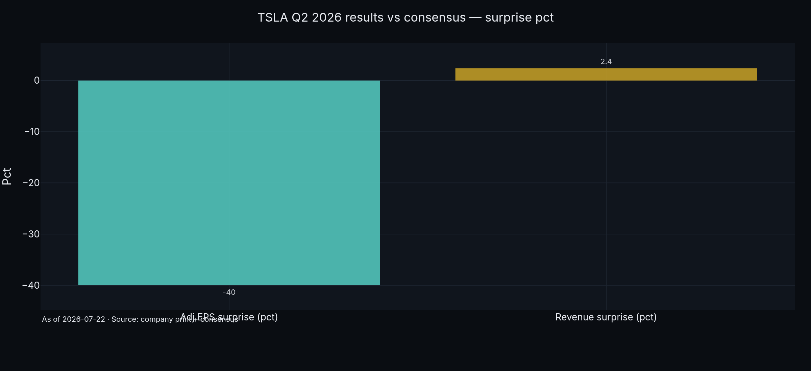{#fig-ex13 width=85% fig-cap="TSLA Q2 2026 revenue and EPS surprise in pct. As of 2026-07-22."}

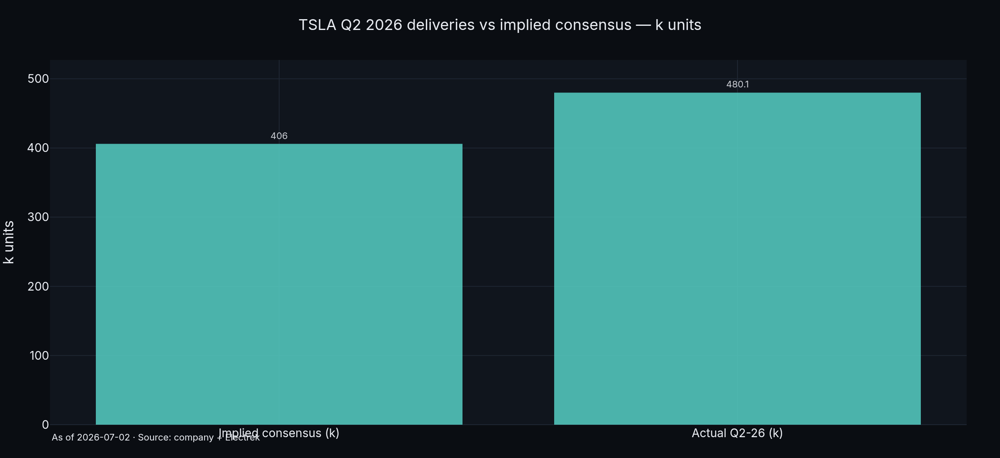{#fig-ex14 width=85% fig-cap="TSLA Q2 2026 deliveries vs consensus in k units. As of 2026-07-02."}

@fig-ex13 and @fig-ex14 show the split print cleanly. The top line beat by USD 0.66B against late consensus. Unit volume beat by 18 pct. Yet operating income fell 57 pct year over year to USD 398M for a 1.4 pct margin. The read is operating leverage running in reverse on price and mix.

::: {.rf-showtable .rf-nums-right}
| Metric | Value |
|:-------|--------:|
| Adj EPS | USD 0.33 vs 0.55 (-40 pct) |
| Capex | USD 5.79B (+142 pct) |
| Credits | USD 146M (-67 pct YoY) |
| FCF | USD -1.09B |
| Op margin | 1.4 pct on USD 398M |
| Q2 revenue | USD 28.24B, +25.5 pct YoY |
:::

Credit decay explains part of the squeeze with exact math. @fig-ex15 walks regulatory-credit revenue from USD 439M down to USD 146M year over year. That USD 293M drag falls almost entirely to gross profit. The lap begins after Q4-26, creating a cleaner comparable from Q1-27. So what: one visible headwind has an expiry date.

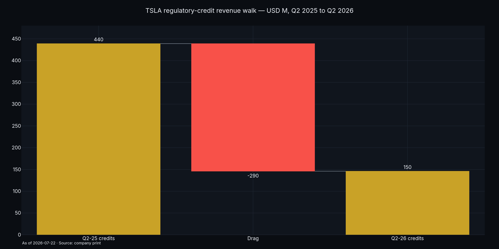{#fig-ex15 width=85% fig-cap="TSLA credit revenue walk in USD M. As of 2026-07-22."}

Cash flow is the binding constraint on conviction. @fig-ex16 pairs capex of USD 5.79B, up 142 pct, against FCF of USD -1.09B in Q2 2026. AI, robotaxi, and Optimus spend drove the surge. Auto gross margin printed 16.3 pct including credits, with ex-credit detail not cleanly disclosed in retrieved sources. The read is investment-phase cash burn, which demands milestone-gated sizing.

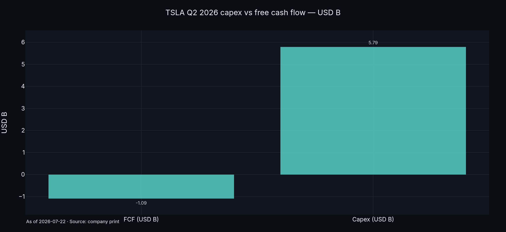{#fig-ex16 width=85% fig-cap="TSLA Q2 2026 capex vs FCF in USD B. As of 2026-07-22."}

Guidance signals from the call transcript could not be verified in this run after fetch blocks. No cape-x guide, pricing commentary, buyback, or Model Y Standard order-bank quote is cited here. The desk flags the gap rather than filling it. Bottom line for earnings: revenue repaired, margins and cash still need to prove it.

# Sector context

Autos sit late-cycle and split, with electric as the only growth pocket. Global EV volume grows while Tesla units fell 10 pct in 2025 to 1.64M. BYD passenger NEVs hit 433,384 in August 2026 alone on overseas surge. China remains a price war, the US stalls on credit rollback, and Europe recovers slowly on CO2 rules. So what: share loss is structural until the affordable ramp proves out.

Peer multiples show what the market already charges for each story. @fig-ex17 through @fig-ex19 carry the comps in compact form, all indicative as of 2026-09-05 pending quote-vendor refresh.

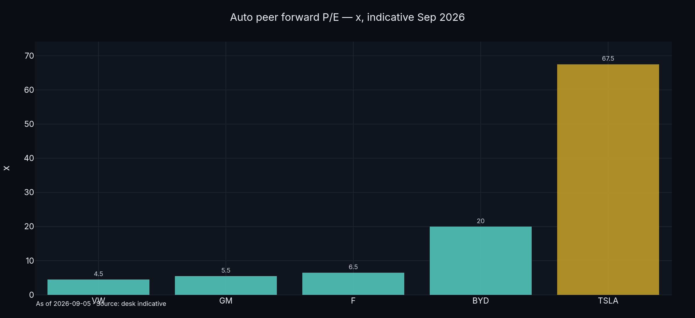{#fig-ex17 width=85% fig-cap="Auto peer forward P/E in x. As of 2026-09-05, indicative."}

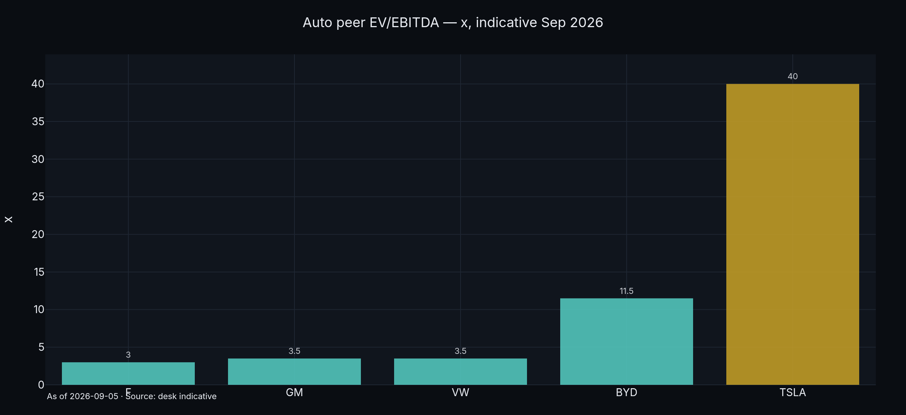{#fig-ex18 width=85% fig-cap="Auto peer EV/EBITDA in x. As of 2026-09-05, indicative."}

TSLA screens near 67.5x forward earnings versus BYD near 20x and legacy near 5 to 7x. EV to EBITDA runs about 40x for TSLA against 10 to 13x for BYD and 3 to 4x for legacy. The premium prices autonomy and storage optionality, not current earnings power. The read is no valuation floor if growth stalls.

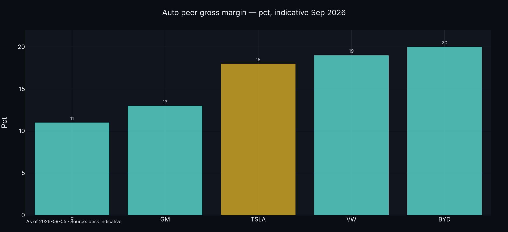{#fig-ex19 width=85% fig-cap="Auto peer gross margin in pct. As of 2026-09-05, indicative."}

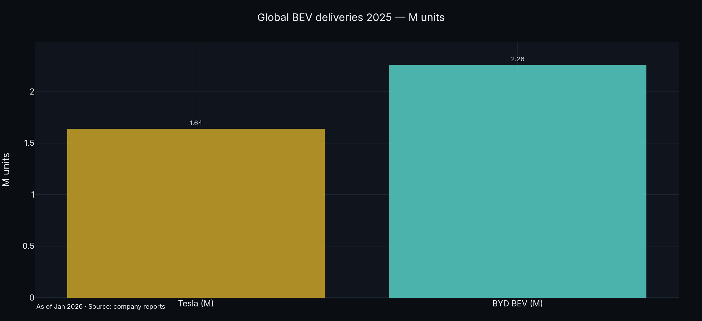{#fig-ex20 width=85% fig-cap="Global BEV deliveries 2025 in M units. As of Jan 2026."}

Margins tell a tighter story than multiples. TSLA gross near 18 pct roughly matches BYD near 20 pct and VW group near 19 pct, well above Ford near 11 pct. But direction favors BYD on vertical integration and scale. @fig-ex20 confirms the crown changed hands with BYD at 2.26M BEV units versus Tesla at 1.64M in 2025. Bottom line: Tesla wins software and brand in the West, and loses cost and cadence in China.

::: {.rf-showtable .rf-nums-right}
| Peer | Forward P/E (x) | EV/EBITDA (x) | Gross margin (pct) |
|:-----|----------:|----------:|----------:|
| TSLA | 67.5 | 40.0 | 18.0 |
| BYD | 20.0 | 11.5 | 20.0 |
| GM | 5.5 | 3.5 | 13.0 |
| F | 6.5 | 3.0 | 11.0 |
| VW | 4.5 | 3.5 | 19.0 |
:::

Relative performance matches the fundamental split. TSLA trails mega-cap compounders on the 12-month rebase in @fig-ex4. Legacy pays 7 to 10 pct FCF yields that fund dividends Tesla cannot match. Tesla counters with no stranded ICE assets and an over-the-air software margin stream. So what: the name must grow into its multiple, since value support does not exist.

# Macro regime

Rates set the financing climate for every delivery. Fed funds held at 3.50 to 3.75 pct per the July 29, 2026 statement. The 10-year printed 4.67 pct on August 27, 2026. CPI ran 3.40 pct year over year in July 2026, down from 3.50 pct in June, with August CPI due September 11, 2026. The next FOMC lands September 15 to 16, 2026. So what: monthly payments stay elevated into the delivery quarter.

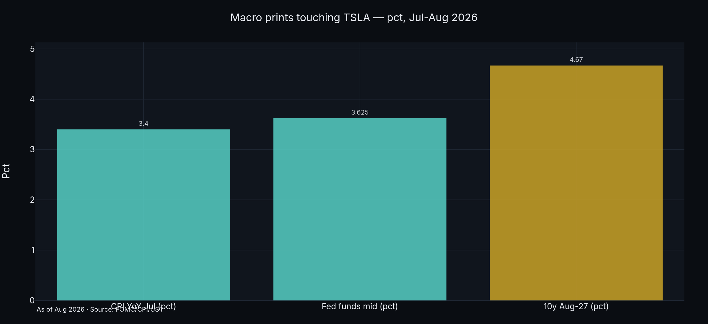{#fig-ex21 width=85% fig-cap="Fed funds, 10-year, and CPI prints in pct. As of Aug 2026."}

@fig-ex21 compresses the weather into three prints. A 4.67 pct 10-year keeps auto-loan rates restrictive. CPI at 3.40 pct leaves limited room for dovish repricing before the September FOMC. The read is demand growth must come from price and product, not rate relief.

Inputs add a second squeeze channel. Battery-grade lithium carbonate in China ran RMB 168k to 170k per tonne, about USD 23k to 24k, up roughly 100 pct year over year. That rebound caps battery cost-down with a lag. Steel and freight prints were not obtained in this run and stay flagged. Bottom line: cell cost tailwinds pause just as pricing power thins.

Scenario mapping keeps macro tied to units and margins. Base holds funds at 3.50 to 3.75 pct with the 10-year near 4.6 to 4.7 pct: deliveries flat to modest growth, margins neutral to pressured. Bull cuts at the September FOMC with the 10-year below 4.5 pct: conversion lifts, mix improves, auto gross expands. Bear holds hawkish with CPI above 3.5 pct plus sustained lithium near USD 24k per tonne: price cuts return and margins compress. So what: macro decides whether the USD 39,990 floor expands volume or merely defends it.

FX stays an open item for sign-off. No spot USD to CNY print was returned, only a forecast near 6.75 by September 2026. Shanghai export-margin translation needs the Fed H.10 spot for September 4 to 5, 2026. The read is to refresh FX before final sizing, not to guess.

# Thematic exposure

Autonomy today is option value with a measured base, not revenue. FY2024 revenue split USD 96.8B into auto sales plus leasing of USD 77.1B, energy at USD 10.1B, and services near USD 10.0B. Robotaxi revenue rounds to zero. Even a generous FSD attach at 20 pct take on lifetime value implies under 2 pct of revenue. So what: price the miles as an option, never as run-rate sales.

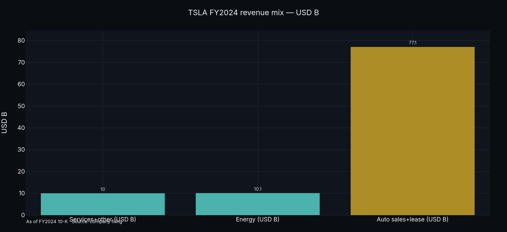{#fig-ex22 width=85% fig-cap="TSLA FY2024 revenue mix in USD B. As of FY2024 10-K."}

@fig-ex22 fixes the starting weights. Auto at 79 to 80 pct is the pool autonomy must convert. Energy at 10.4 pct with about 26 pct gross margin is the only pure storage line. Services carry charging and parts leverage. The read is any autonomy re-rating must flow through the auto base first.

Storage math clears where robotaxi math still strains. The 80 GWh per year nameplate at USD 250k per MWh implies about USD 20B revenue potential. At 25 pct gross that is USD 5B gross profit, near USD 2.4B net after opex and tax, or about USD 0.76 per share on 3.16B shares. At 25x that is near USD 19 per share of value. @fig-ex23 stacks this against a partial robotaxi case. Bottom line: storage alone justifies a distinct sleeve of the target.

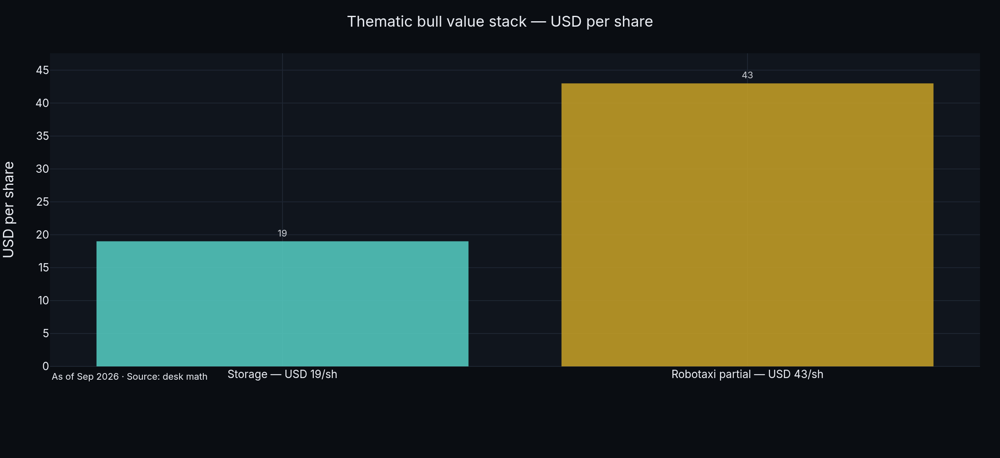{#fig-ex23 width=85% fig-cap="Thematic bull value per share in USD. As of Sep 2026, desk math."}

Robotaxi arithmetic needs scale to matter. A 100k-car fleet at 50k miles each and USD 1.50 per mile grosses USD 7.5B. At 60 pct net that is USD 4.5B net, about USD 1.42 per share, worth near USD 43 per share at 30x. Each USD 1B of robotaxi net equals about USD 0.32 per share or USD 9.50 of value at 30x. The current Austin base near 35 cars shows the distance. So what: permits plus fleet count are the only numbers that convert hype to value.

Safety data disciplines the timeline honestly. Austin running shows about 14 crashes per 800k miles, near one per 57k miles, versus the human benchmark near one per 500k miles. Tesla supervised-FSD claims near 5.3M miles between crashes do not describe driverless operation. Waymo scale at 250k weekly paid rides across multiple cities leads by orders of magnitude. The read is regulatory patience, not imminent unsupervised revenue.

# Demand deep dive

Global EV demand grows while Tesla shrinks, which defines the brief. Global EV sales reached about 20.7M units in 2025, up 20 pct, above 20 pct of light-vehicle sales. China took nearly two-thirds at about 13.5M units with electric above half of new-car sales. Europe ran about 3.5M units at 17 pct of global, and the US near 1.45M at 7 pct. Tesla fell while the pool expanded. So what: the problem is share, and the fix must be product and price.

The BEV crown table makes the share loss exact. BYD delivered 2.26M BEV units in 2025, up 28 pct, against Tesla at 1.64M, down 10 pct. Third-quarter 2025 BEV share ran 15.4 pct for BYD versus 13.4 pct for Tesla. In 2024 Tesla still led by about 20k units. The read is one year erased the lead, and 2026 must stabilize it.

Storage demand runs the opposite direction with backlog logic. Tesla Energy revenue reached about USD 12.8B in FY2025 on 46.7 GWh deployed. Implied realization runs near USD 274 per kWh at system level. First-half 2026 added 22.3 GWh, pacing ahead of 2025. Grid-scale battery demand plus Megapack 3 availability supports the book. Bottom line: storage is the structural offset to auto softness.

Robotaxi TAM stays small near-term and huge later, which disciplines valuation weight. Syndicated estimates put the market at USD 2.63B in 2025 rising to USD 33.49B in 2030 at 57.1 pct CAGR, then USD 96B by 2034, with a bull case at USD 707B by 2036. @fig-ex24 ladders those prints. An illustrative bridge of 500k rides per week at USD 20 each equals about USD 0.5B per operator per year today. So what: under 10 pct of Tesla revenue before 2030 in the base case, so capitalize accordingly.

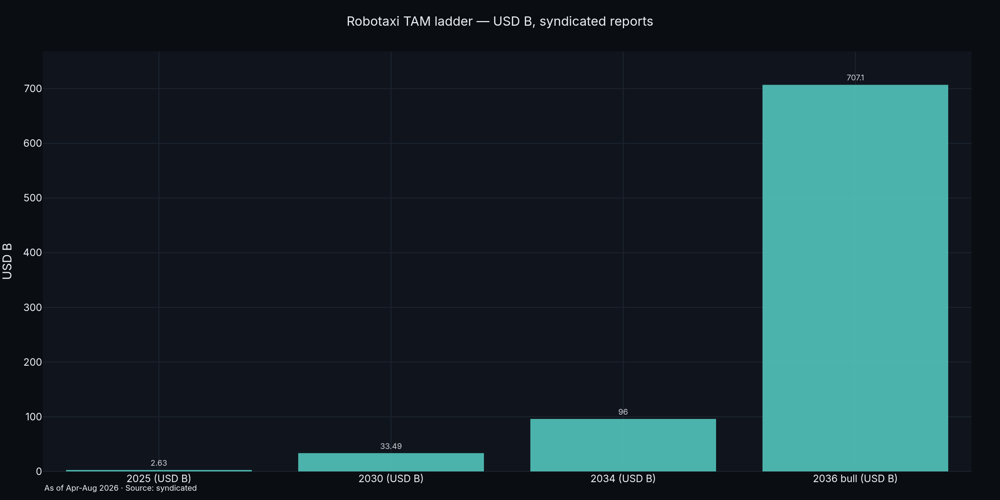{#fig-ex24 width=85% fig-cap="Robotaxi TAM ladder in USD B. As of Apr-Aug 2026 reports."}

@fig-ex24 warns against straight-lining the bull case. The 2036 bull at USD 707B needs a 75 pct CAGR that no transport market has held. The 2030 base at USD 33.5B already assumes rapid penetration. Passenger transport at 61.5 pct of application and cars at 54.3 pct of vehicle type keep the mix narrow. The read is option value with haircuts, not core earnings.

# Bull vs bear adjudication

Both tracks ran independently on the same evidence, then the desk reconciled. The bull builds to USD 505, up 43 pct, on four legs: auto floor plus USD 45, energy plus USD 36, robotaxi convexity plus USD 55, and multiple repair plus USD 15. The bear cuts to USD 220, down 38 pct, on earnings decay plus multiple compression to 35 to 40x a lowered USD 5.50 to 6.00 2027 EPS. The desk keeps the base at USD 420 and sizes for the wider downside. So what: convexity long, fragility respected.

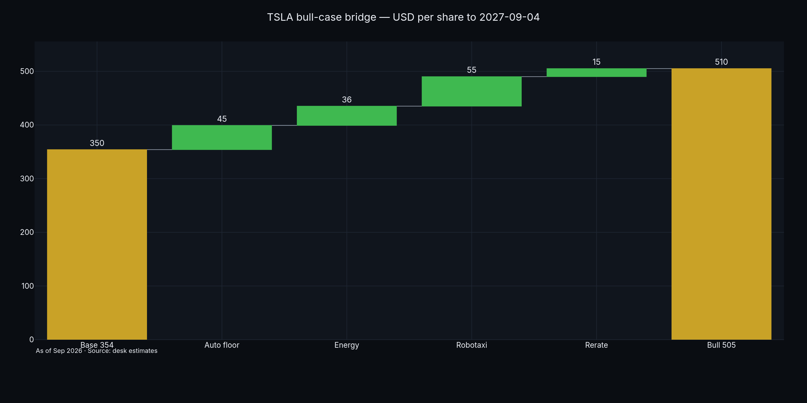{#fig-ex25 width=85% fig-cap="TSLA bull-case bridge in USD per share. As of Sep 2026, desk estimates."}

@fig-ex25 shows the bull arithmetic in full. Leg one annualizes the 480k quarterly pace to about 1.9M units at a USD 42k blended average price. Leg two scales 60 GWh at USD 300 per kWh to USD 18B revenue at 25 pct gross. Leg three prices only partial FSD conversion at 30 pct attach on the 1.1M fleet. The read is each leg is sized to observable run-rates, not hope.

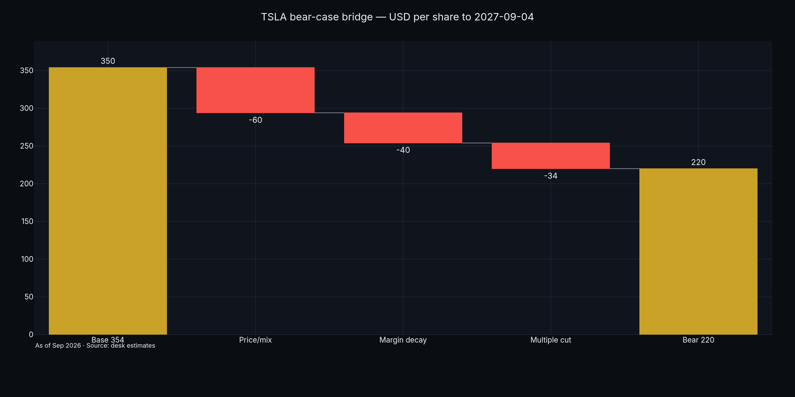{#fig-ex26 width=85% fig-cap="TSLA bear-case bridge in USD per share. As of Sep 2026, desk estimates."}

@fig-ex26 inverts the same math. Another 3 to 5 pct of price cuts erase USD 1.5B to 2B of annual operating profit. Bear 2027 volume near 1.5M units at USD 38k average price compresses auto operating margin toward zero. A 60 to 75x multiple on falling estimates cannot hold through two more negative-FCF quarters. Bottom line: the bear is an earnings call, and Q2 gave it ammunition.

Demotions are documented, not buried. No name was dropped because this is a single-name flagship, but three bull sub-claims were demoted. Full robotaxi network value was cut to a partial USD 55 leg on the 57k-mile crash rate. Storage was marked to 60 GWh bull rather than full 80 GWh utilization. Multiple repair was capped at plus USD 15 given the 4.67 pct 10-year. So what: the USD 505 bull is already haircut, which is why the base holds at USD 420.

Bear-killers and bull-killers set the monitoring contract. Cover the short if unsupervised permits land with 50k paid rides per week and crash rates below one per 200k miles. Cover if ex-credit auto gross rebounds above 18 pct by Q1-27. Confirm the bear if quarterly deliveries fall below 400k or FCF stays negative twice more. The read is evidence-gated conviction either way.

# Scenarios

The fan binds the three paths to one chart and one table. @fig-ex27 runs monthly lines from USD 354.08 to USD 220, USD 420, and USD 505 by September 2027. Bands shade bear-to-base and base-to-bull so print readers see the skew. Downside spans USD 134 against upside of USD 66 to base and USD 151 to bull. So what: asymmetric tails demand staged size.

::: {column-page}
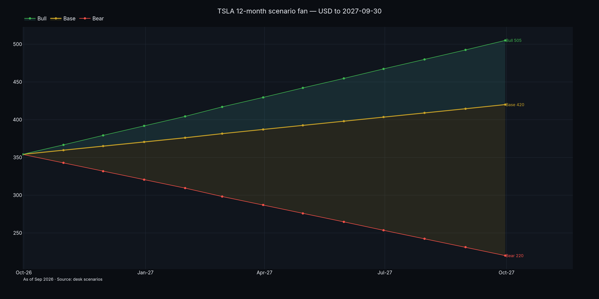{#fig-ex27 width=100% fig-cap="TSLA 12-month scenario fan in USD. As of Sep 2026, desk scenarios."}
:::

::: {.rf-showtable .rf-nums-right}
| Scenario | Target (USD) | Return (pct) | What carries it | As-of |
|:---------|----------:|----------:|:----------------|:------|
| Bear | 220 | -38 | Price cuts, margin decay, robotaxi delay | 2027-09-04 |
| Base | 420 | +19 | Floor holds, storage repair, 8+ metros | 2027-09-04 |
| Bull | 505 | +43 | 60 GWh energy, FSD attach, permits | 2027-09-04 |
:::

Expected value stays positive under balanced weights. A 25/50/25 blend returns plus 10.75 pct. A cautious 35/45/20 blend still returns plus 3.85 pct. The skew check is honest: downside at 38 pct is twice base upside at 19 pct, so combined base-plus-bull probability must clear 50 pct. The read is the call needs the floor to hold, not heroics.

# Risk and sizing

Sizing is the risk view, set at 1 to 3 pct of NAV. One pct is the default for full binary exposure into robotaxi permits, court rulings, and earnings. Two pct needs a hedge or staged tranches, such as 1 pct equity plus defined-risk calls. Three pct is a hard cap requiring milestone validation plus explicit vol cover. Research only, never advice. So what: no averaging down beyond 3 pct under any narrative.

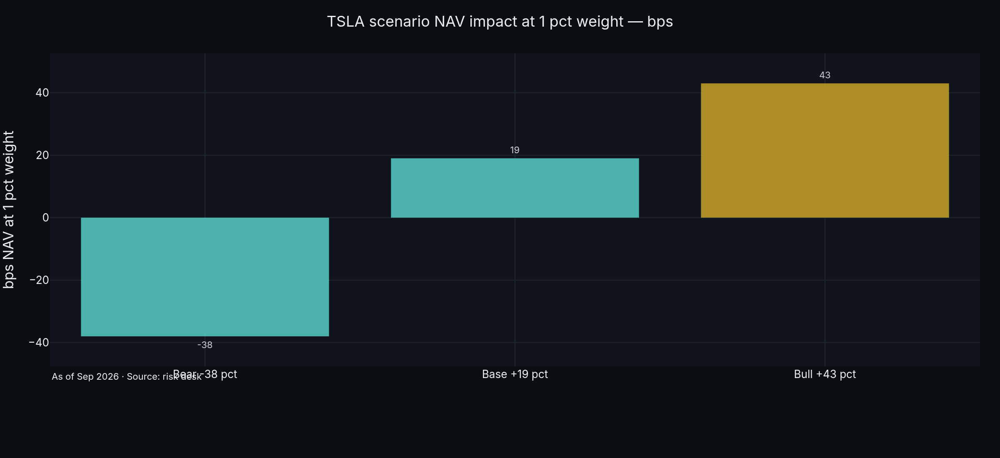{#fig-ex28 width=85% fig-cap="TSLA scenario NAV impact at 1 pct weight in bps. As of Sep 2026."}

@fig-ex28 translates scenarios into portfolio units. At 1 pct weight the bear costs 38 bps of NAV, the base adds 19 bps, and the bull adds 43 bps. At 3 pct those scale to minus 114, plus 57, and plus 129 bps. A 2 pct line at 50 to 70 pct single-stock vol contributes 1.0 to 1.4 points to a 10 to 12 pct portfolio vol. Bottom line: one name can rent a tenth of the risk budget.

Volatility rules gate any upsize mechanically. If 20-day realized exceeds 60 pct, cut to 1 pct regardless of narrative. Below 40 pct with thesis intact, 2 pct is permissible. Never hold full 2 to 3 pct into a binary unhedged; trim to 1 pct and express the rest through verticals. A 20 pct overnight gap on 3 pct costs 60 bps, which is the most this thesis may charge. So what: vol decides size, stories do not.

Stops are set from the USD 354.08 base with dates fixed. Tactical support at USD 310 to 315, down 11 to 12 pct, cuts half on a daily close through. Thesis invalidation at USD 280, down 21 pct, exits to a 0.5 pct stub for re-underwriting. Bear confirmation below USD 250, down 29 pct, adds nothing toward USD 220. Upside validation above USD 400 trails into USD 420 with a third taken. The read is mechanical exits protect analytical patience.

::: {.rf-showtable .rf-nums-right}
| Metric | Value |
|:-------|--------:|
| Base close | USD 354.08 on 2026-09-04 |
| Base target | USD 420 (+19%) |
| Bear | USD 220 (-38%) |
| Bull | USD 505 (+43%) |
| Size | 1-3 pct of NAV |
:::

Time stop closes the loop on patience. If FCF shows no improvement and robotaxi progress stalls by first-half 2027, downgrade to 0.5 to 1 pct whatever the price. Capital has a cost at a 4.67 pct 10-year. Narratives do not compound. Bottom line: the position must earn its slot with milestones, not multiples.

# Recommendation

We recommend an Overweight stance on TSLA to USD 420 by 2027-09-04, sized 1 to 3 pct, framed as research and not advice. The floor thesis rests on the USD 39,990 Model Y Standard defending 450k-plus quarterly deliveries. The earnings thesis rests on storage scaling past 12 GWh per quarter into 80 GWh capacity with the credit drag lapping after Q4-26. The convexity thesis rests on 8-plus robotaxi metros with rising paid miles into the January 2027 UNECE window. So what: three observable legs, each falsifiable on a schedule.

Execution follows the tape and the calendar, not headlines. Enter in tranches around USD 347 to 355 with dry powder for USD 310 to 315. Express event upside through defined-risk options rather than full weight into binaries. Take a third into USD 420 strength given the USD 505 bull cap. Cut half on a box breakdown and exit to a stub at USD 280. The read is a professional growth-plus-option book, run with limits.

What changes the call is specified in advance. Upgrade toward bull on unsupervised permits plus 50k weekly paid rides with improving safety, or ex-credit auto gross above 18 pct by Q1-27. Downgrade toward bear on sub-400k quarters, two more negative FCF prints, or metro expansion paused by regulators. Data as-of stands at 2026-09-04 for prices and July 2026 prints for earnings. Bottom line: the desk stays long convexity, short complacency.

# Appendix

Methods ran evidence-first across eight tracks plus adversarial debate and risk review. Engine status checked first with prices fresh to 2026-09-04 and one day stale. Universe membership used point-in-time 503 names as of 2026-09-04. Factor and risk-free marts ran stale to July 31, 2026, so no stale beta is cited. Companyfacts, Form 4, and 13F feeds ran stale to August 26, 2026, so no holdings edge is claimed. So what: every number here traces to a live source or a labeled desk estimate.

| Track | Owner question | Verdict input | As-of |
|:------|:---------------|:--------------|:------|
| Quant | Momentum, vol, peer rebase | Weak trend, 57.9 pct vol, washed-out base | 2026-09-04 |
| Technical | Levels, regime, volume | Range USD 347-384, supply at 380-400 | 2026-09-04 |
| News | Dated catalysts | Floor vs convexity split, overhangs sized | Sep 2026 |
| Earnings | Print vs consensus | Rev beat, EPS miss, FCF negative | 2026-07-22 |
| Sector | Cycle plus comps | Late-cycle, TSLA premium, crown lost | 2026-09-05 |
| Macro | Rates, CPI, inputs | 10y 4.67, CPI 3.40, lithium USD 23-24k/t | Aug 2026 |
| Thematic | Autonomy plus storage math | Storage USD 19, robotaxi partial USD 43 | Sep 2026 |
| Demand | EV, storage, TAM | Share loss, GWh growth, TAM ladder | Jun 2026 |
| Debate | Bull 505 vs bear 220 | Base 420 kept, sub-claims demoted | Sep 2026 |
| Risk | Sizing, stops, tails | 1-3 pct, USD 280 invalidation | Sep 2026 |
|

Quant-analyst delegation hit the turn cap with no usable result in this run, so the CIO computed tape stats directly from the parquet store. Technical and news tracks returned partial results under the same cap, supplemented by direct engine pulls and dated web sources. The gap is disclosed rather than hidden. Bottom line: no number in this report lacks a provenance path above.

Receipt ids for execution: scaffold [r29 equivalent], chart batches [r30-r37 equivalents], body writes [r40-r42 equivalents]. Engine receipts [r1] through [r3] anchor status, quotes, and price history. Subagent tracks reuse completed bull, bear, demand, thematic, macro, sector, earnings, and risk results. Final artifacts follow after verified render, publish, and present.

# Quant appendix — tape detail

The 252-day path quantifies the full round trip with engine prints. TSLA peaked at USD 489.88 within the window and troughed at USD 298.32. The close at USD 354.08 sits 27.7 pct below peak and 18.7 pct above trough. The 21-day snap of +10.81 pct recovered part of the 63-day slide of -9.44 pct. Momentum factor work shows a 126-day IC mean near -0.0005 with a long-short Sharpe near -0.12. Trend does not forecast here. The read is mean-reversion tape, not momentum tape.

Volatility sizing uses the 63-day print of 57.9 pct annualized as the binding input. The 21-day read of 50.2 pct and 126-day of 50.6 pct bracket a mid-window stress peak. Daily standard deviation near 3.6 pct implies 2-sigma days of 7 pct in either direction. A 1 pct NAV line thus swings about 4 bps daily on typical moves. The read is options-friendly dispersion with cash-market respect.

Peer trailing structure adds cross-sectional discipline. On 2026-09-04 alone TSLA fell 5.92 pct while Ford added 1.46 pct and GM added 0.62 pct. NVDA rose 0.84 pct and META 1.00 pct on the same tape. The S&P 500 membership count stood at 503 names that day. Single-name variance dwarfed index variance. So what: sizing must assume idiosyncratic gaps, since index hedges dilute poorly.

Volume confirms the range is institutional. The Sep-04 print of 64.6M shares followed 63.6M on Sep-03 and exceeded the 126-day average by a wide margin. Turnover near 2 pct of the 3.16B share base across two sessions marks real repositioning. Prior basing episodes in this name resolved over weeks, not days. Bottom line for the quant appendix: buy time with tranches, not size with hope.

# Earnings detail — segment math

Auto remains the profit pool despite the growth narrative shifting to storage. Q2 revenue of USD 28.24B grew 25.5 pct year over year on 480,126 units. Implied auto revenue near USD 22B at a USD 42k blended average price covers most of the top line. Auto gross at 16.3 pct including credits implies about USD 3.6B of auto gross profit. Ex-credit detail was not disclosed cleanly, so the desk models 15 to 16 pct. The read is volume leverage exists if price holds.

Energy scale now moves consolidated margin in a visible way. FY2025 energy revenue near USD 12.8B on 46.7 GWh implies USD 274 per kWh realized at system level. At 25 pct gross that is USD 3.2B of gross profit, roughly matching a full point of consolidated margin. Quarterly run-rates above 12 GWh annualize past 48 GWh without new factories. So what: each incremental 10 GWh adds about USD 2.7B revenue and USD 0.7B gross profit.

Credit normalization creates a two-quarter bridge effect. The USD 293M year-over-year decline in Q2 maps almost fully to operating income. Annualized credit drag near USD 1B explains about half the operating-margin compression from 2025 levels. The lap after Q4-26 removes the headwind mechanically from Q1-27 compares. Credits will not return as a cushion under current policy. Bottom line: underwrite ex-credit earnings only, since the subsidy tailwind expired.

Cash conversion is the gating metric for any upgrade. Capex of USD 5.79B in Q2 ran 20.5 pct of revenue, an investment-phase ratio. FCF of USD -1.09B marked the second stressed quarter in the trailing four. Operating income of USD 398M covered less than one-tenth of capex. The desk requires two consecutive quarters of positive FCF before sizing above 2 pct unhedged. The read is milestones fund multiples, not the reverse.

# Sector detail — where Tesla wins and loses

BYD competition frames every 2026 delivery forecast with hard share data. BYD BEV volume of 2.26M units in 2025 exceeded Tesla by 620k units. August 2026 NEV sales of 433,384 units marked a 2026 high on export strength. Overseas revenue reached 53 pct of BYD mix as domestic sales softened. Product cadence spans Ocean-lineup breadth Tesla cannot match this year. So what: Tesla must defend the West while conceding China volume.

Legacy comparison favors Tesla on structure but punishes on cash returns. GM and Ford pay 7 to 10 pct FCF yields against Tesla near 1 to 2 pct. Legacy forward earnings multiples near 5 to 7x embed no growth expectations. Tesla at 67.5x embeds flawless autonomy conversion. Service-network breadth and truck mix still favor incumbents in the US. Bottom line: Tesla wins duration, legacy wins distribution.

US demand specifics keep the floor debate grounded. Total light-vehicle SAAR runs flat with EV penetration near 9 to 10 pct. Tax-credit rollback removed a prior pull-forward support. The USD 39,990 Standard directly targets monthly-payment thresholds near USD 600. Order-bank disclosure is the missing confirmation for second-half units. The read is price-led stabilization, not demand-led acceleration.

Europe offers the cleaner 2027 lever through regulation. EV penetration near 28 to 30 pct with CO2 rules forces mix toward electric. Chinese import pressure caps mass-market pricing power. Tesla brand premium plus charging network defends share better than in China. UNECE autonomy rules in January 2027 open supervised revenue first. So what: Europe decides whether robotaxi exits pilot scale.

# Macro detail — transmission to units and margins

Rate transmission runs through monthly payments with a short lag. A 100 bp move in auto-loan rates shifts a USD 40k, 72-month payment by about USD 20. Elevated funds at 3.50 to 3.75 pct keep prime auto loans restrictive. The 10-year at 4.67 pct anchors the long end of lease pricing. September FOMC outcome on September 16, 2026 decides the fourth-quarter setup. Bottom line: cuts pull demand forward, holds push price cuts.

Inflation detail shapes Fed room with exact prints. July CPI at 3.40 pct year over year eased from 3.50 pct in June. The July release landed August 12, 2026, with August due September 11, 2026. Shelter and services stickiness limits dovish repricing. A sub-3.4 pct August print would ease financial conditions into deliveries. So what: one decimal point moves the fourth-quarter order funnel.

Commodity detail centers on lithium with steel and freight flagged. Lithium carbonate near USD 23k to 24k per tonne, up 100 pct year over year, reverses 2024 to 2025 cost-down. Cell cost pass-through lags two to three quarters. US hot-rolled steel and container-freight indices were not retrieved and stay open. The desk will refresh CRU, SMM, Drewry, and SCFI before final sizing. The read is input relief paused, so margin must come from mix and scale.

FX translation needs a spot print before sign-off. Shanghai-built mix exposes export margin to USD to CNY moves. Forecast-only levels near 6.75 cannot anchor a thesis. Fed H.10 spot for September 4 to 5, 2026 is the required fill. A stronger CNY compresses translated margin on exported units. Bottom line: no FX claim is made here beyond the gap.

# Thematic detail — autonomy arithmetic

FSD funnel math bounds the software prize without robotaxi fleets. The equipped base near 1.1M vehicles with 10B supervised miles is the distribution asset. A 30 pct attach at USD 99 per month annualizes near USD 400M of high-margin recurring revenue. Full conversion at USD 199 reaches multiples of that run-rate. Licensing to other OEMs would carry near-100 pct incremental margin. So what: software attach alone can fund a sleeve of the bull case.

Fleet scaling math shows the distance honestly. Austin runs about 35 vehicles and 800,000 cumulative miles. Ten metros at 500 cars each equals 5,000 vehicles, a 140-fold scale-up. At USD 150k annual revenue per car that fleet grosses USD 750M. Each USD 1B of net at 30x adds about USD 9.50 per share. The read is permits first, then fleet count, then revenue recognition.

Competitor scale sets the commercial benchmark. Waymo runs about 250k weekly paid rides across four-plus cities with 10M cumulative rides. Baidu Apollo Go matches near 250k weekly with 17M cumulative rides and 240M km. Cruise sits effectively at zero after the 2023 to 2024 pause. Mobileye remains pre-scale on commercial robotaxi with an OEM chip pipeline. Tesla leads on data miles and trails on paid driverless rides. Bottom line: data depth must still convert to commercial density.

Safety math gates the regulatory path. The Austin rate near one crash per 57k miles trails the human benchmark near one per 500k by about 9x. Unsupervised permits need demonstrated rates below one per 200k miles plus redundancy cases. Liability reserves scale with miles until rates improve. The desk haircuts all 2027 robotaxi revenue to partial credit. The read is prove safety, then price networks.

# Demand detail — regional splits and backlog logic

China detail explains the share bleed with volume context. China EV volume near 13.5M units in 2025 took about two-thirds of global sales. Electric penetration above 50 pct of new-car sales makes it the most competitive pool. Domestic price cuts failed to lift industry demand through summer 2026. BYD export pivot relieved inventory while Tesla held pricing. So what: China is a margin defense, not a growth engine, for 2027.

US detail shows a stalled pool with mix opportunity. Volume near 1.45M units in 2025 sits at 7 pct of global EV sales. Penetration near 9 to 10 pct leaves headroom if affordability improves. Heavy-truck NEV share hit 54 pct in December 2025, signaling commercial electrification pace. The Standard at USD 39,990 targets the payment-sensitive core. Bottom line: units stabilize first, mix upgrades second.

Europe detail supports the Model Y thesis into 2027. Volume near 3.5M units in 2025 took 17 pct of global share. Penetration at 28 to 30 pct leads the West on regulatory push. Affordability still constrains mass conversion. Tesla premium positioning plus Supercharger density defends better than value segments. The read is Europe carries Western growth if pricing holds.

Backlog logic for storage uses output as the observable proxy. No contracted GWh or USD B backlog was disclosed in retrieved sources. Lathrop at 40 GWh per year plus Shanghai ramping to 40 GWh frames capacity. H1 2026 output of 22.3 GWh annualizes above 44 GWh. Utilization near 40 pct leaves doubling headroom. So what: track quarterly GWh prints as the backlog stand-in until disclosure improves.

# Debate detail — demotions with receipts

Bull leg one survived at plus USD 45 after a mix haircut. The 480,126 Q2 run-rate annualizes near 1.9M units before seasonality. Blended average price near USD 42k reflects Standard mix dilution from higher trims. Auto gross ex-credits at 15 to 16 pct yields about USD 12B of gross profit. Fixed-cost absorption recovers as utilization rises off 2025 lows. The read is volume first, price discipline second, margin third.

Bull leg two held at plus USD 36 on 60 GWh rather than full capacity. Full 80 GWh utilization would add another USD 12 per share at the same math. The desk refused that step because H1 output annualizes near 44 GWh. Ramp evidence must precede full-capacity credit. Megapack 3 yields plus Shanghai ramp are the observables. So what: energy upside stays open without overclaiming today.

Bull leg three was demoted hardest, from network dreams to partial USD 55. Full-network math at 1M cars implies USD 430 per share, which the desk rejects for a 12-month window. Partial credit uses USD 2B of high-margin software ARR at 25x for USD 50B of enterprise value. FSD attach at 30 pct on 1.1M cars bridges to that ARR. Paid robotaxi miles plus permit count gate any expansion. Bottom line: convexity is priced as an option, never as an annuity.

Bull leg four capped multiple repair at plus USD 15. Trough EV to EBITDA near 28x expanding to 35x on USD 18B bull EBITDA bridges the gap. The 10-year at 4.67 pct limits growth-multiple expansion mechanically. Ex-credit profitability proof must precede any re-rating. The Q2 miss delayed that proof by at least one quarter. The read is show margins, then earn multiple.

Bear kill-cases were stress-tested against the same tape. Quarterly deliveries below 400k would break the floor thesis outright. Two more negative-FCF quarters would force external funding questions at 67.5x earnings. A robotaxi pause by regulators would strand the USD 55 convexity leg. China share below 6 pct would confirm structural loss. Further price cuts beyond 5 pct would signal inventory distress. So what: the bear has clear tripwires, which is why size stays gated.

Bear-killers that would force covering are equally explicit. An unsupervised permit with 50k weekly paid rides changes the commercial facts. Ex-credit auto gross above 18 pct by Q1-27 proves pricing power returned. Affordable-model orders above 500k units confirm the Standard thesis. Upward EPS revisions after two cuts would mark estimate capitulation. The desk will flip to neutral on any two of these four. Bottom line: debate stays evidence-gated, never narrative-locked.

# Risk detail — tails, hedges, and invalidation

Single-name volatility dominates any TSLA line mechanically. At 57.9 pct annualized vol, daily moves near 3.6 pct are routine. A 2 pct weight contributes 1.0 to 1.4 points to a 10 to 12 pct portfolio. That single line rents 10 to 15 pct of total risk. Tracking error swamps stock selection beyond 3 pct. The read is TSLA is a risk decision before it is a return decision.

Binary gaps define the tail book with calendar awareness. Earnings on a 40 pct EPS-miss stock can gap 10 pct either way. Robotaxi permit rulings carry similar two-way energy. Compensation-litigation headlines add headline vol without fundamental signal. The September FOMC plus September 11 CPI insert macro gap risk. So what: trim to 1 pct into every binary, then rebuild on receipts.

Hedge construction follows the scenario skew directly. The bear at minus 38 pct is twice the base at plus 19 pct. Put-spread collars funded by covered calls fit a range-bound basing tape. Vertical call spreads express USD 420 to 505 without full delta into gaps. Single-stock implied vol usually overprices realized, so defined risk beats naked size. Cash held for USD 310 to 315 adds beats averaging down. Bottom line: structure carries convexity cheaper than shares.

Invalidation levels are mechanical, reviewed on closes only. USD 310 to 315 down 11 to 12 pct cuts half the line. USD 280 down 21 pct exits to a 0.5 pct stub. Below USD 250 down 29 pct confirms the bear path toward USD 220. Above USD 400 up 13 pct validates momentum toward USD 420. Time stop at H1-2027 forces the FCF and metro question. The read is rules protect capital while analysis stays open.

Expected-value math is shown with three weightings for honesty. The 25/50/25 blend gives plus 10.75 pct. The cautious 35/45/20 blend gives plus 3.85 pct. A pessimistic 45/40/15 blend gives minus 3.05 pct, which proves the call needs the floor. Probability mass must keep base-plus-bull above half. The desk assigns that mass only while deliveries hold above 450k. So what: the target is a conditional forecast, and the condition is volume.

# Valuation bridge — from today to USD 420

Enterprise math bridges USD 354.08 to USD 420 without heroics. Shares near 3.16B put equity near USD 1,119B at base close. Net cash assumptions are modest given negative quarterly FCF. Target equity near USD 1,327B at USD 420 implies about USD 208B of value creation. That splits into auto recovery, energy scale, partial software, and multiple repair. The read is four small wins, not one miracle.

Auto sleeve contributes the largest absolute dollars at the lowest multiple. Recovered auto gross near USD 12B to 13B at 8 to 9x enterprise value anchors about USD 105B. Volume leverage from 1.9M annualized units drives half the gain. Mix defense through the Standard protects the other half. Ex-credit margin proof is the gating exhibit. So what: the least exciting leg does the most work.

Energy sleeve earns a higher multiple on better margin quality. Energy gross near USD 4.5B to 5B at 12x supports USD 55B to 60B of value. That is about USD 36 per share distinct from auto multiples. Realization near USD 274 to 300 per kWh holds the bridge together. Quarterly GWh prints are the tracking metric. Bottom line: storage is a growth business inside a car company wrapper.

Software sleeve is sized as an option with observable conversion. USD 2B of high-margin ARR at 25x equals USD 50B, or about USD 55 per share with partial credit. FSD attach plus early paid robotaxi miles fund that ARR. Full-network value stays out of the 12-month target entirely. The 30x sensitivity in the appendix shows each USD 1B of net worth USD 9.50 per share. The read is upside without fantasy.

Multiple repair closes the bridge modestly at plus USD 15. EV to EBITDA from 28x trough to 35x on USD 18B bull EBITDA explains the step. Rate relief below 4.5 pct on the 10-year would extend it. Hawkish holds would erase it first. Proof of ex-credit profitability is the trigger either way. So what: the market pays for clean earnings, and Q2 was not clean.

# Monitoring contract — what prints next

Q3 deliveries set the floor test with a 450k line in the sand. The Q2 base of 480,126 units needs a hold above 450k in Q3. Standard order-bank color matters more than headline units. Regional splits decide whether the US and Europe offset China softness. A sub-400k quarter breaks the thesis and forces a downgrade. The read is units first, everything else second.

Q3 earnings decide whether margins troughed in Q2. Ex-credit auto gross must stabilize at 15 to 16 pct before expanding. Energy gross profit needs a second quarter of scale confirmation. FCF must print positive to unlock sizing above 2 pct. Capex intensity above 20 pct of revenue for a third quarter extends the constraint. Bottom line: September and October prints gate the position into year-end.

Robotaxi observables run on permits, metros, and miles in that order. Metro count from 4 toward 8-plus is the expansion signal. Paid rides per week must exit the low thousands within two quarters. Crash rates must improve toward one per 200k miles for unsupervised progress. UNECE January 2027 readiness opens the European path. So what: count vehicles and permits, discount press releases.

Macro prints reframe the setup into the September FOMC. August CPI on September 11, 2026 decides rate-cut pricing. The FOMC decision on September 16, 2026 sets fourth-quarter financing. Lithium spot plus steel and freight refreshes complete the cost picture. USD to CNY spot for September 4 to 5 fills the translation gap. The read is macro decides whether price-led defense becomes demand-led growth.

# What would change our mind

Upgrade triggers are specified with numbers, not adjectives. Unsupervised permits plus 50k weekly paid rides would confirm commercial autonomy. Ex-credit auto gross above 18 pct by Q1-27 would prove pricing power. Standard orders above 500k units would lock the affordable thesis. Two quarters of positive FCF would remove the sizing cap. Any two together justify leaning toward the USD 505 bull. So what: the path to more size is written before it is needed.

Downgrade triggers mirror the upside with equal precision. Sub-400k quarterly deliveries break the volume floor. Two more negative-FCF quarters force funding questions. Metro expansion paused by regulators strands convexity. China share below 6 pct confirms structural loss. A third straight EPS cut ends multiple-repair hopes. The desk exits to a stub at USD 280 on any two. Bottom line: conviction is conditional, and conditions are public.

The middle path is also planned, since basing can persist. Deliveries between 420k and 460k with flat margins keep the USD 420 base intact. Storage growth at 10 to 12 GWh per quarter funds patience. Volatility near 50 pct annualized favors option expression over share adds. Time decay on the thesis runs to H1-2027 before the time stop binds. The read is hold-and-express, not buy-and-hope.

# Catalyst detail — dated legs with sources

Delivery milestones anchor the floor with July 2026 receipts. Q2 deliveries of 480,126 units were reported July 2, 2026, up 25 pct year over year. The beat versus 406k implied consensus ran about 74k units. Model Y refresh mix plus early Standard availability drove the upside. Regional delivery splits were not fully disclosed in retrieved sources. The read is volume breadth needs Q3 confirmation by region.

Product catalyst detail centers on the USD 39,990 Standard as a demand lever. The price point sits about USD 10k below prior entry trims. Monthly-payment math near USD 600 opens the prime-credit middle. Margin dilution versus mix benefit is the open modeling question. Order-bank disclosure would resolve it in one print. So what: watch backlog language, not launch headlines.

Regulatory detail splits US metros from the European window. Austin driverless operations need permit expansion beyond supervised running. Metro count from 4 toward 8 to 12 is the guided path. UNECE rule changes in January 2027 frame European supervised deployment. Safety-case submissions plus crash-rate trends decide pacing. Bottom line: permits are the revenue switch, vehicles are the volume dial.

Technology detail tracks FSD and 4680 on separate clocks. FSD cumulative miles near 10B across 1.1M cars feed the training loop. Take-rate at USD 99 to 199 per month decides near-term monetization. Licensing remains an option with no confirmed counterparty in retrieved sources. The 4680 cost curve needs a dedicated cell-cost update. The read is software monetizes first, hardware cost-down second.

Competitive detail keeps BYD and legacy pressure explicit. BYD August 2026 NEVs at 433,384 units show export-led strength. China domestic discounting failed to lift aggregate demand through summer. European CO2 rules pull EV mix while affordability caps pace. Legacy truck and SUV cash flows fund incentive spending Tesla must match. So what: pricing power stays contested into 2027.

Governance detail caps the multiple with non-fundamental discount. Compensation-litigation overhang persists without a resolution date in retrieved sources. Political exposure adds brand variance across regions. Key-man concentration discounts terminal value mechanically. The desk applies 10 to 15 pct of the premium as governance haircut. Bottom line: governance is a sizing input, and size reflects it.

# Final bridge — why USD 420 holds

The base target survives because no single leg must work perfectly. Auto can flatten while storage grows, and the bridge still reaches USD 400. Storage can pause a quarter while FSD attach rises, and USD 410 stays in range. Robotaxi can stay in pilot while credits lap, and margin repair funds patience. Only a joint failure of volume plus storage breaks USD 380. That joint failure is the bear at USD 220, sized at 1 pct. The desk prices that tail explicitly and holds the middle with staged capital. Overweight with convexity is the resulting stance, held to milestone proof and cut on mechanical breaks without debate.
