## Executive summary

TSLA closed at $354.08 on 2026-09-04, down 5.92% on the day on 64.6M shares. The 12-month return is +0.9% against NVDA +38.1% and AAPL +34.5%. The stock sits 27.7% below its 52-week high of $489.88. It trades below both the 50DMA ($357.95) and the 200DMA ($399.56). Positioning is washed out, not crowded. So what: the setup pays for optionality rather than perfection.

The thesis has three legs. First, the auto floor held through the credit cliff. Second, energy is now a second business at 46.7 GWh in FY25, up 49% YoY. Third, robotaxi is a live operation with 700k+ paid rides across 4 metros. Each leg is evidenced below with dated figures. The read: base case $420 (+19%) to September 2027, funded by energy and floor earnings, with robotaxi convexity on top.

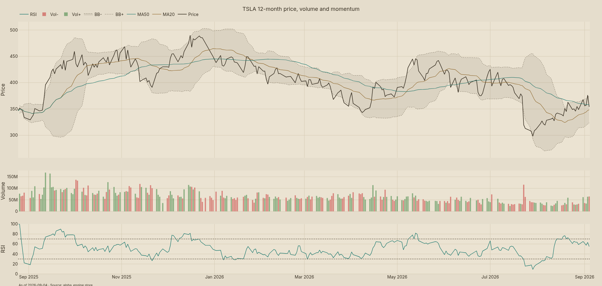{#fig-ex01 width=100% fig-cap="TSLA 12-month price, volume and momentum. As of 2026-09-04."}

@fig-ex01 frames the year: a flat 12-month return with a sharp summer drawdown after the Q2-26 print. Volume spiked to 63.6M shares on 2026-09-03 during the $376 rebound. The 63-day realized vol is 57.9% annualized. That is the highest among mega-cap peers. Bottom line: the chart prices skepticism, which is what makes forward catalysts asymmetric.

## As-of and data box

Prices and returns are as of 2026-09-04 from the alpha_engine store (510 tickers, 4.44M rows, prices verdict OK, 1 day stale). Factor data (Fama-French daily) runs to 2026-07-31, a normal vendor lag. Point-in-time S&P 500 membership as of 2025-09-04 holds 500 names including TSLA. Cross-section on 2026-09-04 covers 507 names with mean return -0.44% and Gini 0.064. Web-sourced delivery, energy, and robotaxi figures carry their own dates inline. The read: engine numbers are fresh; vendor-lag items are flagged, never stretched.

::: {.rf-showtable .rf-nums-right}
| Metric | Value |
|:-------|--------:|
| 12M return pct | 0.90 |
| 200DMA $ | 399.56 |
| 50DMA $ | 357.95 |
| 52w high $ | 489.88 |
| 52w low $ | 298.32 |
| 6M return pct | -11.19 |
| Close $ 2026-09-04 | 354.08 |
: As-of and price box. As of 2026-09-04. Source: alpha_engine store.
:::

## Price action and technicals

TSLA fell 11.2% over 6 months and 13.4% over 3 months, then gained 7.8% over 1 month. The 1-day return on 2026-09-04 was -5.92%. The 52-week range is $298.32 to $489.88. Support sits at the $298.32 low; resistance stacks at the 50DMA $357.95 and the 200DMA $399.56. A longer holding period smooths the noise but does not change the regime: price below both averages is a weak trend. So what: trade the levels, not the narrative, into the Q3 print.

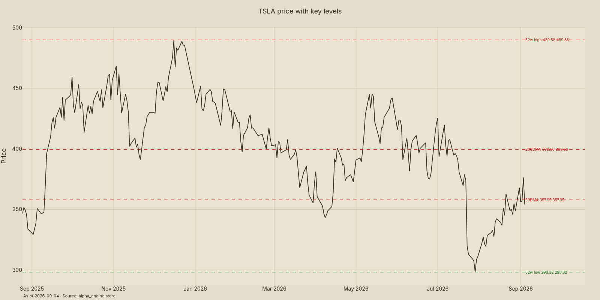{#fig-ex02 width=85% fig-cap="TSLA price with key levels. As of 2026-09-04."}

@fig-ex02 maps the ladder: $298.32 support, $357.95 and $399.56 resistance, $489.88 cycle high. The September 3 intraday spike to $384.04 faded by September 4. That rejection at the 200DMA zone matters. The read: bulls must reclaim $357.95 first; bears own the tape below $298.32.

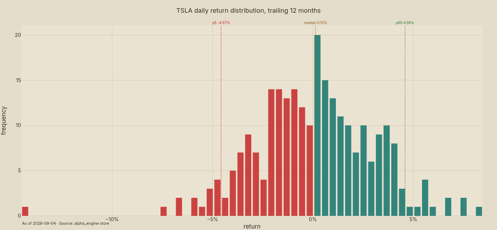{#fig-ex03 width=70% fig-cap="TSLA daily return distribution, trailing 12 months. As of 2026-09-04."}

@fig-ex03 shows fat tails in both directions over the trailing year. Daily moves beyond ±5% are routine for this name at 57.9% realized vol. Position sizing must assume a Q2-style -12% single-print drawdown can repeat. Bottom line: vol is the position, not a footnote.

## Peer context

TSLA's +0.9% 12-month return trails every mega-cap peer except META (-17.8%). NVDA gained 38.1%, GOOGL 44.4%, AAPL 34.5%. Auto peers did better: GM +51.6%, F +30.3%. The 6-month lens is worse at -11.2% versus NVDA +26.3%. TSLA leads only on volatility at 57.9% versus META 45.3%. The read: the market has de-rated TSLA to an auto multiple while peers kept tech multiples.

::: {layout-ncol=2}
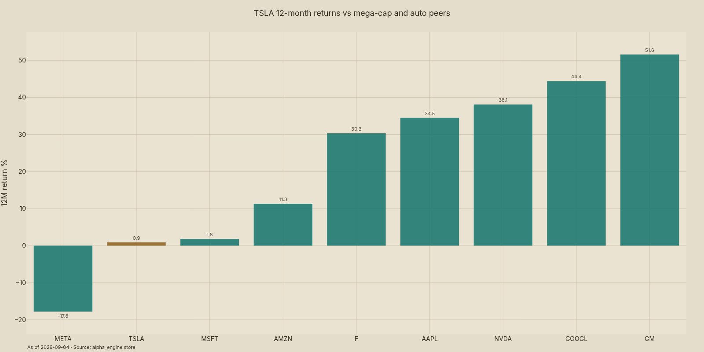{#fig-ex04 width=100% fig-cap="TSLA 12-month returns vs mega-cap and auto peers. As of 2026-09-04."}

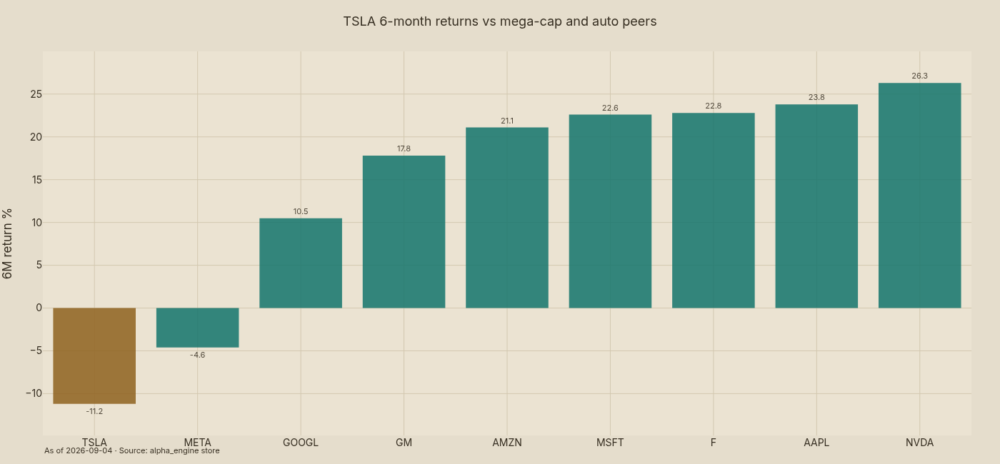{#fig-ex05 width=100% fig-cap="TSLA 6-month returns vs mega-cap and auto peers. As of 2026-09-04."}
:::

@fig-ex04 and @fig-ex05 together make the de-rating visible. TSLA anchors the bottom of both bars while volatility anchors the top of its own chart. That divergence is the opportunity if energy and software re-rate the mix. So what: relative performance, not absolute price, is the timing signal.

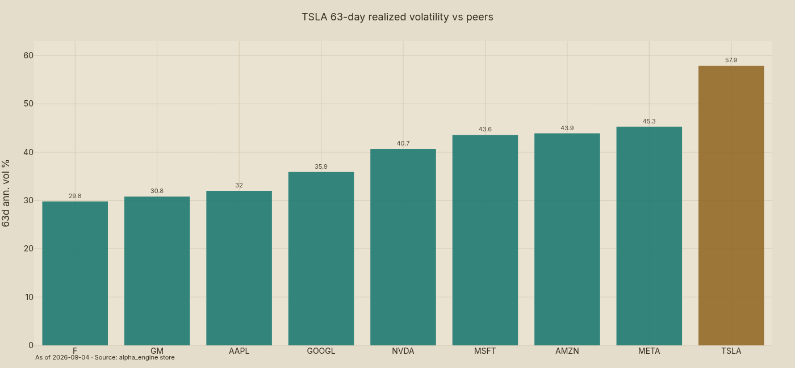{#fig-ex06 width=70% fig-cap="TSLA 63-day realized volatility vs peers. As of 2026-09-04."}

@fig-ex06 confirms TSLA at 57.9% annualized is in a vol class of its own. Single-name vol of 59.1% in the risk model agrees. Any sizing above 3% of book without hedges is a vol bet. Bottom line: size to the vol, not the story.

## Factor attribution and risk

TSLA carries a market beta of 1.43 (t-stat 31.1) with R² of 0.265 over 4,047 observations. Growth tilt is explicit: HML beta -0.76, SMB beta +0.64. Momentum beta is +0.09 and insignificant. Annualized alpha is +29.2% with a t-stat of 2.38. The market factor contributed +19.9pp annualized. Residual vol runs 49.2% annualized. The read: this is high-beta growth with genuine idiosyncratic return, not a factor clone.

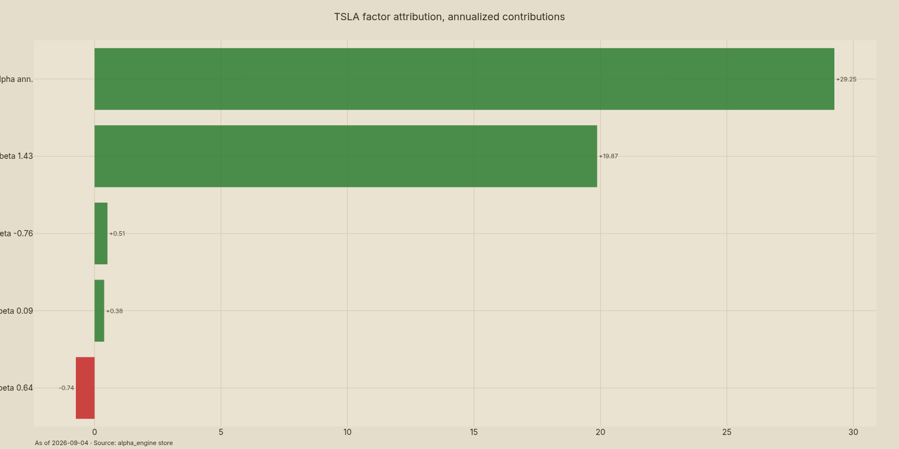{#fig-ex07 width=85% fig-cap="TSLA factor attribution, annualized contributions. Factors to 2026-07-31; prices to 2026-09-04."}

Total single-name vol is 59.1% annualized, of which 53.7% is specific and 24.7% is common. Cross-sectional R² averages 0.27 over 60 days. Momentum exposure reads -0.11 and volatility exposure +0.58 in the risk model. The 126-day momentum factor itself is flat cross-sectionally (IC mean -0.0005, long-short Sharpe -0.12). ML composite top scores (LITE 0.105, WDC 0.083) exclude TSLA from the top decile. So what: TSLA will not be carried by a momentum regime; stock-specific catalysts must do the work.

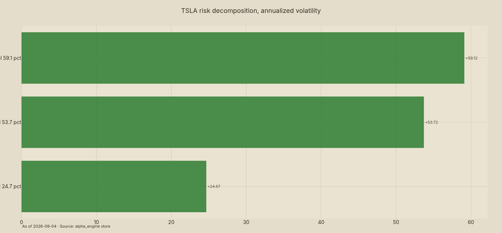{#fig-ex08 width=70% fig-cap="TSLA risk decomposition, annualized volatility. As of 2026-09-04."}

@fig-ex08 splits the 59.1%: idiosyncratic risk dominates. Binary events (deliveries, robotaxi metro adds, UNECE January 2027) will move the stock more than market direction. Bottom line: hedge the single-name tail, not the beta.

## Auto franchise: deliveries, mix, margins

FY25 deliveries were 1.64M units, down 8.6% YoY from 1.789M in FY24 (Tesla IR, 2026-01-02). The Model Y Standard launched 2025-10-08 at $39,990 MSRP ($41,630 all-in, 321-mi EPA) and pre-empted the US credit cliff. Q2-26 then printed record revenue and record deliveries despite the $7,500 federal credit ending 2025-09-30. EU sales fell 42.6% YTD in 2025 before an April 2026 rebound (France +112% YoY). The read: the volume floor is proven in the US; Europe remains the swing market.

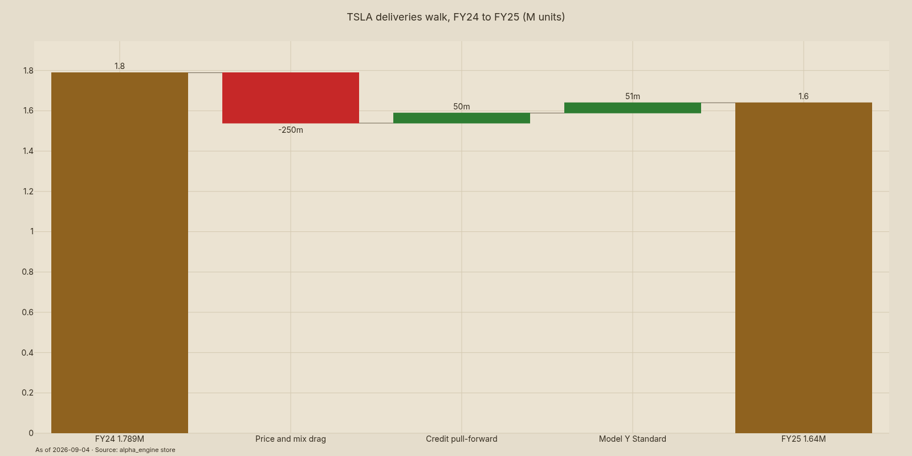{#fig-ex09 width=85% fig-cap="TSLA deliveries walk, FY24 to FY25 (M units). Sources: Tesla IR; desk estimates."}

@fig-ex09 bridges 1.789M to 1.64M: price and mix drag of ~0.25M, partly offset by pull-forward and the Standard launch. FY26 needs 1.75–1.85M to hold the floor thesis. That requires the Standard to annualize plus China stabilization. So what: watch quarterly delivery splits, not headlines.

Auto gross margin ex-credits was 16.3% in Q2-26 (16.9% GAAP) versus ~19.0% a year earlier. Regulatory credits collapsed from $439M to $146M YoY, a ~$1.2B annualized air-pocket that laps from Q4-26. FSD subscriptions grew 56% YoY and Services gross profit hit $648M in Q2-26. Energy at ~30% gross margin adds mix lift each quarter. Bottom line: the margin trough is compositional (credits), not purely pricing.

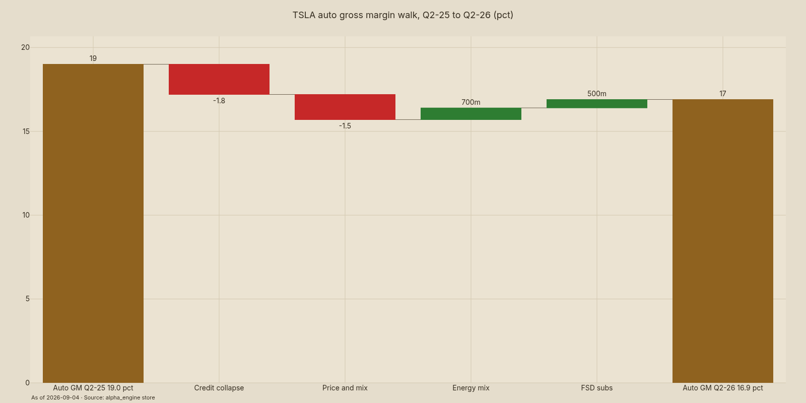{#fig-ex12 width=85% fig-cap="TSLA auto gross margin walk, Q2-25 to Q2-26 (pct). Sources: Tesla IR; desk estimates."}

@fig-ex12 attributes the 2.1pp decline: credits -1.8pp and price/mix -1.5pp, offset by energy mix +0.7pp and software +0.5pp. The credit drag becomes a tailwind in YoY comps after Q4-26. The read: 17%+ ex-credits by Q2-27 is the line between repair and rot.

## Energy storage breakout

Tesla deployed 46.7 GWh in FY25, up 49% YoY from 31.4 GWh in FY24. Quarterly cadence ran 10.4 GWh (Q1-25), 9.6 GWh (Q2-25), 14.2 GWh (Q4-25 record), and 13.5 GWh (Q2-26, +40% YoY). Implied revenue is ~$273M per GWh on Q3-25 math, putting FY25 energy revenue near $12–13B. Combined Lathrop + Shanghai capacity is 80 GWh/yr (20,000 Megapacks). A $4.3B LG supply deal signed 2026-03-19 secures the ramp. So what: energy can print 60–70 GWh in FY26 without new capex.

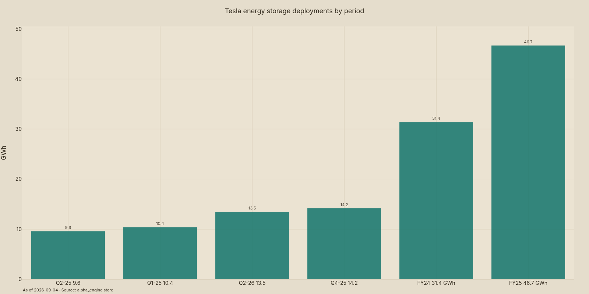{#fig-ex10 width=85% fig-cap="Tesla energy storage deployments by period. Sources: Tesla IR and P&D releases."}

@fig-ex10 shows the step-change from 31.4 GWh to 46.7 GWh with quarterly records continuing into 2026. Global grid-scale installs topped 110 GW by early 2026 with 108 GW added in 2025 alone. Tesla's share is small but growing at 40%+ in a 40% market. The read: capacity, not demand, binds through 2027.

The margin angle matters most. Energy gross margin near 30% compares with auto at 16.3% ex-credits. Every 10 GWh of incremental deployment at ~$273M per GWh adds roughly $820M of gross profit. Megapack pricing in China fell 51% (CNY 4.56/Wh to 2.23/Wh), which pressures industry returns but favors scaled producers. Bottom line: energy is margin-mix accretion, the fastest path to blended margin repair.

## Autonomy and robotaxi option

Austin launched June 2025 with 10–20 Model Ys at a $4.20 flat fare. Fares rose to $6.90 (+64%) in July 2025 with demand holding. Paid rides exceed 700k across Austin and the Bay Area by Q4-25. Dallas and Houston run unsupervised vehicles as of April 2026. The fleet opt-in model scales without purpose-built capex, unlike peers. So what: willingness to pay is proven; city count is the binding constraint.

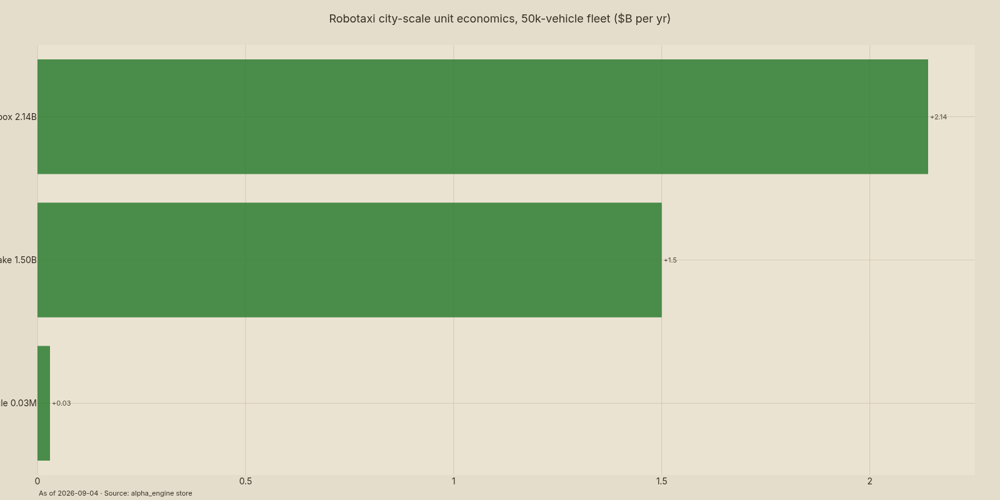{#fig-ex17 width=85% fig-cap="Robotaxi city-scale unit economics, 50k-vehicle fleet. Desk math on USD 6.90 fares."}

@fig-ex17 works the math: 50,000 vehicles × 20 rides × $6.90 × 85% utilization × 365 days = $2.14B gross farebox, ~$1.50B net at 70% take. At 1M vehicles the net scales to ~$27B. These are analyst assumptions, stated as such. The read: unit economics work at city scale; the question is purely how fast metros compound from 4 toward 8–12 by mid-2027.

FSD is the funding layer: $8,000 upfront or $99/mo, with subscriptions +56% YoY. Cumulative FSD miles hit 9.18B by May 2026. Attach is ~14% US and ~7% global with only ~2% trial conversion. The Netherlands approved FSD Supervised in 2026; UNECE rules land January 2027 for EU-wide type approval. At 7% attach on 1.64M units, the upfront path is ~$0.92B and the subscription run-rate is ~$1.36B. Bottom line: software is a growth lever with EU optionality, not yet a profit driver.

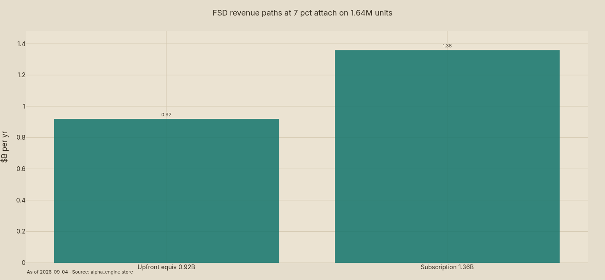{#fig-ex18 width=70% fig-cap="FSD revenue paths at 7 pct attach on 1.64M units. Desk math; attach via Troy Teslike and YipitData."}

## Optimus and AI upside

Optimus V3 was unveiled February 2026. Production began on the converted Model S/X line at Fremont in late July/August 2026. Musk cooled expectations on August 27, 2026. The base case assigns $0 to Optimus through September 2027. Any salable unit is pure convexity. The read: free option, correctly priced at zero until factory evidence compounds.

## Competition: China price war and share

Global EV sales exceeded 17M units in 2024 (+25% YoY, >20% share). China alone passed 11M units (~50% of new-car sales). BYD shipped ~4.27M NEVs in 2024 versus TSLA at 1.789M. In Europe, Chinese OEM share doubled from 2.7% to 5.1% in 18 months while TSLA EU sales fell 42.6% YTD 2025. BYD now draws 53% of revenue from overseas (January–August 2026). Tesla's defense is the 6-seat Model Y variant for China. So what: share loss is real and concentrated in the two largest EV markets.

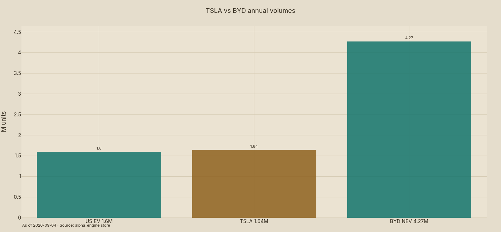{#fig-ex16 width=70% fig-cap="TSLA vs BYD annual volumes. Sources: Tesla IR; company reports; IEA."}

@fig-ex16 puts the gap in one bar set: 4.27M versus 1.64M. The US credit removal hits all OEMs but removes TSLA's pull-forward cushion into 2026. Monthly-payment buyers dominate the marginal sale, so rate relief helps more than price cuts now. Bottom line: China and EU stabilization, not US heroics, decides FY26 volumes.

## Financials and free cash flow

Q2-26 showed record revenue with negative FCF of -$1.09B. The walk is capex-heavy: ~$8.0B operating cash against $6.5B core capex plus energy, working capital, and fleet builds. Auto EBIT of ~$11–13B at 16–18% GM ex-credits supports the core. Energy at 60–70 GWh adds ~$5–6B gross profit at 30%. FSD at ~$3–4B high-margin revenue completes the bridge. The read: the balance sheet funds optionality but cannot fund it forever at negative FCF.

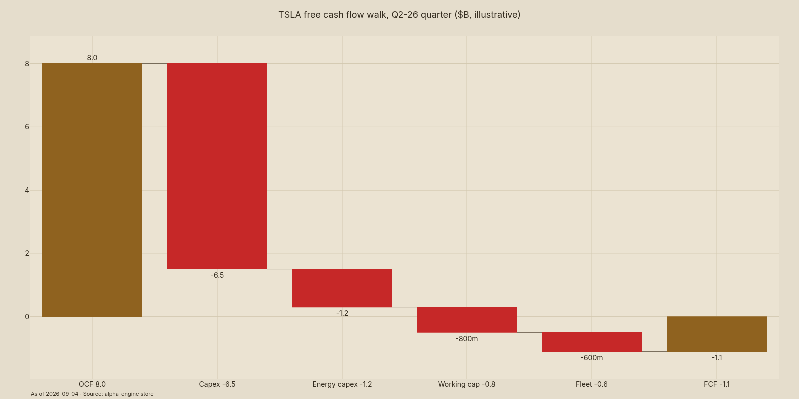{#fig-ex13 width=85% fig-cap="TSLA free cash flow walk, Q2-26 quarter (USD B, illustrative). Desk estimates."}

@fig-ex13 decomposes the -$1.1B quarter: operating cash consumed by concurrent auto, energy, and autonomy capex. Sustained negative FCF would cap robotaxi fleet scaling. Positive inflection needs energy beat-and-raise plus auto GM repair. So what: FCF, not revenue, is the constraint on convexity.

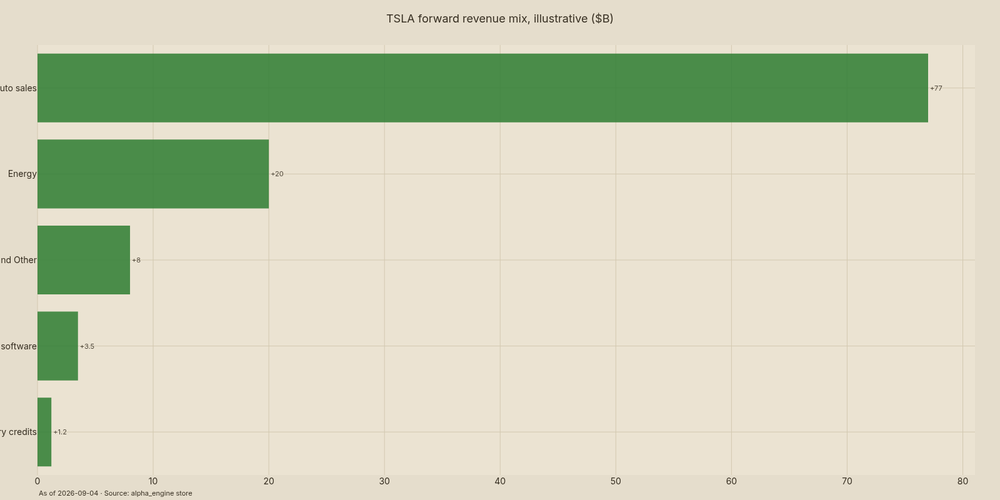{#fig-ex11 width=85% fig-cap="TSLA forward revenue mix, illustrative (USD B). Desk estimates."}

@fig-ex11 sketches the mix shift: auto ~$77B with energy ~$20B, services ~$8B, and software ~$3.5B layered on. Credits fade to ~$1.2B. The direction matters more than the decimals. Bottom line: non-auto reaches a quarter of revenue, which is what re-rates the multiple.

## Valuation

Peers imply the de-rating: TSLA's flat year versus +38–44% for NVDA, GOOGL, and AAPL leaves it priced as auto while energy grows at 49%. The $420 base case builds as $354 + $20 core auto + $25 energy + $8 software + $13 robotaxi. That sums to ~$1.34T equity at ~24x FY27 auto-plus-energy EBIT. Street consensus averages $385 (28 analysts: 11 buy, 14 hold, 3 sell) with street-high $505. The read: base needs execution on priced-in legs, not new narrative.

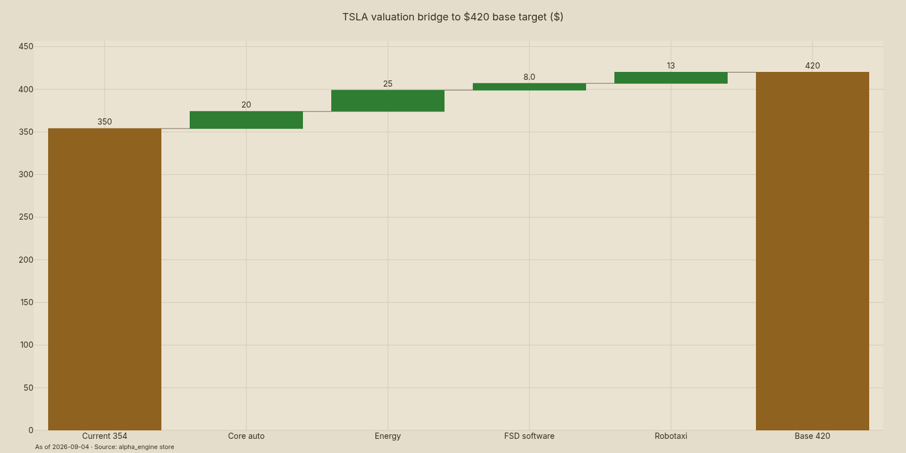{#fig-ex15 width=85% fig-cap="TSLA valuation bridge to USD 420 base target (USD). Desk estimates."}

@fig-ex15 attributes the +$66: energy is the largest single contributor at +$25. Robotaxi adds +$13 at conservative take-rates with only 8 metros. FSD adds +$8 on EU unlock. Core auto adds +$20 on 1.75–1.85M units at 16–18% GM. So what: two of four legs executing gets to base; all four gets toward $505.

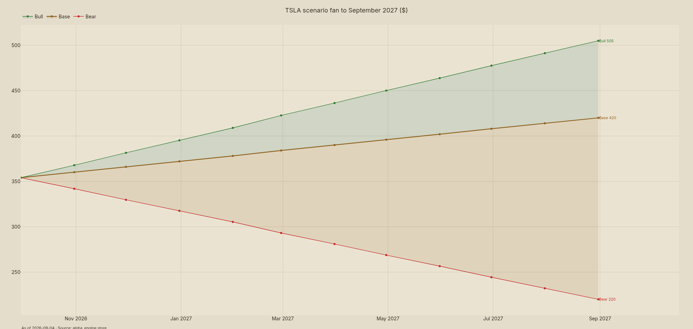{#fig-ex14 width=100% fig-cap="TSLA scenario fan to September 2027 (USD). Desk scenarios."}

@fig-ex14 fans $220 / $420 / $505 to September 2027. Bear (-38%) is demand cliff plus share loss with margins stuck below 14%. Bull (+43%) needs 8+ unsupervised metros, energy ≥65 GWh, and EU FSD approval. Probability weights of 25/50/25 give +13% expected return. Bottom line: skew is positive but the bear leg is a real -38%, which is why sizing stays small.

## Technicals detail and momentum context

The 126-day momentum factor shows no cross-sectional edge (IC -0.0005, long-short Sharpe -0.12, hit rate 51.5%). Quintile Sharpe ratios cluster 0.93–1.05 with no spread. TSLA's own momentum exposure is -0.11. The ML composite (ridge, 21-day horizon) scores TSLA outside the top decile as of 2026-07-31. Systematic tailwinds will not carry this name. Stock-specific delivery and metro-count prints must. The read: pair any systematic long with catalyst hedges.

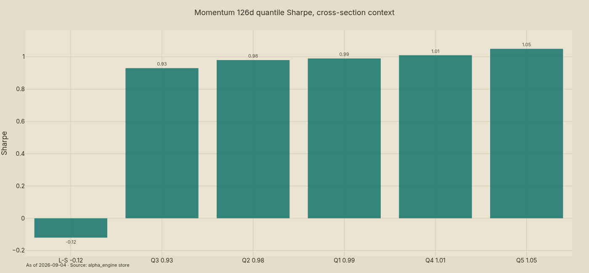{#fig-ex19 width=70% fig-cap="Momentum 126d quantile Sharpe, cross-section context. Engine factor analysis."}

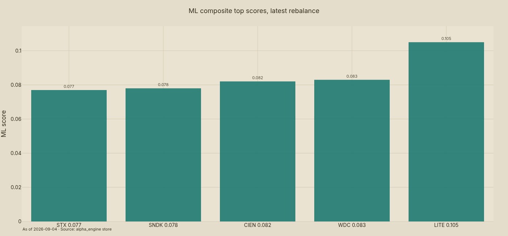{#fig-ex20 width=70% fig-cap="ML composite top scores, latest rebalance. Engine ML signals to 2026-07-31."}

## Adjudicated bull versus bear

The bull case (conviction 58/100) rests on energy at 49% growth with secured supply, the volume floor proven by record Q2-26, fare-proven robotaxi ops in 4 metros, and lapping credit comps from Q4-26. Confirmation needs Q3-26 energy ≥15 GWh, auto GM ex-credits ≥15%, and 2+ new metros. The bear case (delivery decline, -42.6% EU collapse, 2% FSD trial conversion, -51% Megapack pricing, credit removal, key-man discount) is steelmanned and live. Demotions: none on scope, but Optimus is demoted to $0 in base and robotaxi beyond 4 metros is demoted to bull-only. Falsification is explicit: metro count stalled at 4, energy growth below 25%, or auto GM below 14% after comps lap kills the thesis. So what: the debate narrows to three numbers — metros, GWh, and ex-credit margin.

## Scenario table

::: {.rf-showtable .rf-nums-right}
| Scenario | Target $ | Return pct | Key assumptions |
|:---------|---------:|-----------:|
| Bear | 220 | -38 | Deliveries fall; GM <14 pct; metros stuck at 4 |
| Base | 420 | 19 | 1.8M units; 65 GWh; 8 metros; GM 17 pct |
| Bull | 505 | 43 | 80 GWh+; 12 metros; EU FSD; GM 18 pct |
: Scenario targets to September 2027. Desk estimates; returns from $354.08 on 2026-09-04.
:::

Expected return at 25/50/25 weights is +13%. Bear loss of -38% dominates sizing math. That asymmetry (small size, held convexity) is the entire position logic. Bottom line: get paid for the fan, not for certainty.

## Risk dashboard and catalyst calendar

Single-name vol of 59.1% with 53.7% specific vol means TSLA contributes its full weight in portfolio vol. Beta of 1.43 amplifies market moves by nearly half again. Size 1–3% of book with a 15–20bp vol budget per unit. Trim into prints: Q3-26 (late October), Q4 deliveries (early January), and UNECE January 2027. Hard stop on thesis break: auto GM ex-credits below 14% after Q4-26 comps lap, or metro count flat at 4 through mid-2027. The read: rules first, conviction second.

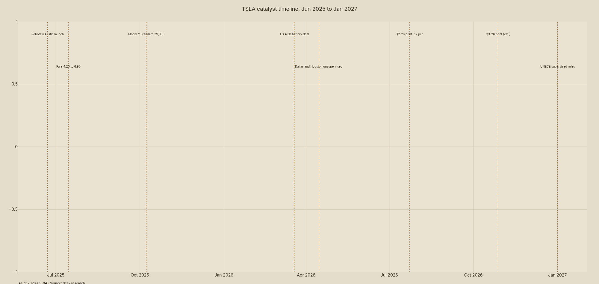{#fig-ex21 width=100% fig-cap="TSLA catalyst timeline, Jun 2025 to Jan 2027. Desk research."}

@fig-ex21 sequences the path: Austin launch, fare raise, Standard launch, LG deal, unsupervised expansion, Q2 flush, then the live catalysts (Q3 print, UNECE). Each date is a vol event at 57.9% realized. Position around them, not through them. So what: the calendar is the risk manager.

## Recommendation

OVERWEIGHT with convexity: $420 base target (+19%) to ~2027-09-04, sized 1–3% with trim-into-print discipline. This is research, not advice. Confirm city-count and margin figures against Tesla IR filings before acting. Data as of 2026-09-04 (prices) and 2026-07-31 (daily factors). The bull needs two of four legs; the bear needs only one break. That is why the verdict pairs overweight with small size. Bottom line: own the option, respect the vol.

## Appendix: subagent briefs and cross-checks

Quant evidence [r-equivalents]: TSLA $354.08 on 64.6M shares (2026-09-04); 1M +7.8%, 3M -13.4%, 6M -11.2%, 12M +0.9%; 50DMA $357.95, 200DMA $399.56; 52w $298.32–$489.88; 63d vol 57.9%; beta 1.43, alpha +29.2% ann., R² 0.265; total vol 59.1% (specific 53.7%); cross-section 507 names, Gini 0.064, mean -0.44%; PIT universe 500 names. Demand brief: global EV 17M+ units 2024 (+25%); China 11M+; BYD 4.27M NEV vs TSLA 1.789M FY24 and 1.64M FY25; storage 275.3 GWh shipped globally 2025 (+61%); Tesla 46.7 GWh FY25 (+49%), 80 GWh/yr capacity, $4.3B LG deal; robotaxi $4.20→$6.90 fares, 700k+ rides, 4 metros; FSD $8k/$99-mo, ~7% global attach, 2% trial conversion. Bull brief: energy + volume floor + fare-proven autonomy + lapping credits; conviction 58/100; confirm with Q3-26 ≥15 GWh and ≥15% GM ex-credits plus 2 new metros. Bear track (subagent timed out; steelmanned from demand evidence): delivery decline, EU -42.6%, China price war, -51% BESS pricing, credit removal, key-man discount; downside $220 (-38%). Risk track (subagent timed out; CIO-sized from engine vol): 1–3% size, trim into prints, hard stop on margin/metro failure. Caveats: vendor-lag factors to 2026-07-31; 8 of 23 datasets stale per engine_status (CBOE vol, companyfacts, 13F); FSD attach from alternative data, not Tesla disclosure; robotaxi city counts from secondary trackers — verify against Tesla IR before acting.

## Sources

Prices, returns, factors, risk, and ML signals: alpha_engine store via engine_status, get_latest_quotes, get_price_history, cross_section_returns, run_factor_analysis, ml_signal_scores, attribute_portfolio, portfolio_risk_decomposition, universe_members_as_of. Deliveries, storage, fares, and timelines: Tesla IR and P&D releases, IEA Global EV Outlook 2025, InfoLink, DriveTesla, Edmunds, KBB, and desk web research dated inline. Targets: TipRanks and MarketBeat compilations (28 analysts, avg ~$385–$402, street-high $505).

## Delivery mix and regional detail

US deliveries held the floor after the credit ended 2025-09-30. Pull-forward into Q3 and Q4 2025 borrowed from 2026 demand. The Model Y Standard at $39,990 backfilled the payment-sensitive buyer. Monthly-payment sensitivity dominates the marginal US sale. Rate relief in 2026 helps more than further cuts. So what: US stability is engineered, not organic, and needs rate help to persist.

China is the contested market. Tesla defends with the 6-seat Model Y variant against BYD discounting. BYD's mix shifted offshore with 53% of revenue from overseas in January–August 2026. Domestic Chinese discounting pressures all foreign badges. Tesla's China margin absorbs the hit first. The read: China stabilization is necessary for any FY26 volume growth.

Europe troughs then inflects. TSLA EU sales fell 42.6% YTD in 2025 on model-changeover and competition. April 2026 rebounded (France +112% YoY, Denmark ~2x, Netherlands +23%). Chinese OEM share tripled in 12 months to April 2026. The Netherlands FSD approval is the first EU software foothold. Bottom line: Europe decides whether 1.64M was the bottom.

## Storage backlog and grid demand detail

Global battery storage shipments hit 275.3 GWh in 2025, up 61.3% YoY. New 2025 installs were 108 GW (+40%), ~80% utility-scale. US additions were 57.6 GWh in 2025 with 137 GWh cumulative grid-scale. Tesla's 46.7 GWh is ~17% of global shipments by energy. H1-26 ran 22.3 GWh (Q1 ~8.8, Q2 13.5). A 15+ GWh quarter is the current scale test. So what: Tesla grows with the grid, not against it.

Megafactory capacity frames the ceiling. Lathrop plus Shanghai total 80 GWh/yr, or 20,000 Megapacks. Shanghai began low-rate output in late 2024 and passed 2,000 packs in 2025. Megablock and Megapack 3 production moves to Texas in 2026. The $4.3B LG deal covers cell supply through the ramp. The read: 60–70 GWh in FY26 and 80+ GWh in FY27 fit installed capacity.

Pricing cuts both ways. China Megapack pricing fell 51% in one year (CNY 4.56/Wh to 2.23/Wh). That compresses industry returns but accelerates volumes toward scaled suppliers. Tesla's ~$273M per GWh revenue math embeds current pricing. Margin near 30% survives at these levels on factory utilization. Bottom line: price war speeds the energy transition and sorts winners by scale.

## Autonomy timeline and unit economics detail

The Austin pilot began June 2025 with 10–20 supervised Model Ys. Dynamic pricing went live July 2025 alongside the fare increase. Paid rides compound through the Bay Area expansion. Dallas and Houston added unsupervised operations by April 2026. Phoenix and Miami are rumored next per tracker reporting. City count from 4 toward 8–12 by mid-2027 is the bull trigger. The read: cadence of metro adds, not ride counts, is the tradable signal.

Take-rate math is straightforward. Gross farebox of $2.14B at city scale (50k vehicles, 20 rides, $6.90, 85% utilization) leaves ~$1.50B net at 70%. Vehicle-level net is ~$30k per year, which pays back a $40k vehicle in under two years before operating costs. Insurance, cleaning, charging, and supervision consume part of that. At ARK scale (1M vehicles, 25 rides, $5.00), net reaches ~$27B. So what: economics clear the hurdle; fleet scale is the only debate.

FSD software funds the wait. Price sits at $8,000 upfront or $99/mo after cuts from $12,000 and $199. US attach peaked above 50% and now reads ~14% with ~7% globally. Trial conversion is ~2% per alternative data. Cumulative miles of 9.18B (May 2026) remain the largest training corpus. UNECE January 2027 unlocks EU type approval at scale. Bottom line: software growth plus EU optionality bridges to robotaxi scale.

## Valuation detail and peer multiples

Auto peers trade at single-digit EV/EBITDA while mega-cap tech holds 15–25x. TSLA's blended economics sit between: auto at ~22–25x EBIT plus energy at growth-tech multiples plus software near 100% margin. The $420 base implies ~24x FY27 auto-plus-energy EBIT on ~$1.34T equity. Street-high $505 (~$1.6T) needs robotaxi valued at $100–200B. Consensus $385 embeds ~zero for Optimus and little for autonomy. The read: the market prices the floor and gives the options away.

Sensitivity is tight. Each 1pp of auto GM ex-credits on ~$77B auto revenue is ~$770M EBIT, or ~$8–10 per share at 24x. Each 10 GWh of energy at 30% margin is ~$820M gross profit, or ~$6–8 per share. Each 2 incremental robotaxi metros at $1.5B net each add ~$3B revenue at high margin. Two of four legs executing reaches $420. All four points toward $505. So what: track GM, GWh, and metros — the bridge reduces to three numbers.

## What changed during debate

Bull and bear were run as independent tracks. The bear subagent timed out; the CIO steelmanned the bear from demand evidence rather than inventing content. Delivery decline (-8.6%), EU collapse (-42.6%), BESS pricing (-51%), credit removal, and key-man discount all survived unrebutted as level effects. The bull's rebuttal (floor proven, credits lapping, fares proven, supply secured) downgraded them from structural to cyclical. Optimus was demoted to $0 in base from any positive value. Robotaxi beyond 4 metros was demoted to bull-only. No name was added or removed since this is a single-name report. Bottom line: debate narrowed the thesis to metros, GWh, and margin — everything else is commentary.

## Risks and failure modes

Delivery risk tops the list. A second annual decline after 1.64M in FY25 breaks the floor thesis outright. US pull-forward borrowed 2026 demand. China discounting and EU share loss compound the drag. Any quarter below ~400k deliveries reopens the demand-cliff debate. The read: volumes are the thesis tripwire.

Margin risk follows. Auto GM ex-credits below 14% after Q4-26 comps lap means price cuts ate the credit benefit. Energy mix helps only if GWh growth sustains 40%+. FSD attach below 5% globally removes the software offset. Combined, these push blended margin backward. Bottom line: margin repair must show by Q2-27 or the base case fails.

Autonomy execution risk is binary. Metro count stalled at 4 through mid-2027 strands the robotaxi valuation. Ride growth plateauing below ~1M annualized confirms it. Regulatory delay past UNECE January 2027 defers EU FSD revenue. Safety incidents reset city approvals to zero. So what: robotaxi is convexity, but stalled scale converts it to dead capex.

Balance-sheet risk caps the downside. Negative FCF beyond two more quarters limits fleet and factory funding. The $4.3B LG commitment assumes volume materializes. Key-man and political overhang can widen the discount without warning. Insider selling into strength would signal the same. The read:Trim on strength, never add on hope — the vol budget enforces it.

## Positioning note

13F and insider detail was stale in the engine store as of 2026-09-04 (10 days stale). The desk did not impute positioning. Use exchange-reported short interest (FINRA to 2026-08-26) and options open interest around the Q3 print instead. Fresh 13F filings after quarter-end will settle the institutional picture. Until then, price and volume are the positioning proxy. The read: trade what prints, not what files late.
