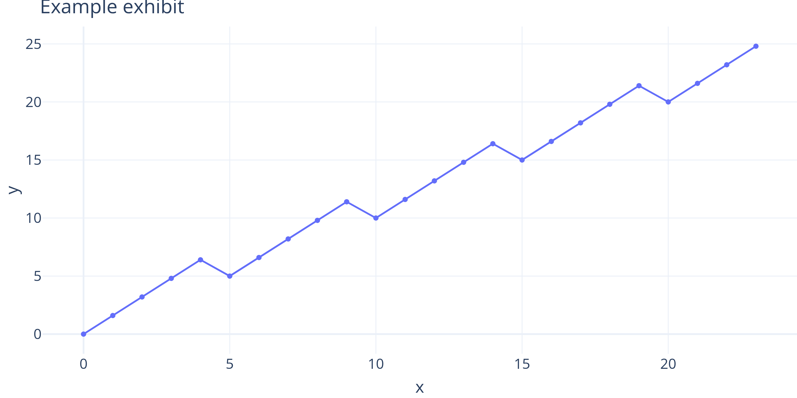

::: {style="text-align: center;"}
**Kizo Capital Management** · Investment Research
:::


# Key takeaways {-}

- **Takeaway one** — the single most important conclusion, stated as a claim.
- **Takeaway two** — the second conclusion, tied to an exhibit if possible.
- **Takeaway three** — what the reader should do about it.

# Investment thesis

Two to four paragraphs: the opportunity, why it is mispriced or overlooked,
and what would make the thesis right or wrong. Lead with the conclusion.

> **Bottom line.** One-sentence version of the thesis for readers in a hurry.

## Why now

The catalysts or structural shifts that make this timely.

# Framework

The analytical framework or taxonomy the paper applies. Hedge-fund white
papers earn trust here: define terms precisely before using them.

## Definitions and scope

What is in scope, what is not, and the conventions used throughout.

# Analysis

The core of the paper. Build the argument exhibit by exhibit — every claim
should point at a chart or table.

## Exhibit-driven findings

{#fig-example width=90%}

As @fig-example shows, the trend supports the thesis. State the observation
first, then the interpretation, then the implication.

::: {#fig-metric}
| Metric | Value | As-of |
|--------|------:|------|
| Example | 42 | 2026-08-26 |

Example exhibit caption.
:::

## Robustness and counterarguments

Address the strongest case against the thesis and how the analysis handles
it. Papers that steelman survive scrutiny.

# Portfolio implications

Position sizing context, correlation with existing exposures, liquidity and
exit considerations.

## Risk factors

1. Risk one, with observable early-warning indicators.
2. Risk two, with the condition under which the thesis is abandoned.

# Conclusion

Restate the thesis in light of the evidence. End with the decision this
paper supports.

# Appendix {.appendix}

Methodology notes, data sources, extended exhibits, reproducibility.

```{python}
# Writes the print-quality exhibit PNG referenced by @fig-example above.
# NOTE: do NOT use `#| label:` / `#| fig-cap:` on executable chunks here —
# Quarto 1.10's typst-PDF path emits an undefined `quarto_super` helper for
# them ("unknown variable: quarto_super"). Use markdown embeds with
# {#fig-x} + caption text for exhibits instead.
import plotly.express as px
import pandas as pd

df = pd.DataFrame({"x": range(24), "y": [i + (i % 5) * 0.6 for i in range(24)]})
fig = px.line(df, x="x", y="y", markers=True)
fig.update_layout(template="plotly_white", title="Example exhibit")
# width 9in = target print width; font 16 = readable after ~45% shrink;
# scale=3 = 3x pixel density for print sharpness (~450 DPI effective).
fig.update_layout(font=dict(size=16))
fig.write_image("assets/example-chart.png", width=9 * 100, height=4.5 * 100, scale=3)
```